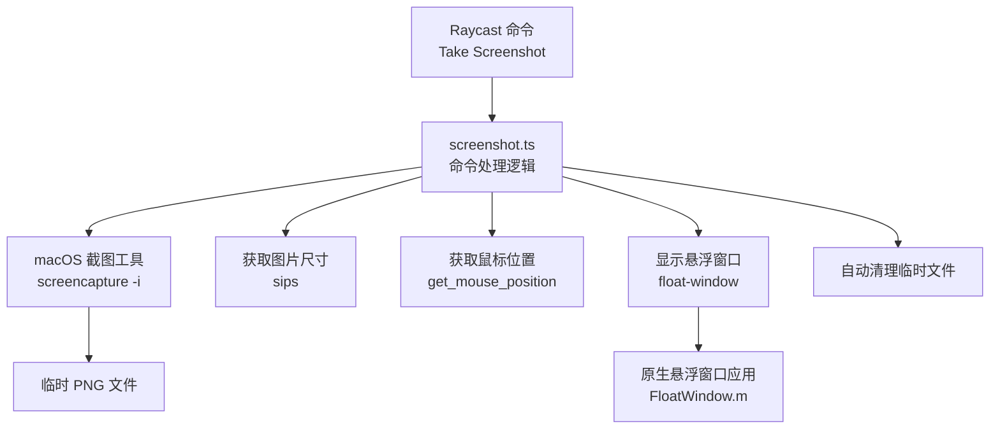
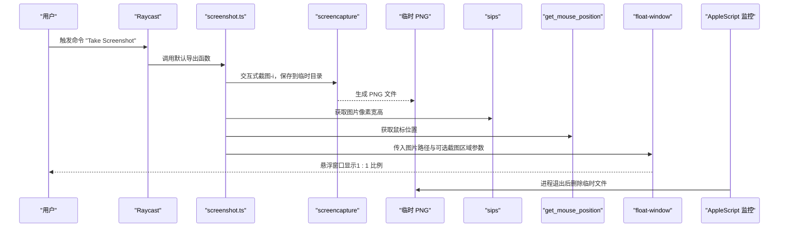
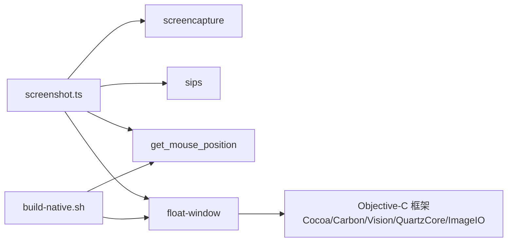

# 使用方法

<cite>
**本文引用的文件**
- [README.md](file://README.md)
- [src/screenshot.ts](file://src/screenshot.ts)
- [package.json](file://package.json)
- [build-native.sh](file://build-native.sh)
- [FloatWindow.m](file://FloatWindow.m)
- [get_mouse_position.m](file://get_mouse_position.m)
- [float_window.py](file://float_window.py)
</cite>

## 目录
1. [简介](#简介)
2. [项目结构](#项目结构)
3. [核心组件](#核心组件)
4. [架构总览](#架构总览)
5. [详细组件分析](#详细组件分析)
6. [依赖关系分析](#依赖关系分析)
7. [性能与行为特性](#性能与行为特性)
8. [故障排查指南](#故障排查指南)
9. [结论](#结论)

## 简介
本插件为 Raycast 提供“快速截图并悬浮显示”的能力。用户通过 Raycast 命令触发后，自动唤起 macOS 原生截图工具进行区域选择，截图完成后以 1:1 比例在全屏上显示为悬浮窗口。悬浮窗口具备以下特性：
- 始终置顶
- 点击穿透（不影响底层应用）
- 边缘 10px 区域可拖动窗口
- ESC 键关闭窗口并自动清理临时文件
- 若未正确显示，请确认原生组件已编译

## 项目结构
该仓库采用“TypeScript 插件 + 原生悬浮窗口应用 + 鼠标位置查询工具”的组合结构：
- Raycast 插件入口与业务逻辑位于 src/screenshot.ts
- 原生悬浮窗口应用由 Objective-C 源码编译产出，脚本见 build-native.sh
- 鼠标位置查询工具由 Objective-C 源码编译产出，脚本见 build-native.sh
- Python 版本的悬浮窗口实现仅作参考，当前主流程使用 Objective-C 版本

图表来源
- [src/screenshot.ts](file://src/screenshot.ts#L1-L114)
- [build-native.sh](file://build-native.sh#L1-L26)
- [FloatWindow.m](file://FloatWindow.m#L179-L210)
- [get_mouse_position.m](file://get_mouse_position.m#L1-L10)

章节来源
- [README.md](file://README.md#L1-L61)
- [package.json](file://package.json#L1-L34)

## 核心组件
- Raycast 命令入口：在 package.json 中定义命令名称与描述，触发后调用 src/screenshot.ts 的默认导出函数。
- 截图与临时文件管理：使用 macOS 原生 screencapture 命令交互式选择区域，将结果保存到系统临时目录，并在后续流程中传递给悬浮窗口。
- 悬浮窗口展示：通过原生 Objective-C 应用（float-window）创建无边框、始终置顶、点击穿透的窗口，按 1:1 比例显示图片。
- 鼠标位置与窗口定位：通过 get_mouse_position 工具获取鼠标位置，作为悬浮窗口初始居中位置的参考。
- 自动清理：当原生悬浮窗口进程退出时，通过 AppleScript 监控并删除对应的临时文件。

章节来源
- [package.json](file://package.json#L12-L18)
- [src/screenshot.ts](file://src/screenshot.ts#L1-L114)
- [src/screenshot.ts](file://src/screenshot.ts#L238-L391)
- [get_mouse_position.m](file://get_mouse_position.m#L1-L10)
- [FloatWindow.m](file://FloatWindow.m#L179-L210)

## 架构总览
下图展示了从触发命令到显示悬浮窗口的端到端流程，包括截图、尺寸与位置计算、悬浮窗口启动与监控清理等关键步骤。

图表来源
- [src/screenshot.ts](file://src/screenshot.ts#L10-L114)
- [src/screenshot.ts](file://src/screenshot.ts#L116-L135)
- [src/screenshot.ts](file://src/screenshot.ts#L162-L236)
- [src/screenshot.ts](file://src/screenshot.ts#L238-L391)
- [FloatWindow.m](file://FloatWindow.m#L179-L210)

## 详细组件分析

### 命令触发与截图流程
- 命令定义：在 package.json 中声明命令名称、标题与描述，模式为“no-view”，表示执行后不打开视图。
- 截图执行：使用 spawn 方式调用 screencapture -i，避免因用户取消导致的非零退出码误判；通过文件存在性判断截图是否成功。
- 失败处理：捕获用户取消与异常错误，必要时提示并清理临时文件。

章节来源
- [package.json](file://package.json#L12-L18)
- [src/screenshot.ts](file://src/screenshot.ts#L10-L44)

### 图片尺寸与鼠标位置
- 图片尺寸：通过 sips 命令解析 PNG 的像素宽高，作为 1:1 显示与窗口尺寸依据；若解析失败则回退默认尺寸。
- 鼠标位置：通过 get_mouse_position 工具获取当前鼠标坐标，用于将悬浮窗口定位到截图区域附近，提升用户体验。

章节来源
- [src/screenshot.ts](file://src/screenshot.ts#L116-L135)
- [src/screenshot.ts](file://src/screenshot.ts#L162-L236)
- [get_mouse_position.m](file://get_mouse_position.m#L1-L10)

### 悬浮窗口启动与定位
- 可执行文件发现：优先在项目根目录查找 float-window；若未找到，尝试多种路径与 PATH；若仍不可用，则尝试执行构建脚本进行编译。
- 参数传递：将图片路径与可选的截图区域（x/y/宽/高）传递给原生应用，用于精确定位窗口。
- 进程监控：通过 AppleScript 后台轮询检测原生应用进程是否仍在运行，退出后自动删除对应临时文件。

章节来源
- [src/screenshot.ts](file://src/screenshot.ts#L238-L391)
- [build-native.sh](file://build-native.sh#L1-L26)

### 原生悬浮窗口实现要点
- 1:1 显示：根据图片像素尺寸与屏幕缩放因子换算为点尺寸，确保视觉上 1:1。
- 始终置顶：使用 NSFloatingWindowLevel，保证窗口始终在最上层。
- 点击穿透：图片视图重写 hitTest 返回 nil，实现点击穿透；边缘 10px 区域用于拖动。
- ESC 关闭：通过定时轮询检测 ESC 键状态，按下后终止应用。
- 自动清理：依赖外部监控脚本在进程退出后删除临时文件。

章节来源
- [FloatWindow.m](file://FloatWindow.m#L179-L210)
- [FloatWindow.m](file://FloatWindow.m#L268-L322)
- [FloatWindow.m](file://FloatWindow.m#L416-L464)

### Python 版悬浮窗口（参考实现）
- 该版本演示了点击穿透、始终置顶、ESC 关闭与 1:1 显示的基本思路，当前主流程使用 Objective-C 版本。
- 若需切换到 Python 版本，可参考其窗口创建与事件处理逻辑。

章节来源
- [float_window.py](file://float_window.py#L1-L100)

## 依赖关系分析
- TypeScript 插件依赖 Raycast API，负责命令调度、子进程调用与文件管理。
- 原生组件依赖 macOS Cocoa/Carbon/Vision 等框架，实现悬浮窗口、OCR 与事件处理。
- 构建脚本负责编译 Objective-C 源码，生成可执行文件并赋予执行权限。

图表来源
- [src/screenshot.ts](file://src/screenshot.ts#L1-L114)
- [src/screenshot.ts](file://src/screenshot.ts#L238-L391)
- [build-native.sh](file://build-native.sh#L1-L26)
- [FloatWindow.m](file://FloatWindow.m#L1-L10)
- [get_mouse_position.m](file://get_mouse_position.m#L1-L10)

章节来源
- [src/screenshot.ts](file://src/screenshot.ts#L1-L114)
- [build-native.sh](file://build-native.sh#L1-L26)

## 性能与行为特性
- 截图阶段：交互式截图由系统工具完成，延迟主要受用户选择时间影响。
- 尺寸解析：sips 解析 PNG 元数据，开销极低。
- 窗口定位：基于鼠标位置与图片尺寸计算，避免额外网络或服务依赖。
- 悬浮窗口：1:1 显示避免缩放开销；点击穿透减少事件转发成本。
- 清理策略：进程退出后清理临时文件，避免磁盘占用累积。

[本节为通用性能讨论，无需列出具体文件来源]

## 故障排查指南
- 未显示悬浮窗口
  - 现象：执行命令后仅出现截图工具，未见悬浮窗口。
  - 排查：确认已执行构建脚本生成 float-window 与 get_mouse_position，并赋予执行权限。
  - 参考：构建脚本与可执行文件发现逻辑。
- ESC 无效或窗口不关闭
  - 现象：按下 ESC 后窗口未关闭。
  - 排查：确认原生应用仍在运行；检查 AppleScript 监控脚本是否被系统安全策略阻止。
- 点击穿透失效
  - 现象：悬浮窗口遮挡区域无法透传点击。
  - 排查：确认图片视图实现了点击穿透逻辑；检查窗口层级与忽略鼠标事件设置。
- 窗口位置异常
  - 现象：窗口出现在屏幕外或与截图区域不一致。
  - 排查：确认传入的截图区域参数是否正确；检查屏幕缩放因子与坐标系差异。
- 临时文件未清理
  - 现象：多次使用后磁盘空间增长。
  - 排查：确认 AppleScript 监控脚本已执行；检查原生应用进程是否异常退出。

章节来源
- [src/screenshot.ts](file://src/screenshot.ts#L238-L391)
- [build-native.sh](file://build-native.sh#L1-L26)
- [FloatWindow.m](file://FloatWindow.m#L179-L210)

## 结论
本插件通过“Raycast 命令 + 原生悬浮窗口应用”的组合，实现了快速截图与 1:1 悬浮显示的流畅体验。其关键在于：
- 使用系统原生截图工具保证截图质量与稳定性
- 通过像素尺寸与缩放因子实现 1:1 显示
- 通过点击穿透与边缘拖动区域优化交互
- 通过进程监控与自动清理保障资源回收

若遇到未正确显示的问题，请优先确认原生组件已编译并通过命令行验证可执行文件可用性。