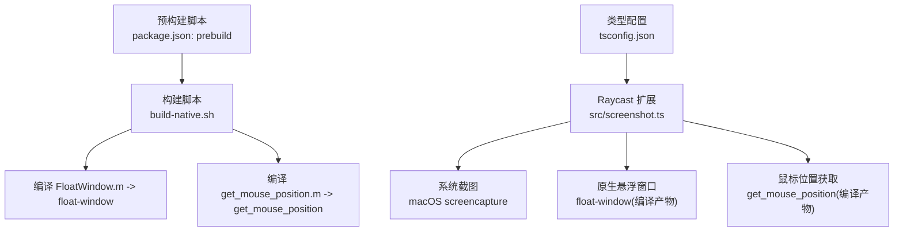
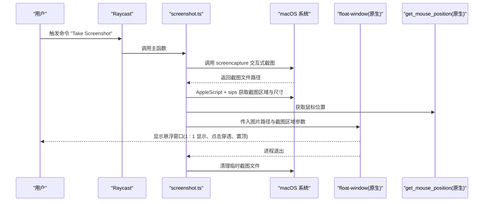
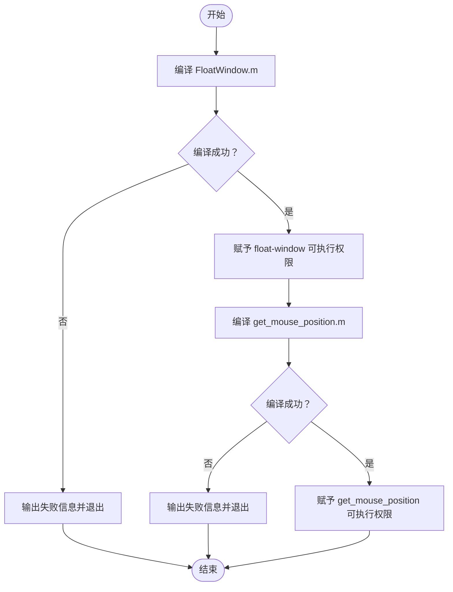
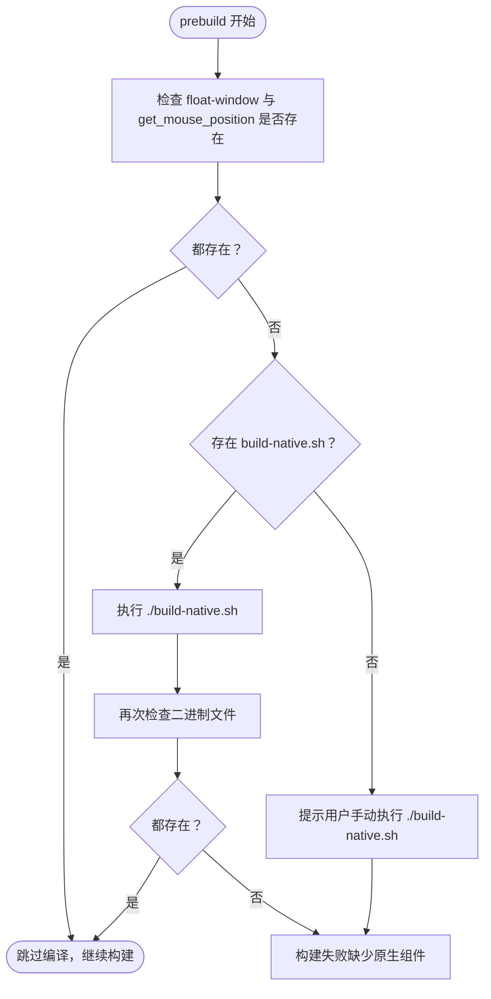
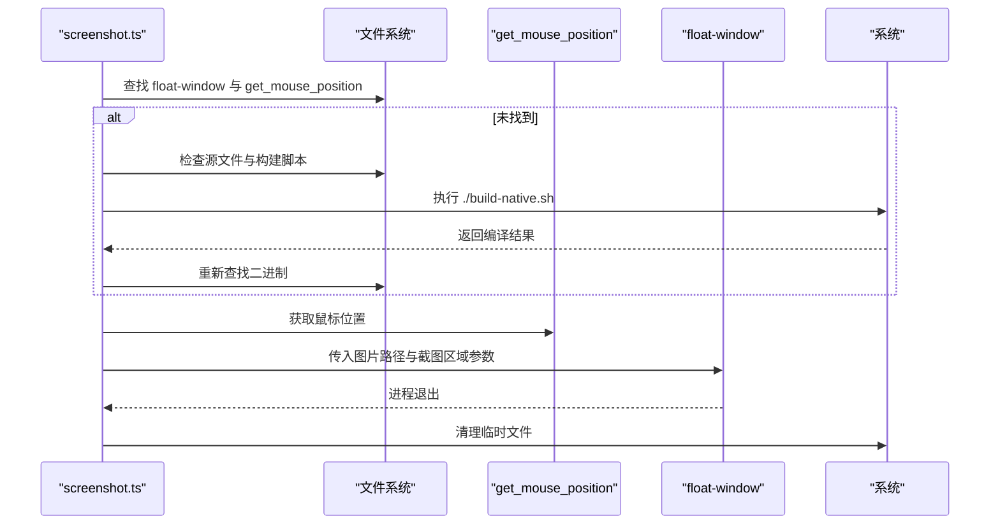
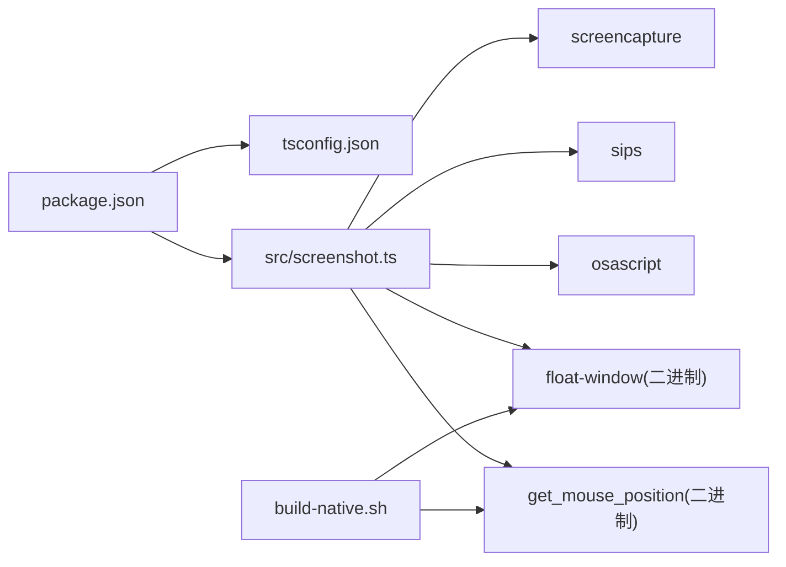

# 安装与配置

<cite>
**本文引用的文件**
- [README.md](file://README.md)
- [package.json](file://package.json)
- [build-native.sh](file://build-native.sh)
- [src/screenshot.ts](file://src/screenshot.ts)
- [FloatWindow.m](file://FloatWindow.m)
- [get_mouse_position.m](file://get_mouse_position.m)
- [tsconfig.json](file://tsconfig.json)
- [test_position.sh](file://test_position.sh)
</cite>

## 目录
1. [简介](#简介)
2. [项目结构](#项目结构)
3. [核心组件](#核心组件)
4. [架构总览](#架构总览)
5. [详细组件分析](#详细组件分析)
6. [依赖关系分析](#依赖关系分析)
7. [性能与可靠性考量](#性能与可靠性考量)
8. [故障排查指南](#故障排查指南)
9. [结论](#结论)
10. [附录](#附录)

## 简介
本指南面向希望在 Raycast 中安装与配置 ScreenshotsPluginOnRaycast 插件的用户与开发者。文档覆盖从克隆仓库到在 Raycast 中成功导入的完整流程，并重点解释原生组件编译的必要性与作用：实现点击穿透、窗口置顶、ESC 关闭、拖动窗口等系统级能力。同时，文档说明 package.json 中 prebuild 脚本如何自动检测并提示缺少的原生组件，以及常见问题的解决方法（如 Xcode 命令行工具缺失、权限问题等）。

## 项目结构
该仓库采用“Raycast 扩展 + 原生组件”的混合架构：
- TypeScript 主逻辑位于 src/screenshot.ts，负责调用系统截图、定位鼠标、启动原生悬浮窗口并监控进程清理临时文件。
- 原生组件由 Objective-C 源文件编译而来：FloatWindow.m 与 get_mouse_position.m，分别用于创建悬浮窗口与获取鼠标位置。
- 构建脚本 build-native.sh 统一编译上述原生组件，并赋予可执行权限。
- package.json 定义了 Raycast 命令、依赖、开发与构建脚本，其中 prebuild 脚本会在构建前自动检测原生组件是否存在，否则提示用户执行编译。

图表来源
- [src/screenshot.ts](file://src/screenshot.ts#L1-L392)
- [build-native.sh](file://build-native.sh#L1-L26)
- [package.json](file://package.json#L1-L34)
- [tsconfig.json](file://tsconfig.json#L1-L21)

章节来源
- [README.md](file://README.md#L1-L61)
- [package.json](file://package.json#L1-L34)
- [build-native.sh](file://build-native.sh#L1-L26)
- [src/screenshot.ts](file://src/screenshot.ts#L1-L392)
- [tsconfig.json](file://tsconfig.json#L1-L21)

## 核心组件
- Raycast 命令与入口
  - package.json 中定义了名为 “Take Screenshot” 的命令，模式为 no-view，适合直接触发系统行为。
- TypeScript 主流程
  - 调用系统截图工具，等待用户选择区域；
  - 通过 AppleScript 与 sips 获取截图区域与尺寸；
  - 调用 get_mouse_position 获取鼠标位置，推导截图区域中心；
  - 启动原生悬浮窗口 float-window 并传入图片路径与截图区域参数；
  - 后台监控原生进程，进程退出后自动删除临时截图文件。
- 原生组件
  - float-window：基于 Cocoa 创建无边框悬浮窗口，支持点击穿透、置顶、ESC 关闭、边缘拖动、OCR 文字面板等。
  - get_mouse_position：获取当前鼠标坐标，供主流程推导截图区域中心。

章节来源
- [package.json](file://package.json#L1-L34)
- [src/screenshot.ts](file://src/screenshot.ts#L1-L392)
- [FloatWindow.m](file://FloatWindow.m#L1-L466)
- [get_mouse_position.m](file://get_mouse_position.m#L1-L10)

## 架构总览
下图展示了从用户触发到悬浮窗口显示的关键调用链路，以及原生组件在其中的角色。

图表来源
- [src/screenshot.ts](file://src/screenshot.ts#L1-L392)
- [FloatWindow.m](file://FloatWindow.m#L1-L466)
- [get_mouse_position.m](file://get_mouse_position.m#L1-L10)

## 详细组件分析

### 安装与导入步骤
- 克隆或下载项目至本地任意目录。
- 在 Raycast 扩展设置中选择“导入扩展”，并指向该项目目录。
- 在项目根目录执行 npm install 安装 Node.js 依赖。
- 执行 ./build-native.sh 编译原生组件，生成 float-window 与 get_mouse_position 两个二进制文件。
- 验证构建结果：确认 dist 目录与项目根目录均存在上述两个二进制文件。
- 如需开发或构建发布包，可使用 npm run dev 或 npm run build。

章节来源
- [README.md](file://README.md#L15-L44)
- [package.json](file://package.json#L28-L33)
- [build-native.sh](file://build-native.sh#L1-L26)

### 原生组件编译流程
- build-native.sh 会依次编译 FloatWindow.m 与 get_mouse_position.m，并在成功后赋予可执行权限。
- 若编译失败，脚本会输出失败信息并终止，便于快速定位问题。

图表来源
- [build-native.sh](file://build-native.sh#L1-L26)

章节来源
- [build-native.sh](file://build-native.sh#L1-L26)

### package.json 预构建脚本与自动检测
- prebuild 脚本会检查 dist 目录与项目根目录是否存在 float-window 与 get_mouse_position 二进制文件；若缺失则提示用户执行 ./build-native.sh。
- build 脚本会先进行 TypeScript 编译，再复制原生二进制到 dist 目录，并尝试将 dist 内容同步到 Raycast 扩展目录（若存在）。
- postbuild 脚本用于在构建后将 dist 内容复制到 Raycast 扩展安装目录，便于快速生效。

图表来源
- [package.json](file://package.json#L28-L33)

章节来源
- [package.json](file://package.json#L28-L33)

### TypeScript 主流程与原生交互
- 截图与区域信息
  - 使用系统 screencapture 交互式截图，通过 AppleScript 与 sips 获取截图区域与尺寸，结合鼠标位置推导截图中心，从而实现悬浮窗口的精准定位。
- 原生悬浮窗口启动
  - 通过 findProjectRoot 与多路径探测策略定位 float-window 与 get_mouse_position；
  - 若未找到且存在源文件与构建脚本，将尝试自动编译；
  - 成功后以 detached 方式启动原生进程，并传入图片路径与截图区域参数。
- 进程监控与清理
  - 使用 AppleScript 后台轮询检测原生进程是否仍在运行；
  - 进程退出后自动删除临时截图文件，避免磁盘占用。

图表来源
- [src/screenshot.ts](file://src/screenshot.ts#L162-L392)

章节来源
- [src/screenshot.ts](file://src/screenshot.ts#L1-L392)

### 原生组件功能要点
- float-window
  - 1:1 显示图片，按像素尺寸计算窗口大小；
  - 置顶显示（NSFloatingWindowLevel）、点击穿透（ignoresMouseEvents）、边缘 10px 区域可拖动；
  - ESC 键关闭窗口；
  - OCR 文字识别与面板展示（识别到的文字可复制/粘贴）。
- get_mouse_position
  - 获取当前鼠标坐标，用于推导截图区域中心，提升悬浮窗口定位精度。

章节来源
- [FloatWindow.m](file://FloatWindow.m#L1-L466)
- [get_mouse_position.m](file://get_mouse_position.m#L1-L10)

## 依赖关系分析
- TypeScript 与系统工具
  - 使用 child_process/spawn 调用 screencapture、sips、osascript、which 等系统命令；
  - 通过 AppleScript 控制 Raycast 启动台隐藏与原生进程监控。
- 构建与运行时依赖
  - package.json 定义 Raycast API 与 utils 依赖；
  - tsconfig.json 指定输出目录与模块解析策略，确保构建产物与原生二进制正确复制到 dist。
- 原生组件依赖
  - clang 编译器与 Cocoa/Carbon/Vision/QuartzCore/ImageIO 等框架；
  - build-native.sh 统一管理编译与权限修正。

图表来源
- [package.json](file://package.json#L1-L34)
- [tsconfig.json](file://tsconfig.json#L1-L21)
- [src/screenshot.ts](file://src/screenshot.ts#L1-L392)
- [build-native.sh](file://build-native.sh#L1-L26)

章节来源
- [package.json](file://package.json#L1-L34)
- [tsconfig.json](file://tsconfig.json#L1-L21)
- [src/screenshot.ts](file://src/screenshot.ts#L1-L392)
- [build-native.sh](file://build-native.sh#L1-L26)

## 性能与可靠性考量
- 原生组件编译
  - 编译一次即可长期复用，建议在首次安装与每次升级后重新编译；
  - 若使用 prebuild 脚本，可在 CI/CD 中自动执行，减少人工干预。
- 进程监控与资源回收
  - 通过 AppleScript 后台轮询检测原生进程，确保异常退出也能清理临时文件；
  - 使用 detached 子进程避免阻塞主流程。
- 窗口定位与拖动
  - 基于截图区域与鼠标位置推导窗口位置，减少用户手动调整；
  - 边缘拖动区域设计提升交互体验。

[本节为通用指导，无需特定文件引用]

## 故障排查指南
- 编译失败
  - 现象：./build-native.sh 输出编译失败信息并退出。
  - 排查：确认已安装 Xcode 命令行工具；检查 clang 是否可用；确认源文件路径正确。
- 权限问题
  - 现象：./build-native.sh 执行时报权限不足。
  - 处理：使用 chmod +x 为脚本与生成的二进制赋予可执行权限。
- 找不到原生二进制
  - 现象：Raycast 提示找不到 float-window 或 get_mouse_position。
  - 处理：确认已执行 ./build-native.sh；检查 dist 与项目根目录是否存在对应二进制；必要时手动执行 clang 编译。
- 预构建脚本未生效
  - 现象：执行 npm run build 时提示缺少原生组件。
  - 处理：确保 prebuild 脚本在构建前执行；若脚本未执行，手动运行 ./build-native.sh。
- 悬浮窗口未显示或无法拖动
  - 现象：悬浮窗口不显示或无法拖动。
  - 处理：确认 float-window 已正确编译并可执行；检查系统权限与窗口层级设置；确认 ESC 键可触发关闭。

章节来源
- [build-native.sh](file://build-native.sh#L1-L26)
- [src/screenshot.ts](file://src/screenshot.ts#L284-L346)
- [package.json](file://package.json#L28-L33)

## 结论
通过以上步骤，您可以在 Raycast 中成功安装并配置 ScreenshotsPluginOnRaycast 插件。原生组件编译是关键环节，它实现了点击穿透、窗口置顶、ESC 关闭、拖动窗口等系统级能力。借助 package.json 的 prebuild 脚本与 build-native.sh，您可以自动化检测与编译流程，降低使用门槛。遇到问题时，优先检查 Xcode 命令行工具、权限与二进制文件的存在性，并参考故障排查指南逐项排除。

[本节为总结性内容，无需特定文件引用]

## 附录
- 开发与测试辅助
  - test_position.sh 提供了手动测试悬浮窗口定位的示例脚本，可用于验证截图区域与窗口位置的对应关系。
  - tsconfig.json 定义了 TypeScript 编译选项与输出目录，确保构建产物结构清晰。

章节来源
- [test_position.sh](file://test_position.sh#L1-L15)
- [tsconfig.json](file://tsconfig.json#L1-L21)