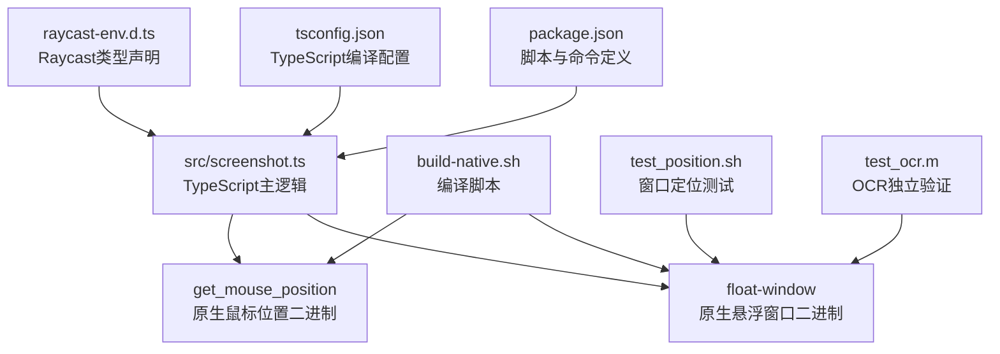
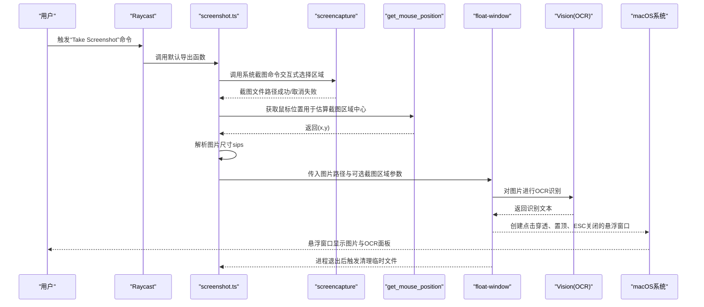
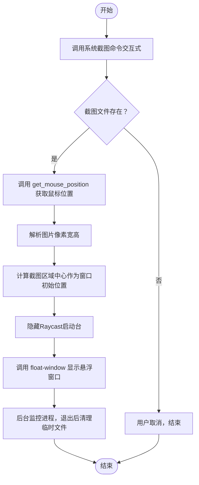
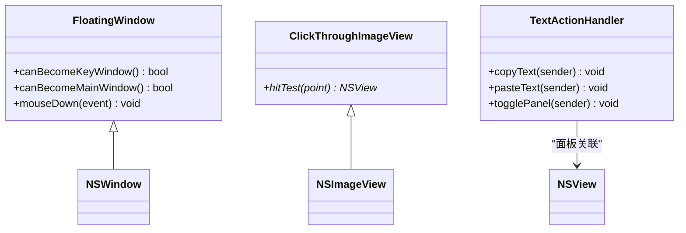
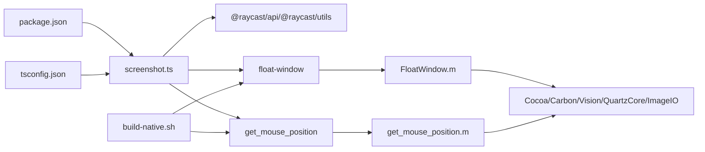

# 开发指南

<cite>
**本文引用的文件**
- [package.json](file://package.json)
- [tsconfig.json](file://tsconfig.json)
- [README.md](file://README.md)
- [build-native.sh](file://build-native.sh)
- [test_position.sh](file://test_position.sh)
- [test_ocr.m](file://test_ocr.m)
- [src/screenshot.ts](file://src/screenshot.ts)
- [FloatWindow.m](file://FloatWindow.m)
- [get_mouse_position.m](file://get_mouse_position.m)
- [float_window.py](file://float_window.py)
- [raycast-env.d.ts](file://raycast-env.d.ts)
</cite>

## 目录
1. [简介](#简介)
2. [项目结构](#项目结构)
3. [核心组件](#核心组件)
4. [架构总览](#架构总览)
5. [详细组件分析](#详细组件分析)
6. [依赖关系分析](#依赖关系分析)
7. [性能与可靠性考量](#性能与可靠性考量)
8. [故障排查指南](#故障排查指南)
9. [结论](#结论)
10. [附录](#附录)

## 简介
本开发指南面向贡献者与二次开发者，帮助你在本地完成环境准备、构建与调试，理解TypeScript与原生组件的协作方式，并提供可操作的修改建议与最佳实践。重点覆盖：
- 环境准备：Node.js、Xcode命令行工具（用于clang编译）、Raycast客户端
- 构建流程：npm run build触发TypeScript编译并通过脚本复制原生二进制到dist目录
- 调试方法：使用test_position.sh验证窗口定位，使用test_ocr.m独立验证OCR识别，使用ray develop进行热重载开发
- tsconfig.json编译选项与Raycast环境适配说明
- 修改建议：调整悬浮窗口样式需编辑FloatWindow.m；扩展功能需在package.json中新增命令
- 代码风格一致性：Objective-C命名规范、TypeScript格式化

## 项目结构
该仓库采用“TypeScript逻辑 + 原生Objective-C二进制”的混合架构：
- TypeScript入口位于src/screenshot.ts，负责调用macOS系统命令、定位鼠标、调用原生悬浮窗口应用、清理临时文件
- 原生组件包括悬浮窗口应用（FloatWindow.m）与鼠标位置查询程序（get_mouse_position.m），通过build-native.sh编译产出二进制
- 构建脚本与调试脚本分别位于package.json与shell脚本中
- tsconfig.json定义TypeScript编译目标与严格性等选项
- raycast-env.d.ts声明Raycast扩展的类型环境

图表来源
- [src/screenshot.ts](file://src/screenshot.ts#L1-L392)
- [build-native.sh](file://build-native.sh#L1-L26)
- [package.json](file://package.json#L1-L34)
- [tsconfig.json](file://tsconfig.json#L1-L21)
- [test_position.sh](file://test_position.sh#L1-L15)
- [test_ocr.m](file://test_ocr.m#L1-L92)
- [raycast-env.d.ts](file://raycast-env.d.ts#L1-L26)

章节来源
- [README.md](file://README.md#L1-L61)
- [package.json](file://package.json#L1-L34)
- [tsconfig.json](file://tsconfig.json#L1-L21)

## 核心组件
- TypeScript命令入口：负责截图、获取鼠标位置、调用原生悬浮窗口、清理临时文件
- 原生悬浮窗口应用：基于Cocoa框架，实现点击穿透、始终置顶、ESC关闭、边缘拖拽、OCR面板等功能
- 鼠标位置查询程序：获取当前鼠标坐标，辅助计算截图区域
- 构建与调试脚本：编译原生组件、开发热重载、窗口定位测试、OCR独立验证

章节来源
- [src/screenshot.ts](file://src/screenshot.ts#L1-L392)
- [FloatWindow.m](file://FloatWindow.m#L1-L466)
- [get_mouse_position.m](file://get_mouse_position.m#L1-L10)
- [build-native.sh](file://build-native.sh#L1-L26)
- [test_position.sh](file://test_position.sh#L1-L15)
- [test_ocr.m](file://test_ocr.m#L1-L92)

## 架构总览
下图展示从Raycast命令到系统截图、原生悬浮窗口与OCR处理的整体流程。

图表来源
- [src/screenshot.ts](file://src/screenshot.ts#L1-L392)
- [FloatWindow.m](file://FloatWindow.m#L1-L466)
- [get_mouse_position.m](file://get_mouse_position.m#L1-L10)
- [test_ocr.m](file://test_ocr.m#L1-L92)

## 详细组件分析

### TypeScript命令入口（src/screenshot.ts）
职责与流程要点：
- 截图：使用系统截图命令，交互式选择区域；通过spawn避免非零退出码导致误判
- 鼠标位置：调用get_mouse_position二进制，结合图片尺寸计算截图区域中心，作为悬浮窗口初始位置
- 图片尺寸：使用系统工具解析像素宽高，作为1:1显示依据
- 原生调用：自动查找/编译float-window与get_mouse_position，支持多路径探测
- 清理策略：窗口进程退出后通过AppleScript监控清理临时文件
- 错误处理：区分用户取消与异常，必要时提示Toast并清理临时文件

图表来源
- [src/screenshot.ts](file://src/screenshot.ts#L1-L392)

章节来源
- [src/screenshot.ts](file://src/screenshot.ts#L1-L392)

### 原生悬浮窗口应用（FloatWindow.m）
功能与实现要点：
- 窗口属性：无边框、始终置顶、点击穿透、跨空间固定
- 1:1显示：根据图片像素尺寸与屏幕缩放因子换算点尺寸
- 边缘拖拽：窗口边缘10px区域允许拖动，支持Cmd+拖拽
- ESC关闭：轮询检测ESC键，满足用户快速关闭
- OCR面板：右侧显示识别文本，支持复制/粘贴动作
- 文本识别：使用Vision框架，支持中英语言，置信度阈值过滤

图表来源
- [FloatWindow.m](file://FloatWindow.m#L154-L177)
- [FloatWindow.m](file://FloatWindow.m#L169-L177)
- [FloatWindow.m](file://FloatWindow.m#L85-L152)

章节来源
- [FloatWindow.m](file://FloatWindow.m#L1-L466)

### 鼠标位置查询程序（get_mouse_position.m）
功能与实现要点：
- 获取当前鼠标坐标，输出为“x,y”，供TypeScript侧计算截图区域中心
- 通过Cocoa框架直接读取NSEvent的鼠标位置

章节来源
- [get_mouse_position.m](file://get_mouse_position.m#L1-L10)

### 构建与调试脚本
- build-native.sh：使用clang编译float-window与get_mouse_position，赋予可执行权限
- package.json脚本：
  - prebuild：在构建前确保原生二进制存在，否则尝试编译
  - build：执行TypeScript编译并将二进制复制到dist目录
  - postbuild：若目标目录存在，将dist内容同步到Raycast扩展目录
  - dev：使用ray develop进行热重载开发
- test_position.sh：启动float-window显示测试图片，便于验证窗口定位与边界处理
- test_ocr.m：独立验证OCR识别效果，支持中英语言与置信度阈值

章节来源
- [build-native.sh](file://build-native.sh#L1-L26)
- [package.json](file://package.json#L1-L34)
- [test_position.sh](file://test_position.sh#L1-L15)
- [test_ocr.m](file://test_ocr.m#L1-L92)

### TypeScript编译配置（tsconfig.json）
- 目标与模块：ES2021、commonjs、node解析
- 严格性：开启严格模式、跳过库检查、强制文件名一致大小写
- JSX：使用react-jsx
- 输出目录：dist
- 包含范围：src/**/*
- 排除：node_modules

章节来源
- [tsconfig.json](file://tsconfig.json#L1-L21)

### Raycast类型声明（raycast-env.d.ts）
- 自动生成的类型声明文件，声明扩展偏好、命令参数等类型
- 不建议手动修改，应通过package.json维护

章节来源
- [raycast-env.d.ts](file://raycast-env.d.ts#L1-L26)

## 依赖关系分析
- TypeScript命令入口依赖：
  - 系统命令：screencapture、sips、osascript
  - 原生二进制：float-window、get_mouse_position
  - Raycast API：@raycast/api、@raycast/utils
- 原生悬浮窗口应用依赖：
  - Cocoa、Carbon、Vision、QuartzCore、ImageIO等系统框架
- 构建与调试依赖：
  - Node.js与npm
  - Xcode命令行工具（clang）
  - Raycast客户端（ray develop）

图表来源
- [src/screenshot.ts](file://src/screenshot.ts#L1-L392)
- [FloatWindow.m](file://FloatWindow.m#L1-L466)
- [get_mouse_position.m](file://get_mouse_position.m#L1-L10)
- [build-native.sh](file://build-native.sh#L1-L26)
- [package.json](file://package.json#L1-L34)
- [tsconfig.json](file://tsconfig.json#L1-L21)

章节来源
- [package.json](file://package.json#L1-L34)
- [tsconfig.json](file://tsconfig.json#L1-L21)

## 性能与可靠性考量
- 原生二进制编译：首次运行需确保Xcode命令行工具可用；编译失败时应检查clang与系统框架链接
- 进程管理：TypeScript侧通过detached子进程启动原生应用，避免阻塞；通过后台监控脚本清理临时文件
- 窗口定位：根据图片像素尺寸与屏幕缩放因子换算点尺寸，确保1:1显示；提供边界检查与Y轴修正逻辑
- OCR识别：使用Vision框架，支持中英语言；置信度阈值过滤低质量候选，提升稳定性
- 资源清理：窗口退出后立即清理临时文件，避免磁盘占用

[本节为通用指导，无需列出具体文件来源]

## 故障排查指南
常见问题与解决步骤：
- 原生二进制缺失
  - 现象：TypeScript侧提示找不到float-window或get_mouse_position
  - 处理：先运行构建脚本编译原生组件，再执行开发或构建
  - 参考：[build-native.sh](file://build-native.sh#L1-L26)、[package.json](file://package.json#L1-L34)
- 编译失败
  - 现象：clang报错或二进制不可执行
  - 处理：确认Xcode命令行工具安装；检查头文件与系统框架链接；重新执行编译脚本
  - 参考：[build-native.sh](file://build-native.sh#L1-L26)
- 窗口定位不准
  - 现象：悬浮窗口位置偏移或超出屏幕
  - 处理：使用test_position.sh启动测试；检查Y轴修正逻辑与边界处理；核对屏幕缩放因子
  - 参考：[test_position.sh](file://test_position.sh#L1-L15)、[FloatWindow.m](file://FloatWindow.m#L215-L266)
- OCR识别效果不佳
  - 现象：识别文本为空或置信度低
  - 处理：使用test_ocr.m独立验证；调整语言列表与最小文本高度；提高置信度阈值
  - 参考：[test_ocr.m](file://test_ocr.m#L1-L92)
- 热重载开发无效
  - 现象：修改代码后未生效
  - 处理：确认Raycast客户端版本与ray develop可用；确保dist目录与Raycast扩展目录同步
  - 参考：[package.json](file://package.json#L1-L34)

章节来源
- [build-native.sh](file://build-native.sh#L1-L26)
- [package.json](file://package.json#L1-L34)
- [test_position.sh](file://test_position.sh#L1-L15)
- [test_ocr.m](file://test_ocr.m#L1-L92)
- [FloatWindow.m](file://FloatWindow.m#L215-L266)

## 结论
本项目通过TypeScript与原生Objective-C的协同，实现了Raycast平台上的高质量截图悬浮显示体验。遵循本文档的环境准备、构建与调试流程，可快速完成开发与迭代。建议在修改悬浮窗口样式时优先编辑FloatWindow.m，扩展新功能时在package.json中新增命令，并保持代码风格一致性（Objective-C命名规范、TypeScript格式化）。

[本节为总结性内容，无需列出具体文件来源]

## 附录

### 环境准备清单
- 安装Node.js与npm
- 安装Xcode命令行工具（clang）
- 安装Raycast客户端
- 克隆/下载本仓库并导入Raycast扩展

章节来源
- [README.md](file://README.md#L1-L61)

### 构建与调试步骤
- 安装依赖：npm install
- 编译原生组件：./build-native.sh
- 开发模式：npm run dev
- 构建产物：npm run build（自动复制原生二进制到dist）

章节来源
- [README.md](file://README.md#L30-L44)
- [package.json](file://package.json#L1-L34)
- [build-native.sh](file://build-native.sh#L1-L26)

### 修改建议
- 调整悬浮窗口样式：编辑FloatWindow.m（窗口属性、拖拽区域、面板布局、颜色与圆角等）
- 扩展新功能：在package.json中新增commands条目与对应脚本，确保TypeScript入口与原生二进制路径一致
- 代码风格：
  - Objective-C：类名与方法命名遵循驼峰与帕斯卡命名规范，接口与实现分离清晰
  - TypeScript：使用统一的格式化工具（如Prettier），保持文件组织与注释规范

章节来源
- [package.json](file://package.json#L1-L34)
- [FloatWindow.m](file://FloatWindow.m#L1-L466)