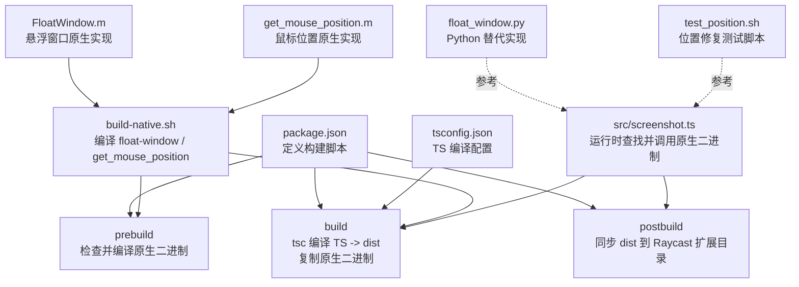
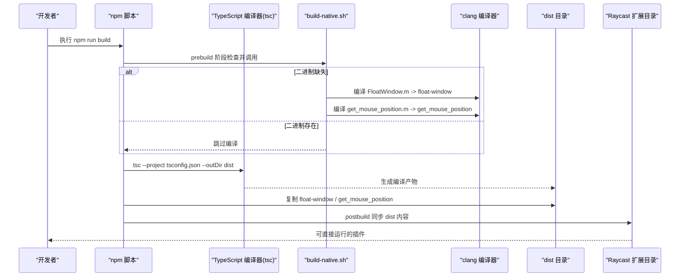
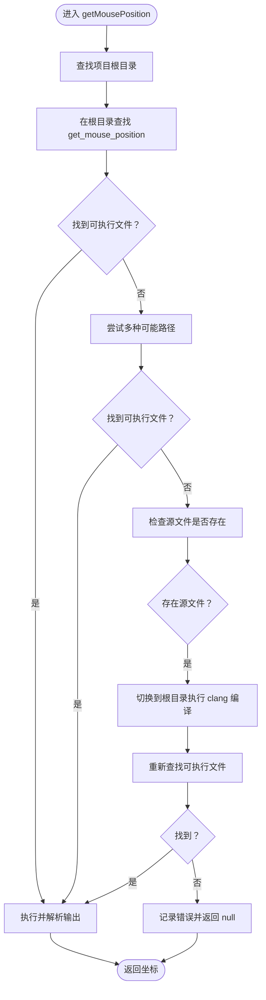
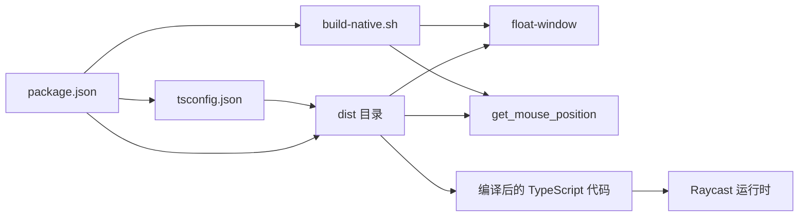

# 构建流程

<cite>
**本文引用的文件**
- [package.json](file://package.json)
- [tsconfig.json](file://tsconfig.json)
- [build-native.sh](file://build-native.sh)
- [src/screenshot.ts](file://src/screenshot.ts)
- [FloatWindow.m](file://FloatWindow.m)
- [get_mouse_position.m](file://get_mouse_position.m)
- [float_window.py](file://float_window.py)
- [test_position.sh](file://test_position.sh)
- [README.md](file://README.md)
</cite>

## 目录
1. [简介](#简介)
2. [项目结构](#项目结构)
3. [核心组件](#核心组件)
4. [架构总览](#架构总览)
5. [详细组件分析](#详细组件分析)
6. [依赖分析](#依赖分析)
7. [性能考量](#性能考量)
8. [故障排查指南](#故障排查指南)
9. [结论](#结论)
10. [附录](#附录)

## 简介
本文件系统性阐述从源码到可运行 Raycast 插件的完整构建流程，重点覆盖以下方面：
- package.json 中 scripts 字段的执行逻辑与控制流：prebuild 阶段检查并调用 build-native.sh 编译原生二进制；build 阶段通过 tsc 编译 TypeScript 至 dist 并复制原生二进制；postbuild 阶段将 dist 同步至 Raycast 扩展目录。
- tsconfig.json 的编译配置如何适配 Raycast 运行时环境：模块格式、输出目录、严格模式与 JSX 处理等。
- 构建失败的常见原因与排查思路：编译器缺失、权限问题、路径错误、依赖缺失等。
- 结合实际代码片段路径，展示构建脚本的调用关系与数据流向，帮助开发者理解自动化流程背后的机制。

## 项目结构
该项目采用“TypeScript 源码 + 原生 Objective-C 二进制”的混合架构：
- 源码层：src/screenshot.ts 为插件入口，负责截图、定位、调用原生悬浮窗口与鼠标位置工具。
- 原生层：FloatWindow.m 与 get_mouse_position.m 分别编译为 float-window 与 get_mouse_position 两个二进制文件。
- 构建层：package.json 定义 prebuild/build/postbuild 三阶段；tsconfig.json 控制 TypeScript 编译行为；build-native.sh 统一编译原生二进制。
- 工具层：float_window.py 为 Python 版本的替代实现（可选）；test_position.sh 用于手动验证悬浮窗口位置逻辑。

图表来源
- [package.json](file://package.json#L28-L33)
- [tsconfig.json](file://tsconfig.json#L1-L21)
- [build-native.sh](file://build-native.sh#L1-L26)
- [src/screenshot.ts](file://src/screenshot.ts#L162-L236)
- [FloatWindow.m](file://FloatWindow.m#L1-L466)
- [get_mouse_position.m](file://get_mouse_position.m#L1-L10)
- [float_window.py](file://float_window.py#L1-L100)
- [test_position.sh](file://test_position.sh#L1-L15)

章节来源
- [package.json](file://package.json#L1-L34)
- [tsconfig.json](file://tsconfig.json#L1-L21)
- [build-native.sh](file://build-native.sh#L1-L26)
- [README.md](file://README.md#L30-L44)

## 核心组件
- 构建脚本与控制流
  - prebuild：在构建前检查是否存在 float-window 与 get_mouse_position；若缺失则尝试执行 build-native.sh；否则输出提示。
  - build：调用 tsc 编译 src 下的 TypeScript 源码至 dist 目录，并将 float-window 与 get_mouse_position 复制到 dist。
  - postbuild：若 dist 存在且 Raycast 扩展目录存在，则将 dist 内容同步到该目录，便于直接运行。
- TypeScript 编译配置
  - 目标与库：ES2021，模块格式 commonjs，严格模式开启，JSX 使用 react-jsx。
  - 输出目录：dist。
  - 其他：跳过库检查、解析 JSON 模块、隔离模块等，提升兼容性与构建速度。
- 原生二进制编译
  - 使用 clang 编译 FloatWindow.m 为 float-window，链接 Cocoa、Carbon、Vision、QuartzCore、ImageIO 等框架。
  - 使用 clang 编译 get_mouse_position.m 为 get_mouse_position，链接 Cocoa。
  - 成功后赋予可执行权限。

章节来源
- [package.json](file://package.json#L28-L33)
- [tsconfig.json](file://tsconfig.json#L1-L21)
- [build-native.sh](file://build-native.sh#L1-L26)

## 架构总览
下图展示了从开发到部署的端到端流程，以及各组件之间的依赖关系：

图表来源
- [package.json](file://package.json#L28-L33)
- [tsconfig.json](file://tsconfig.json#L1-L21)
- [build-native.sh](file://build-native.sh#L1-L26)
- [src/screenshot.ts](file://src/screenshot.ts#L238-L390)

## 详细组件分析

### 构建脚本与控制流（package.json）
- prebuild
  - 条件判断：若当前目录同时存在 float-window 与 get_mouse_position，则跳过编译；否则检查 build-native.sh 是否存在并执行；若仍不可用则输出提示。
  - 作用：确保构建前具备必要的原生二进制，避免后续步骤失败。
- build
  - tsc 编译：基于 tsconfig.json，将 src 下的 TypeScript 源码编译到 dist。
  - 复制原生二进制：将 float-window 与 get_mouse_position 复制到 dist，保证运行时可发现。
- postbuild
  - 同步：若 dist 与目标 Raycast 扩展目录均存在，则将 dist 内容复制过去，便于直接运行。

章节来源
- [package.json](file://package.json#L28-L33)

### TypeScript 编译配置（tsconfig.json）
- 目标与模块
  - target/lib：ES2021，确保现代语法可用。
  - module/moduleResolution：commonjs + node，适配 Node 生态与 Raycast 运行时。
- 严格性与兼容性
  - strict：开启严格模式，提升类型安全。
  - esModuleInterop/skipLibCheck：增强互操作性并跳过库类型检查，减少噪声。
  - forceConsistentCasingInFileNames/resolveJsonModule/isolatedModules：提升一致性与 JSON 模块解析能力。
- JSX 与输出
  - jsx：react-jsx，适配 React/JSX 场景。
  - outDir：dist，统一输出目录，便于后续打包与分发。
- include/exclude
  - include：src/**/*，仅编译源码目录。
  - exclude：node_modules，避免第三方包参与编译。

章节来源
- [tsconfig.json](file://tsconfig.json#L1-L21)

### 原生二进制编译（build-native.sh）
- 编译流程
  - 编译 float-window：链接 Cocoa、Carbon、Vision、QuartzCore、ImageIO、ImageIO 等框架，成功后赋予可执行权限。
  - 编译 get_mouse_position：链接 Cocoa，成功后赋予可执行权限。
- 错误处理
  - 若任一编译失败，打印失败信息并退出，阻止后续构建继续。
- 与 TypeScript 的集成
  - build 阶段将编译产物复制到 dist，供 src/screenshot.ts 在运行时查找与调用。

章节来源
- [build-native.sh](file://build-native.sh#L1-L26)

### 运行时查找与调用原生二进制（src/screenshot.ts）
- getMousePosition
  - 路径查找策略：优先项目根目录，其次 dist 上级目录、当前工作目录、两级上级目录、环境变量指定路径。
  - 自动编译：若源文件存在且可执行文件缺失，切换到项目根目录执行 clang 编译。
  - 执行与解析：调用 get_mouse_position 并解析输出的鼠标坐标。
- showFloatingWindow
  - 路径查找策略：与 getMousePosition 类似，支持 PATH 查询与自动编译。
  - 参数传递：向 float-window 传入图片路径与可选的截图区域参数。
  - 清理机制：通过 AppleScript 监控进程退出后删除临时截图文件。
- 异常处理
  - 对找不到可执行文件、编译失败、执行异常等情况进行日志记录与用户提示。

图表来源
- [src/screenshot.ts](file://src/screenshot.ts#L162-L236)

章节来源
- [src/screenshot.ts](file://src/screenshot.ts#L162-L236)

### 原生实现细节（FloatWindow.m 与 get_mouse_position.m）
- FloatWindow.m
  - 功能：创建无边框悬浮窗口，支持点击穿透、始终置顶、ESC 关闭、边缘拖动、OCR 文字识别面板等。
  - 输入：图片路径；可选截图区域参数（X/Y/宽/高）。
  - 输出：原生窗口进程，生命周期由外部监控脚本管理。
- get_mouse_position.m
  - 功能：输出当前鼠标坐标，供 TypeScript 侧计算截图区域中心点。
  - 输入：无。
  - 输出：标准输出的逗号分隔坐标字符串。

章节来源
- [FloatWindow.m](file://FloatWindow.m#L1-L466)
- [get_mouse_position.m](file://get_mouse_position.m#L1-L10)

### Python 替代实现与测试脚本
- float_window.py
  - 作为 Objective-C 实现的参考，展示相同功能的 Python 版本，便于理解窗口行为与参数传递。
- test_position.sh
  - 用于手动验证悬浮窗口位置修复逻辑，通过直接调用已安装的 float-window 并传入截图区域参数，观察显示效果。

章节来源
- [float_window.py](file://float_window.py#L1-L100)
- [test_position.sh](file://test_position.sh#L1-L15)

## 依赖分析
- 构建期依赖
  - TypeScript 编译器：tsc（由 devDependencies 中的 typescript 提供）。
  - 原生编译器：clang（macOS 系统自带）。
  - 构建脚本：build-native.sh。
- 运行时依赖
  - Raycast API：@raycast/api。
  - 工具链：/usr/sbin/screencapture、/usr/bin/sips、/usr/bin/osascript 等系统命令。
  - 原生二进制：float-window、get_mouse_position。
- 耦合与内聚
  - package.json 的三个脚本与 tsconfig.json 的编译配置耦合紧密，共同决定产物布局与分发。
  - src/screenshot.ts 与原生二进制之间通过路径查找与参数传递形成松耦合，具备自动编译与回退策略。

图表来源
- [package.json](file://package.json#L28-L33)
- [tsconfig.json](file://tsconfig.json#L1-L21)
- [build-native.sh](file://build-native.sh#L1-L26)
- [src/screenshot.ts](file://src/screenshot.ts#L238-L390)

章节来源
- [package.json](file://package.json#L1-L34)
- [tsconfig.json](file://tsconfig.json#L1-L21)
- [build-native.sh](file://build-native.sh#L1-L26)
- [src/screenshot.ts](file://src/screenshot.ts#L238-L390)

## 性能考量
- 构建阶段
  - tsc 使用 isolatedModules 与 skipLibCheck，减少类型检查开销，适合大型项目与频繁迭代。
  - outDir 统一输出到 dist，便于后续打包与缓存命中。
- 运行阶段
  - 原生二进制通过 clang 直接编译，启动快、资源占用低。
  - TypeScript 侧通过路径查找与自动编译策略，避免重复编译，提升开发体验。
- I/O 与清理
  - 临时文件在原生窗口退出后由 AppleScript 脚本清理，降低磁盘碎片与残留风险。

## 故障排查指南
- 编译器缺失
  - 现象：prebuild/build 阶段报错，提示 clang 未找到。
  - 排查：确认 Xcode Command Line Tools 已安装；在终端执行 clang --version 验证。
  - 参考路径：[build-native.sh](file://build-native.sh#L1-L26)
- 权限问题
  - 现象：执行 ./build-native.sh 或复制 dist 失败。
  - 排查：确保脚本具有可执行权限；检查目标 Raycast 扩展目录写权限。
  - 参考路径：[package.json](file://package.json#L28-L33)
- 路径错误
  - 现象：运行时报找不到 float-window 或 get_mouse_position。
  - 排查：确认 dist 目录存在且包含上述二进制；检查 src/screenshot.ts 的路径查找逻辑是否命中预期位置。
  - 参考路径：[src/screenshot.ts](file://src/screenshot.ts#L238-L390)
- 依赖缺失
  - 现象：TypeScript 编译失败或运行时报错。
  - 排查：执行 npm install 安装依赖；确认 @raycast/api 与 typescript 版本兼容。
  - 参考路径：[package.json](file://package.json#L1-L34)
- Raycast 目录不存在
  - 现象：postbuild 阶段同步失败。
  - 排查：确认 Raycast 扩展目录存在；必要时先在 Raycast 中导入扩展后再执行构建。
  - 参考路径：[package.json](file://package.json#L28-L33)
- 原生编译失败
  - 现象：build-native.sh 输出编译失败并退出。
  - 排查：检查 FloatWindow.m 与 get_mouse_position.m 是否有语法错误；确认所需框架已正确链接。
  - 参考路径：[build-native.sh](file://build-native.sh#L1-L26)

## 结论
本项目的构建流程通过 npm scripts 与 tsconfig.json 的协同，实现了从 TypeScript 源码到可运行插件的自动化交付。prebuild 阶段确保原生二进制就绪，build 阶段完成类型安全的编译与产物整合，postbuild 阶段将产物同步至 Raycast 扩展目录，便于直接运行。src/screenshot.ts 在运行时具备完善的路径查找与自动编译回退机制，增强了开发与部署的鲁棒性。建议在 CI/CD 中复用相同脚本，以保证构建一致性与可追溯性。

## 附录
- 开发与构建建议
  - 本地开发：先执行 ./build-native.sh 确保二进制就绪，再执行 npm run build。
  - CI 环境：确保安装 Xcode Command Line Tools 与 Node.js，预置 Raycast 扩展目录。
- 参考命令
  - 安装依赖：npm install
  - 编译原生二进制：./build-native.sh
  - 开发模式：npm run dev
  - 构建：npm run build

章节来源
- [README.md](file://README.md#L30-L44)
- [package.json](file://package.json#L28-L33)