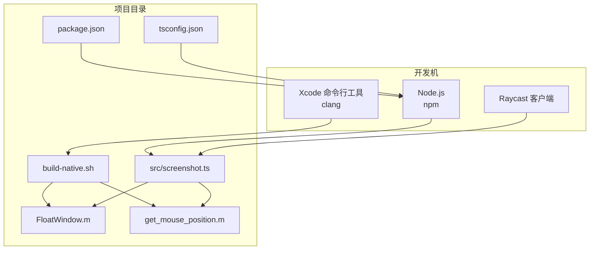
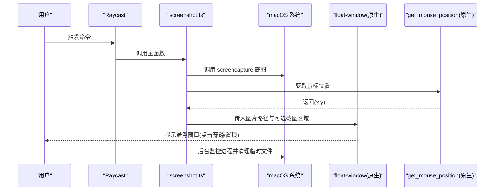
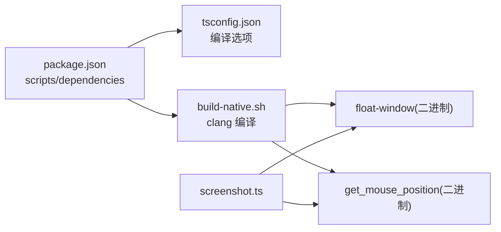
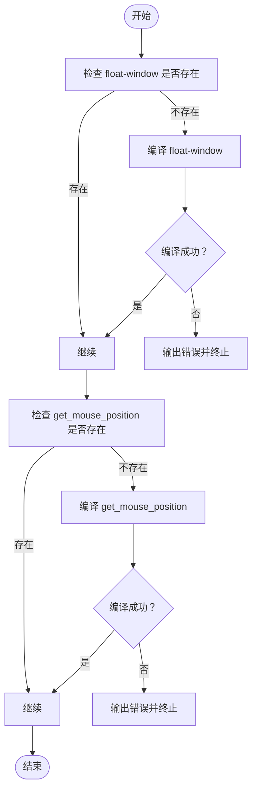

# 环境准备

<cite>
**本文引用的文件**
- [package.json](file://package.json)
- [tsconfig.json](file://tsconfig.json)
- [README.md](file://README.md)
- [build-native.sh](file://build-native.sh)
- [FloatWindow.m](file://FloatWindow.m)
- [get_mouse_position.m](file://get_mouse_position.m)
- [src/screenshot.ts](file://src/screenshot.ts)
- [float_window.py](file://float_window.py)
- [test_ocr.m](file://test_ocr.m)
- [test_position.sh](file://test_position.sh)
</cite>

## 目录
1. [简介](#简介)
2. [项目结构](#项目结构)
3. [核心组件](#核心组件)
4. [架构总览](#架构总览)
5. [详细组件分析](#详细组件分析)
6. [依赖关系分析](#依赖关系分析)
7. [性能注意事项](#性能注意事项)
8. [故障排查指南](#故障排查指南)
9. [结论](#结论)
10. [附录](#附录)

## 简介
本指南面向开发者，帮助你完成本 Raycast 插件的开发环境准备。重点包括：
- 安装 Node.js（版本需满足 package.json 中 devDependencies 的范围）
- 安装 Xcode 命令行工具（用于 clang 编译 Objective-C 源文件 FloatWindow.m 与 get_mouse_position.m）
- 安装 Raycast 客户端（插件运行平台）
- 配置 npm 与 TypeScript（与 tsconfig.json 的编译选项保持一致）
- 验证环境（node -v、npm -v、clang --version）
- 结合代码示例说明 package.json 中 devDependencies 的作用
- 常见环境问题与解决方案（如权限不足、路径错误）

## 项目结构
该仓库采用“前端 TypeScript + 原生 Objective-C 工具”的混合架构：
- TypeScript 源码位于 src/，负责调用系统截图命令与原生工具
- 原生工具通过 build-native.sh 编译产出 float-window 与 get_mouse_position
- package.json 定义了依赖与构建脚本；tsconfig.json 规定了 TypeScript 编译选项
- README.md 提供安装与开发流程说明

图表来源
- [package.json](file://package.json#L1-L34)
- [tsconfig.json](file://tsconfig.json#L1-L21)
- [build-native.sh](file://build-native.sh#L1-L26)
- [FloatWindow.m](file://FloatWindow.m#L1-L466)
- [get_mouse_position.m](file://get_mouse_position.m#L1-L10)
- [src/screenshot.ts](file://src/screenshot.ts#L1-L392)

章节来源
- [package.json](file://package.json#L1-L34)
- [tsconfig.json](file://tsconfig.json#L1-L21)
- [README.md](file://README.md#L1-L61)

## 核心组件
- TypeScript 主程序：负责截图、获取图片尺寸与鼠标位置、调用原生悬浮窗口与鼠标位置工具、清理临时文件
- 原生悬浮窗口应用：基于 Cocoa/Carbon/Vision 等框架，实现点击穿透、始终置顶、1:1 显示、拖动与 ESC 关闭
- 鼠标位置工具：基于 Cocoa 获取当前鼠标坐标
- 构建脚本：使用 clang 编译上述原生工具

章节来源
- [src/screenshot.ts](file://src/screenshot.ts#L1-L392)
- [FloatWindow.m](file://FloatWindow.m#L1-L466)
- [get_mouse_position.m](file://get_mouse_position.m#L1-L10)
- [build-native.sh](file://build-native.sh#L1-L26)

## 架构总览
下图展示了从 Raycast 命令触发到最终显示悬浮窗口的整体流程。

图表来源
- [src/screenshot.ts](file://src/screenshot.ts#L1-L392)
- [FloatWindow.m](file://FloatWindow.m#L1-L466)
- [get_mouse_position.m](file://get_mouse_position.m#L1-L10)

## 详细组件分析

### TypeScript 开发环境与编译配置
- Node.js 与 npm：用于安装依赖与运行脚本
- TypeScript：由 tsc 编译，tsconfig.json 指定目标版本、模块系统、JSX 处理等
- @raycast/api 与 @raycast/utils：运行时依赖，用于与 Raycast 平台交互
- @types/node 与 @types/react：开发期类型定义，提升编辑器体验与类型安全

建议步骤
- 安装 Node.js（版本需满足 devDependencies 的 ^ 范围）
- 安装 Xcode 命令行工具（提供 clang）
- 安装依赖：npm install
- 验证 TypeScript 编译：tsc --project tsconfig.json
- 开发模式：npm run dev
- 构建产物：npm run build

章节来源
- [package.json](file://package.json#L1-L34)
- [tsconfig.json](file://tsconfig.json#L1-L21)
- [README.md](file://README.md#L30-L44)

### 原生工具编译与运行
- build-native.sh 使用 clang 编译：
  - float-window：链接 Cocoa、Carbon、Vision、QuartzCore、ImageIO
  - get_mouse_position：链接 Cocoa
- 编译后产物会被复制到 dist/ 并在开发/构建阶段被部署到 Raycast 扩展目录
- screenshot.ts 在运行时会优先查找 float-window 与 get_mouse_position 的可执行文件，若缺失则尝试自动编译

章节来源
- [build-native.sh](file://build-native.sh#L1-L26)
- [FloatWindow.m](file://FloatWindow.m#L1-L466)
- [get_mouse_position.m](file://get_mouse_position.m#L1-L10)
- [src/screenshot.ts](file://src/screenshot.ts#L1-L392)

### Python 辅助工具（可选）
- float_window.py 提供 Python 版本的悬浮窗口逻辑，便于理解窗口属性与行为（点击穿透、置顶、ESC 关闭等）
- 若你希望使用 Python 版本，可直接运行该脚本，但本项目主要使用 Objective-C 原生应用

章节来源
- [float_window.py](file://float_window.py#L1-L100)

### OCR 与测试工具
- test_ocr.m：演示如何使用 Vision 框架对图片进行 OCR 识别
- test_position.sh：演示如何手动测试悬浮窗口的位置与尺寸参数

章节来源
- [test_ocr.m](file://test_ocr.m#L1-L92)
- [test_position.sh](file://test_position.sh#L1-L15)

## 依赖关系分析
- package.json 中的 scripts 与依赖关系
  - prebuild：在构建前检查并编译原生工具
  - build：TypeScript 编译并复制原生二进制
  - postbuild：将 dist 内容复制到 Raycast 扩展目录（若存在）
  - dev：通过 ray develop 启动开发模式
- tsconfig.json 的编译选项与 Node.js 生态兼容性
  - target/module/jsx 等选项需与运行时环境匹配
- 原生工具依赖 macOS 框架（Cocoa、Carbon、Vision、QuartzCore、ImageIO）

图表来源
- [package.json](file://package.json#L1-L34)
- [tsconfig.json](file://tsconfig.json#L1-L21)
- [build-native.sh](file://build-native.sh#L1-L26)
- [src/screenshot.ts](file://src/screenshot.ts#L1-L392)

章节来源
- [package.json](file://package.json#L1-L34)
- [tsconfig.json](file://tsconfig.json#L1-L21)
- [src/screenshot.ts](file://src/screenshot.ts#L1-L392)

## 性能注意事项
- 原生工具使用 Vision 进行 OCR，识别质量与性能受图片分辨率与语言设置影响
- 悬浮窗口启用点击穿透与置顶，避免不必要的渲染开销
- TypeScript 编译严格模式与 isolatedModules 有助于早期发现类型问题，减少运行时错误

## 故障排查指南

常见问题与解决思路
- 权限不足
  - 现象：clang 编译失败、无法写入扩展目录
  - 解决：确认 Xcode 命令行工具已安装且 clang 可用；确保 Raycast 扩展目录可写
- 路径错误
  - 现象：找不到 float-window 或 get_mouse_position
  - 解决：先运行 ./build-native.sh 生成二进制；或在 screenshot.ts 中自动编译（依赖源文件存在）
- Node.js 版本不匹配
  - 现象：npm install 报错或 tsc 编译失败
  - 解决：使用与 devDependencies 对应的 Node.js 版本（例如使用 nvm 切换）
- Raycast 开发模式不可用
  - 现象：ray develop 命令不存在
  - 解决：安装 @raycast/cli 或确保已安装 Raycast 客户端并正确配置

验证清单
- 检查 Node.js 与 npm 版本：node -v、npm -v
- 检查 clang 版本：clang --version
- 确认原生工具已生成：ls float-window get_mouse_position
- 确认 TypeScript 编译通过：tsc --project tsconfig.json
- 运行开发模式：npm run dev
- 运行构建：npm run build

章节来源
- [README.md](file://README.md#L30-L44)
- [src/screenshot.ts](file://src/screenshot.ts#L1-L392)
- [build-native.sh](file://build-native.sh#L1-L26)

## 结论
完成 Node.js、Xcode 命令行工具与 Raycast 客户端的安装后，按照 README 的开发流程执行 npm install、./build-native.sh、npm run dev 即可开始开发。通过 tsconfig.json 与 package.json 的约束，确保 TypeScript 与原生工具链的一致性。遇到问题时，优先检查 clang 可用性、二进制文件存在性与 Node.js 版本匹配。

## 附录

### package.json 中 devDependencies 的作用
- @types/node：为 Node.js 内置模块提供类型定义，提升编辑器体验与类型安全
- @types/react：为 React JSX 提供类型定义，配合 tsconfig.json 的 jsx: react-jsx
- typescript：提供 tsc 编译器，用于将 TypeScript 源码编译为 JavaScript

章节来源
- [package.json](file://package.json#L1-L34)
- [tsconfig.json](file://tsconfig.json#L1-L21)

### TypeScript 编译选项与 Raycast 平台兼容性
- target: ES2021、lib: ES2021：确保使用较新的 ECMAScript 特性
- module: commonjs：与 Node.js 运行时兼容
- jsx: react-jsx：与 React JSX 语法配合
- strict、esModuleInterop、skipLibCheck 等：提升类型安全与兼容性

章节来源
- [tsconfig.json](file://tsconfig.json#L1-L21)

### 原生工具编译流程（算法）

图表来源
- [build-native.sh](file://build-native.sh#L1-L26)
- [FloatWindow.m](file://FloatWindow.m#L1-L466)
- [get_mouse_position.m](file://get_mouse_position.m#L1-L10)