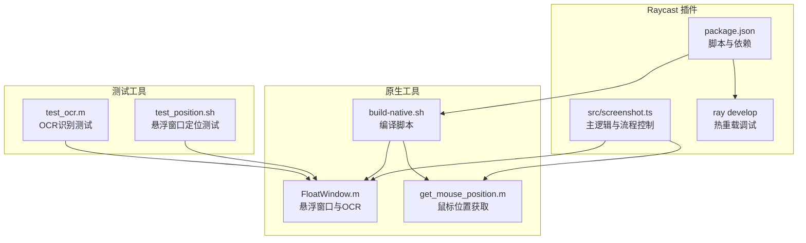
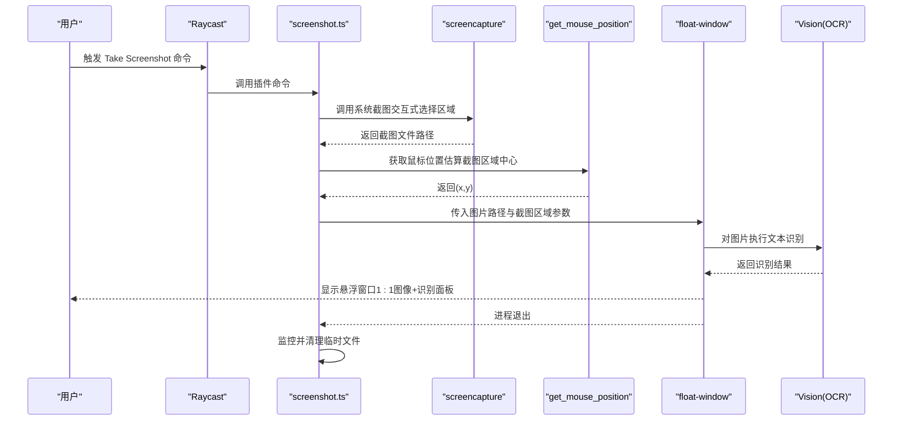
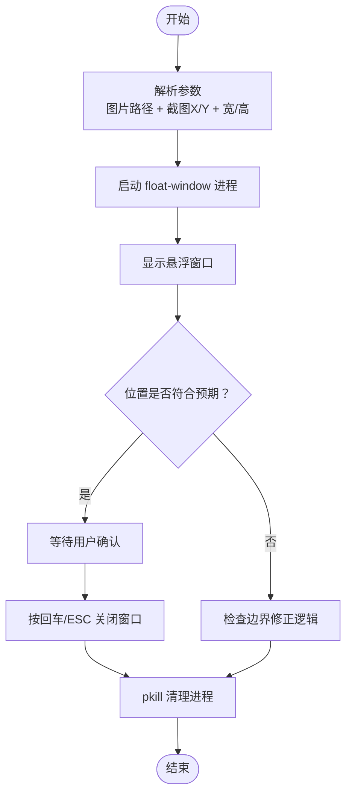
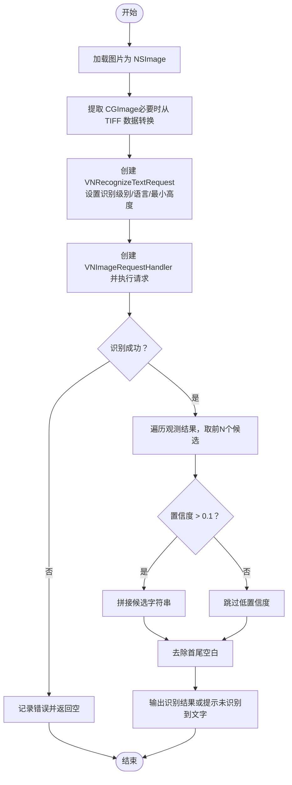
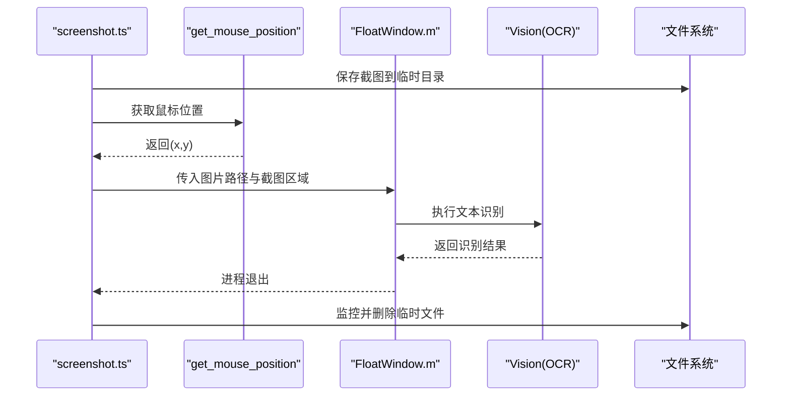
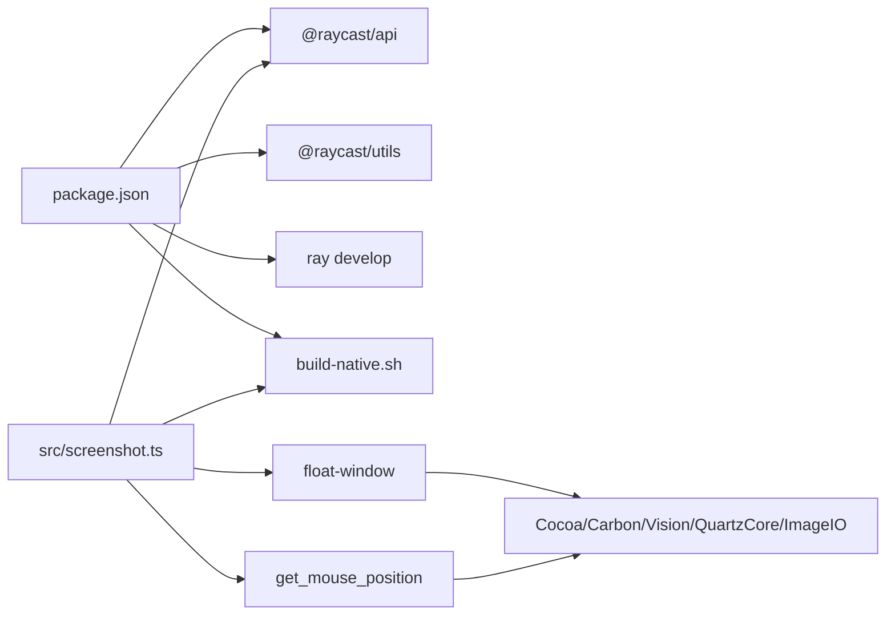

# 调试方法

<cite>
**本文引用的文件**
- [README.md](file://README.md)
- [package.json](file://package.json)
- [build-native.sh](file://build-native.sh)
- [src/screenshot.ts](file://src/screenshot.ts)
- [test_position.sh](file://test_position.sh)
- [test_ocr.m](file://test_ocr.m)
- [FloatWindow.m](file://FloatWindow.m)
- [get_mouse_position.m](file://get_mouse_position.m)
</cite>

## 目录
1. [简介](#简介)
2. [项目结构](#项目结构)
3. [核心组件](#核心组件)
4. [架构总览](#架构总览)
5. [详细组件分析](#详细组件分析)
6. [依赖关系分析](#依赖关系分析)
7. [性能考量](#性能考量)
8. [故障排查指南](#故障排查指南)
9. [结论](#结论)
10. [附录](#附录)

## 简介
本指南面向开发者，系统化地介绍如何调试该 Raycast 插件的各功能模块，重点包括：
- 使用 test_position.sh 独立测试悬浮窗口的定位精度，支持手动指定图片路径、坐标与尺寸参数，并通过 pkill 清理进程。
- 使用 test_ocr.m 验证 OCR 文字识别功能，传入截图文件路径后查看控制台输出的识别结果，分析 Vision 框架的识别准确率与置信度阈值（confidence > 0.1）的影响。
- 利用 Raycast 官方开发工具 ray develop 实现热重载调试，快速迭代插件逻辑。
- 结合 test_ocr.m 中的 Objective-C 代码，解释 VNRecognizeTextRequest 的配置（如 recognitionLanguages 支持中文和英文）对识别效果的影响，并提供优化建议。

## 项目结构
该项目由 TypeScript 插件主逻辑与原生 Objective-C 工具组成，配合构建脚本与测试脚本，形成完整的开发与调试闭环。

图表来源
- [src/screenshot.ts](file://src/screenshot.ts#L1-L392)
- [package.json](file://package.json#L1-L34)
- [build-native.sh](file://build-native.sh#L1-L26)
- [FloatWindow.m](file://FloatWindow.m#L1-L466)
- [get_mouse_position.m](file://get_mouse_position.m#L1-L10)
- [test_position.sh](file://test_position.sh#L1-L15)
- [test_ocr.m](file://test_ocr.m#L1-L92)

章节来源
- [README.md](file://README.md#L1-L61)
- [package.json](file://package.json#L1-L34)

## 核心组件
- TypeScript 主逻辑：负责调用系统截图、获取鼠标位置、计算截图区域、启动原生悬浮窗口、监控进程并清理临时文件。
- 原生悬浮窗口应用：基于 Cocoa/Carbon/Vision，实现点击穿透、始终置顶、1:1 图像显示、拖拽、ESC 关闭、右侧识别结果面板等。
- 鼠标位置工具：获取当前鼠标坐标，辅助估算截图区域。
- 测试脚本：独立验证悬浮窗口定位与 OCR 识别效果。

章节来源
- [src/screenshot.ts](file://src/screenshot.ts#L1-L392)
- [FloatWindow.m](file://FloatWindow.m#L1-L466)
- [get_mouse_position.m](file://get_mouse_position.m#L1-L10)
- [test_position.sh](file://test_position.sh#L1-L15)
- [test_ocr.m](file://test_ocr.m#L1-L92)

## 架构总览
下图展示了从 Raycast 命令触发到悬浮窗口显示与 OCR 识别的整体流程。

图表来源
- [src/screenshot.ts](file://src/screenshot.ts#L1-L392)
- [FloatWindow.m](file://FloatWindow.m#L1-L466)
- [get_mouse_position.m](file://get_mouse_position.m#L1-L10)

## 详细组件分析

### 悬浮窗口定位测试（test_position.sh）
- 目的：独立验证悬浮窗口在指定图片路径、坐标与尺寸下的定位是否符合预期。
- 使用步骤：
  1) 准备一张测试图片（例如 test.png）。
  2) 在终端运行脚本，传入图片路径与目标坐标(x,y)及宽高(w,h)。
  3) 观察悬浮窗口是否出现在预期位置；按回车键或 ESC 关闭窗口。
  4) 使用 pkill 清理残留的 float-window 进程，避免干扰后续测试。
- 关键行为：
  - 脚本直接调用编译好的 float-window 可执行文件，并以参数形式传入图片路径与截图区域。
  - 窗口采用无边框、始终置顶、点击穿透等策略，便于观察定位。
  - 若窗口越界，程序会进行边界修正，确保可见。

图表来源
- [test_position.sh](file://test_position.sh#L1-L15)
- [FloatWindow.m](file://FloatWindow.m#L215-L266)

章节来源
- [test_position.sh](file://test_position.sh#L1-L15)
- [FloatWindow.m](file://FloatWindow.m#L215-L266)

### OCR 文字识别测试（test_ocr.m）
- 目的：验证 Vision 框架的 OCR 能力，查看控制台输出的识别结果，并评估置信度阈值对识别质量的影响。
- 使用步骤：
  1) 准备一张包含文字的截图文件（例如 test.png）。
  2) 在终端运行 test_ocr.m，传入图片路径作为参数。
  3) 查看控制台输出的识别结果；若未识别到文字，输出相应提示。
- 关键实现要点（来自 test_ocr.m）：
  - 使用 VNRecognizeTextRequest 执行识别，设置识别级别为精确级。
  - 启用语言纠正，最小文本高度设为自动检测。
  - 识别语言列表包含简体/繁体中文与英式/美式英语，覆盖多语场景。
  - 置信度阈值设置为 0.1，仅输出高置信度候选；必要时可调整阈值以平衡召回与精度。
  - 对识别结果进行去空白处理，保证输出整洁。

图表来源
- [test_ocr.m](file://test_ocr.m#L1-L92)

章节来源
- [test_ocr.m](file://test_ocr.m#L1-L92)

### 热重载调试（ray develop）
- 目的：在开发过程中通过 ray develop 实现热重载，无需手动重启即可看到修改效果。
- 使用步骤：
  1) 在项目根目录执行 npm run dev（内部即 ray develop）。
  2) 修改 TypeScript 源码后，Raycast 会自动重新加载插件。
  3) 如需验证原生工具改动，先执行 ./build-native.sh 重新编译 float-window 与 get_mouse_position，再进行测试。
- 注意事项：
  - package.json 中 scripts.dev 指向 ray develop，确保本地已安装 Raycast CLI。
  - 若修改了原生部分，务必重新编译后再进行端到端验证。

章节来源
- [package.json](file://package.json#L1-L34)
- [README.md](file://README.md#L30-L44)

### 悬浮窗口与 OCR 的集成（src/screenshot.ts → FloatWindow.m）
- 截图与区域估算：
  - 使用系统 screencapture 交互式选择区域，保存为 PNG。
  - 通过 get_mouse_position 获取鼠标位置，估算截图区域中心，从而推导 x/y。
  - 使用 sips 获取图片像素尺寸，确保 1:1 显示。
- 启动悬浮窗口：
  - 自动查找/编译 float-window，传入图片路径与截图区域参数。
  - 后台启动监控脚本，进程退出后清理临时文件。
- OCR 集成：
  - 在原生悬浮窗口中对图片执行 Vision OCR，将结果展示在右侧面板。
  - 支持复制/粘贴文字、ESC 关闭、拖拽窗口等交互。

图表来源
- [src/screenshot.ts](file://src/screenshot.ts#L1-L392)
- [FloatWindow.m](file://FloatWindow.m#L1-L466)
- [get_mouse_position.m](file://get_mouse_position.m#L1-L10)

章节来源
- [src/screenshot.ts](file://src/screenshot.ts#L1-L392)
- [FloatWindow.m](file://FloatWindow.m#L1-L466)

## 依赖关系分析
- TypeScript 依赖：
  - @raycast/api：提供命令、Toast、子进程等能力。
  - @raycast/utils：通用工具库。
- 构建与运行：
  - package.json 中 prebuild/build/postbuild 脚本确保原生二进制可用。
  - ray develop 用于热重载调试。
- 原生依赖：
  - Cocoa/Carbon/Vision/QuartzCore/ImageIO：悬浮窗口、OCR、图像处理与事件处理。
- 外部工具：
  - screencapture：系统截图。
  - osascript：隐藏启动台、监控进程。
  - sips：获取图片像素尺寸。

图表来源
- [package.json](file://package.json#L1-L34)
- [src/screenshot.ts](file://src/screenshot.ts#L1-L392)
- [build-native.sh](file://build-native.sh#L1-L26)
- [FloatWindow.m](file://FloatWindow.m#L1-L466)
- [get_mouse_position.m](file://get_mouse_position.m#L1-L10)

章节来源
- [package.json](file://package.json#L1-L34)
- [src/screenshot.ts](file://src/screenshot.ts#L1-L392)

## 性能考量
- 截图与尺寸获取：
  - 使用系统 screencapture 与 sips，避免额外解码开销。
  - 优先使用像素尺寸进行 1:1 显示，减少缩放与渲染成本。
- OCR 执行：
  - 精确识别级别与语言纠正会增加耗时，建议在批量识别时合并请求或分批处理。
  - 置信度阈值过高可能导致漏检，过低则可能引入噪声；可根据场景动态调整。
- 窗口与事件：
  - 点击穿透与定时轮询 ESC/拖拽事件，注意降低轮询频率，避免占用 CPU。
- 文件清理：
  - 进程退出后及时清理临时文件，避免磁盘占用累积。

## 故障排查指南
- 找不到 float-window 或 get_mouse_position
  - 现象：插件提示找不到可执行文件，要求先运行 ./build-native.sh。
  - 排查：确认已执行构建脚本；检查可执行文件权限与路径；确认源文件存在。
  - 参考
    - [src/screenshot.ts](file://src/screenshot.ts#L284-L321)
    - [build-native.sh](file://build-native.sh#L1-L26)
- 悬浮窗口未显示或位置异常
  - 现象：窗口未出现或越界。
  - 排查：检查截图区域参数是否传入；确认边界修正逻辑；验证屏幕缩放因子与像素尺寸换算。
  - 参考
    - [src/screenshot.ts](file://src/screenshot.ts#L323-L344)
    - [FloatWindow.m](file://FloatWindow.m#L215-L266)
- OCR 未识别到文字或识别质量差
  - 现象：控制台输出“未识别到文字”或识别结果为空。
  - 排查：检查图片清晰度与对比度；调整置信度阈值；确认识别语言列表包含所需语言；必要时提升识别级别。
  - 参考
    - [test_ocr.m](file://test_ocr.m#L27-L41)
    - [test_ocr.m](file://test_ocr.m#L50-L72)
- 热重载无效
  - 现象：修改 TypeScript 源码后未生效。
  - 排查：确认已执行 npm run dev；检查 Raycast CLI 是否安装；确保未被其他进程阻塞。
  - 参考
    - [package.json](file://package.json#L28-L33)

章节来源
- [src/screenshot.ts](file://src/screenshot.ts#L284-L344)
- [FloatWindow.m](file://FloatWindow.m#L215-L266)
- [test_ocr.m](file://test_ocr.m#L27-L72)
- [package.json](file://package.json#L28-L33)

## 结论
通过 test_position.sh 与 test_ocr.m，开发者可以独立验证悬浮窗口定位与 OCR 识别的核心功能；借助 ray develop 实现热重载，显著提升迭代效率。结合原生工具的边界修正、点击穿透与 OCR 参数配置，可在不同分辨率与多语言场景下获得稳定可靠的识别与显示体验。

## 附录

### 使用清单与最佳实践
- 悬浮窗口定位测试
  - 准备测试图片与脚本，按需调整坐标与尺寸参数，观察窗口位置与边界修正效果。
  - 使用 pkill 清理残留进程，避免影响后续测试。
  - 参考
    - [test_position.sh](file://test_position.sh#L1-L15)
    - [FloatWindow.m](file://FloatWindow.m#L215-L266)
- OCR 识别测试
  - 传入包含文字的截图路径，查看控制台输出；根据场景调整置信度阈值与识别语言列表。
  - 参考
    - [test_ocr.m](file://test_ocr.m#L27-L72)
- 热重载调试
  - 执行 npm run dev 启动热重载；修改 TypeScript 源码后自动生效；原生改动需先 ./build-native.sh 再测试。
  - 参考
    - [package.json](file://package.json#L28-L33)
    - [build-native.sh](file://build-native.sh#L1-L26)