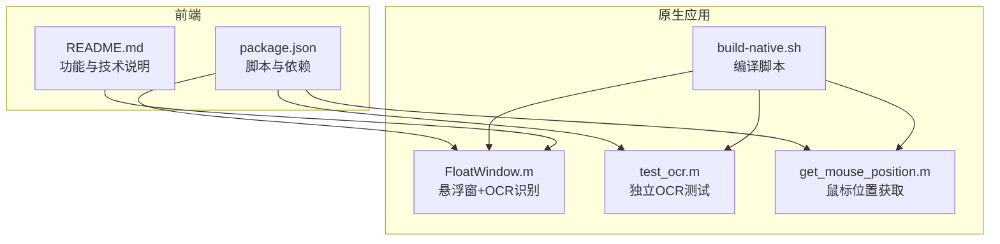
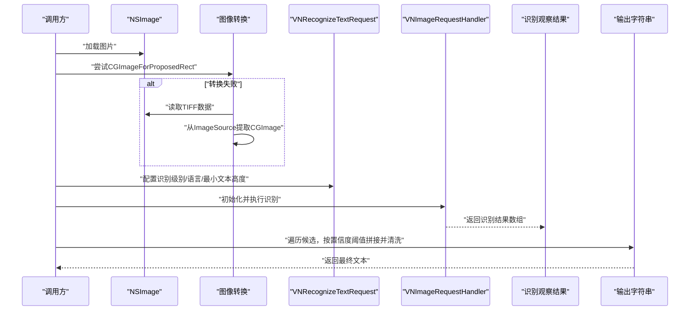
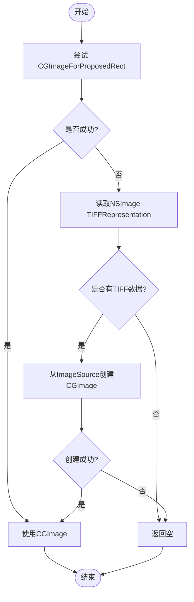
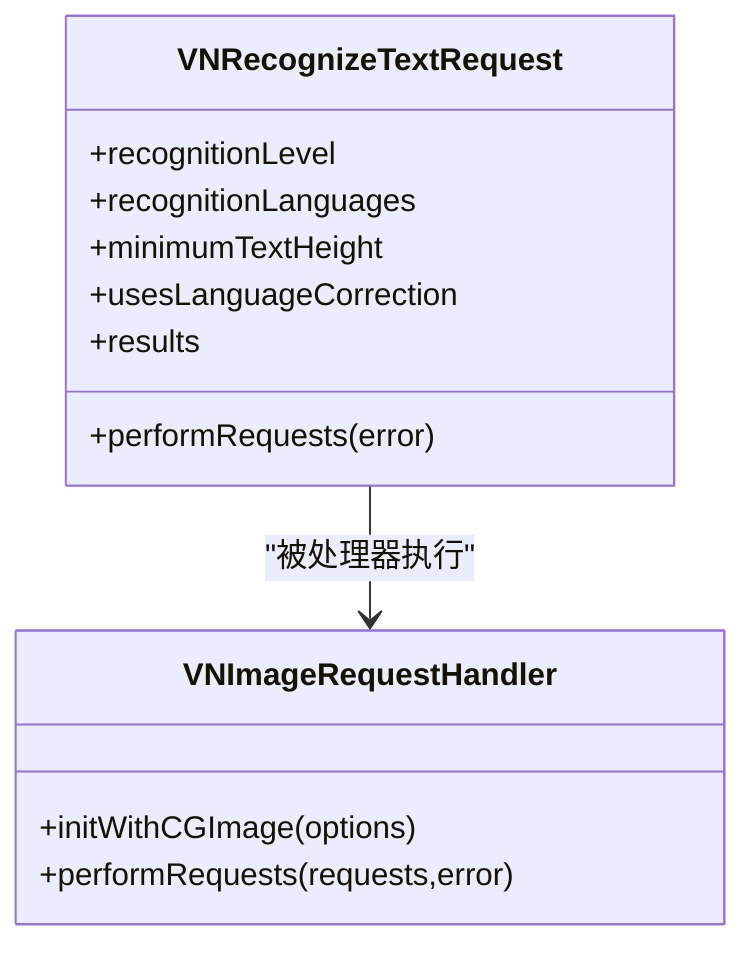
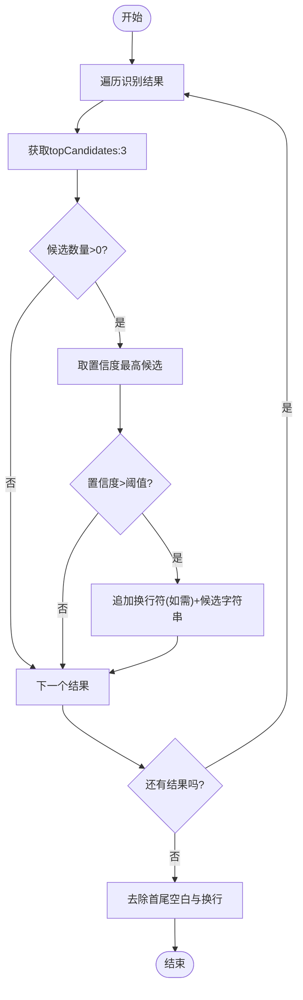
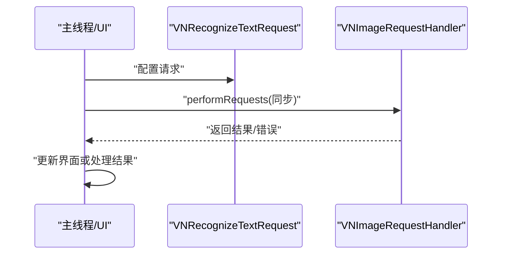
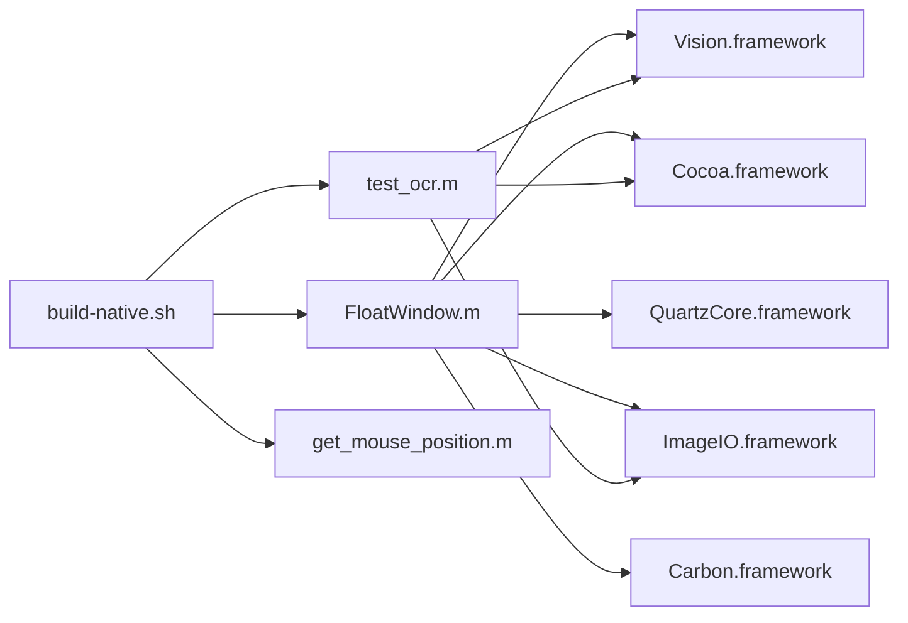

# OCR文字识别算法

<cite>
**本文引用的文件**
- [test_ocr.m](file://test_ocr.m)
- [FloatWindow.m](file://FloatWindow.m)
- [README.md](file://README.md)
- [build-native.sh](file://build-native.sh)
- [package.json](file://package.json)
- [get_mouse_position.m](file://get_mouse_position.m)
</cite>

## 目录
1. [引言](#引言)
2. [项目结构](#项目结构)
3. [核心组件](#核心组件)
4. [架构总览](#架构总览)
5. [详细组件分析](#详细组件分析)
6. [依赖关系分析](#依赖关系分析)
7. [性能考量](#性能考量)
8. [故障排查指南](#故障排查指南)
9. [结论](#结论)
10. [附录](#附录)

## 引言
本文件围绕基于Vision框架的OCR文字识别实现进行全面解析，重点覆盖以下方面：
- VNRecognizeTextRequest的关键参数：识别级别、语言列表、最小文本高度等
- 置信度阈值过滤与候选容错策略
- 从NSImage到CGImage的转换流程
- 同步识别的线程安全考虑
- 结果拼接与空白字符清理
- 提升OCR准确性的实践建议

该实现同时包含独立的测试程序与Raycast插件的原生悬浮窗应用，二者均采用相同的OCR识别流程。

**章节来源**
- [README.md](file://README.md#L1-L61)

## 项目结构
该项目由前端脚本与原生Objective-C应用组成，其中原生应用负责悬浮窗口展示与OCR识别，前端通过脚本调用原生二进制。

**图表来源**
- [package.json](file://package.json#L1-L34)
- [README.md](file://README.md#L1-L61)
- [FloatWindow.m](file://FloatWindow.m#L1-L56)
- [test_ocr.m](file://test_ocr.m#L1-L41)
- [get_mouse_position.m](file://get_mouse_position.m#L1-L10)
- [build-native.sh](file://build-native.sh#L1-L26)

**章节来源**
- [package.json](file://package.json#L1-L34)
- [README.md](file://README.md#L1-L61)
- [build-native.sh](file://build-native.sh#L1-L26)

## 核心组件
- 浮动窗口与OCR识别器：在悬浮窗口应用中，识别函数负责将NSImage转换为CGImage，配置VNRecognizeTextRequest并执行同步识别，随后对结果进行拼接与清洗。
- 独立OCR测试：提供最小可运行的命令行入口，验证识别流程与结果输出。
- 原生编译：通过构建脚本链接Cocoa、Vision、QuartzCore、ImageIO等框架生成可执行文件。

关键实现要点：
- 识别级别：使用高精度识别级别以提升准确性
- 多语言支持：配置中英繁体语言集合
- 最小文本高度：设置为0以启用自动检测
- 置信度阈值：仅保留置信度高于阈值的结果
- 候选容错：取topCandidates:3，优先采用置信度最高的候选
- 结果拼接：按行追加换行符，最终去除首尾空白字符

**章节来源**
- [FloatWindow.m](file://FloatWindow.m#L85-L177)
- [test_ocr.m](file://test_ocr.m#L1-L92)
- [build-native.sh](file://build-native.sh#L1-L26)

## 架构总览
下图展示了从图像输入到识别结果输出的整体流程，包括图像转换、请求配置、识别执行、结果处理与输出。

**图表来源**
- [FloatWindow.m](file://FloatWindow.m#L85-L177)
- [test_ocr.m](file://test_ocr.m#L1-L92)

## 详细组件分析

### 组件A：图像到CGImage的转换流程
- 优先使用NSImage的内置转换接口；若失败则回退到读取TIFF表示并从ImageSource中提取CGImage
- 释放策略：仅在成功从ImageSource创建CGImage时标记释放，避免重复释放

**图表来源**
- [FloatWindow.m](file://FloatWindow.m#L85-L122)
- [test_ocr.m](file://test_ocr.m#L1-L41)

**章节来源**
- [FloatWindow.m](file://FloatWindow.m#L85-L122)
- [test_ocr.m](file://test_ocr.m#L1-L41)

### 组件B：VNRecognizeTextRequest配置与执行
- 识别级别：高精度
- 语言列表：包含简体中文、繁体中文、英式英语与美式英语
- 最小文本高度：0（自动检测）
- 语言纠正：开启
- 执行方式：同步识别，直接在主线程调用
- 错误处理：捕获并记录错误，返回空结果

**图表来源**
- [FloatWindow.m](file://FloatWindow.m#L108-L122)
- [test_ocr.m](file://test_ocr.m#L27-L41)

**章节来源**
- [FloatWindow.m](file://FloatWindow.m#L108-L122)
- [test_ocr.m](file://test_ocr.m#L27-L41)

### 组件C：结果拼接与清洗
- 遍历识别结果，获取topCandidates:3
- 仅保留置信度高于阈值的候选
- 按行追加换行符进行拼接
- 最终去除首尾空白与换行字符

**图表来源**
- [FloatWindow.m](file://FloatWindow.m#L121-L177)
- [test_ocr.m](file://test_ocr.m#L40-L92)

**章节来源**
- [FloatWindow.m](file://FloatWindow.m#L121-L177)
- [test_ocr.m](file://test_ocr.m#L40-L92)

### 组件D：线程安全与同步识别
- 当前实现使用同步识别接口，直接在主线程调用
- 由于Vision识别在本地执行且为单次请求，未见显式并发控制
- 若在UI线程长时间阻塞，可能影响界面响应；建议在后台队列执行识别并在主线程更新UI

**图表来源**
- [FloatWindow.m](file://FloatWindow.m#L119-L122)
- [test_ocr.m](file://test_ocr.m#L38-L41)

**章节来源**
- [FloatWindow.m](file://FloatWindow.m#L119-L122)
- [test_ocr.m](file://test_ocr.m#L38-L41)

## 依赖关系分析
- 原生应用依赖系统框架：Cocoa、Vision、Carbon、QuartzCore、ImageIO
- 构建脚本统一链接上述框架并生成可执行文件
- 前端通过package.json脚本在构建阶段复制原生二进制

**图表来源**
- [FloatWindow.m](file://FloatWindow.m#L1-L56)
- [test_ocr.m](file://test_ocr.m#L1-L41)
- [get_mouse_position.m](file://get_mouse_position.m#L1-L10)
- [build-native.sh](file://build-native.sh#L1-L26)

**章节来源**
- [build-native.sh](file://build-native.sh#L1-L26)
- [package.json](file://package.json#L1-L34)

## 性能考量
- 识别级别：高精度识别通常带来更好的准确率，但可能增加耗时
- 语言列表：包含多种语言会增加模型匹配开销，建议根据实际场景裁剪语言集
- 最小文本高度：设置为0可自动检测，避免人为设定导致误判
- 候选数与阈值：topCandidates:3与置信度阈值共同降低误识别风险，但可能遗漏低置信度但正确的文本
- 图像质量：清晰、无模糊、无倾斜的截图可显著提升识别效果
- 线程模型：同步识别在UI线程可能导致卡顿，建议异步执行并回调更新UI

[本节为通用性能讨论，无需具体文件引用]

## 故障排查指南
- 无法加载图片：检查输入路径与权限
- 识别为空：确认图像包含可识别文本；检查语言列表是否覆盖目标语言
- 识别错误：查看错误日志；确认CGImage转换是否成功
- 界面卡顿：将识别移至后台队列执行

**章节来源**
- [test_ocr.m](file://test_ocr.m#L74-L92)
- [FloatWindow.m](file://FloatWindow.m#L119-L122)

## 结论
本实现以Vision框架为核心，通过高精度识别、多语言支持与自动文本高度检测，结合置信度阈值与候选容错策略，实现了较为稳健的OCR识别流程。图像转换与结果拼接清洗逻辑清晰，便于维护与扩展。为进一步提升用户体验，建议在后台线程执行识别并在主线程更新UI，同时根据实际使用场景优化语言列表与阈值设置。

[本节为总结性内容，无需具体文件引用]

## 附录

### A. 参数与策略对照表
- 识别级别：高精度
- 识别语言：简体中文、繁体中文、英式英语、美式英语
- 最小文本高度：0（自动检测）
- 置信度阈值：>0.1
- 候选数量：3
- 结果拼接：按行追加换行符
- 清洗规则：去除首尾空白与换行

**章节来源**
- [FloatWindow.m](file://FloatWindow.m#L108-L177)
- [test_ocr.m](file://test_ocr.m#L27-L92)

### B. 实践建议
- 截图文字区域应清晰、锐利，避免模糊或过度抖动
- 避免倾斜与严重透视变形，尽量保持水平
- 减少背景干扰，突出文字区域
- 根据实际使用场景调整语言列表，减少不必要的语言匹配
- 对于长文本，建议在UI层提供滚动与复制功能，提升可用性

[本节为通用建议，无需具体文件引用]