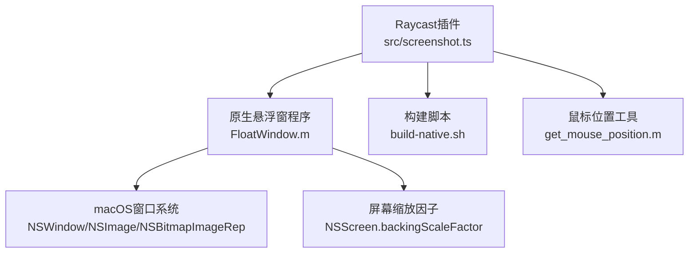
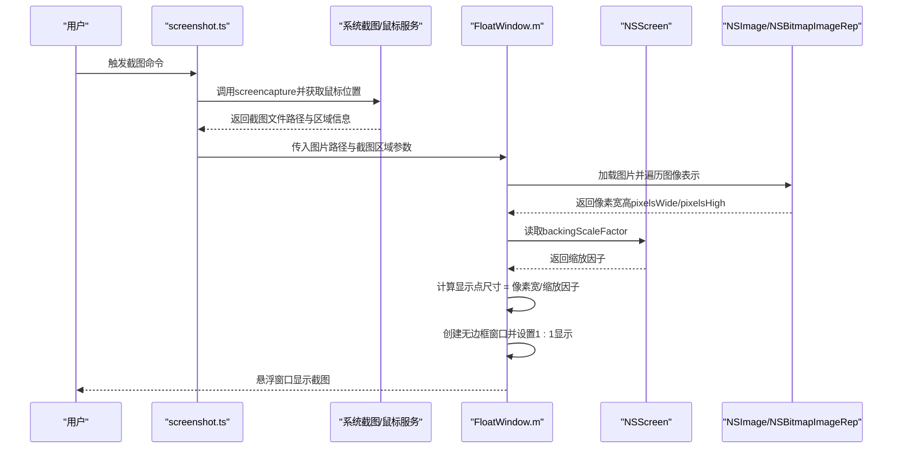
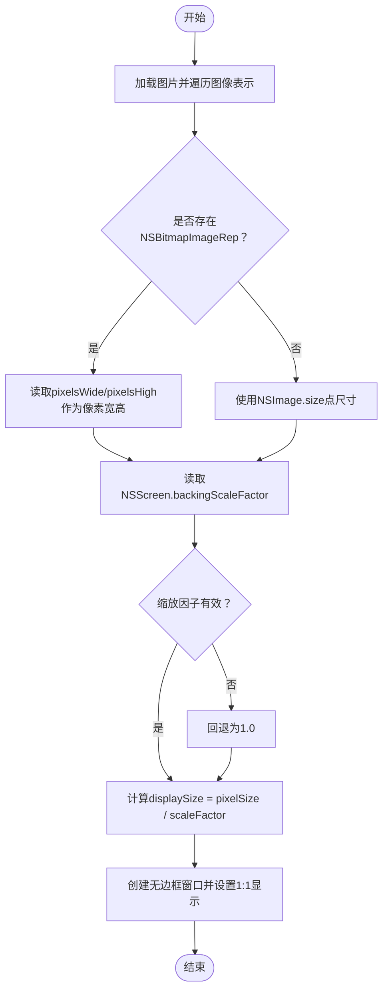
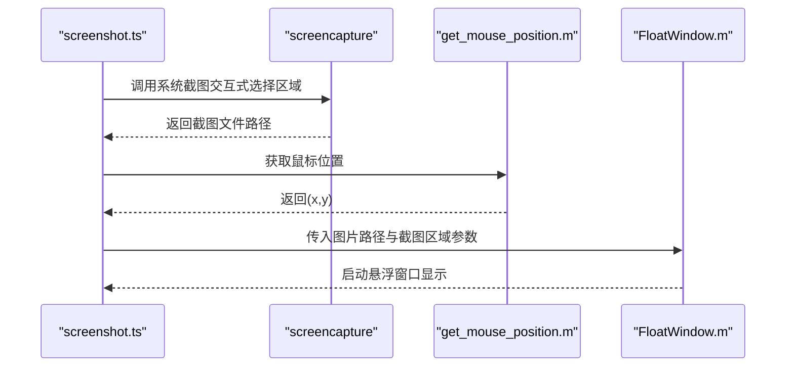
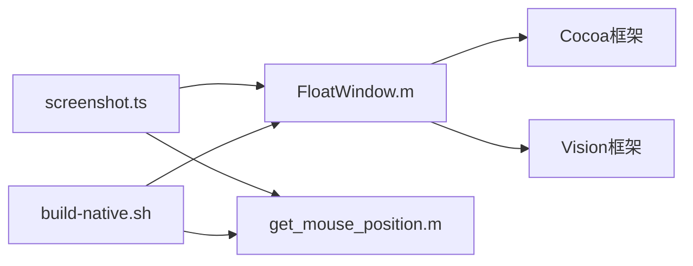

# Retina屏幕像素与点转换算法

<cite>
**本文引用的文件**
- [FloatWindow.m](file://FloatWindow.m)
- [screenshot.ts](file://src/screenshot.ts)
- [README.md](file://README.md)
- [build-native.sh](file://build-native.sh)
- [get_mouse_position.m](file://get_mouse_position.m)
</cite>

## 目录
1. [引言](#引言)
2. [项目结构](#项目结构)
3. [核心组件](#核心组件)
4. [架构总览](#架构总览)
5. [详细组件分析](#详细组件分析)
6. [依赖关系分析](#依赖关系分析)
7. [性能考量](#性能考量)
8. [故障排查指南](#故障排查指南)
9. [结论](#结论)
10. [附录](#附录)

## 引言
本文件围绕“Retina屏幕下像素与点的转换算法”展开，目标是解释如何在不同DPI（每英寸点数）的屏幕（尤其是高分屏）上，将图片的真实像素尺寸换算为显示点尺寸，从而实现“1:1精准显示”。文档重点基于FloatWindow.m中的实现，说明以下要点：
- 如何通过屏幕的缩放因子backingScaleFactor获取当前屏幕的缩放比例；
- 如何使用NSBitmapImageRep获取图片的真实像素宽高；
- 为什么不能直接使用NSImage的size属性；
- 通过pixelSize.width / scaleFactor公式将像素尺寸转换为点尺寸；
- 在2x缩放的Retina屏上，200x200像素图片对应100x100点的显示尺寸；
- 该算法对保持截图原始清晰度的关键作用；
- 常见误区：忽略像素密度导致的图像模糊问题。

## 项目结构
该项目由一个Raycast插件与一组原生组件构成：
- TypeScript入口负责调用系统截图、定位鼠标、调用原生悬浮窗程序并传递截图区域信息；
- 原生Objective-C程序负责创建悬浮窗口、读取图片像素尺寸、按屏幕缩放因子换算显示点尺寸、实现1:1显示与点击穿透等；
- 构建脚本负责编译原生二进制；
- 辅助工具用于获取鼠标位置。

图表来源
- [screenshot.ts](file://src/screenshot.ts#L238-L391)
- [FloatWindow.m](file://FloatWindow.m#L179-L212)
- [build-native.sh](file://build-native.sh#L1-L26)
- [get_mouse_position.m](file://get_mouse_position.m#L1-L10)

章节来源
- [README.md](file://README.md#L1-L61)
- [screenshot.ts](file://src/screenshot.ts#L1-L115)
- [FloatWindow.m](file://FloatWindow.m#L179-L212)
- [build-native.sh](file://build-native.sh#L1-L26)

## 核心组件
- 原生悬浮窗程序（FloatWindow.m）
  - 读取图片并遍历其图像表示，使用NSBitmapImageRep获取真实像素宽高；
  - 读取当前屏幕的缩放因子backingScaleFactor；
  - 使用公式pixelSize.width / scaleFactor得到显示点尺寸；
  - 创建无边框悬浮窗口，设置层级与透明背景，实现1:1显示与点击穿透。
- TypeScript入口（screenshot.ts）
  - 调用系统截图命令，获取截图区域信息；
  - 通过辅助工具获取鼠标位置，推导截图区域中心作为悬浮窗口初始位置；
  - 将截图路径与区域信息传递给原生悬浮窗程序；
  - 监控原生进程生命周期，自动清理临时文件。
- 构建脚本（build-native.sh）
  - 编译FloatWindow.m与get_mouse_position.m为可执行文件；
  - 链接Cocoa、Carbon、Vision、QuartzCore、ImageIO等框架。
- 鼠标位置工具（get_mouse_position.m）
  - 输出当前鼠标坐标，供TS侧推导截图区域中心。

章节来源
- [FloatWindow.m](file://FloatWindow.m#L179-L212)
- [FloatWindow.m](file://FloatWindow.m#L247-L277)
- [FloatWindow.m](file://FloatWindow.m#L325-L353)
- [screenshot.ts](file://src/screenshot.ts#L238-L391)
- [build-native.sh](file://build-native.sh#L1-L26)
- [get_mouse_position.m](file://get_mouse_position.m#L1-L10)

## 架构总览
下图展示了从Raycast命令到原生悬浮窗显示的端到端流程，包括像素与点的换算逻辑。

图表来源
- [screenshot.ts](file://src/screenshot.ts#L238-L391)
- [FloatWindow.m](file://FloatWindow.m#L179-L212)
- [FloatWindow.m](file://FloatWindow.m#L247-L277)

## 详细组件分析

### 像素与点的换算算法（FloatWindow.m）
FloatWindow.m的核心算法如下：
- 获取图片像素尺寸
  - 遍历NSImage的所有图像表示，若发现NSBitmapImageRep，则使用其pixelsWide与pixelsHigh作为真实像素宽高；
  - 若未找到NSBitmapImageRep，则回退使用NSImage的size（这通常对应点尺寸，会导致1:1显示不正确）。
- 获取屏幕缩放因子
  - 通过NSScreen.mainScreen的backingScaleFactor获取当前屏幕缩放比例；
  - 若读取异常则回退为1.0。
- 计算显示点尺寸
  - 使用公式：displaySize.width = pixelSize.width / scaleFactor；
  - displaySize.height = pixelSize.height / scaleFactor。
- 创建窗口并显示
  - 以displaySize作为窗口内容视图的尺寸，实现1:1像素映射到点尺寸，从而在Retina屏上达到“像素对齐”的清晰显示。

图表来源
- [FloatWindow.m](file://FloatWindow.m#L179-L212)
- [FloatWindow.m](file://FloatWindow.m#L247-L277)

章节来源
- [FloatWindow.m](file://FloatWindow.m#L179-L212)
- [FloatWindow.m](file://FloatWindow.m#L247-L277)

### 为什么不能直接使用NSImage的size
- NSImage的size返回的是“点尺寸”，而非“像素尺寸”。在高分屏（例如2x缩放）下，点尺寸会小于像素尺寸。如果直接使用NSImage.size创建窗口，会导致图片被缩放显示，无法实现1:1像素对齐，从而影响清晰度。
- FloatWindow.m通过遍历NSImage的图像表示，优先使用NSBitmapImageRep的pixelsWide/pixelsHigh，确保获得真实的像素尺寸，再除以backingScaleFactor换算为点尺寸，从而实现1:1显示。

章节来源
- [FloatWindow.m](file://FloatWindow.m#L179-L212)

### Retina屏上的典型换算示例
- 假设一张图片为200x200像素；
- 在2x缩放的Retina屏上，backingScaleFactor为2.0；
- 则显示点尺寸 = 200 / 2.0 = 100点；
- 窗口内容视图尺寸为100x100点，每个点对应2x2个物理像素，实现像素对齐显示，避免模糊。

章节来源
- [FloatWindow.m](file://FloatWindow.m#L179-L212)

### 保持截图原始清晰度的关键作用
- 通过像素对齐显示，避免了中间缩放过程引入的插值与模糊；
- 在高分屏上，1:1显示意味着每个逻辑像素对应一个物理像素块，最大程度保留原始锐利度；
- FloatWindow.m在创建窗口时以displaySize作为内容视图尺寸，确保渲染管线直接按像素级绘制，不进行额外缩放。

章节来源
- [FloatWindow.m](file://FloatWindow.m#L247-L277)

### 常见误区与规避
- 忽略像素密度（backingScaleFactor）：直接使用NSImage.size而不做换算，会导致在高分屏上显示过小且模糊；
- 误以为NSImage.size就是像素尺寸：在高分屏下，点尺寸与像素尺寸不一致；
- 未区分NSBitmapImageRep与其他图像表示：非位图表示可能不暴露像素维度，导致无法获取真实像素尺寸。

章节来源
- [FloatWindow.m](file://FloatWindow.m#L179-L212)

### 与Raycast插件的集成（screenshot.ts）
- screenshot.ts负责：
  - 调用系统截图命令并等待用户完成截图；
  - 通过get_mouse_position.m获取鼠标位置，推导截图区域中心作为悬浮窗口初始位置；
  - 将图片路径与截图区域信息传递给FloatWindow.m；
  - 监控原生进程生命周期，自动清理临时文件。

图表来源
- [screenshot.ts](file://src/screenshot.ts#L238-L391)
- [get_mouse_position.m](file://get_mouse_position.m#L1-L10)
- [FloatWindow.m](file://FloatWindow.m#L179-L212)

章节来源
- [screenshot.ts](file://src/screenshot.ts#L1-L115)
- [screenshot.ts](file://src/screenshot.ts#L238-L391)
- [get_mouse_position.m](file://get_mouse_position.m#L1-L10)

## 依赖关系分析
- FloatWindow.m依赖于：
  - Cocoa框架：NSImage、NSBitmapImageRep、NSScreen、NSWindow等；
  - Vision框架：用于图片文字识别（与像素换算无直接关系，但影响窗口布局与UI元素尺寸）。
- screenshot.ts依赖于：
  - 子进程调用系统命令（screencapture、osascript、sips）；
  - 通过spawn与exec配合处理用户取消与错误场景；
  - 通过原生工具get_mouse_position.m获取鼠标位置，推导截图区域中心。
- 构建脚本build-native.sh负责：
  - 编译FloatWindow.m与get_mouse_position.m；
  - 链接Cocoa、Carbon、Vision、QuartzCore、ImageIO等框架。

图表来源
- [screenshot.ts](file://src/screenshot.ts#L238-L391)
- [FloatWindow.m](file://FloatWindow.m#L179-L212)
- [build-native.sh](file://build-native.sh#L1-L26)

章节来源
- [screenshot.ts](file://src/screenshot.ts#L238-L391)
- [FloatWindow.m](file://FloatWindow.m#L179-L212)
- [build-native.sh](file://build-native.sh#L1-L26)

## 性能考量
- 像素换算仅涉及一次除法运算，开销极低；
- NSBitmapImageRep的像素维度读取在内存中完成，无需额外I/O；
- 悬浮窗口采用无边框缓冲视图与点击穿透，减少不必要的绘制与合成开销；
- 文字识别（Vision）仅在需要时触发，且结果用于UI面板展示，不影响像素换算主流程。

## 故障排查指南
- 原生悬浮窗程序未找到或无法执行
  - 确认已执行构建脚本并生成float-window与get_mouse_position；
  - 检查可执行文件权限与路径解析逻辑。
- 截图后悬浮窗口显示模糊
  - 确认FloatWindow.m已使用NSBitmapImageRep的pixelsWide/pixelsHigh；
  - 确认backingScaleFactor读取有效且非0；
  - 确认displaySize是通过像素尺寸除以缩放因子计算得到。
- 截图区域位置不正确
  - 检查screenshot.ts传递的截图区域参数是否正确；
  - 检查FloatWindow.m中窗口位置计算逻辑（含Y轴坐标系差异修正）。

章节来源
- [screenshot.ts](file://src/screenshot.ts#L238-L391)
- [FloatWindow.m](file://FloatWindow.m#L247-L277)

## 结论
通过在FloatWindow.m中使用NSBitmapImageRep获取真实像素尺寸，并结合NSScreen.backingScaleFactor进行换算，实现了在不同DPI屏幕上的1:1像素对齐显示。这一算法是保持截图原始清晰度的关键所在；同时，screenshot.ts与原生工具的协同，确保了从截图到悬浮显示的完整链路顺畅可靠。

## 附录
- Retina缩放因子示例
  - 1x缩放：backingScaleFactor = 1.0，显示点尺寸 = 像素尺寸；
  - 2x缩放：backingScaleFactor = 2.0，显示点尺寸 = 像素尺寸 / 2；
  - 3x缩放：backingScaleFactor = 3.0，显示点尺寸 = 像素尺寸 / 3。
- 1:1显示的意义
  - 在高分屏上，1:1意味着每个逻辑像素对应一个物理像素块，避免插值与模糊，提升视觉锐利度。