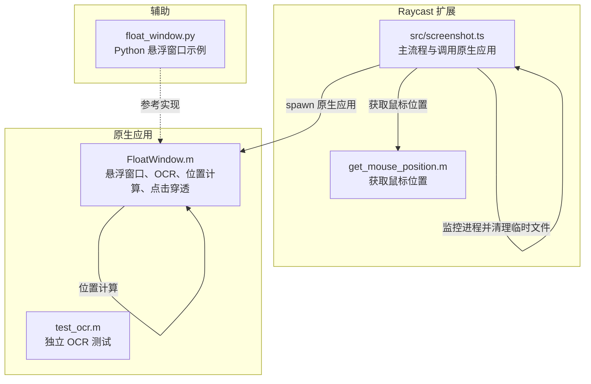
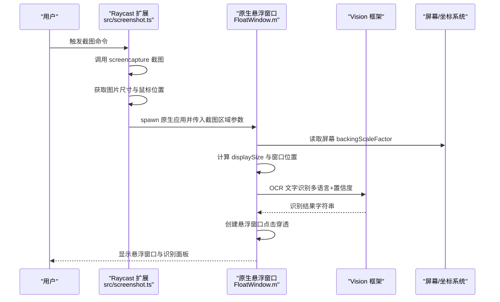
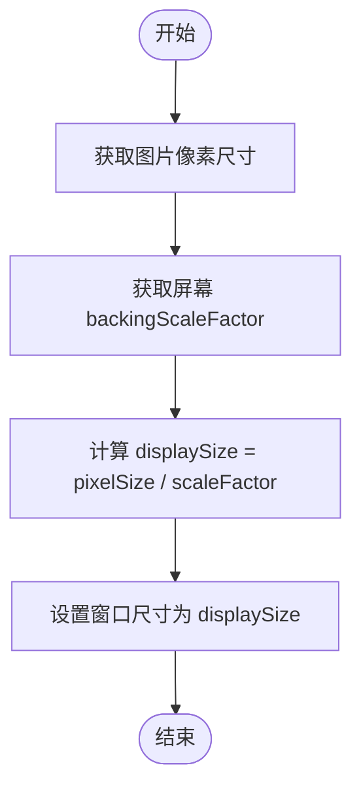
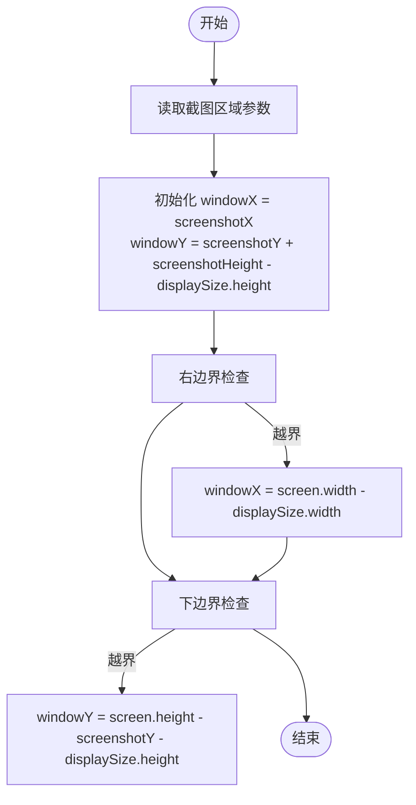
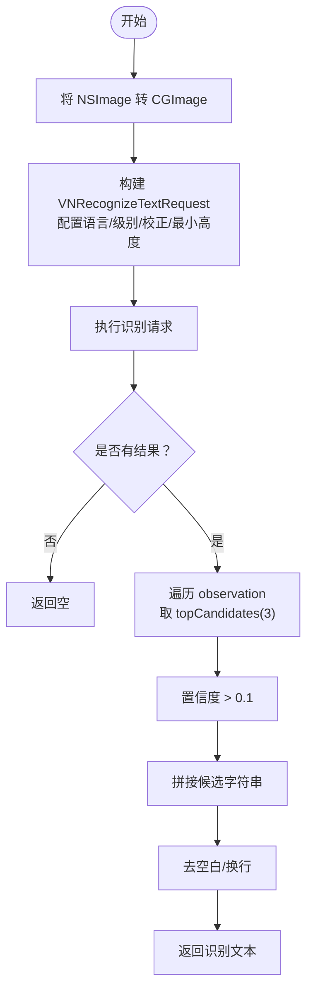
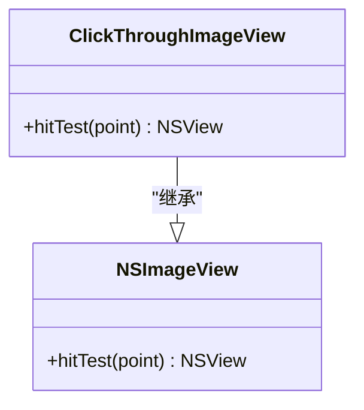
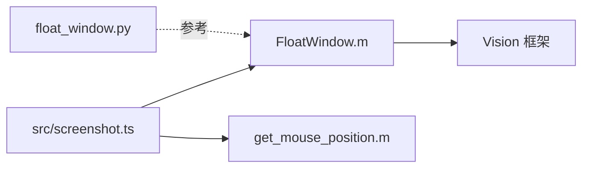

# 关键算法

<cite>
**本文引用的文件**
- [FloatWindow.m](file://FloatWindow.m)
- [test_ocr.m](file://test_ocr.m)
- [float_window.py](file://float_window.py)
- [src/screenshot.ts](file://src/screenshot.ts)
- [get_mouse_position.m](file://get_mouse_position.m)
- [README.md](file://README.md)
</cite>

## 目录
1. [引言](#引言)
2. [项目结构](#项目结构)
3. [核心组件](#核心组件)
4. [架构总览](#架构总览)
5. [详细组件分析](#详细组件分析)
6. [依赖关系分析](#依赖关系分析)
7. [性能考量](#性能考量)
8. [故障排查指南](#故障排查指南)
9. [结论](#结论)

## 引言
本文件聚焦于项目中的四个关键算法实现，面向不同技术栈与职责边界：
- Retina 屏幕下像素与点的转换算法：通过屏幕 backingScaleFactor 计算 displaySize，确保图片 1:1 显示。
- 悬浮窗口位置计算算法：基于截图区域坐标与屏幕边界进行定位与修正，解决 Y 轴位置错位问题。
- OCR 文字识别算法：使用 Vision 框架的 VNRecognizeTextRequest，配置置信度阈值与多语言支持。
- 点击穿透实现机制：通过重写 NSImageView 的 hitTest 返回 nil，使图片区域点击透传到底层应用。

同时，本文提供数学公式、流程图与实际应用场景说明，并解释 Y 轴位置错位修复逻辑背后的坐标系统差异。

## 项目结构
该项目由 TypeScript/Raycast 主流程与原生 Objective-C 悬浮窗口应用组成，配合 Python 辅助实现与 AppleScript/Shell 工具链协同工作。

图表来源
- [src/screenshot.ts](file://src/screenshot.ts#L238-L390)
- [FloatWindow.m](file://FloatWindow.m#L179-L464)
- [test_ocr.m](file://test_ocr.m#L1-L92)
- [float_window.py](file://float_window.py#L1-L100)
- [get_mouse_position.m](file://get_mouse_position.m#L1-L10)

章节来源
- [README.md](file://README.md#L46-L56)
- [src/screenshot.ts](file://src/screenshot.ts#L1-L115)

## 核心组件
- Retina 像素与点的转换：在原生应用入口中，先获取图片像素尺寸，再结合屏幕 backingScaleFactor 计算 displaySize，从而保证 1:1 显示。
- 悬浮窗口位置计算：根据截图区域坐标与屏幕边界进行定位；对 Y 轴进行修正，以适配坐标系统差异。
- OCR 文字识别：使用 Vision 框架，配置识别语言、置信度阈值与候选数量，过滤低置信度结果。
- 点击穿透：重写 NSImageView 的 hitTest 返回 nil，使图片区域点击透传。

章节来源
- [FloatWindow.m](file://FloatWindow.m#L179-L277)
- [FloatWindow.m](file://FloatWindow.m#L274-L353)
- [FloatWindow.m](file://FloatWindow.m#L85-L152)
- [FloatWindow.m](file://FloatWindow.m#L169-L177)

## 架构总览
下图展示从 Raycast 主流程到原生悬浮窗口应用的关键调用序列，涵盖截图、悬浮窗口创建、OCR 识别与点击穿透等环节。

图表来源
- [src/screenshot.ts](file://src/screenshot.ts#L1-L115)
- [src/screenshot.ts](file://src/screenshot.ts#L238-L390)
- [FloatWindow.m](file://FloatWindow.m#L179-L464)
- [FloatWindow.m](file://FloatWindow.m#L85-L152)

## 详细组件分析

### Retina 屏幕下像素与点的转换算法
- 目标：在 Retina 屏幕上实现“像素尺寸 1:1 显示”，避免图片被按点尺寸缩放导致模糊或尺寸偏差。
- 输入：
  - 图片像素尺寸（pixelsWide/pixelsHigh）
  - 屏幕 backingScaleFactor（像素/点）
- 输出：displaySize（点尺寸），用于窗口尺寸与布局计算。
- 数学公式：
  - displaySize.width = pixelSize.width / scaleFactor
  - displaySize.height = pixelSize.height / scaleFactor
- 关键实现位置：
  - 获取像素尺寸与 backingScaleFactor
  - 计算 displaySize 并据此设置窗口尺寸
- 应用场景：
  - 悬浮窗口图片渲染与布局
  - OCR 文字面板位置与尺寸计算

图表来源
- [FloatWindow.m](file://FloatWindow.m#L179-L212)

章节来源
- [FloatWindow.m](file://FloatWindow.m#L179-L212)

### 悬浮窗口位置计算算法（含 Y 轴修正）
- 目标：根据截图区域坐标与屏幕边界，计算悬浮窗口的窗口左下角坐标，确保窗口不越界且视觉上位于截图区域附近。
- 输入：
  - 截图区域坐标 (screenshotX, screenshotY, screenshotWidth, screenshotHeight)
  - 屏幕 frame 尺寸
  - displaySize（点尺寸）
- 输出：窗口位置 (windowX, windowY)
- 数学公式（修正逻辑）：
  - 初始：windowX = screenshotX
  - 初始：windowY = screenshotY + screenshotHeight - displaySize.height
  - 边界修正：
    - 若 windowX + displaySize.width > screen.width → windowX = screen.width - displaySize.width
    - 若 windowY + displaySize.height > screen.height → windowY = screen.height - screenshotY - displaySize.height
- 坐标系统差异解释：
  - 截图区域坐标系通常以屏幕左下角为原点（y 轴向上递增）。
  - NSWindow/NSView 坐标系以屏幕左下角为原点（y 轴向上递增）。
  - 但由于窗口内容视图的原点在左下角，而绘制时的 Y 轴方向与截图区域一致，因此需要通过加减 screenshotHeight 来对齐。
  - 当窗口底部越界时，使用 screen.height - screenshotY - displaySize.height 进行修正，确保窗口在视觉上与截图区域对齐。
- 关键实现位置：
  - 位置计算与边界修正
  - 文字面板位置与尺寸计算

图表来源
- [FloatWindow.m](file://FloatWindow.m#L212-L277)
- [FloatWindow.m](file://FloatWindow.m#L325-L353)

章节来源
- [FloatWindow.m](file://FloatWindow.m#L212-L277)
- [FloatWindow.m](file://FloatWindow.m#L325-L353)

### OCR 文字识别算法（Vision 框架）
- 目标：从图片中提取文字，支持多语言并过滤低置信度结果。
- 关键配置：
  - recognitionLevel = Accurate
  - recognitionLanguages = ["zh-Hans", "zh-Hant", "en-US", "en-GB"]
  - usesLanguageCorrection = true
  - minimumTextHeight = 0（自动检测）
  - topCandidates = 3，confidence > 0.1
- 处理流程：
  - 将 NSImage 转换为 CGImage（若直接不可得则从 TIFF 数据重建）
  - 使用 VNImageRequestHandler 执行 VNRecognizeTextRequest
  - 遍历 observation 结果，取置信度最高的候选，满足阈值后拼接
  - 去除空白与换行后返回
- 关键实现位置：
  - OCR 请求构建与执行
  - 结果处理与置信度过滤

图表来源
- [FloatWindow.m](file://FloatWindow.m#L85-L152)
- [test_ocr.m](file://test_ocr.m#L1-L92)

章节来源
- [FloatWindow.m](file://FloatWindow.m#L85-L152)
- [test_ocr.m](file://test_ocr.m#L1-L92)

### 点击穿透实现机制（NSImageView.hitTest）
- 目标：使图片区域点击透传到底层应用，不影响用户操作。
- 实现方式：重写 NSImageView 的 hitTest(point) 返回 nil，表示该视图不参与命中测试。
- 关键实现位置：自定义 ClickThroughImageView 类，覆盖 hitTest。

图表来源
- [FloatWindow.m](file://FloatWindow.m#L169-L177)

章节来源
- [FloatWindow.m](file://FloatWindow.m#L169-L177)

## 依赖关系分析
- Raycast 主流程负责截图、获取图片尺寸与鼠标位置，并调用原生悬浮窗口应用。
- 原生应用负责：
  - 计算 displaySize 与窗口位置（含 Y 轴修正）
  - 执行 OCR 识别
  - 创建悬浮窗口并启用点击穿透
- Python 示例提供参考实现，便于理解窗口创建与点击穿透的基本思路。

图表来源
- [src/screenshot.ts](file://src/screenshot.ts#L238-L390)
- [FloatWindow.m](file://FloatWindow.m#L179-L464)
- [float_window.py](file://float_window.py#L1-L100)
- [get_mouse_position.m](file://get_mouse_position.m#L1-L10)

章节来源
- [src/screenshot.ts](file://src/screenshot.ts#L238-L390)
- [float_window.py](file://float_window.py#L1-L100)

## 性能考量
- Retina 转换：仅在应用启动时进行一次像素尺寸与 scale 的读取与计算，开销极小。
- OCR：识别过程在主线程中执行，建议控制图片尺寸与语言列表规模，避免不必要的大图与过多语言导致耗时增加。
- 点击穿透：仅在图片视图上生效，不影响拖动区域与按钮交互，降低不必要的事件处理。
- 边界检查：O(1) 操作，对性能影响可忽略。

## 故障排查指南
- 截图区域与窗口位置不匹配
  - 检查是否正确传入截图区域参数，确认 windowX = screenshotX 与 windowY 的修正公式。
  - 确认屏幕 frame 与 displaySize 的单位一致性（点）。
- Y 轴位置错位
  - 确认使用了 windowY = screenshotY + screenshotHeight - displaySize.height 的修正逻辑。
  - 若仍错位，检查屏幕坐标系与截图坐标系的一致性，必要时采用 windowY = screen.height - screenshotY - displaySize.height 的替代修正。
- OCR 未识别到文字
  - 检查 recognitionLanguages 是否包含目标语言。
  - 适当提高置信度阈值或增加 topCandidates 数量。
  - 确认图片清晰度与分辨率，必要时缩小图片尺寸以提升识别速度。
- 点击穿透无效
  - 确认图片视图确实使用了 ClickThroughImageView，并且 hitTest 返回 nil。
  - 检查拖动区域是否正确设置，避免误拦截事件。

章节来源
- [FloatWindow.m](file://FloatWindow.m#L212-L277)
- [FloatWindow.m](file://FloatWindow.m#L85-L152)
- [FloatWindow.m](file://FloatWindow.m#L169-L177)

## 结论
本项目通过原生应用与 Raycast 扩展的协作，实现了高质量的悬浮窗口截图展示与 OCR 文字识别能力。其中：
- Retina 下像素与点的转换确保了 1:1 显示；
- 悬浮窗口位置计算与 Y 轴修正解决了坐标系统差异带来的错位问题；
- OCR 使用 Vision 框架并结合多语言与置信度阈值，提升了识别准确性；
- 点击穿透机制使图片区域不影响底层应用交互。

这些算法共同构成了稳定、易用且高性能的截图悬浮体验。