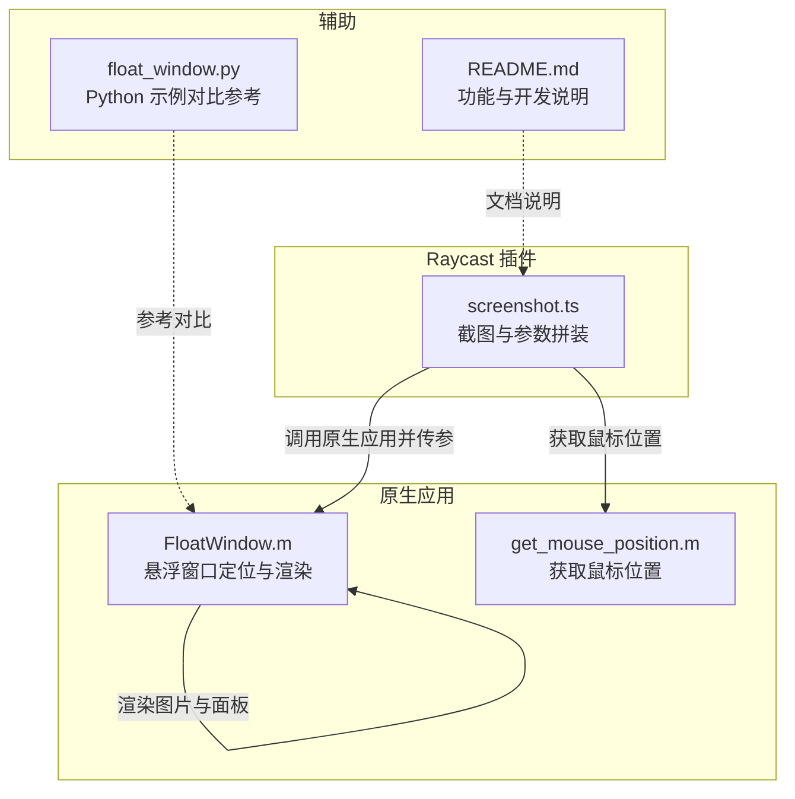
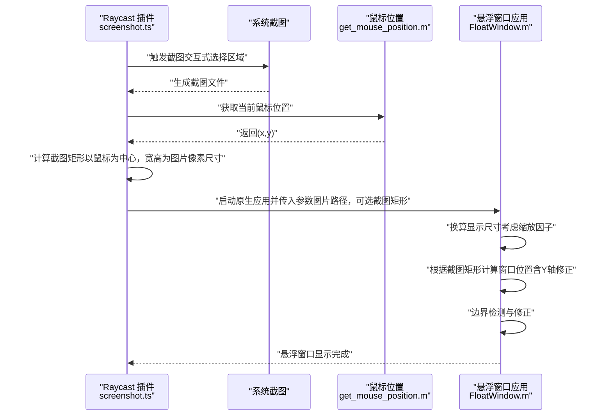
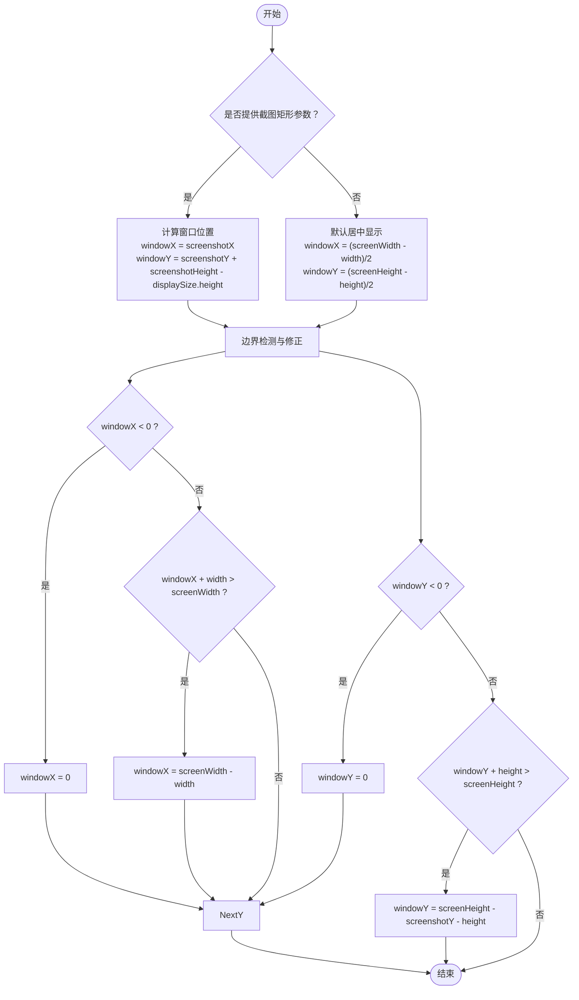
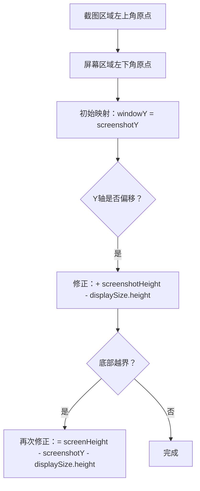
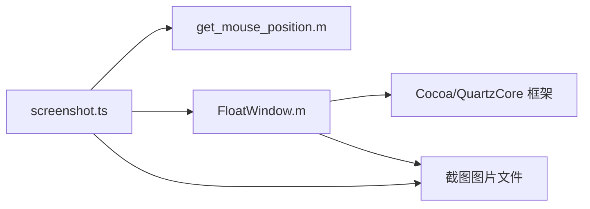

# 悬浮窗口定位算法

<cite>
**本文引用的文件**
- [FloatWindow.m](file://FloatWindow.m)
- [get_mouse_position.m](file://get_mouse_position.m)
- [screenshot.ts](file://src/screenshot.ts)
- [float_window.py](file://float_window.py)
- [README.md](file://README.md)
</cite>

## 目录
1. [引言](#引言)
2. [项目结构](#项目结构)
3. [核心组件](#核心组件)
4. [架构总览](#架构总览)
5. [详细组件分析](#详细组件分析)
6. [依赖关系分析](#依赖关系分析)
7. [性能考量](#性能考量)
8. [故障排查指南](#故障排查指南)
9. [结论](#结论)

## 引言
本文件聚焦于“悬浮窗口的位置计算逻辑”，围绕截图区域坐标（screenshotX, screenshotY, screenshotWidth, screenshotHeight）如何转换为窗口显示位置（windowX, windowY）展开，重点解释以下问题：
- 核心公式 windowY = screenshotY + screenshotHeight - displaySize.height 的推导过程
- MacOS 屏幕坐标系原点在左下角与截图坐标系原点在左上角的差异导致的 Y 轴偏移问题及修正原理
- 边界检测逻辑（如 windowX + displaySize.width > screenFrame.size.width 时的修正）如何确保窗口不超出屏幕可视区域
- get_mouse_position.m 如何辅助定位，以及默认居中显示的实现方式（windowX = (screenWidth - width)/2）

## 项目结构
该仓库由 Raycast 插件与原生悬浮窗口应用组成：
- Raycast 插件负责调用系统截图、获取鼠标位置、拼装截图区域参数，并通过原生应用展示悬浮窗口
- 原生应用负责根据传入的截图区域参数计算窗口位置、处理边界检测、渲染图片与文字面板、响应 ESC 关闭等

图表来源
- [screenshot.ts](file://src/screenshot.ts#L238-L339)
- [FloatWindow.m](file://FloatWindow.m#L179-L277)
- [get_mouse_position.m](file://get_mouse_position.m#L1-L10)
- [float_window.py](file://float_window.py#L1-L100)
- [README.md](file://README.md#L1-L61)

章节来源
- [README.md](file://README.md#L1-L61)
- [screenshot.ts](file://src/screenshot.ts#L1-L120)
- [FloatWindow.m](file://FloatWindow.m#L179-L277)

## 核心组件
- 截图与参数拼装：screenshot.ts 负责调用系统截图、尝试获取前台应用信息、获取鼠标位置、计算截图区域矩形（以鼠标为中心，宽高为图片像素尺寸），并将这些参数传递给原生悬浮窗口应用。
- 原生悬浮窗口：FloatWindow.m 负责加载图片、按屏幕缩放因子换算显示尺寸、根据传入的截图区域计算窗口位置、进行边界检测、创建无边框悬浮窗口、渲染图片与右侧文字面板、处理 ESC 关闭与拖拽等。
- 鼠标位置辅助：get_mouse_position.m 提供简单接口获取当前鼠标坐标，供 screenshot.ts 在无法获取截图区域信息时作为近似定位依据。
- 默认居中显示：float_window.py 展示了标准的居中算法（windowX = (screenWidth - width)/2, windowY = (screenHeight - height)/2），便于理解与对比。

章节来源
- [screenshot.ts](file://src/screenshot.ts#L238-L339)
- [FloatWindow.m](file://FloatWindow.m#L179-L277)
- [get_mouse_position.m](file://get_mouse_position.m#L1-L10)
- [float_window.py](file://float_window.py#L1-L100)

## 架构总览
悬浮窗口定位的整体流程如下：
- Raycast 插件调用系统截图，得到图片文件
- 若能获取前台应用与鼠标位置，则以鼠标为中心、宽高为图片像素尺寸构造截图矩形；否则回退到默认策略
- 将图片路径与截图矩形（若存在）作为参数传递给原生悬浮窗口应用
- 原生应用根据传入参数计算窗口位置，进行边界检测，创建悬浮窗口并渲染

图表来源
- [screenshot.ts](file://src/screenshot.ts#L238-L339)
- [get_mouse_position.m](file://get_mouse_position.m#L1-L10)
- [FloatWindow.m](file://FloatWindow.m#L179-L277)

## 详细组件分析

### 截图参数与鼠标位置辅助
- 截图参数拼装：screenshot.ts 在成功截图后，尝试通过 AppleScript 获取前台应用信息，并调用 get_mouse_position.m 获取鼠标位置。随后以鼠标位置为中心、宽高为图片像素尺寸构造最终截图矩形，作为后续悬浮窗口定位的输入。
- 鼠标位置获取：get_mouse_position.m 通过 Cocoa 获取当前鼠标坐标并以“x,y”的格式输出，供 screenshot.ts 解析使用。

章节来源
- [screenshot.ts](file://src/screenshot.ts#L46-L115)
- [screenshot.ts](file://src/screenshot.ts#L162-L236)
- [get_mouse_position.m](file://get_mouse_position.m#L1-L10)

### 原生悬浮窗口定位算法
- 显示尺寸换算：原生应用先获取图片像素尺寸，再根据屏幕缩放因子换算为点尺寸，确保“1:1”显示。
- 截图区域到窗口位置的映射：
  - 若提供截图矩形，则 windowX = screenshotX；windowY 的计算包含两步修正：
    1) 初始修正：windowY = screenshotY + screenshotHeight - displaySize.height
    2) 边界修正：当窗口底部越界时，windowY = screenFrame.size.height - screenshotY - displaySize.height
  - 若未提供截图矩形，则默认居中显示：windowX = (screenWidth - displaySize.width)/2，windowY = (screenHeight - displaySize.height)/2
- 边界检测：对 X/Y 方向分别进行边界校正，保证窗口不超出屏幕可视区域。

图表来源
- [FloatWindow.m](file://FloatWindow.m#L212-L277)

章节来源
- [FloatWindow.m](file://FloatWindow.m#L179-L277)

### Y 轴坐标系错位问题与修正原理
- 差异来源：
  - MacOS 屏幕坐标系原点位于左下角，Y 轴向上递增
  - 截图坐标系原点位于左上角，Y 轴向下递增
- 影响表现：
  - 当直接将 screenshotY 作为 windowY 时，窗口会在 Y 轴方向“向上偏移”一个截图高度的距离
- 修正策略：
  - 初始修正：windowY = screenshotY + screenshotHeight - displaySize.height
  - 边界修正：当窗口底部越界时，使用 windowY = screenHeight - screenshotY - displaySize.height，从而抵消坐标系差异带来的偏移

图表来源
- [FloatWindow.m](file://FloatWindow.m#L234-L258)

章节来源
- [FloatWindow.m](file://FloatWindow.m#L234-L258)

### 边界检测与屏幕溢出防护
- X 方向：当 windowX < 0 时强制置为 0；当 windowX + displaySize.width > screenFrame.size.width 时，将 windowX 调整为 screenFrame.size.width - displaySize.width
- Y 方向：当 windowY < 0 时强制置为 0；当 windowY + displaySize.height > screenFrame.size.height 时，采用 Y 轴修正公式 windowY = screenFrame.size.height - screenshotY - displaySize.height
- 作用：确保悬浮窗口始终在屏幕可视区域内，避免被裁切或不可见

章节来源
- [FloatWindow.m](file://FloatWindow.m#L247-L258)

### 默认居中显示的实现方式
- 当未提供截图矩形时，采用标准居中公式：
  - windowX = (screenWidth - displaySize.width)/2
  - windowY = (screenHeight - displaySize.height)/2
- 该方式与“基于截图矩形的定位”互为备选方案，保证在任何情况下都能正确显示悬浮窗口

章节来源
- [FloatWindow.m](file://FloatWindow.m#L263-L266)
- [float_window.py](file://float_window.py#L33-L35)

### 与 Python 示例的对比参考
- float_window.py 展示了与原生应用一致的居中算法，便于理解“1:1 显示”与居中定位的通用思路
- 两者均强调：以屏幕 frame 尺寸与显示尺寸（考虑缩放因子）为基准进行计算

章节来源
- [float_window.py](file://float_window.py#L33-L35)

## 依赖关系分析
- screenshot.ts 依赖：
  - get_mouse_position.m：用于在无法获取前台应用信息时，以鼠标位置为中心构造截图矩形
  - 原生悬浮窗口应用（float-window）：负责最终的窗口定位与渲染
- FloatWindow.m 依赖：
  - Cocoa/QuartzCore 等框架：用于窗口、图片与视觉效果的创建与管理
  - 截图参数（可选）：决定窗口位置是否基于截图区域

图表来源
- [screenshot.ts](file://src/screenshot.ts#L238-L339)
- [FloatWindow.m](file://FloatWindow.m#L1-L20)
- [get_mouse_position.m](file://get_mouse_position.m#L1-L10)

章节来源
- [screenshot.ts](file://src/screenshot.ts#L238-L339)
- [FloatWindow.m](file://FloatWindow.m#L1-L20)

## 性能考量
- 原生应用启动与渲染：悬浮窗口应用以最小化开销启动，仅在必要时进行尺寸换算与边界检测，避免不必要的 CPU/GPU 占用
- 1:1 显示优化：通过像素尺寸与缩放因子换算，减少额外缩放步骤，提升渲染效率
- 事件处理：ESC 关闭与拖拽检测采用定时器轮询与事件监听相结合的方式，兼顾实时性与资源占用

[本节为通用建议，无需特定文件分析]

## 故障排查指南
- 截图区域参数缺失
  - 现象：悬浮窗口未按预期出现在截图区域附近
  - 处理：确认 screenshot.ts 是否成功获取前台应用与鼠标位置；若失败，将回退到默认居中显示
- Y 轴偏移或窗口底部越界
  - 现象：窗口在 Y 轴方向出现明显偏移或底部被裁切
  - 处理：检查是否正确传入截图矩形；确认边界修正逻辑生效；必要时手动调整截图矩形
- 窗口超出屏幕范围
  - 现象：窗口部分或全部不可见
  - 处理：查看边界检测修正是否执行；确认屏幕 frame 尺寸与缩放因子换算是否正确
- 鼠标位置获取失败
  - 现象：无法获取鼠标坐标，导致截图矩形计算异常
  - 处理：确认 get_mouse_position.m 可执行且可被 screenshot.ts 正确调用；检查权限与路径

章节来源
- [screenshot.ts](file://src/screenshot.ts#L162-L236)
- [FloatWindow.m](file://FloatWindow.m#L247-L258)

## 结论
悬浮窗口的定位算法围绕“坐标系差异”与“屏幕边界”两大核心问题展开：
- Y 轴修正：通过 windowY = screenshotY + screenshotHeight - displaySize.height 与后续边界修正，消除 MacOS 屏幕坐标系与截图坐标系之间的原点差异
- 边界检测：对 X/Y 方向分别进行校正，确保窗口始终在屏幕可视区域内
- 参数驱动：当提供截图矩形时，窗口紧邻截图区域显示；未提供时，默认居中显示，保证可用性

该设计在保证“1:1 显示”的前提下，兼顾了跨坐标系的兼容性与用户体验的稳定性。