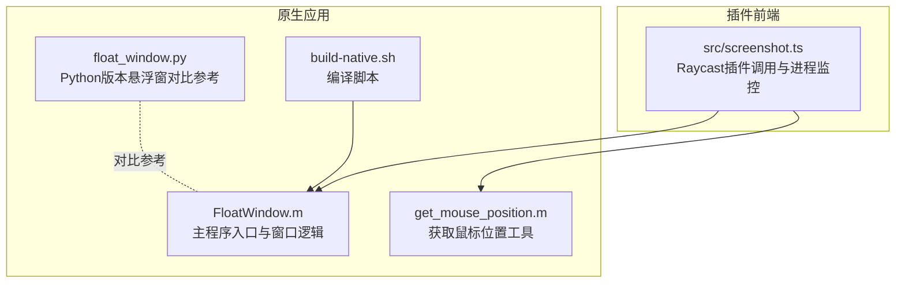
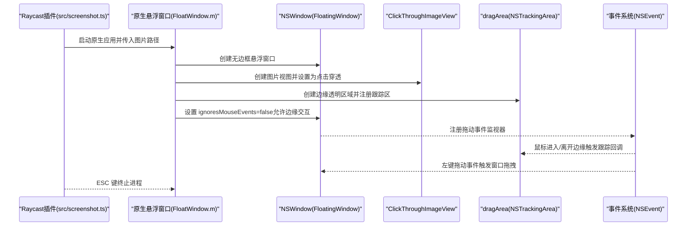
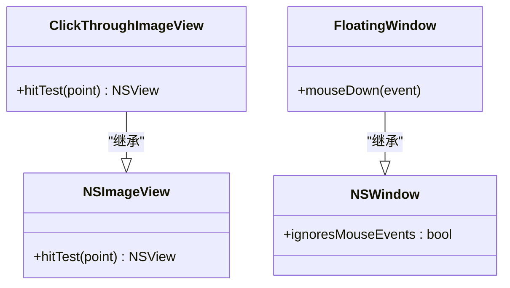
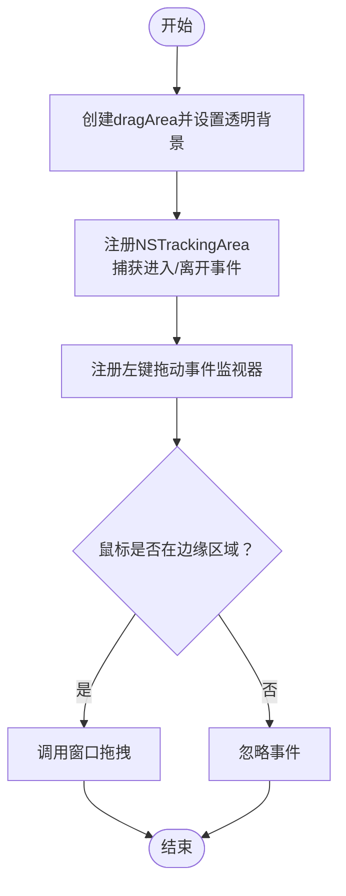
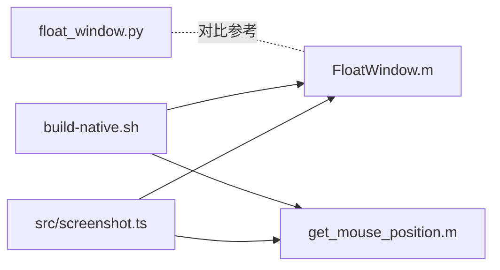

# 点击穿透实现机制

<cite>
**本文引用的文件**
- [FloatWindow.m](file://FloatWindow.m)
- [README.md](file://README.md)
- [float_window.py](file://float_window.py)
- [build-native.sh](file://build-native.sh)
- [get_mouse_position.m](file://get_mouse_position.m)
- [src/screenshot.ts](file://src/screenshot.ts)
</cite>

## 目录
1. [引言](#引言)
2. [项目结构](#项目结构)
3. [核心组件](#核心组件)
4. [架构总览](#架构总览)
5. [详细组件分析](#详细组件分析)
6. [依赖关系分析](#依赖关系分析)
7. [性能考量](#性能考量)
8. [故障排查指南](#故障排查指南)
9. [结论](#结论)
10. [附录](#附录)

## 引言
本文件围绕“点击穿透”这一交互设计展开，系统解析 FloatWindow.m 中 ClickThroughImageView 类通过重写 hitTest: 方法返回空指针，使视图不响应鼠标事件、从而将点击透传至下层应用的底层原理；同时说明该机制与 NSWindow 的 ignoresMouseEvents 属性如何协同工作，确保悬浮窗口既可见又不影响用户对底层程序的操作。文档还深入剖析 dragArea 拖动区域的设计思路：通过创建透明边缘区域并注册 NSTrackingArea 来检测鼠标进入/离开，结合事件监视器实现按住 Cmd 键拖动窗口的混合交互模式。最后总结该设计的用户体验优势、潜在兼容性问题与可行的解决方案。

## 项目结构
该项目由一个原生 Objective-C 悬浮窗口应用与配套脚本组成，配合 TypeScript/Raycast 插件调用流程共同完成“截图—悬浮展示—交互控制”的闭环。

图表来源
- [FloatWindow.m](file://FloatWindow.m#L179-L212)
- [float_window.py](file://float_window.py#L21-L62)
- [get_mouse_position.m](file://get_mouse_position.m#L1-L10)
- [build-native.sh](file://build-native.sh#L1-L26)
- [src/screenshot.ts](file://src/screenshot.ts#L342-L390)

章节来源
- [README.md](file://README.md#L1-L61)
- [FloatWindow.m](file://FloatWindow.m#L179-L212)
- [float_window.py](file://float_window.py#L1-L100)
- [get_mouse_position.m](file://get_mouse_position.m#L1-L10)
- [build-native.sh](file://build-native.sh#L1-L26)
- [src/screenshot.ts](file://src/screenshot.ts#L193-L236)

## 核心组件
- ClickThroughImageView：通过重写 hitTest: 返回空指针，使视图不参与事件命中测试，从而实现点击穿透。
- FloatingWindow：自定义 NSWindow 子类，禁用成为主/次窗口能力，并在按住 Cmd 键时触发窗口拖拽。
- dragArea：位于窗口边缘的透明区域，使用 NSTrackingArea 捕获鼠标进入/离开事件，结合事件监视器实现拖动。
- NSWindow 的 ignoresMouseEvents 属性：控制窗口整体是否忽略鼠标事件，与 dragArea 的局部可交互形成互补。
- OCR 文字面板：右侧浮动面板，提供复制/粘贴等文本操作入口。

章节来源
- [FloatWindow.m](file://FloatWindow.m#L169-L177)
- [FloatWindow.m](file://FloatWindow.m#L154-L167)
- [FloatWindow.m](file://FloatWindow.m#L296-L326)
- [FloatWindow.m](file://FloatWindow.m#L416-L422)

## 架构总览
下图展示了从 Raycast 插件调用到原生悬浮窗口启动、事件分发与拖动交互的关键流程。

图表来源
- [src/screenshot.ts](file://src/screenshot.ts#L342-L390)
- [FloatWindow.m](file://FloatWindow.m#L179-L212)
- [FloatWindow.m](file://FloatWindow.m#L274-L326)
- [FloatWindow.m](file://FloatWindow.m#L416-L464)

## 详细组件分析

### ClickThroughImageView：点击穿透的实现原理
- 设计要点
  - 重写 hitTest: 返回空指针，使视图不参与事件命中测试，所有鼠标事件直接透传给下层视图。
  - 该策略确保图片区域完全“不可点击”，避免遮挡底层应用交互。
- 与 NSWindow ignoresMouseEvents 的协作
  - 当 ignoresMouseEvents 为 YES 时，整个窗口忽略鼠标事件；为 NO 时，窗口仍可接收事件。
  - 本项目通过将 ignoresMouseEvents 设为 NO，并在 dragArea 上启用跟踪与事件监视，实现了“图片区域穿透、边缘区域可拖动”的混合交互。
- 复杂度与性能
  - hitTest: 为 O(1)，无额外计算开销。
  - 与窗口层级、子视图数量无关，性能稳定。

图表来源
- [FloatWindow.m](file://FloatWindow.m#L169-L177)
- [FloatWindow.m](file://FloatWindow.m#L154-L167)

章节来源
- [FloatWindow.m](file://FloatWindow.m#L169-L177)
- [FloatWindow.m](file://FloatWindow.m#L416-L422)

### dragArea 拖动区域设计：透明边缘 + NSTrackingArea
- 设计目标
  - 在窗口四边各创建 10px 的透明区域，作为可交互的拖动边界。
  - 通过 NSTrackingArea 捕获鼠标进入/离开事件，结合事件监视器实现拖动。
- 关键实现
  - 创建透明背景的 NSView 作为 dragArea，并将其置于图片视图之上。
  - 注册 NSTrackingArea，选项包含“仅在窗口处于活动状态时生效、进入/离开事件、可见区域内生效”。
  - 使用 NSEvent 本地监视器捕获左键拖动事件，判断鼠标位置是否处于边缘区域，若是则调用窗口拖拽。
- 用户体验
  - 边缘区域提供明确的拖动触达点，避免误触图片区域导致交互冲突。
  - 按住 Cmd 键时，窗口可通过系统级拖拽行为移动，提升易用性。

图表来源
- [FloatWindow.m](file://FloatWindow.m#L296-L326)
- [FloatWindow.m](file://FloatWindow.m#L300-L326)

章节来源
- [FloatWindow.m](file://FloatWindow.m#L296-L326)
- [FloatWindow.m](file://FloatWindow.m#L300-L326)

### NSWindow 的 ignoresMouseEvents 与窗口层级
- ignoresMouseEvents
  - 为 YES：窗口整体忽略鼠标事件，完全穿透。
  - 为 NO：窗口可接收事件，但仍可通过子视图的 hitTest: 控制具体区域的可交互性。
- 窗口层级与可见性
  - 使用 NSFloatingWindowLevel 保证悬浮窗口始终位于最上层。
  - 设置集合行为（加入所有空间、静止）以满足跨桌面显示与固定位置需求。
- 与 ClickThroughImageView 的配合
  - 图片区域通过 hitTest: 返回空指针穿透事件；边缘区域通过 ignoresMouseEvents=NO 与 dragArea 的跟踪机制实现可拖动。

章节来源
- [FloatWindow.m](file://FloatWindow.m#L274-L302)
- [FloatWindow.m](file://FloatWindow.m#L416-L422)

### 混合交互模式的用户体验优势
- 点击穿透：图片区域不影响底层应用操作，避免遮挡与误触。
- 边缘拖动：提供明确的拖动入口，降低误操作风险。
- 按住 Cmd 键拖动：利用系统级拖拽行为，提升一致性与可用性。
- 文字面板：右侧浮动面板提供 OCR 结果与常用操作入口，增强信息密度与效率。

章节来源
- [README.md](file://README.md#L1-L61)
- [FloatWindow.m](file://FloatWindow.m#L325-L353)

### 兼容性问题与解决方案
- 问题：不同 macOS 版本对事件分发与窗口层级的行为可能存在细微差异。
  - 解决方案：在关键路径增加边界检查与降级处理（如窗口越界修正已在代码中体现）。
- 问题：某些第三方窗口管理器或辅助功能可能影响事件传递。
  - 解决方案：提供最小化复现步骤与日志输出，便于定位冲突来源。
- 问题：高分辨率屏缩放因子导致像素与点尺寸不一致。
  - 解决方案：在计算显示尺寸时使用像素尺寸并按缩放因子换算为点尺寸，确保 1:1 视觉效果。
- 问题：边缘拖动区域过小或过大影响可用性。
  - 解决方案：将边缘尺寸设为 10px 并通过用户反馈持续优化。

章节来源
- [FloatWindow.m](file://FloatWindow.m#L194-L213)
- [FloatWindow.m](file://FloatWindow.m#L247-L277)

## 依赖关系分析
- 原生应用依赖
  - Cocoa、Carbon、Vision、QuartzCore、ImageIO 等框架提供窗口、图像与 OCR 能力。
- 脚本与工具
  - build-native.sh 负责编译原生应用与辅助工具。
  - get_mouse_position.m 提供鼠标位置查询能力，供前端脚本使用。
- 插件集成
  - src/screenshot.ts 调用原生应用，监控进程生命周期并在退出时清理临时文件。

图表来源
- [src/screenshot.ts](file://src/screenshot.ts#L193-L236)
- [build-native.sh](file://build-native.sh#L1-L26)
- [get_mouse_position.m](file://get_mouse_position.m#L1-L10)
- [float_window.py](file://float_window.py#L1-L100)

章节来源
- [src/screenshot.ts](file://src/screenshot.ts#L193-L236)
- [build-native.sh](file://build-native.sh#L1-L26)
- [get_mouse_position.m](file://get_mouse_position.m#L1-L10)
- [float_window.py](file://float_window.py#L1-L100)

## 性能考量
- 点击穿透的 hitTest: 为 O(1)，对性能影响极小。
- 拖动检测采用定时器轮询与事件监视器组合，频率较低（约每 10ms），在大多数场景下开销可控。
- 图像渲染与 OCR 仅在初始化阶段执行，后续交互不重复计算。
- 建议
  - 避免在高频事件中进行昂贵操作。
  - 对窗口尺寸变化与屏幕缩放因子的处理应尽量一次性完成，减少重复计算。

[本节为通用性能建议，无需特定文件引用]

## 故障排查指南
- 症状：点击穿透无效，图片区域仍拦截鼠标事件
  - 排查：确认 ClickThroughImageView 的 hitTest: 是否被正确重写并返回空指针。
  - 参考路径：[FloatWindow.m](file://FloatWindow.m#L169-L177)
- 症状：边缘拖动区域无效
  - 排查：确认 dragArea 的透明背景、NSTrackingArea 注册与事件监视器是否生效；检查 ignoresMouseEvents 是否为 NO。
  - 参考路径：[FloatWindow.m](file://FloatWindow.m#L296-L326), [FloatWindow.m](file://FloatWindow.m#L416-L422)
- 症状：窗口无法按住 Cmd 键拖动
  - 排查：确认 FloatingWindow 的 mouseDown: 是否在修饰键包含 Cmd 时触发窗口拖拽。
  - 参考路径：[FloatWindow.m](file://FloatWindow.m#L154-L167)
- 症状：ESC 键无法关闭窗口
  - 排查：确认事件轮询中 ESC 键状态检测逻辑是否正常。
  - 参考路径：[FloatWindow.m](file://FloatWindow.m#L422-L464)
- 症状：窗口位置异常或越界
  - 排查：检查屏幕尺寸、缩放因子与窗口尺寸换算逻辑，确保边界修正有效。
  - 参考路径：[FloatWindow.m](file://FloatWindow.m#L194-L213), [FloatWindow.m](file://FloatWindow.m#L247-L277)

章节来源
- [FloatWindow.m](file://FloatWindow.m#L154-L177)
- [FloatWindow.m](file://FloatWindow.m#L296-L326)
- [FloatWindow.m](file://FloatWindow.m#L416-L464)

## 结论
本项目通过 ClickThroughImageView 的点击穿透与 NSWindow 的 ignoresMouseEvents 属性协同，实现了“图片区域完全穿透、边缘区域可拖动”的混合交互模式。dragArea 与 NSTrackingArea 的结合，辅以事件监视器与按住 Cmd 键的系统级拖拽，既保证了悬浮窗口的可见性与可用性，又最大限度地减少了对底层应用的干扰。该设计在用户体验上具备明显优势，同时通过边界检查与事件轮询等手段提升了稳定性。针对潜在兼容性问题，建议在不同 macOS 版本与第三方工具环境下进行回归验证，并根据用户反馈持续优化边缘拖动区域与交互细节。

[本节为总结性内容，无需特定文件引用]

## 附录
- 编译与运行
  - 使用 build-native.sh 编译原生应用与辅助工具。
  - 参考路径：[build-native.sh](file://build-native.sh#L1-L26)
- Python 对比实现
  - 参考 float_window.py 的悬浮窗口实现，便于理解不同语言下的等价逻辑。
  - 参考路径：[float_window.py](file://float_window.py#L21-L62)

章节来源
- [build-native.sh](file://build-native.sh#L1-L26)
- [float_window.py](file://float_window.py#L21-L62)