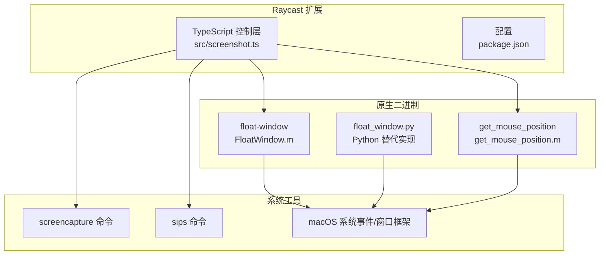
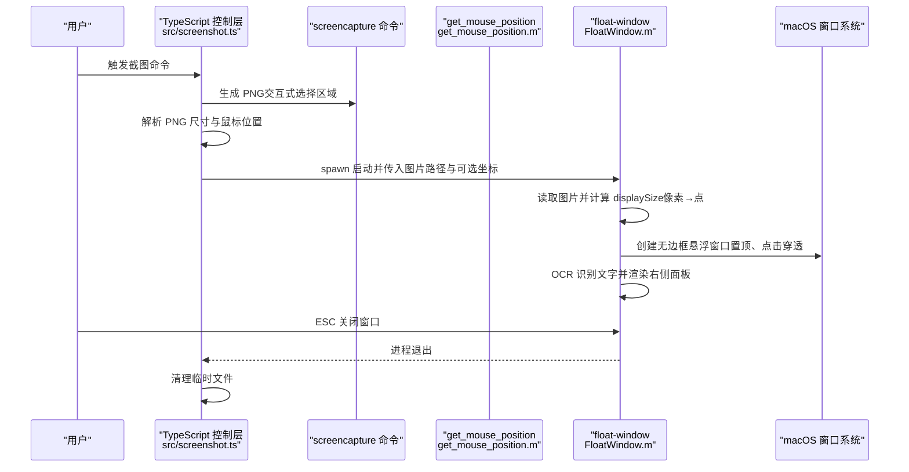
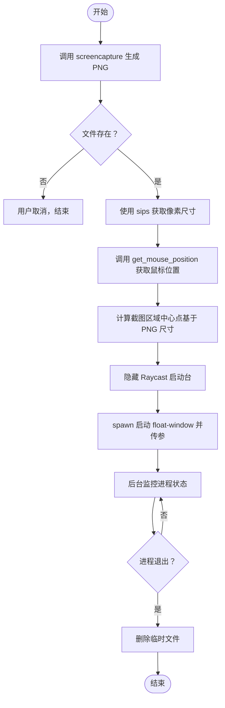
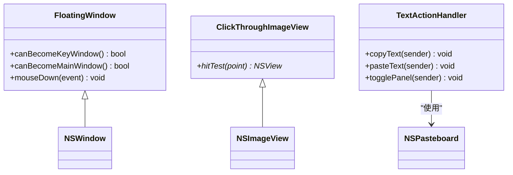
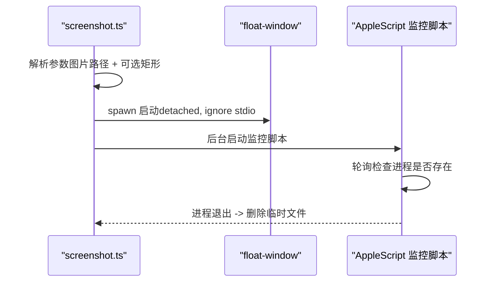
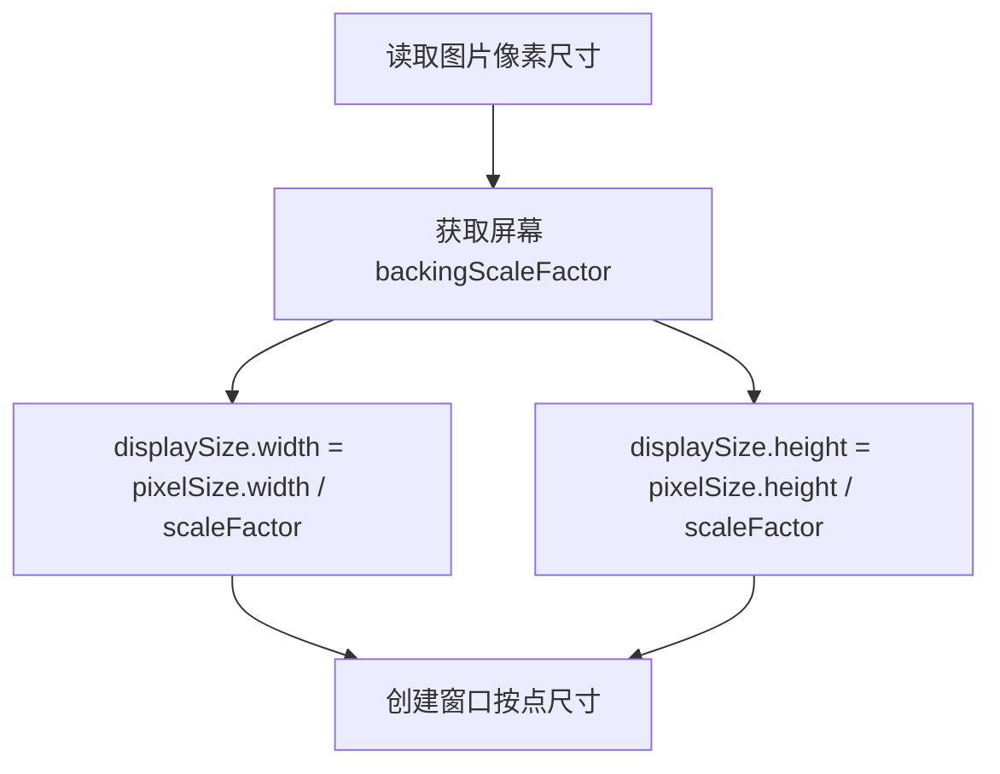
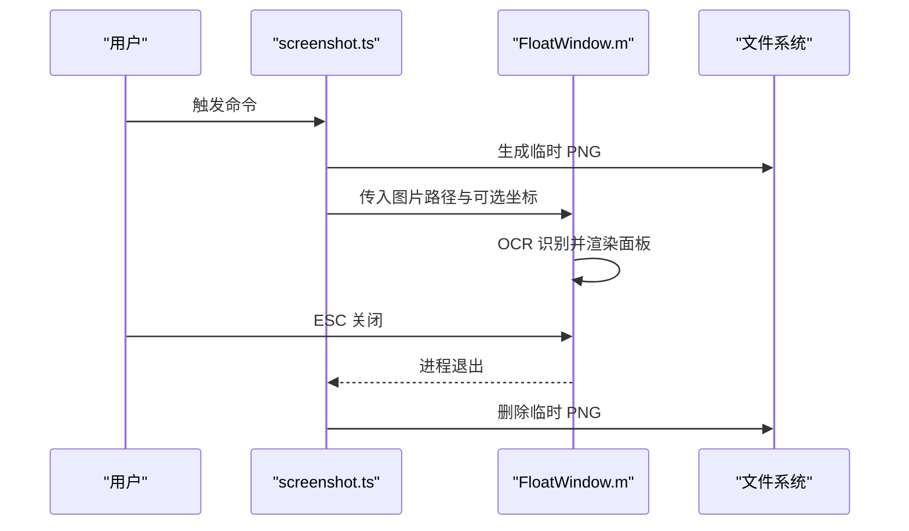
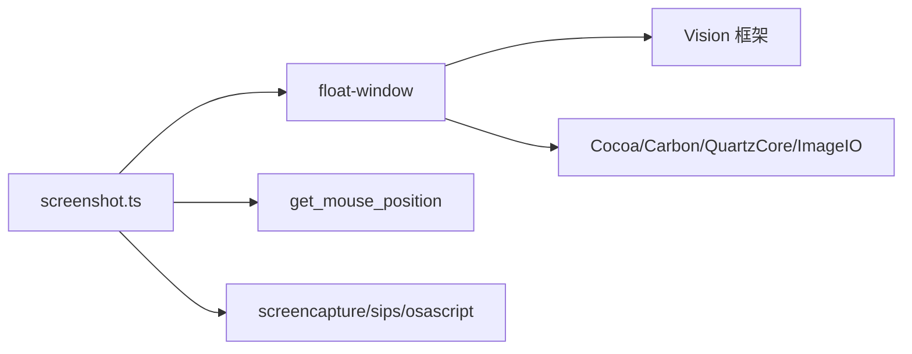

# 技术实现

<cite>
**本文引用的文件**
- [src/screenshot.ts](file://src/screenshot.ts)
- [FloatWindow.m](file://FloatWindow.m)
- [README.md](file://README.md)
- [build-native.sh](file://build-native.sh)
- [float_window.py](file://float_window.py)
- [get_mouse_position.m](file://get_mouse_position.m)
- [test_ocr.m](file://test_ocr.m)
- [test_position.sh](file://test_position.sh)
- [package.json](file://package.json)
</cite>

## 目录
1. [引言](#引言)
2. [项目结构](#项目结构)
3. [核心组件](#核心组件)
4. [架构总览](#架构总览)
5. [详细组件分析](#详细组件分析)
6. [依赖关系分析](#依赖关系分析)
7. [性能考量](#性能考量)
8. [故障排查指南](#故障排查指南)
9. [结论](#结论)
10. [附录](#附录)

## 引言
本技术文档面向混合编程架构的设计与实现，聚焦于以下目标：
- TypeScript 层（screenshot.ts）作为控制中枢，负责调用系统命令、管理生命周期与错误处理；
- Objective-C 层（FloatWindow.m）作为表现层，实现 macOS 原生窗口的高级特性；
- 解释进程间通信机制：Node.js 的 spawn 如何启动 float-window 二进制并传递图片路径与坐标等参数；
- 分析 Retina 屏幕下像素与点的转换逻辑（通过 backingScaleFactor 计算 displaySize）；
- 描述端到端数据流：用户触发 → screencapture 生成 PNG → 获取鼠标位置 → 启动 float-window → OCR 识别 → 用户交互 → 关闭清理；
- 给出系统上下文图与组件交互图的文字描述；
- 讨论技术权衡：为何不采用 Electron 或纯 Web 技术，而选择轻量级原生 + 脚本方案。

## 项目结构
该项目采用“Raycast 扩展 + 原生二进制 + 辅助工具”的混合架构：
- TypeScript 控制层：位于 src/screenshot.ts，负责截图、定位、调用原生二进制与清理；
- 原生表现层：FloatWindow.m 编译为 float-window，负责悬浮窗口展示、OCR 识别、交互与关闭；
- 辅助工具：get_mouse_position.m 编译为 get_mouse_position，用于获取鼠标位置；
- Python 替代实现：float_window.py 提供等价的 Python 版本（可选）；
- 构建脚本：build-native.sh 编译原生二进制；
- 测试脚本：test_ocr.m 与 test_position.sh 用于验证 OCR 与位置修复；
- 配置：package.json 定义构建与开发脚本，README.md 提供使用说明。

图表来源
- [src/screenshot.ts](file://src/screenshot.ts#L1-L120)
- [FloatWindow.m](file://FloatWindow.m#L180-L270)
- [get_mouse_position.m](file://get_mouse_position.m#L1-L10)
- [float_window.py](file://float_window.py#L1-L63)
- [build-native.sh](file://build-native.sh#L1-L26)
- [package.json](file://package.json#L1-L34)

章节来源
- [README.md](file://README.md#L1-L61)
- [package.json](file://package.json#L1-L34)

## 核心组件
- TypeScript 控制层（screenshot.ts）
  - 负责调用 screencapture 生成 PNG；
  - 使用 AppleScript 与 sips 获取截图区域与尺寸；
  - 通过 spawn 启动 float-window，并传入图片路径与可选的截图矩形参数；
  - 监控进程状态并在窗口退出后清理临时文件；
  - 处理用户取消与异常，提供友好的错误提示。
- 原生表现层（FloatWindow.m）
  - 接收图片路径与可选截图矩形参数；
  - 通过 backingScaleFactor 将像素尺寸换算为点尺寸，实现 1:1 视觉显示；
  - 创建无边框悬浮窗口，支持点击穿透、始终置顶、边缘拖动与 ESC 关闭；
  - 使用 Vision 框架进行 OCR 文字识别，并提供复制/粘贴交互。
- 辅助工具（get_mouse_position.m）
  - 输出当前鼠标坐标，用于估算截图区域中心点。
- 构建脚本（build-native.sh）
  - 编译 float-window 与 get_mouse_position，链接 Cocoa、Carbon、Vision、QuartzCore、ImageIO 等框架。
- Python 替代实现（float_window.py）
  - 提供与 Objective-C 版本等价的功能，便于跨语言验证与替换。

章节来源
- [src/screenshot.ts](file://src/screenshot.ts#L1-L120)
- [FloatWindow.m](file://FloatWindow.m#L180-L270)
- [get_mouse_position.m](file://get_mouse_position.m#L1-L10)
- [build-native.sh](file://build-native.sh#L1-L26)
- [float_window.py](file://float_window.py#L1-L63)

## 架构总览
系统采用“脚本控制 + 原生表现”的分层设计：
- 上层（TypeScript）负责业务流程编排与系统命令调用；
- 中层（spawn）负责进程间通信与参数传递；
- 下层（Objective-C/Python）负责窗口渲染、输入事件与 OCR。

图表来源
- [src/screenshot.ts](file://src/screenshot.ts#L20-L120)
- [src/screenshot.ts](file://src/screenshot.ts#L238-L391)
- [FloatWindow.m](file://FloatWindow.m#L180-L270)
- [FloatWindow.m](file://FloatWindow.m#L270-L340)
- [get_mouse_position.m](file://get_mouse_position.m#L1-L10)

## 详细组件分析

### TypeScript 控制层（screenshot.ts）
职责与流程要点：
- 截图生成：使用 spawn 调用 screencapture，避免 exec 的非零退出码误判；
- 截图区域与尺寸：通过 AppleScript 获取前台应用名（辅助定位），通过 sips 获取像素宽高；
- 鼠标位置：调用 get_mouse_position 获取坐标，结合 PNG 尺寸计算截图区域中心；
- 启动悬浮窗口：findProjectRoot 递归查找项目根，多策略定位 float-window 可执行文件；若缺失则尝试自动编译；
- 参数传递：spawn 传入图片路径与可选的截图矩形（x,y,width,height）；
- 生命周期与清理：后台运行 AppleScript 监控进程，进程退出后删除临时文件；
- 错误处理：区分用户取消与异常，提供 Toast 提示并清理资源。

图表来源
- [src/screenshot.ts](file://src/screenshot.ts#L1-L120)
- [src/screenshot.ts](file://src/screenshot.ts#L238-L391)

章节来源
- [src/screenshot.ts](file://src/screenshot.ts#L1-L120)
- [src/screenshot.ts](file://src/screenshot.ts#L120-L237)
- [src/screenshot.ts](file://src/screenshot.ts#L238-L391)

### 原生表现层（FloatWindow.m）
职责与流程要点：
- 参数解析：接收图片路径与可选截图矩形参数；
- Retina 尺寸换算：通过 backingScaleFactor 将像素尺寸换算为点尺寸，确保 1:1 视觉显示；
- 窗口属性：无边框、透明背景、始终置顶、点击穿透、边缘 10px 可拖动；
- OCR 识别：使用 Vision 框架识别图片文字，支持中英语言，过滤低置信度候选；
- 交互：ESC 关闭窗口；Cmd+鼠标拖动可移动窗口；右侧面板提供复制/粘贴按钮；
- 位置计算：优先使用传入的截图矩形作为窗口位置，否则居中显示；并做边界检查与修正。

图表来源
- [FloatWindow.m](file://FloatWindow.m#L154-L168)
- [FloatWindow.m](file://FloatWindow.m#L169-L178)
- [FloatWindow.m](file://FloatWindow.m#L8-L24)

章节来源
- [FloatWindow.m](file://FloatWindow.m#L180-L270)
- [FloatWindow.m](file://FloatWindow.m#L270-L340)
- [FloatWindow.m](file://FloatWindow.m#L340-L466)

### 进程间通信机制（Node.js spawn）
- 启动方式：screenshot.ts 使用 spawn 启动 float-window，detached 且 stdio 忽略，避免阻塞；
- 参数传递：将图片路径作为第一个参数，可选的截图矩形（x,y,width,height）依次追加；
- 进程监控：通过 osascript 后台脚本轮询进程是否存在，退出后删除临时文件；
- 与 get_mouse_position 的协作：先获取鼠标位置，再启动悬浮窗口，提升用户体验。

图表来源
- [src/screenshot.ts](file://src/screenshot.ts#L323-L391)
- [FloatWindow.m](file://FloatWindow.m#L180-L210)

章节来源
- [src/screenshot.ts](file://src/screenshot.ts#L323-L391)

### Retina 屏幕像素与点的转换逻辑
- 背景：Retina 屏幕下，像素尺寸与点尺寸不同；为实现“1:1 显示”，需将像素尺寸换算为点尺寸；
- 实现：读取图片像素尺寸，乘以屏幕 backingScaleFactor 得到 displaySize；
- 影响：窗口尺寸按点计算，视觉上与图片像素一致，避免模糊或放大。

图表来源
- [FloatWindow.m](file://FloatWindow.m#L194-L213)

章节来源
- [FloatWindow.m](file://FloatWindow.m#L194-L213)

### 数据流：从用户触发到清理
- 用户触发 → screencapture 生成 PNG → 获取鼠标位置 → 启动 float-window → OCR 识别 → 用户交互（ESC/拖动/复制/粘贴）→ 进程退出 → 清理临时文件。

图表来源
- [src/screenshot.ts](file://src/screenshot.ts#L1-L120)
- [src/screenshot.ts](file://src/screenshot.ts#L323-L391)
- [FloatWindow.m](file://FloatWindow.m#L340-L466)

章节来源
- [src/screenshot.ts](file://src/screenshot.ts#L1-L120)
- [src/screenshot.ts](file://src/screenshot.ts#L323-L391)
- [FloatWindow.m](file://FloatWindow.m#L340-L466)

### 技术权衡：为何不使用 Electron 或纯 Web 技术
- 轻量化与性能：原生窗口具备更佳的渲染性能与更低的资源占用，适合高频触发的截图场景；
- 原生能力：充分利用 macOS 窗口系统（置顶、点击穿透、边缘拖动、ESC 关闭）与 Vision 框架 OCR；
- 集成成本：通过 spawn 调用原生二进制，无需引入重型前端框架，降低打包体积与启动时间；
- 可维护性：TypeScript 控制层负责流程编排，Objective-C/Python 表现层专注 UI 与识别，职责清晰。

章节来源
- [README.md](file://README.md#L46-L61)
- [package.json](file://package.json#L28-L33)

## 依赖关系分析
- 构建依赖：build-native.sh 链接 Cocoa、Carbon、Vision、QuartzCore、ImageIO；
- 运行时依赖：screencapture、sips、osascript、Vision 框架；
- 进程依赖：screenshot.ts 依赖 float-window 与 get_mouse_position 的可执行文件；
- 语言依赖：TypeScript 与 Objective-C/Python 互补，分别承担控制与表现。

图表来源
- [build-native.sh](file://build-native.sh#L1-L26)
- [src/screenshot.ts](file://src/screenshot.ts#L238-L391)
- [FloatWindow.m](file://FloatWindow.m#L1-L10)

章节来源
- [build-native.sh](file://build-native.sh#L1-L26)
- [package.json](file://package.json#L28-L33)

## 性能考量
- 启动延迟：spawn detached 与 stdio 忽略减少阻塞；后台监控脚本轮询间隔较小，保证及时清理；
- 渲染效率：1:1 显示避免缩放带来的额外开销；点击穿透减少不必要的事件处理；
- OCR 成本：Vision 框架识别在本地执行，建议对大图进行预裁剪或降采样以提升速度；
- 资源回收：进程退出即清理临时文件，避免磁盘碎片与残留。

## 故障排查指南
- 找不到 float-window 可执行文件
  - 确认已执行构建脚本并生成 float-window；
  - 检查可执行文件路径与权限；
  - 若缺失，screenshot.ts 会尝试自动编译。
- OCR 未识别到文字
  - 确认图片质量与对比度；
  - 检查语言设置与置信度阈值；
  - 可参考 test_ocr.m 的实现进行验证。
- 窗口位置偏移或越界
  - 检查截图矩形参数与屏幕 backingScaleFactor；
  - 参考 test_position.sh 的测试流程验证位置修复逻辑。
- 鼠标位置异常
  - 确认 get_mouse_position 可执行文件存在并可执行；
  - 检查系统权限与坐标系差异。

章节来源
- [src/screenshot.ts](file://src/screenshot.ts#L238-L391)
- [test_ocr.m](file://test_ocr.m#L1-L92)
- [test_position.sh](file://test_position.sh#L1-L15)

## 结论
该系统通过 TypeScript 控制层与 Objective-C 表现层的分工协作，实现了高性能、低耦合的截图悬浮展示方案。借助 spawn 的进程间通信、Vision 的 OCR 能力与 macOS 原生窗口特性，系统在易用性与性能之间取得良好平衡。对于需要快速、稳定、轻量的桌面截图体验，该混合架构是合理的选择。

## 附录
- 开发与构建
  - 安装依赖：npm install
  - 编译原生二进制：./build-native.sh
  - 开发模式：npm run dev
  - 构建：npm run build
- 使用说明
  - 在 Raycast 中导入扩展，执行 Take Screenshot 命令，选择截图区域后查看悬浮窗口。

章节来源
- [README.md](file://README.md#L16-L44)
- [package.json](file://package.json#L28-L33)
- [build-native.sh](file://build-native.sh#L1-L26)