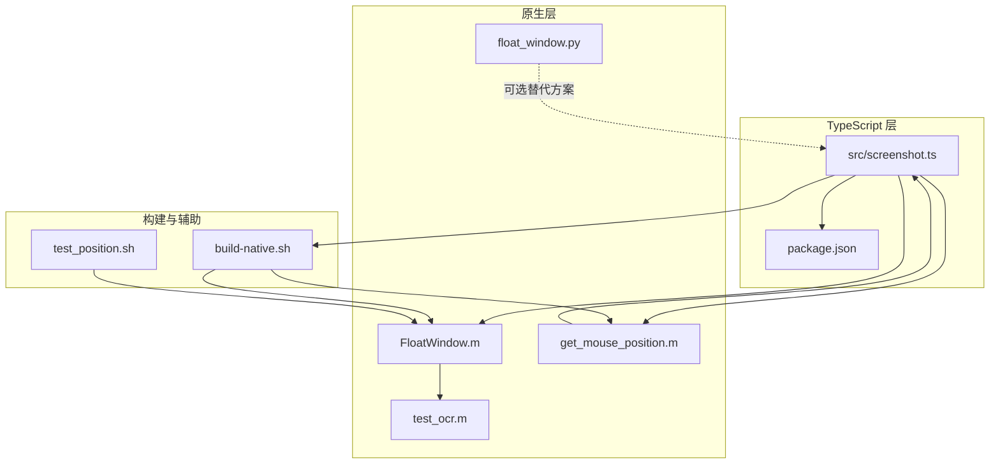
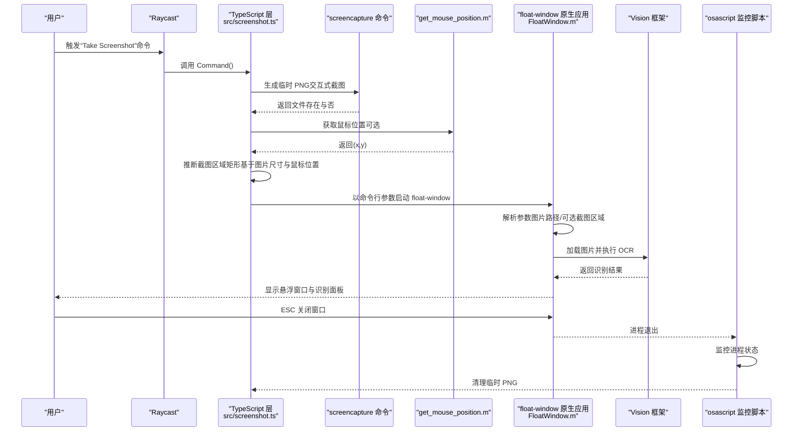
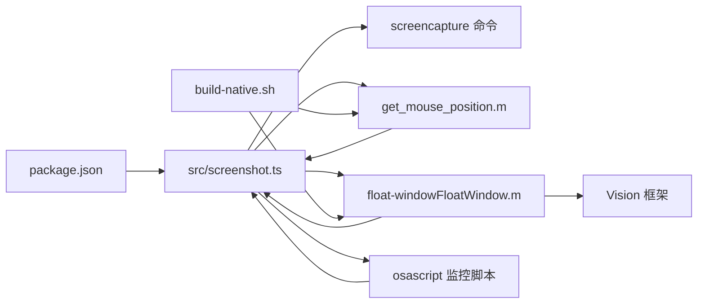

# 数据流

<cite>
**本文引用的文件**
- [src/screenshot.ts](file://src/screenshot.ts)
- [FloatWindow.m](file://FloatWindow.m)
- [get_mouse_position.m](file://get_mouse_position.m)
- [float_window.py](file://float_window.py)
- [test_ocr.m](file://test_ocr.m)
- [build-native.sh](file://build-native.sh)
- [package.json](file://package.json)
- [README.md](file://README.md)
- [test_position.sh](file://test_position.sh)
</cite>

## 目录
1. [简介](#简介)
2. [项目结构](#项目结构)
3. [核心组件](#核心组件)
4. [架构总览](#架构总览)
5. [详细组件分析](#详细组件分析)
6. [依赖关系分析](#依赖关系分析)
7. [性能考量](#性能考量)
8. [故障排查指南](#故障排查指南)
9. [结论](#结论)

## 简介
本文件围绕“从用户触发到最终清理”的完整数据流进行深入分析，覆盖以下关键环节：
- 用户通过 Raycast 触发命令
- TypeScript 层调用 screencapture 生成临时 PNG 文件
- 通过 get_mouse_position.m 获取鼠标位置
- 启动 float-window 原生应用并传入图片路径与截图区域参数
- Objective-C 层解析参数并创建悬浮窗口
- Vision 框架执行 OCR 识别
- 用户交互（ESC 关闭、拖动窗口）
- osascript 监控进程并清理临时文件

同时，重点说明临时文件生命周期管理、进程间通信的数据格式（命令行参数）、以及错误状态的传播机制，并提供数据流的文字描述与可视化图示。

## 项目结构
该仓库采用“TypeScript + 原生 Objective-C + Shell 脚本”的混合架构：
- TypeScript 层负责用户交互、系统调用、文件管理与进程监控
- 原生层负责窗口创建、点击穿透、拖动、ESC 关闭与 OCR 识别
- Shell 脚本负责编译原生二进制（float-window、get_mouse_position）

图表来源
- [src/screenshot.ts](file://src/screenshot.ts#L1-L392)
- [FloatWindow.m](file://FloatWindow.m#L1-L466)
- [get_mouse_position.m](file://get_mouse_position.m#L1-L10)
- [float_window.py](file://float_window.py#L1-L100)
- [test_ocr.m](file://test_ocr.m#L1-L92)
- [build-native.sh](file://build-native.sh#L1-L26)
- [package.json](file://package.json#L1-L34)
- [test_position.sh](file://test_position.sh#L1-L15)

章节来源
- [package.json](file://package.json#L1-L34)
- [README.md](file://README.md#L1-L61)

## 核心组件
- TypeScript 主流程：负责截图、尺寸与位置推断、原生应用定位与启动、进程监控与临时文件清理
- 原生悬浮窗口（Objective-C）：负责窗口创建、点击穿透、拖动、ESC 关闭、OCR 识别与结果面板
- 鼠标位置获取（Objective-C）：负责获取当前鼠标坐标
- Python 悬浮窗口（可选）：提供另一种悬浮窗口实现（与主流程互斥）
- 构建脚本：编译原生二进制
- OCR 测试：验证 Vision 识别能力

章节来源
- [src/screenshot.ts](file://src/screenshot.ts#L1-L392)
- [FloatWindow.m](file://FloatWindow.m#L1-L466)
- [get_mouse_position.m](file://get_mouse_position.m#L1-L10)
- [float_window.py](file://float_window.py#L1-L100)
- [test_ocr.m](file://test_ocr.m#L1-L92)
- [build-native.sh](file://build-native.sh#L1-L26)

## 架构总览
下图展示从用户触发到最终清理的端到端数据流与控制流。

图表来源
- [src/screenshot.ts](file://src/screenshot.ts#L1-L392)
- [FloatWindow.m](file://FloatWindow.m#L1-L466)
- [get_mouse_position.m](file://get_mouse_position.m#L1-L10)
- [test_ocr.m](file://test_ocr.m#L1-L92)

## 详细组件分析

### TypeScript 主流程（截图与启动）
- 生成临时 PNG 路径于系统临时目录
- 调用 screencapture 命令进行交互式截图；通过监听子进程 close 事件判断用户是否取消（以文件存在性为准）
- 可选：通过 AppleScript 获取前台应用名，再调用 get_mouse_position.m 获取鼠标坐标
- 读取图片像素尺寸，结合鼠标位置计算截图区域矩形（作为窗口初始位置参考）
- 隐藏 Raycast 启动台，短暂等待后启动 float-window 并传入参数
- 参数格式：图片路径 + 可选的截图区域四元组（x, y, width, height）
- 启动 osascript 监控脚本，后台轮询进程状态，一旦进程退出即删除临时 PNG

关键数据节点与转换
- 输入：用户触发 → screencapture 输出 PNG 文件
- 中间：鼠标位置（x,y）→ 图片尺寸（width,height）→ 截图区域矩形（x,y,width,height）
- 输出：float-window 进程启动 → OCR 结果面板显示 → ESC 关闭 → osascript 清理临时文件

错误传播
- 用户取消：不弹出错误提示，直接返回
- 其他异常：Toast 失败提示 → 若临时文件存在则主动删除

章节来源
- [src/screenshot.ts](file://src/screenshot.ts#L1-L114)
- [src/screenshot.ts](file://src/screenshot.ts#L116-L160)
- [src/screenshot.ts](file://src/screenshot.ts#L162-L236)
- [src/screenshot.ts](file://src/screenshot.ts#L238-L343)
- [src/screenshot.ts](file://src/screenshot.ts#L342-L390)

### 原生悬浮窗口（Objective-C）
- 命令行参数解析：至少包含图片路径；可选包含截图区域四元组
- 窗口属性：无边框、悬浮层级、透明背景、阴影、点击穿透（图片区域）
- 1:1 显示：根据图片像素尺寸与屏幕缩放因子换算为点尺寸
- 交互：
  - ESC 键：终止应用，关闭窗口
  - 边缘拖动：窗口边缘 10px 区域允许拖动
  - 文字面板：右侧显示识别结果，支持复制/粘贴
- OCR：使用 Vision 框架识别图片文本，支持多语言，置信度阈值过滤

关键数据节点与转换
- 输入：命令行参数（图片路径/可选截图区域）
- 处理：加载图片 → 计算窗口位置与尺寸 → OCR 识别 → 构建界面
- 输出：悬浮窗口显示 → 用户交互 → 进程退出

章节来源
- [FloatWindow.m](file://FloatWindow.m#L1-L466)
- [test_ocr.m](file://test_ocr.m#L1-L92)

### 鼠标位置获取（Objective-C）
- 通过 Cocoa 获取当前鼠标坐标，输出格式为“x,y”
- TypeScript 侧解析为数值坐标，用于推断截图区域矩形

章节来源
- [get_mouse_position.m](file://get_mouse_position.m#L1-L10)
- [src/screenshot.ts](file://src/screenshot.ts#L162-L236)

### Python 悬浮窗口（可选替代）
- 提供另一种悬浮窗口实现，支持点击穿透、ESC 关闭等行为
- 与主流程互斥，TypeScript 优先使用 float-window

章节来源
- [float_window.py](file://float_window.py#L1-L100)

### 构建与辅助脚本
- build-native.sh：编译 float-window 与 get_mouse_position，赋予可执行权限
- test_position.sh：用于测试截图位置修复效果，演示带截图区域参数的启动方式

章节来源
- [build-native.sh](file://build-native.sh#L1-L26)
- [test_position.sh](file://test_position.sh#L1-L15)

## 依赖关系分析

图表来源
- [src/screenshot.ts](file://src/screenshot.ts#L1-L392)
- [FloatWindow.m](file://FloatWindow.m#L1-L466)
- [get_mouse_position.m](file://get_mouse_position.m#L1-L10)
- [build-native.sh](file://build-native.sh#L1-L26)
- [package.json](file://package.json#L1-L34)

章节来源
- [package.json](file://package.json#L1-L34)
- [README.md](file://README.md#L1-L61)

## 性能考量
- 截图与尺寸查询：screencapture 与 sips 均为系统命令，耗时取决于磁盘与显示器分辨率
- OCR：Vision 识别在 CPU 上执行，受图片大小与语言数量影响；建议控制图片尺寸与语言列表长度
- 窗口渲染：1:1 显示避免缩放开销；点击穿透与边缘拖动逻辑轻量
- 进程监控：osascript 轮询间隔较短，但仅在窗口存在期间运行，整体开销可控

## 故障排查指南
常见问题与处理建议：
- 找不到 float-window 或 get_mouse_position
  - 确认已执行构建脚本完成编译
  - 检查可执行文件是否存在于项目根目录或 PATH 中
  - TypeScript 侧会在找不到时提示并引导运行构建脚本
- 用户取消截图
  - 不会弹出错误提示，属于预期行为
- 截图区域位置不正确
  - 可通过 test_position.sh 模拟带截图区域参数的启动，验证位置修复逻辑
- OCR 未识别到文字
  - 检查图片质量与语言设置；可参考 test_ocr.m 的实现进行对比
- 临时文件未清理
  - 确认 osascript 监控脚本已启动且进程退出后触发清理

章节来源
- [src/screenshot.ts](file://src/screenshot.ts#L273-L313)
- [src/screenshot.ts](file://src/screenshot.ts#L342-L390)
- [build-native.sh](file://build-native.sh#L1-L26)
- [test_position.sh](file://test_position.sh#L1-L15)
- [test_ocr.m](file://test_ocr.m#L1-L92)

## 结论
该系统通过 TypeScript 与原生层的清晰分工，实现了从用户触发到悬浮显示与 OCR 的完整闭环。TypeScript 负责系统调用、参数组装与生命周期管理，原生层专注窗口与交互体验，Vision 提供可靠的 OCR 能力。数据流的关键在于：
- 命令行参数格式明确（图片路径 + 可选截图区域四元组）
- 临时文件生命周期由进程监控保障
- 错误状态在 TypeScript 层统一捕获与传播，用户感知友好