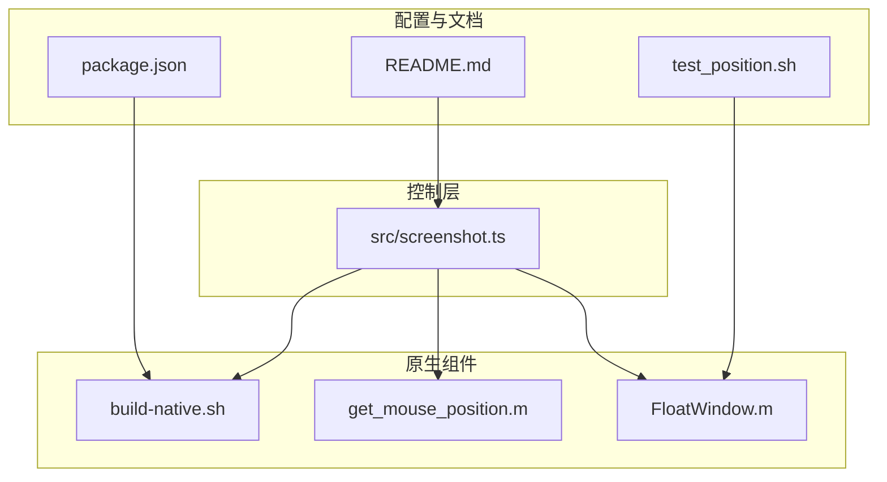
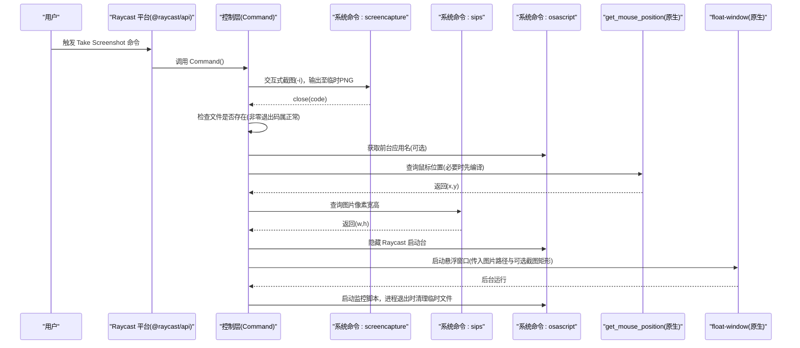
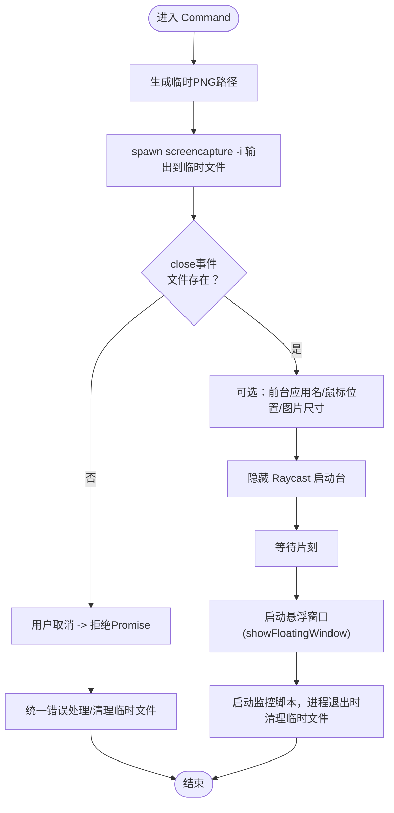
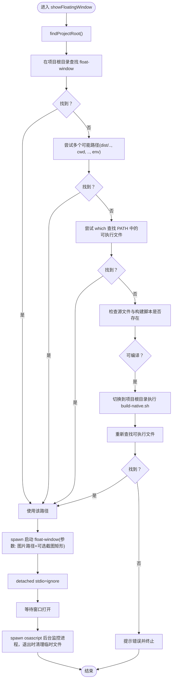
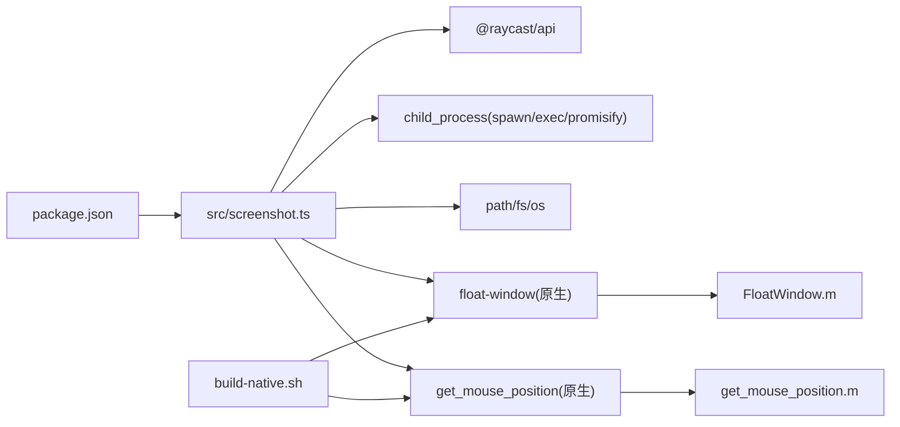

# 控制层架构

<cite>
**本文引用的文件**
- [src/screenshot.ts](file://src/screenshot.ts)
- [README.md](file://README.md)
- [package.json](file://package.json)
- [build-native.sh](file://build-native.sh)
- [FloatWindow.m](file://FloatWindow.m)
- [get_mouse_position.m](file://get_mouse_position.m)
- [test_position.sh](file://test_position.sh)
</cite>

## 目录
1. [简介](#简介)
2. [项目结构](#项目结构)
3. [核心组件](#核心组件)
4. [架构总览](#架构总览)
5. [详细组件分析](#详细组件分析)
6. [依赖关系分析](#依赖关系分析)
7. [性能考量](#性能考量)
8. [故障排查指南](#故障排查指南)
9. [结论](#结论)
10. [附录](#附录)

## 简介
本文件聚焦于 TypeScript 控制层模块 src/screenshot.ts 的整体架构与执行流程，解释其如何作为插件的控制中枢，协调系统命令调用（screencapture、sips、osascript）、生命周期管理、错误处理以及与 Raycast 平台的集成（@raycast/api）。同时，文档深入解析 Command 函数的执行链路：从用户触发命令、生成临时截图文件、调用系统截图工具、获取鼠标位置与图片尺寸，到最终启动原生悬浮窗口；并说明自动编译机制（当原生可执行文件缺失时，通过 execAsync 调用 build-native.sh 脚本自动编译 Objective-C 代码）；最后给出关键 Promise 与 spawn 调用的片段路径，并解释为何使用 spawn 而非 exec 来处理用户取消操作；分析 findProjectRoot 函数的路径查找策略及其对插件鲁棒性的意义。

## 项目结构
该项目采用“控制层 + 原生组件 + 构建脚本”的分层组织方式：
- 控制层：src/screenshot.ts，负责命令入口、系统命令调度、错误处理、Raycast 集成与生命周期管理。
- 原生组件：FloatWindow.m（悬浮窗口）、get_mouse_position.m（鼠标位置查询）、build-native.sh（编译脚本）。
- 配置与开发：package.json（脚本与依赖）、README.md（功能与使用说明）、test_position.sh（测试脚本）。

图表来源
- [src/screenshot.ts](file://src/screenshot.ts#L1-L114)
- [build-native.sh](file://build-native.sh#L1-L26)
- [FloatWindow.m](file://FloatWindow.m#L179-L210)
- [get_mouse_position.m](file://get_mouse_position.m#L1-L10)
- [package.json](file://package.json#L1-L34)
- [README.md](file://README.md#L1-L61)
- [test_position.sh](file://test_position.sh#L1-L15)

章节来源
- [README.md](file://README.md#L1-L61)
- [package.json](file://package.json#L1-L34)

## 核心组件
- 控制层入口：Command 函数，作为用户触发命令的唯一入口，负责组织截图、尺寸与位置信息、Raycast 集成与原生悬浮窗口启动。
- 工具函数：
  - getImageDimensions：通过 sips 获取图片像素宽高。
  - findProjectRoot：向上查找项目根目录，提升部署鲁棒性。
  - getMousePosition：定位鼠标位置，必要时自动编译 get_mouse_position。
  - showFloatingWindow：定位并启动 float-window，支持自动编译与进程监控清理。
- Raycast 集成：使用 @raycast/api 的 showToast、隐藏 Raycast 启动台、通过 osascript 发送快捷键。
- 系统命令：screencapture（交互式截图）、sips（图片尺寸查询）、osascript（系统事件与快捷键）、clang（原生编译）。

章节来源
- [src/screenshot.ts](file://src/screenshot.ts#L1-L114)
- [src/screenshot.ts](file://src/screenshot.ts#L116-L135)
- [src/screenshot.ts](file://src/screenshot.ts#L137-L160)
- [src/screenshot.ts](file://src/screenshot.ts#L162-L236)
- [src/screenshot.ts](file://src/screenshot.ts#L238-L391)

## 架构总览
下图展示了从用户触发命令到原生悬浮窗口启动的端到端流程，包括系统命令调用、错误处理与生命周期管理。

图表来源
- [src/screenshot.ts](file://src/screenshot.ts#L10-L114)
- [src/screenshot.ts](file://src/screenshot.ts#L116-L135)
- [src/screenshot.ts](file://src/screenshot.ts#L162-L236)
- [src/screenshot.ts](file://src/screenshot.ts#L238-L391)
- [get_mouse_position.m](file://get_mouse_position.m#L1-L10)
- [FloatWindow.m](file://FloatWindow.m#L179-L210)

## 详细组件分析

### 控制层入口：Command 函数
- 职责：组织一次完整的截图与悬浮窗口展示流程，包含错误处理、Raycast 集成与生命周期管理。
- 关键步骤：
  - 生成临时 PNG 路径。
  - 使用 spawn 调用 screencapture -i，监听 close 事件判断用户是否取消（通过文件存在性而非退出码）。
  - 可选：通过 osascript 获取前台应用名；通过 getMousePosition 获取鼠标位置；通过 getImageDimensions 获取图片像素尺寸。
  - 隐藏 Raycast 启动台，等待短暂时间确保隐藏生效。
  - 启动 showFloatingWindow，传入图片路径与可选截图矩形。
  - 统一错误处理：区分用户取消与异常，必要时清理临时文件。
- 为什么使用 spawn 而非 exec：
  - 用户取消 screencapture 时返回非零退出码，若使用 exec，标准库会将此视为错误；而 spawn 通过 close 事件与文件存在性判断，能正确区分“用户取消”与“真正失败”。

图表来源
- [src/screenshot.ts](file://src/screenshot.ts#L10-L114)
- [src/screenshot.ts](file://src/screenshot.ts#L238-L391)

章节来源
- [src/screenshot.ts](file://src/screenshot.ts#L10-L114)

### 图片尺寸查询：getImageDimensions
- 使用 sips 查询图片像素宽高，失败时返回默认尺寸。
- 与 showFloatingWindow 的位置计算配合，确保 1:1 显示。

章节来源
- [src/screenshot.ts](file://src/screenshot.ts#L116-L135)

### 鼠标位置查询：getMousePosition
- 通过 findProjectRoot 定位项目根目录，优先在根目录查找可执行文件 get_mouse_position。
- 若未找到，尝试多处可能路径（dist 上级、当前工作目录、两级上级、Raycast 环境变量）。
- 若仍不可用且源文件存在，切换到项目根目录执行 clang 编译。
- 成功后通过 execAsync 调用可执行文件，解析输出的 x,y 坐标。

章节来源
- [src/screenshot.ts](file://src/screenshot.ts#L137-L160)
- [src/screenshot.ts](file://src/screenshot.ts#L162-L236)

### 项目根目录查找：findProjectRoot
- 向上遍历目录，最多 10 层，遇到 package.json 或 build-native.sh 即返回当前目录作为项目根。
- 作用：提升部署鲁棒性，避免因打包后路径变化导致的资源定位失败。

章节来源
- [src/screenshot.ts](file://src/screenshot.ts#L137-L160)

### 原生悬浮窗口：showFloatingWindow
- 路径查找策略：
  - 优先在项目根目录查找 float-window。
  - 若未找到，尝试多处可能路径（dist 上级、当前工作目录、两级上级、Raycast 环境变量）。
  - 若仍未找到，尝试 which 查看是否在 PATH 中。
- 自动编译：
  - 若源文件 FloatWindow.m 与构建脚本 build-native.sh 存在，切换到项目根目录执行 bash build-native.sh。
  - 编译成功后重新查找，若仍不可用则向用户提示错误并终止。
- 启动与监控：
  - 通过 spawn 启动 float-window，传入图片路径与可选截图矩形参数。
  - 后台启动 osascript 监控脚本，进程退出时删除临时文件，确保资源回收。

图表来源
- [src/screenshot.ts](file://src/screenshot.ts#L238-L391)
- [build-native.sh](file://build-native.sh#L1-L26)

章节来源
- [src/screenshot.ts](file://src/screenshot.ts#L238-L391)

### Raycast 集成与生命周期管理
- 使用 @raycast/api 的 showToast 展示失败提示。
- 通过 osascript 隐藏 Raycast 启动台，避免遮挡悬浮窗口。
- 通过后台 osascript 监控原生进程，进程退出后自动清理临时文件，避免资源泄漏。

章节来源
- [src/screenshot.ts](file://src/screenshot.ts#L1-L114)
- [src/screenshot.ts](file://src/screenshot.ts#L342-L391)

### 自动编译机制
- 当原生可执行文件缺失时，优先检查源文件与构建脚本是否存在。
- 切换到项目根目录执行 bash build-native.sh，编译 float-window 与 get_mouse_position。
- 编译成功后重新定位可执行文件；若仍失败，向用户展示明确的错误提示与建议。

章节来源
- [src/screenshot.ts](file://src/screenshot.ts#L284-L306)
- [build-native.sh](file://build-native.sh#L1-L26)
- [package.json](file://package.json#L28-L33)

### 与 Raycast 平台的集成要点
- 命令注册：package.json 中定义命令名称、标题与描述。
- 开发模式：npm run dev 由 ray 本地开发工具驱动。
- 构建与分发：prebuild/postbuild 脚本确保原生二进制可用并复制到目标目录。

章节来源
- [package.json](file://package.json#L1-L34)
- [README.md](file://README.md#L30-L46)

## 依赖关系分析
- 控制层依赖：
  - @raycast/api：Toast 提示、命令入口。
  - child_process：spawn/exec/promisify，用于系统命令与原生进程管理。
  - path/fs/os：路径拼接、文件存在性检查、临时目录。
- 原生组件依赖：
  - Cocoa/Carbon/Vision/QuartzCore/ImageIO：悬浮窗口与 OCR 功能。
  - clang：编译 Objective-C 源文件为可执行文件。
- 构建脚本：
  - build-native.sh：统一编译流程与权限设置。

图表来源
- [package.json](file://package.json#L1-L34)
- [src/screenshot.ts](file://src/screenshot.ts#L1-L114)
- [build-native.sh](file://build-native.sh#L1-L26)
- [FloatWindow.m](file://FloatWindow.m#L1-L20)
- [get_mouse_position.m](file://get_mouse_position.m#L1-L10)

章节来源
- [package.json](file://package.json#L1-L34)
- [src/screenshot.ts](file://src/screenshot.ts#L1-L114)

## 性能考量
- 进程分离与异步：
  - spawn detached 与 unref 保证原生进程独立运行，避免阻塞主流程。
  - Promise + setTimeout 降低同步等待成本。
- 资源回收：
  - 后台监控脚本在进程退出时清理临时文件，避免磁盘占用。
- 命令选择：
  - screencapture 使用 -i 交互式截图，减少不必要的 UI 干扰。
  - sips 仅查询像素尺寸，开销极低。
- 路径查找：
  - findProjectRoot 限制最大深度，避免深层递归带来的性能损耗。

[本节为通用性能讨论，无需列出具体文件来源]

## 故障排查指南
- 常见问题与定位：
  - 原生可执行文件缺失：检查 build-native.sh 是否执行成功，确认 float-window 与 get_mouse_position 是否存在于项目根目录或 PATH。
  - 用户取消截图：screencapture 返回非零退出码属预期行为，控制层通过文件存在性判断区分取消与失败。
  - 鼠标位置获取失败：确认 get_mouse_position 源文件存在且可编译；检查编译输出与可执行文件权限。
  - Raycast 启动台未隐藏：osascript 命令可能被系统安全策略阻止，可在系统偏好设置中授权。
- 建议排查步骤：
  - 手动执行 build-native.sh，验证编译输出。
  - 使用 test_position.sh 模拟悬浮窗口启动，验证位置与尺寸计算。
  - 在终端中分别运行 screencapture、sips、osascript 命令，确认系统可用性。
  - 检查 findProjectRoot 返回值，确认项目根目录定位正确。

章节来源
- [src/screenshot.ts](file://src/screenshot.ts#L284-L306)
- [src/screenshot.ts](file://src/screenshot.ts#L342-L391)
- [test_position.sh](file://test_position.sh#L1-L15)

## 结论
src/screenshot.ts 作为插件的控制中枢，通过清晰的流程划分与健壮的错误处理，实现了从用户触发到原生悬浮窗口展示的完整闭环。其关键优势包括：
- 使用 spawn 精确区分用户取消与异常，避免误判。
- 自动编译与多路径查找策略显著提升部署鲁棒性。
- 与 Raycast 平台深度集成，提供良好的用户体验与资源回收保障。
- 与原生组件解耦，便于后续扩展与维护。

[本节为总结性内容，无需列出具体文件来源]

## 附录
- 关键实现片段路径（不展示代码内容，仅提供定位）：
  - Command 主流程与错误处理：[src/screenshot.ts](file://src/screenshot.ts#L10-L114)
  - 图片尺寸查询：[src/screenshot.ts](file://src/screenshot.ts#L116-L135)
  - 项目根目录查找：[src/screenshot.ts](file://src/screenshot.ts#L137-L160)
  - 鼠标位置查询与自动编译：[src/screenshot.ts](file://src/screenshot.ts#L162-L236)
  - 原生悬浮窗口启动与监控：[src/screenshot.ts](file://src/screenshot.ts#L238-L391)
  - 构建脚本与编译流程：[build-native.sh](file://build-native.sh#L1-L26)
  - 原生悬浮窗口入口与参数处理：[FloatWindow.m](file://FloatWindow.m#L179-L210)
  - 鼠标位置原生实现：[get_mouse_position.m](file://get_mouse_position.m#L1-L10)
  - 开发与构建脚本配置：[package.json](file://package.json#L28-L33)
  - 使用说明与技术实现：[README.md](file://README.md#L30-L56)