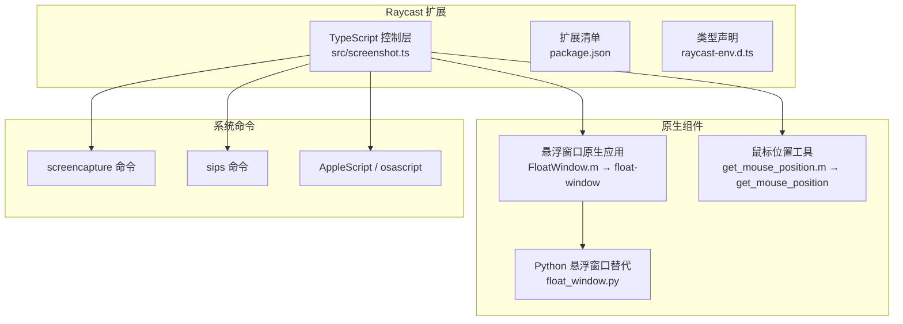
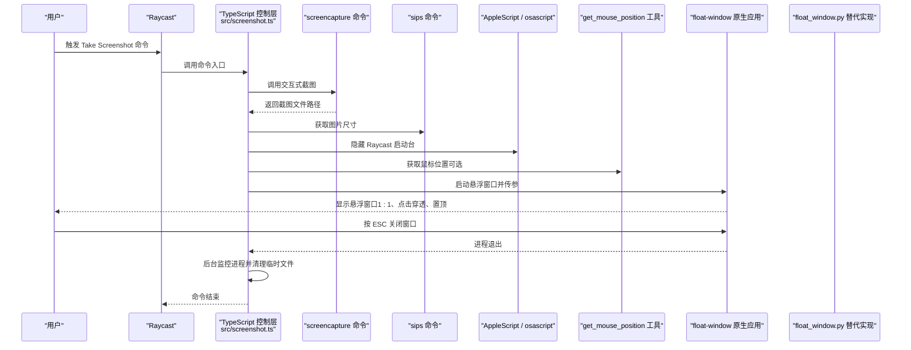
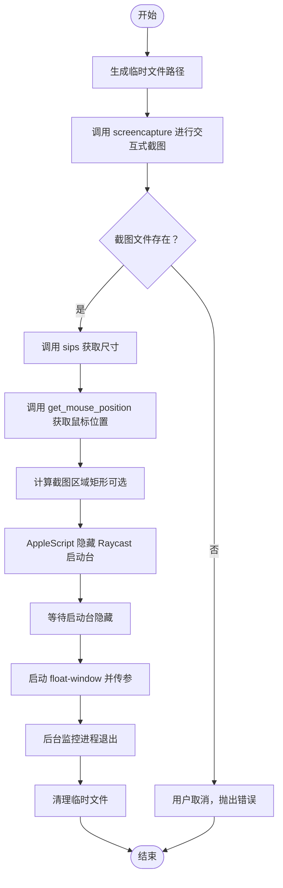
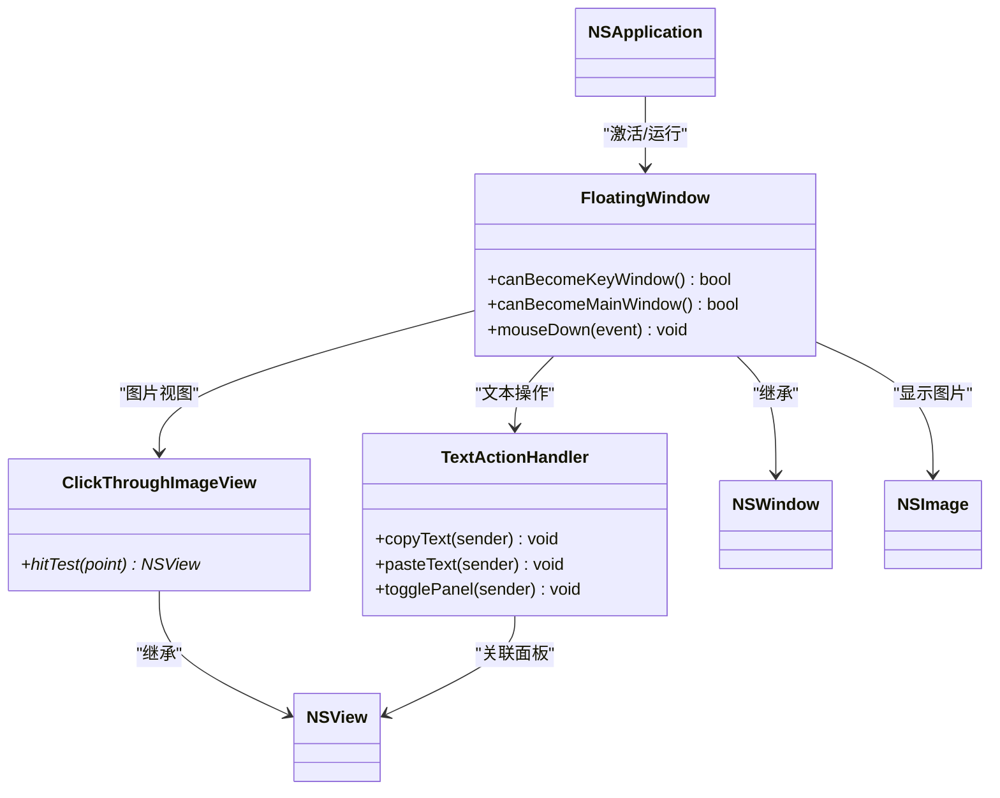
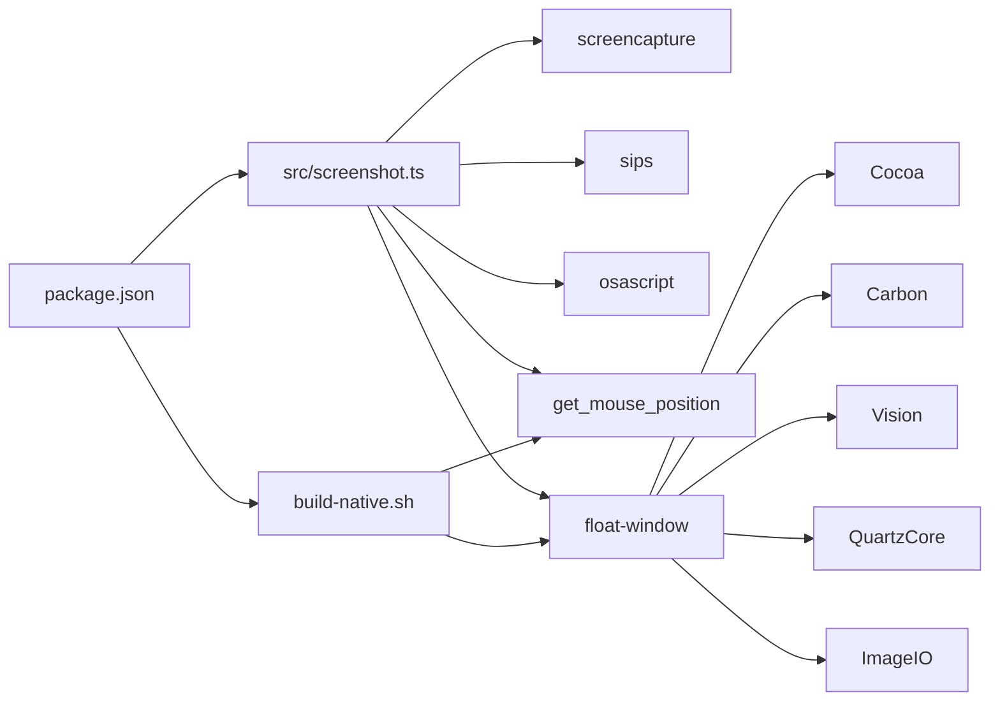

# 架构设计

<cite>
**本文引用的文件**
- [src/screenshot.ts](file://src/screenshot.ts)
- [FloatWindow.m](file://FloatWindow.m)
- [README.md](file://README.md)
- [package.json](file://package.json)
- [build-native.sh](file://build-native.sh)
- [float_window.py](file://float_window.py)
- [get_mouse_position.m](file://get_mouse_position.m)
- [test_ocr.m](file://test_ocr.m)
- [test_position.sh](file://test_position.sh)
- [raycast-env.d.ts](file://raycast-env.d.ts)
</cite>

## 目录
1. [简介](#简介)
2. [项目结构](#项目结构)
3. [核心组件](#核心组件)
4. [架构总览](#架构总览)
5. [详细组件分析](#详细组件分析)
6. [依赖关系分析](#依赖关系分析)
7. [性能考量](#性能考量)
8. [故障排查指南](#故障排查指南)
9. [结论](#结论)
10. [附录](#附录)

## 简介
本项目是一个基于 Raycast 的截图悬浮显示插件，采用“轻量级原生 + 脚本”的混合架构：
- TypeScript 层（screenshot.ts）作为控制中枢，负责调用系统命令（如 screencapture、sips）、管理生命周期与错误处理，并通过进程间通信调用原生悬浮窗口应用。
- Objective-C 层（FloatWindow.m）作为表现层，利用 Cocoa 框架实现 macOS 原生窗口的高级特性：点击穿透、始终置顶、Retina 屏幕适配、1:1 图像显示、ESC 关闭等。
- 该方案避免 Electron 或纯 Web 技术带来的体积与性能开销，充分利用系统原生能力，实现低耦合、高集成度与低资源占用。

## 项目结构
项目采用“脚本 + 原生二进制 + Raycast 扩展清单”的组织方式：
- src/screenshot.ts：Raycast 命令入口，负责截图、尺寸探测、鼠标位置辅助、原生窗口进程管理与清理。
- FloatWindow.m：原生悬浮窗口应用，负责窗口创建、布局、事件处理与 OCR 文字面板。
- float_window.py：Python 版本的悬浮窗口实现（可选替代方案，功能与原生一致）。
- get_mouse_position.m：获取当前鼠标位置的轻量原生工具。
- build-native.sh：一键编译原生二进制（float-window、get_mouse_position）。
- package.json：Raycast 扩展清单与构建脚本。
- README.md：功能说明与开发指引。
- 其他测试与验证脚本：test_ocr.m、test_position.sh 等。

图表来源
- [src/screenshot.ts](file://src/screenshot.ts#L1-L120)
- [FloatWindow.m](file://FloatWindow.m#L180-L270)
- [get_mouse_position.m](file://get_mouse_position.m#L1-L10)
- [float_window.py](file://float_window.py#L1-L60)
- [package.json](file://package.json#L1-L34)
- [build-native.sh](file://build-native.sh#L1-L26)

章节来源
- [README.md](file://README.md#L1-L61)
- [package.json](file://package.json#L1-L34)

## 核心组件
- TypeScript 控制层（screenshot.ts）
  - 负责调用 screencapture 进行交互式截图，使用 sips 获取图片尺寸，使用 AppleScript 隐藏 Raycast 启动台，使用 get_mouse_position 辅助定位。
  - 通过进程管理调用 float-window 并传入截图区域参数，同时在后台监控进程退出以清理临时文件。
  - 统一错误处理与用户提示，避免不必要的 UI 干扰。
- 原生悬浮窗口（FloatWindow.m）
  - 使用 Cocoa 创建无边框窗口，设置 NSFloatingWindowLevel、点击穿透、Retina 适配与 1:1 显示。
  - 内置拖动区域（边缘 10px）、ESC 关闭、OCR 文字面板与复制/粘贴动作。
- Python 替代实现（float_window.py）
  - 提供与原生版本一致的功能，便于跨语言验证或替换。
- 鼠标位置工具（get_mouse_position.m）
  - 轻量原生工具，用于在截图区域不可用时提供近似定位。
- 构建脚本（build-native.sh）
  - 统一编译 float-window 与 get_mouse_position，链接 Cocoa、Carbon、Vision、QuartzCore、ImageIO 等框架。

章节来源
- [src/screenshot.ts](file://src/screenshot.ts#L1-L120)
- [FloatWindow.m](file://FloatWindow.m#L180-L270)
- [float_window.py](file://float_window.py#L1-L60)
- [get_mouse_position.m](file://get_mouse_position.m#L1-L10)
- [build-native.sh](file://build-native.sh#L1-L26)

## 架构总览
该系统采用“脚本控制 + 原生表现”的分层架构：
- 控制层（TypeScript）：负责业务流程编排、系统命令调用、进程管理与错误处理。
- 表现层（Objective-C）：负责窗口渲染、事件处理与系统特性集成。
- 工具层（原生小工具）：提供鼠标位置、OCR 等辅助能力。
- Raycast 集成：通过扩展清单注册命令，实现从用户触发到窗口关闭的完整链路。

图表来源
- [src/screenshot.ts](file://src/screenshot.ts#L1-L120)
- [FloatWindow.m](file://FloatWindow.m#L180-L270)
- [get_mouse_position.m](file://get_mouse_position.m#L1-L10)
- [float_window.py](file://float_window.py#L1-L60)

## 详细组件分析

### TypeScript 控制层（screenshot.ts）
职责与流程
- 截图与尺寸探测：调用 screencapture 进行交互式截图；使用 sips 获取像素宽高，结合鼠标位置计算截图区域矩形。
- 生命周期管理：隐藏 Raycast 启动台，短暂等待后启动悬浮窗口；通过 AppleScript 后台监控进程，进程退出即清理临时文件。
- 错误处理：区分用户取消与系统错误，避免无意义的错误提示；异常时删除临时文件，保证系统整洁。
- 进程管理：动态查找/编译原生二进制，支持多路径定位与 PATH 查询；以 detached 模式启动，避免阻塞主流程。

图表来源
- [src/screenshot.ts](file://src/screenshot.ts#L1-L120)
- [src/screenshot.ts](file://src/screenshot.ts#L238-L391)

章节来源
- [src/screenshot.ts](file://src/screenshot.ts#L1-L120)
- [src/screenshot.ts](file://src/screenshot.ts#L238-L391)

### 原生悬浮窗口（FloatWindow.m）
职责与特性
- 窗口创建：无边框、透明背景、阴影、始终置顶（NSFloatingWindowLevel）。
- 点击穿透：图片区域忽略鼠标事件，不影响底层应用交互。
- Retina 适配：按屏幕缩放因子换算像素尺寸，实现 1:1 视觉显示。
- 交互能力：边缘 10px 区域可拖动窗口；ESC 键关闭窗口。
- OCR 文字面板：识别图片文字并提供复制/粘贴按钮；无文字时显示提示。
- 文本处理：支持复制到剪贴板与模拟粘贴快捷键（Cmd+V）。

图表来源
- [FloatWindow.m](file://FloatWindow.m#L154-L167)
- [FloatWindow.m](file://FloatWindow.m#L169-L178)
- [FloatWindow.m](file://FloatWindow.m#L1-L83)
- [FloatWindow.m](file://FloatWindow.m#L180-L270)

章节来源
- [FloatWindow.m](file://FloatWindow.m#L1-L120)
- [FloatWindow.m](file://FloatWindow.m#L120-L220)
- [FloatWindow.m](file://FloatWindow.m#L220-L340)
- [FloatWindow.m](file://FloatWindow.m#L340-L466)

### Python 悬浮窗口替代（float_window.py）
- 功能与原生版本一致：无边框、点击穿透、置顶、1:1 显示、ESC 关闭。
- 适合在不同运行环境下验证或替换原生实现。

章节来源
- [float_window.py](file://float_window.py#L1-L100)

### 鼠标位置工具（get_mouse_position.m）
- 作用：在截图区域不可用时，提供近似定位，辅助悬浮窗口居中或定位。
- 实现：调用 Cocoa 获取当前鼠标坐标并输出。

章节来源
- [get_mouse_position.m](file://get_mouse_position.m#L1-L10)

### 构建脚本（build-native.sh）
- 作用：统一编译 float-window 与 get_mouse_position，链接 Cocoa、Carbon、Vision、QuartzCore、ImageIO 等框架。
- 输出：生成可执行文件并赋予执行权限。

章节来源
- [build-native.sh](file://build-native.sh#L1-L26)

### Raycast 集成与命令触发
- 扩展清单（package.json）注册命令“Take Screenshot”，模式为 no-view，表示无需 UI 页面。
- 开发与构建：prebuild 脚本在构建前检查并编译原生二进制；build 脚本编译 TypeScript 并复制原生二进制到 dist；postbuild 将 dist 复制到 Raycast 扩展目录。
- 类型声明：raycast-env.d.ts 自动生成扩展类型，确保命令参数与偏好设置类型安全。

章节来源
- [package.json](file://package.json#L1-L34)
- [raycast-env.d.ts](file://raycast-env.d.ts#L1-L26)

## 依赖关系分析
- 控制层依赖系统命令与原生工具：screencapture、sips、osascript、get_mouse_position。
- 原生悬浮窗口依赖 Cocoa、Carbon、Vision、QuartzCore、ImageIO 等框架。
- 构建脚本负责将源码编译为可执行文件，供控制层调用。
- Raycast 扩展清单定义命令与脚本生命周期。

图表来源
- [src/screenshot.ts](file://src/screenshot.ts#L1-L120)
- [FloatWindow.m](file://FloatWindow.m#L1-L20)
- [build-native.sh](file://build-native.sh#L1-L26)
- [package.json](file://package.json#L1-L34)

章节来源
- [src/screenshot.ts](file://src/screenshot.ts#L1-L120)
- [FloatWindow.m](file://FloatWindow.m#L1-L20)
- [build-native.sh](file://build-native.sh#L1-L26)
- [package.json](file://package.json#L1-L34)

## 性能考量
- 为什么选择轻量级原生+脚本而非 Electron 或纯 Web？
  - 性能优势：原生窗口直接使用 Cocoa 渲染，避免 Electron 的额外进程与内存开销；脚本层仅做编排与进程管理，CPU/内存占用极低。
  - 系统集成深度：直接调用 screencapture、sips、osascript 等系统工具，与 macOS 深度集成；原生窗口具备点击穿透、置顶、Retina 适配等系统特性。
  - 资源占用：原生二进制体积小，启动快；Raycast 扩展本身轻量，整体资源占用远低于 Electron 方案。
- 优化建议
  - 截图区域计算尽量使用系统返回值，减少额外调用。
  - 原生窗口启动采用 detached 模式，避免阻塞主流程。
  - 后台监控采用定时轮询与事件监听结合，降低 CPU 占用。

[本节为通用性能讨论，不直接分析具体文件]

## 故障排查指南
常见问题与解决思路
- 找不到 float-window 或 get_mouse_position
  - 确认已执行构建脚本生成二进制；检查项目根目录、dist 目录与 PATH 是否包含可执行文件。
  - 参考：构建脚本与控制层的路径查找逻辑。
- 截图取消导致错误提示
  - 控制层已区分用户取消与系统错误；取消时不弹出错误提示，直接结束。
- 悬浮窗口位置偏移
  - 原生窗口已修正 Y 轴坐标与边界检查；可通过测试脚本验证位置修复效果。
- OCR 未识别到文字
  - 可能由于图片质量或语言设置；可参考 OCR 测试工具验证识别流程。

章节来源
- [src/screenshot.ts](file://src/screenshot.ts#L238-L391)
- [FloatWindow.m](file://FloatWindow.m#L215-L266)
- [test_position.sh](file://test_position.sh#L1-L15)
- [test_ocr.m](file://test_ocr.m#L1-L92)

## 结论
该混合架构以 TypeScript 为控制中枢，结合原生表现层与系统命令，实现了高性能、低资源占用且深度集成 macOS 的截图悬浮显示体验。通过清晰的进程管理与错误处理，系统在易用性与稳定性之间取得良好平衡；同时，Raycast 扩展清单与构建脚本确保了部署与维护的便捷性。

[本节为总结性内容，不直接分析具体文件]

## 附录
- 开发与构建
  - 安装依赖：npm install
  - 编译原生：./build-native.sh
  - 开发模式：npm run dev
  - 构建：npm run build
- 使用方法
  - 在 Raycast 中搜索“Take Screenshot”命令，执行后选择截图区域，ESC 关闭悬浮窗口。

章节来源
- [README.md](file://README.md#L1-L61)
- [package.json](file://package.json#L1-L34)