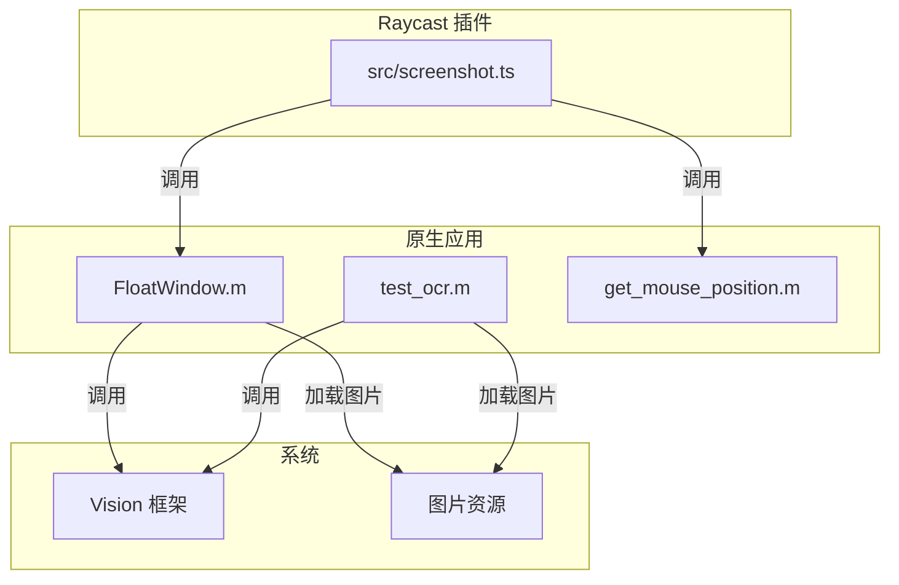
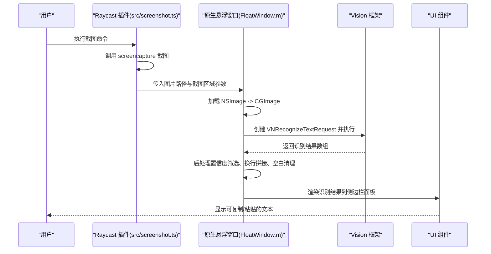
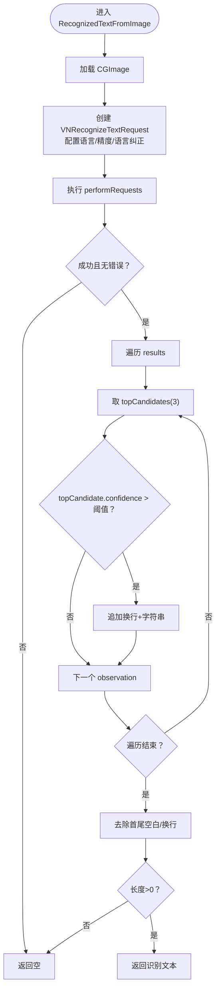
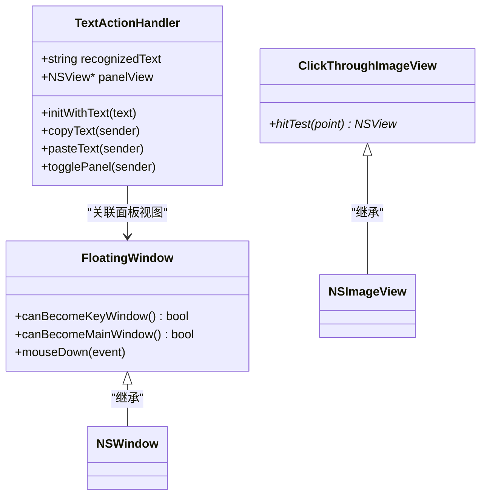
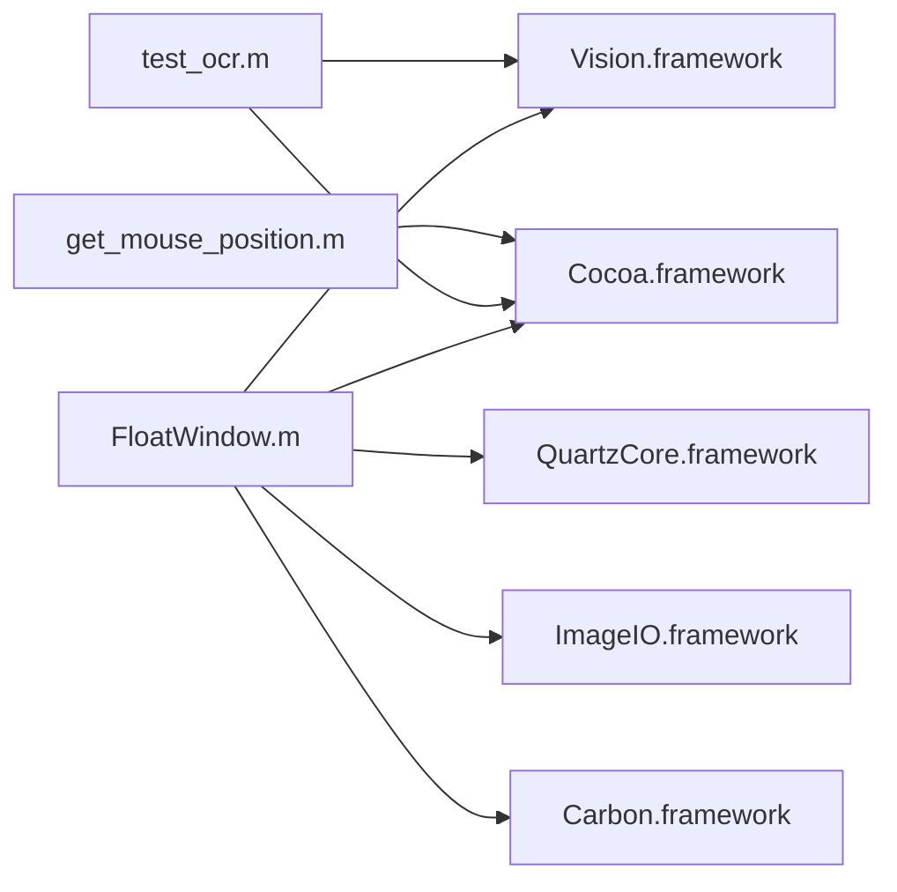

# OCR集成

<cite>
**本文引用的文件**
- [FloatWindow.m](file://FloatWindow.m)
- [test_ocr.m](file://test_ocr.m)
- [README.md](file://README.md)
- [build-native.sh](file://build-native.sh)
- [src/screenshot.ts](file://src/screenshot.ts)
- [get_mouse_position.m](file://get_mouse_position.m)
</cite>

## 目录
1. [简介](#简介)
2. [项目结构](#项目结构)
3. [核心组件](#核心组件)
4. [架构总览](#架构总览)
5. [详细组件分析](#详细组件分析)
6. [依赖关系分析](#依赖关系分析)
7. [性能考量](#性能考量)
8. [故障排查指南](#故障排查指南)
9. [结论](#结论)
10. [附录](#附录)

## 简介
本文件围绕 Vision 框架在 FloatWindow.m 中的 OCR 集成流程展开，系统性讲解从 VNRecognizeTextRequest 初始化到识别结果的后处理与 UI 呈现；结合 test_ocr.m 的测试用例说明验证方法与预期输出；并提供性能优化、常见失败场景与语言扩展建议。

## 项目结构
- 原生悬浮窗口应用入口：FloatWindow.m，负责加载图片、调用 Vision OCR、渲染识别结果到 UI。
- 测试用例：test_ocr.m，独立验证 OCR 识别流程与输出。
- Raycast 插件主逻辑：src/screenshot.ts，负责截图、定位、调用原生悬浮窗口。
- 构建脚本：build-native.sh，编译原生二进制。
- 辅助工具：get_mouse_position.m，用于获取鼠标位置辅助定位。

图表来源
- [src/screenshot.ts](file://src/screenshot.ts#L238-L344)
- [FloatWindow.m](file://FloatWindow.m#L85-L177)
- [test_ocr.m](file://test_ocr.m#L1-L92)
- [get_mouse_position.m](file://get_mouse_position.m#L1-L10)

章节来源
- [README.md](file://README.md#L1-L61)
- [build-native.sh](file://build-native.sh#L1-L26)

## 核心组件
- OCR 识别函数：在 FloatWindow.m 与 test_ocr.m 中均实现了 RecognizedTextFromImage，负责将 NSImage 转换为 CGImage，构造 VNRecognizeTextRequest 并执行识别，最终返回清洗后的字符串。
- UI 呈现：在 FloatWindow.m 中，识别结果通过 NSVisualEffectView + NSScrollView + NSTextView 呈现，并提供复制/粘贴等交互。
- 插件桥接：src/screenshot.ts 负责截图、定位、调用原生悬浮窗口并监控进程生命周期。

章节来源
- [FloatWindow.m](file://FloatWindow.m#L85-L177)
- [test_ocr.m](file://test_ocr.m#L1-L92)
- [src/screenshot.ts](file://src/screenshot.ts#L238-L344)

## 架构总览
下图展示了从 Raycast 触发到 OCR 识别与 UI 呈现的整体流程。

图表来源
- [src/screenshot.ts](file://src/screenshot.ts#L238-L344)
- [FloatWindow.m](file://FloatWindow.m#L85-L177)
- [FloatWindow.m](file://FloatWindow.m#L292-L411)

## 详细组件分析

### OCR 请求初始化与配置
- 请求类型：使用 VNRecognizeTextRequest。
- 精度模式：设置为准确模式，以提升识别质量。
- 语言配置：支持简体中文、繁体中文、英式英语与美式英语。
- 其他参数：启用语言纠正、最小文本高度设为自动检测。
- 异常处理：捕获 performRequests 返回值与 NSError，失败时直接返回空结果。

章节来源
- [FloatWindow.m](file://FloatWindow.m#L108-L122)
- [test_ocr.m](file://test_ocr.m#L27-L41)

### 识别结果异步回调与数据流
- 结果结构：识别结果为 VNRecognizedTextObservation 数组。
- 候选集：对每个 observation 取 topCandidates，取前若干个候选。
- 置信度阈值：仅当最高候选置信度超过阈值时才纳入结果，避免噪声干扰。
- 换行策略：按 observation 顺序追加换行符，形成段落式输出。
- 输出清洗：去除首尾空白与换行，保证 UI 展示整洁。

图表来源
- [FloatWindow.m](file://FloatWindow.m#L108-L177)
- [test_ocr.m](file://test_ocr.m#L40-L72)

章节来源
- [FloatWindow.m](file://FloatWindow.m#L121-L177)
- [test_ocr.m](file://test_ocr.m#L40-L72)

### UI 呈现与交互
- 文字面板：右侧侧边栏，支持透明背景与圆角，标题随识别结果动态变化。
- 文本显示：使用可滚动文本视图保留换行格式，字体与尺寸适配。
- 交互按钮：复制文字与粘贴文字，粘贴时模拟 Command+V 键盘事件。
- 窗口行为：点击穿透图片区域、边缘拖动、ESC 关闭、始终置顶。

章节来源
- [FloatWindow.m](file://FloatWindow.m#L323-L411)
- [FloatWindow.m](file://FloatWindow.m#L1-L83)

### 测试用例与验证方法
- test_ocr.m 独立验证：加载图片、执行 OCR、打印识别结果或“未识别到文字”。
- 验证要点：确认语言列表、置信度阈值、换行与空白清理逻辑是否生效。
- 输出格式：纯文本，保留段落换行，去除多余空白。

章节来源
- [test_ocr.m](file://test_ocr.m#L74-L92)

### 代码级类图（面向对象视角）

图表来源
- [FloatWindow.m](file://FloatWindow.m#L1-L83)

章节来源
- [FloatWindow.m](file://FloatWindow.m#L1-L83)

## 依赖关系分析
- 外部框架：Cocoa、Carbon、QuartzCore、Vision、ImageIO。
- 运行时依赖：macOS 系统的 Vision 框架与图像处理能力。
- 构建依赖：clang 链接各框架生成 float-window 与 get_mouse_position。

图表来源
- [build-native.sh](file://build-native.sh#L1-L26)
- [FloatWindow.m](file://FloatWindow.m#L1-L10)
- [test_ocr.m](file://test_ocr.m#L1-L4)
- [get_mouse_position.m](file://get_mouse_position.m#L1-L10)

章节来源
- [build-native.sh](file://build-native.sh#L1-L26)

## 性能考量
- 识别区域大小：优先缩小输入图像尺寸，减少计算量；在 UI 上可先按像素尺寸缩放再进行 OCR。
- 识别频率：避免高频重复触发；在 Raycast 插件中可通过节流或延迟策略控制。
- 语言与模型：准确模式更耗时，若对速度敏感可在特定场景切换为快速模式（需评估准确率）。
- 置信度阈值：适当提高阈值可降低误报，但可能漏检；需结合业务场景权衡。
- 图像预处理：在调用 Vision 前进行对比度增强、去噪或二值化（需自行实现）可显著提升效果。

## 故障排查指南
- 无法加载图片：检查输入路径与权限；确认图片格式可被 CGImageSource 解析。
- 识别为空：检查语言列表是否覆盖目标文本；调整置信度阈值；确认最小文本高度设置为自动检测。
- 识别错误：关注 NSError 的描述信息；确认 Vision 框架可用与系统版本兼容。
- UI 不显示：确认窗口层级、透明度与点击穿透设置；检查面板尺寸与屏幕边界约束。
- 进程生命周期：Raycast 插件会在原生进程退出后清理临时文件，若未清理需检查监控脚本执行情况。

章节来源
- [test_ocr.m](file://test_ocr.m#L40-L48)
- [src/screenshot.ts](file://src/screenshot.ts#L345-L390)

## 结论
本项目通过 Vision 框架在原生悬浮窗口中实现了稳定的 OCR 能力，结合 Raycast 插件完成从截图到识别再到 UI 呈现的闭环。通过合理的语言配置、置信度阈值与后处理策略，能够在多数场景下获得高质量的识别结果。后续可进一步优化性能、扩展语言与词典、完善图像预处理与错误恢复机制。

## 附录

### 语言与字符组扩展建议
- 语言扩展：在请求中增加更多语言代码，以覆盖多语种场景。
- 字典/词汇表：可结合 usesLanguageCorrection 与自定义词典（需在更高层的文本处理阶段引入）提升特定领域识别准确率。
- 字符组过滤：当前未实现字符集白名单/黑名单过滤，可在后处理阶段加入字符清洗逻辑。

章节来源
- [FloatWindow.m](file://FloatWindow.m#L112-L122)
- [test_ocr.m](file://test_ocr.m#L31-L37)

### 常见识别失败场景与应对
- 低对比度：提高亮度/对比度或采用二值化预处理。
- 模糊图像：尝试锐化或放大裁剪；必要时引导用户重新拍摄。
- 字体过小：增大最小文本高度阈值或手动指定识别区域。
- 多语言混合：确保语言列表覆盖所有语言；必要时分区域识别并合并结果。

章节来源
- [FloatWindow.m](file://FloatWindow.m#L116-L122)
- [test_ocr.m](file://test_ocr.m#L35-L41)