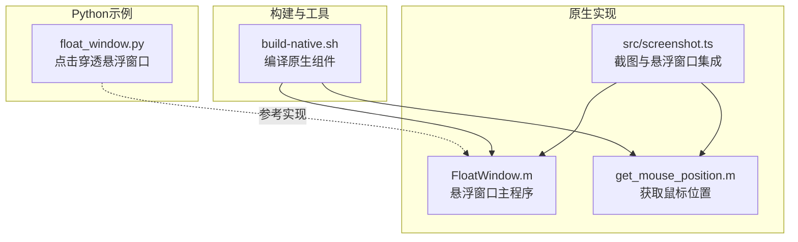
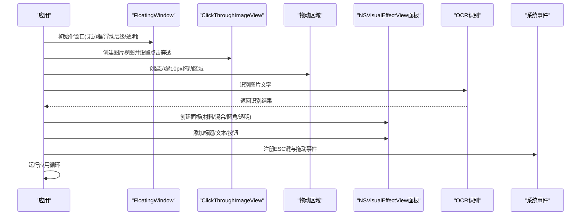
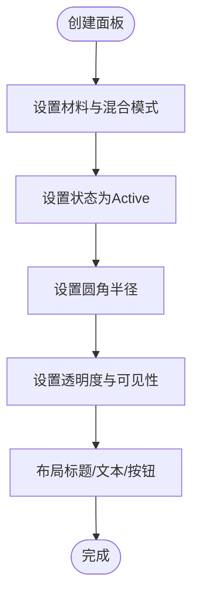
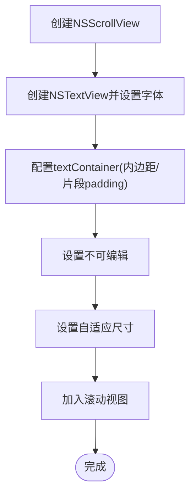
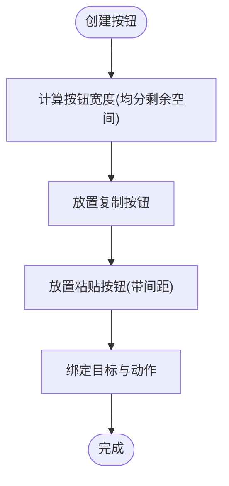
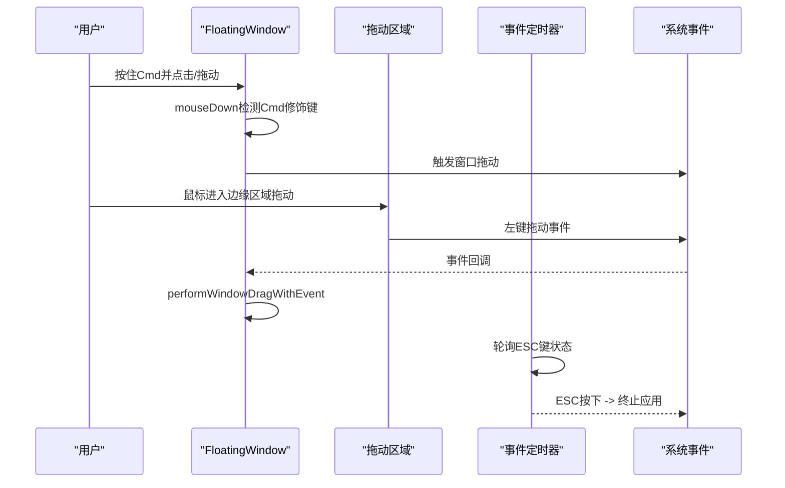
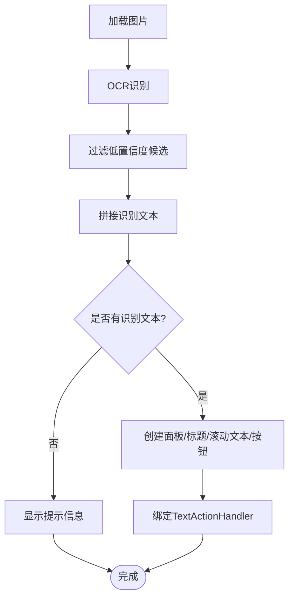
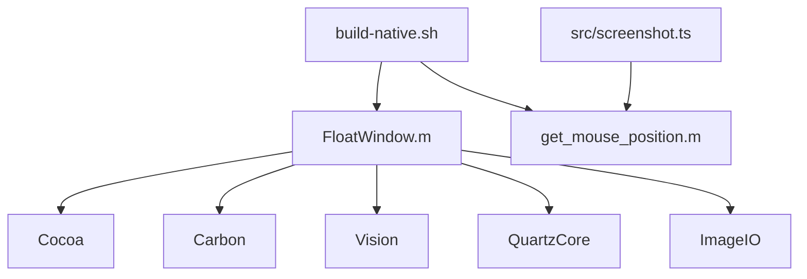

# UI组件

<cite>
**本文引用的文件**
- [FloatWindow.m](file://FloatWindow.m)
- [float_window.py](file://float_window.py)
- [README.md](file://README.md)
- [build-native.sh](file://build-native.sh)
- [get_mouse_position.m](file://get_mouse_position.m)
- [src/screenshot.ts](file://src/screenshot.ts)
</cite>

## 目录
1. [简介](#简介)
2. [项目结构](#项目结构)
3. [核心组件](#核心组件)
4. [架构总览](#架构总览)
5. [详细组件分析](#详细组件分析)
6. [依赖关系分析](#依赖关系分析)
7. [性能考量](#性能考量)
8. [故障排查指南](#故障排查指南)
9. [结论](#结论)
10. [附录](#附录)

## 简介
本文件系统性介绍悬浮窗口的UI组件构成与交互设计，重点覆盖：
- NSVisualEffectView的应用，实现磨砂玻璃效果背景以提升视觉融合度
- 文本显示区域（NSTextView）与操作按钮（NSButton）的布局策略，包括自动换行、字体适配和按钮间距控制
- Cmd拖动功能通过mouseDown和mouseDragged事件监听实现窗口移动，同时确保不影响点击穿透行为
- 对比Objective-C与Python版本（float_window.py）在UI实现上的异同，分析为何最终选择原生实现
- UI自定义扩展指南，如修改主题颜色、调整透明度或添加新控件
- 可访问性考虑，如支持键盘导航和屏幕阅读器兼容性

## 项目结构
该仓库围绕“悬浮窗口”这一核心功能展开，主要由以下部分组成：
- 原生Objective-C实现：负责悬浮窗口创建、图片渲染、OCR识别、窗口拖动、点击穿透、UI布局与动画等
- Python实现：提供一个轻量级的悬浮窗口示例，演示点击穿透与ESC关闭等基础能力
- 构建脚本：编译原生二进制与辅助工具
- 辅助工具：获取鼠标位置的原生工具，供TS脚本调用
- 文档与说明：README概述功能与技术实现要点

图表来源
- [FloatWindow.m](file://FloatWindow.m#L179-L212)
- [float_window.py](file://float_window.py#L1-L19)
- [build-native.sh](file://build-native.sh#L1-L26)
- [get_mouse_position.m](file://get_mouse_position.m#L1-L10)
- [src/screenshot.ts](file://src/screenshot.ts#L193-L236)

章节来源
- [README.md](file://README.md#L1-L61)
- [build-native.sh](file://build-native.sh#L1-L26)

## 核心组件
- 悬浮窗口类（FloatingWindow）：继承自NSWindow，禁用成为主/次键窗口的能力，提供按住Cmd拖动窗口的行为
- 点击穿透视图（ClickThroughImageView）：继承自NSImageView，重写hitTest返回nil，实现图片区域点击穿透
- 文本动作处理器（TextActionHandler）：封装复制/粘贴/显示面板等逻辑，与面板视图关联
- OCR识别函数（RecognizedTextFromImage）：基于Vision框架对图片进行文字识别，过滤低置信度结果
- 主程序入口：创建窗口、设置属性、布局UI、注册事件与运行应用循环

章节来源
- [FloatWindow.m](file://FloatWindow.m#L154-L177)
- [FloatWindow.m](file://FloatWindow.m#L169-L177)
- [FloatWindow.m](file://FloatWindow.m#L8-83)
- [FloatWindow.m](file://FloatWindow.m#L85-L152)
- [FloatWindow.m](file://FloatWindow.m#L179-L212)

## 架构总览
悬浮窗口的运行时架构如下：
- 应用启动后，解析命令行参数，加载图片并计算显示尺寸（考虑屏幕缩放因子）
- 创建无边框悬浮窗口，设置层级、透明度、阴影与集合行为
- 构建容器视图，添加图片视图（点击穿透）、拖动区域（边缘10px）、文字识别面板
- 文字面板采用NSVisualEffectView实现磨砂玻璃背景，内部嵌入滚动文本视图与两个按钮
- 注册ESC键检测与拖动事件监听，实现窗口移动与退出
- 启动应用循环，处理事件与渲染

图表来源
- [FloatWindow.m](file://FloatWindow.m#L274-L302)
- [FloatWindow.m](file://FloatWindow.m#L325-L353)
- [FloatWindow.m](file://FloatWindow.m#L351-L373)
- [FloatWindow.m](file://FloatWindow.m#L372-L398)
- [FloatWindow.m](file://FloatWindow.m#L422-L464)

## 详细组件分析

### NSVisualEffectView：磨砂玻璃背景与视觉融合
- 材料与混合：使用Sidebar材料与WithinWindow混合模式，配合状态Active，营造半透明、模糊的背景质感
- 圆角与层级：设置圆角半径与WantsLayer，保证背景与内容的视觉统一
- 透明度与可见性：默认显示且alpha为1；通过动画切换隐藏/显示，实现平滑过渡
- 面板尺寸与定位：根据屏幕与图片尺寸动态计算面板宽高与位置，避免越界

图表来源
- [FloatWindow.m](file://FloatWindow.m#L325-L353)
- [FloatWindow.m](file://FloatWindow.m#L351-L373)

章节来源
- [FloatWindow.m](file://FloatWindow.m#L325-L353)
- [FloatWindow.m](file://FloatWindow.m#L351-L373)

### 文本显示区域：NSTextView与滚动布局
- 滚动视图：使用NSScrollView承载NSTextView，启用垂直滚动条
- 字体与换行：设置字体大小，保留换行格式；通过textContainer的lineFragmentPadding与inset为0，确保文本紧贴容器边缘
- 自动调整：文本视图与滚动视图均设置可随容器尺寸变化而自适应
- 内容与不可编辑：识别到文字时填充内容，设置为不可编辑；未识别到文字时显示提示信息

图表来源
- [FloatWindow.m](file://FloatWindow.m#L372-L398)

章节来源
- [FloatWindow.m](file://FloatWindow.m#L372-L398)

### 操作按钮：NSButton布局与间距控制
- 布局策略：面板底部放置两个圆角按钮，宽度均分并留出间距；按钮高度固定，便于在不同面板尺寸下保持一致的视觉比例
- 事件绑定：复制按钮与粘贴按钮分别绑定到TextActionHandler的对应方法
- 字体与外观：按钮采用圆角样式，标题文字清晰可读

图表来源
- [FloatWindow.m](file://FloatWindow.m#L386-L398)

章节来源
- [FloatWindow.m](file://FloatWindow.m#L386-L398)

### Cmd拖动与点击穿透：事件监听与交互策略
- 点击穿透：图片视图重写hitTest返回nil，确保图片区域点击透传给底层应用
- 拖动区域：在窗口边缘创建10px高的区域，用于拖动窗口；边缘区域允许响应鼠标事件
- 事件监听：
  - 按住Cmd触发拖动：重写mouseDown，若包含Cmd修饰键则执行窗口拖动
  - 全局拖动：使用本地事件监视器监听左键拖动事件，若鼠标位于边缘区域则执行窗口拖动
  - ESC键退出：定时器轮询检测ESC键状态，按下则终止应用
- 窗口移动：通过定时器检测左键状态与鼠标位置，计算偏移并更新窗口原点

图表来源
- [FloatWindow.m](file://FloatWindow.m#L154-L177)
- [FloatWindow.m](file://FloatWindow.m#L169-L177)
- [FloatWindow.m](file://FloatWindow.m#L300-L326)
- [FloatWindow.m](file://FloatWindow.m#L422-L464)

章节来源
- [FloatWindow.m](file://FloatWindow.m#L154-L177)
- [FloatWindow.m](file://FloatWindow.m#L169-L177)
- [FloatWindow.m](file://FloatWindow.m#L300-L326)
- [FloatWindow.m](file://FloatWindow.m#L422-L464)

### OCR识别与面板展示：TextActionHandler与RecognizedTextFromImage
- 文字识别：使用Vision框架，设置识别级别与语言列表，过滤低置信度候选，拼接识别结果
- 面板控制：TextActionHandler维护面板视图引用，提供显示/隐藏动画；支持复制与模拟粘贴（含Cmd修饰键）
- 面板内容：根据识别结果决定显示滚动文本或提示信息；标题根据是否有识别结果动态变化

图表来源
- [FloatWindow.m](file://FloatWindow.m#L85-L152)
- [FloatWindow.m](file://FloatWindow.m#L8-83)
- [FloatWindow.m](file://FloatWindow.m#L351-L373)
- [FloatWindow.m](file://FloatWindow.m#L372-L398)

章节来源
- [FloatWindow.m](file://FloatWindow.m#L85-L152)
- [FloatWindow.m](file://FloatWindow.m#L8-83)
- [FloatWindow.m](file://FloatWindow.m#L351-L373)
- [FloatWindow.m](file://FloatWindow.m#L372-L398)

### Objective-C与Python版本对比：UI实现异同与选型理由
- 相同点
  - 均使用无边框窗口与浮动层级，实现悬浮效果
  - 均支持ESC键关闭窗口
  - 均提供点击穿透能力（Python通过忽略鼠标事件，Objective-C通过自定义视图hitTest）

- 不同点
  - 窗口拖动：Python版本未实现拖动；Objective-C版本通过重写mouseDown与事件监视器实现拖动
  - OCR与面板：Python版本未包含OCR与面板；Objective-C版本集成Vision识别与NSVisualEffectView面板
  - 交互细节：Objective-C版本更丰富，包含动画、边缘拖动区域、按钮与文本布局等
  - 性能与稳定性：原生实现直接调用系统框架，事件处理与渲染更高效稳定

- 选型理由
  - 功能完整性：需要OCR、面板、动画、边缘拖动等复杂交互，原生实现更易实现与维护
  - 事件与窗口模型：原生对窗口拖动、修饰键事件、定时器轮询等支持更直接
  - 可访问性与可定制性：原生UI组件更易扩展与适配系统主题与可访问性需求

章节来源
- [float_window.py](file://float_window.py#L1-L19)
- [float_window.py](file://float_window.py#L21-L63)
- [float_window.py](file://float_window.py#L64-L100)
- [FloatWindow.m](file://FloatWindow.m#L154-L177)
- [FloatWindow.m](file://FloatWindow.m#L300-L326)
- [FloatWindow.m](file://FloatWindow.m#L325-L353)
- [FloatWindow.m](file://FloatWindow.m#L351-L373)
- [FloatWindow.m](file://FloatWindow.m#L372-L398)
- [FloatWindow.m](file://FloatWindow.m#L422-L464)

### UI自定义扩展指南
- 修改主题颜色
  - NSVisualEffectView的材料与混合模式决定了背景色与透明度；可通过调整材料类型与状态实现不同风格
  - 若需自定义背景色，可在面板上添加子视图或调整layer的背景色（注意与系统主题的协调）
- 调整透明度
  - 面板初始alpha为1；可通过动画或直接设置alphaValue实现淡入淡出
  - 窗口整体透明度由背景设置与层级共同影响，需平衡视觉与可读性
- 添加新控件
  - 在面板上新增控件时，建议使用约束或固定布局，确保在不同屏幕尺寸下的稳定性
  - 控件事件绑定应与现有TextActionHandler解耦，避免破坏现有交互
- 字体与排版
  - 文本视图字体大小与行距可根据内容长度与屏幕密度动态调整
  - 标题与正文采用不同字号与粗细，增强可读性与层次感

章节来源
- [FloatWindow.m](file://FloatWindow.m#L325-L353)
- [FloatWindow.m](file://FloatWindow.m#L351-L373)
- [FloatWindow.m](file://FloatWindow.m#L372-L398)

### 可访问性考虑
- 键盘导航
  - 当前实现主要依赖鼠标事件；为支持键盘导航，可在面板上启用键盘可用性，为按钮添加键盘快捷键
- 屏幕阅读器兼容性
  - 为文本视图与按钮设置合适的辅助角色与标签，确保屏幕阅读器能正确朗读内容
- 焦点管理
  - 在显示面板时，将焦点转移到可交互控件（如按钮），便于键盘用户操作

章节来源
- [FloatWindow.m](file://FloatWindow.m#L351-L373)
- [FloatWindow.m](file://FloatWindow.m#L372-L398)

## 依赖关系分析
- 外部框架
  - Cocoa：窗口、视图、事件、剪贴板等
  - Carbon：事件源与键盘事件
  - Vision：OCR文字识别
  - QuartzCore：图层与圆角
  - ImageIO：图像处理
- 构建与运行
  - build-native.sh负责编译原生二进制与辅助工具
  - get_mouse_position.m用于获取鼠标位置，供TS脚本调用
  - src/screenshot.ts在运行时检查并编译辅助工具

图表来源
- [FloatWindow.m](file://FloatWindow.m#L1-L10)
- [build-native.sh](file://build-native.sh#L1-L26)
- [get_mouse_position.m](file://get_mouse_position.m#L1-L10)
- [src/screenshot.ts](file://src/screenshot.ts#L193-L236)

章节来源
- [FloatWindow.m](file://FloatWindow.m#L1-L10)
- [build-native.sh](file://build-native.sh#L1-L26)
- [src/screenshot.ts](file://src/screenshot.ts#L193-L236)

## 性能考量
- 事件轮询频率：定时器以较短周期轮询ESC键与鼠标状态，建议根据实际需求调整频率，避免过度占用CPU
- 图像缩放与1:1显示：通过像素尺寸与缩放因子换算，确保视觉上1:1显示，减少不必要的缩放开销
- 动画与透明度：NSVisualEffectView与透明度动画在低端设备上可能带来额外开销，建议在性能敏感场景降低动画时长或关闭动画
- 文本渲染：滚动文本视图在长文本时可能增加绘制成本，建议合理设置最大高度与自动换行

## 故障排查指南
- 窗口无法拖动
  - 检查是否按住Cmd修饰键触发拖动
  - 确认边缘拖动区域是否被遮挡或未响应鼠标事件
- 点击穿透失效
  - 确认图片视图的hitTest是否返回nil
  - 检查容器视图与子视图的层级关系
- ESC键无效
  - 确认定时器是否正常运行
  - 检查事件源状态与修饰键标志
- OCR识别结果为空
  - 检查图片格式与分辨率
  - 调整识别语言与置信度阈值
- 面板越界或遮挡
  - 检查屏幕尺寸与面板尺寸计算逻辑
  - 确认面板位置边界校验是否生效

章节来源
- [FloatWindow.m](file://FloatWindow.m#L154-L177)
- [FloatWindow.m](file://FloatWindow.m#L169-L177)
- [FloatWindow.m](file://FloatWindow.m#L300-L326)
- [FloatWindow.m](file://FloatWindow.m#L422-L464)
- [FloatWindow.m](file://FloatWindow.m#L85-L152)

## 结论
本项目通过原生Objective-C实现了完整的悬浮窗口UI与交互体验：点击穿透、边缘拖动、OCR识别、磨砂玻璃面板、按钮与文本布局、ESC退出等。相比Python示例，原生实现具备更强的功能完整性、事件处理能力与可定制性，适合在macOS平台上提供高质量的悬浮窗口体验。后续可在此基础上进一步优化性能、增强可访问性与扩展更多交互控件。

## 附录
- 构建与运行
  - 使用构建脚本编译原生组件与辅助工具
  - 在Raycast插件中集成截图流程与悬浮窗口调用
- 参考文件路径
  - [FloatWindow.m](file://FloatWindow.m#L179-L212)
  - [float_window.py](file://float_window.py#L1-L19)
  - [build-native.sh](file://build-native.sh#L1-L26)
  - [get_mouse_position.m](file://get_mouse_position.m#L1-L10)
  - [src/screenshot.ts](file://src/screenshot.ts#L193-L236)