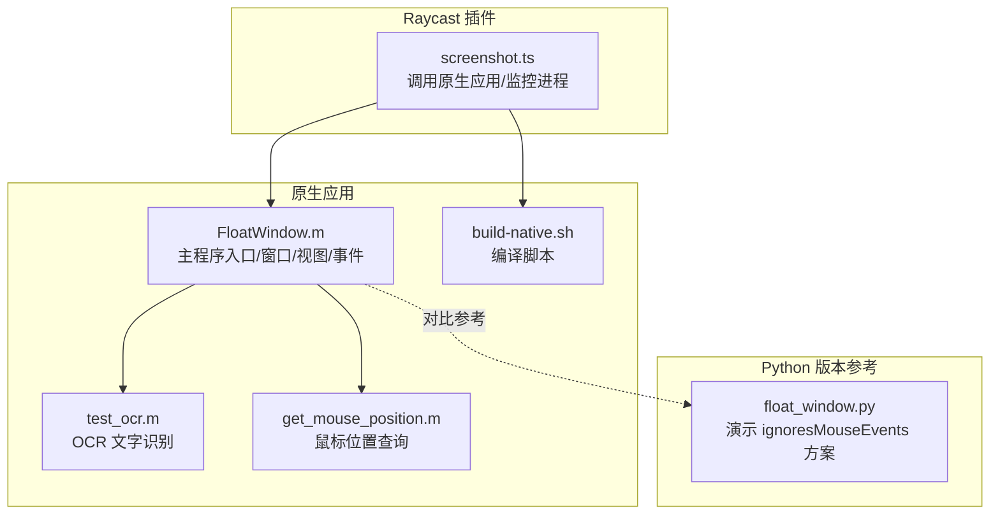
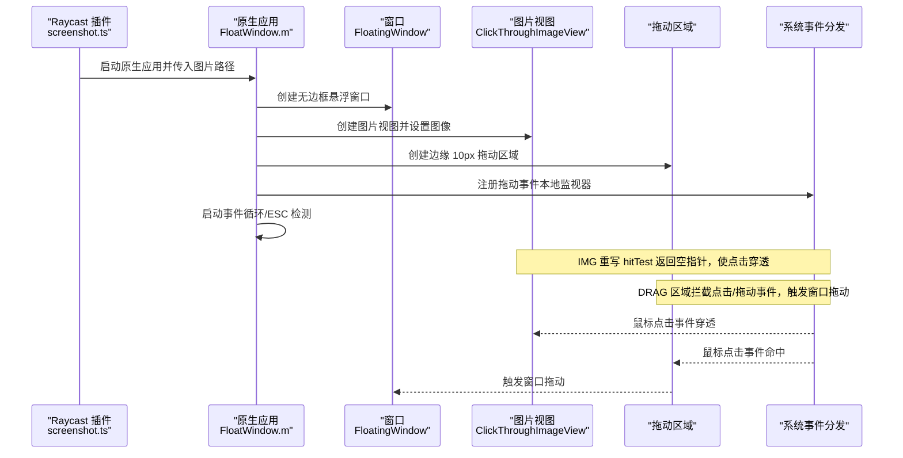
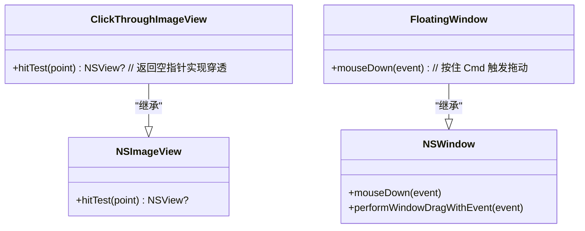
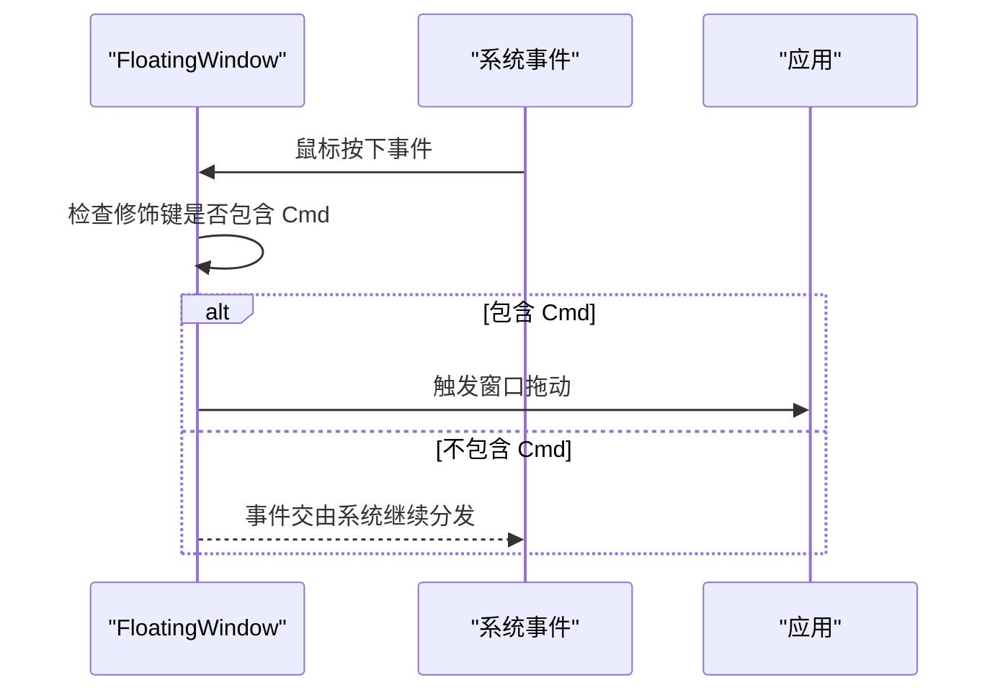
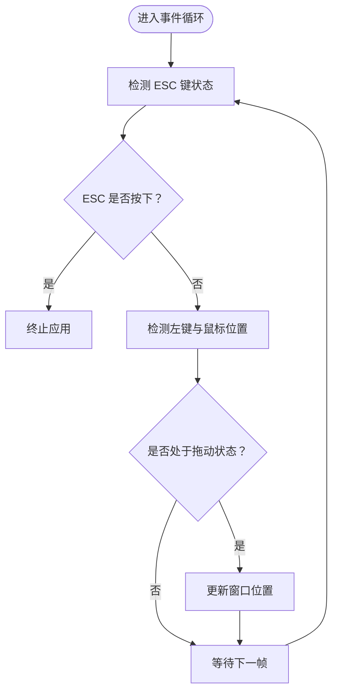
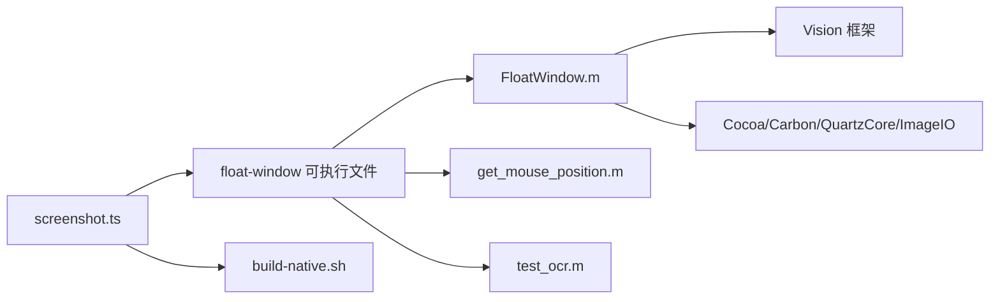

# 点击穿透机制

<cite>
**本文引用的文件**
- [FloatWindow.m](file://FloatWindow.m)
- [README.md](file://README.md)
- [float_window.py](file://float_window.py)
- [screenshot.ts](file://src/screenshot.ts)
- [build-native.sh](file://build-native.sh)
- [get_mouse_position.m](file://get_mouse_position.m)
- [test_ocr.m](file://test_ocr.m)
</cite>

## 目录
1. [引言](#引言)
2. [项目结构](#项目结构)
3. [核心组件](#核心组件)
4. [架构总览](#架构总览)
5. [详细组件分析](#详细组件分析)
6. [依赖关系分析](#依赖关系分析)
7. [性能考量](#性能考量)
8. [故障排查指南](#故障排查指南)
9. [结论](#结论)
10. [附录](#附录)

## 引言
本文件围绕 ClickThroughImageView 类通过重写 hitTest 方法实现“点击穿透”的技术细节展开，解释 NSImageView 子类化的设计动机、事件传递链路、与 Cmd 拖动功能的共存策略、与其他实现方式（如 ignoresMouseEvents）的对比，以及在多显示器环境下的注意事项与调试技巧。目标是帮助读者在不直接阅读代码的前提下，理解该机制如何保障悬浮窗口不干扰底层应用交互，提升用户体验。

## 项目结构
该项目由 Raycast 插件与原生悬浮窗口应用组成，核心逻辑集中在原生应用中，负责创建悬浮窗口、图片渲染、OCR 文字识别、窗口拖动与 ESC 关闭等能力；插件侧负责调用原生应用并进行生命周期管理与资源清理。

图表来源
- [FloatWindow.m](file://FloatWindow.m#L179-L464)
- [screenshot.ts](file://src/screenshot.ts#L273-L390)
- [test_ocr.m](file://test_ocr.m#L1-L92)
- [get_mouse_position.m](file://get_mouse_position.m#L1-L10)
- [build-native.sh](file://build-native.sh#L1-L26)
- [float_window.py](file://float_window.py#L1-L100)

章节来源
- [FloatWindow.m](file://FloatWindow.m#L179-L464)
- [README.md](file://README.md#L1-L61)
- [screenshot.ts](file://src/screenshot.ts#L273-L390)
- [float_window.py](file://float_window.py#L1-L100)
- [build-native.sh](file://build-native.sh#L1-L26)

## 核心组件
- ClickThroughImageView：继承自 NSImageView，通过重写 hitTest 返回空指针，使点击事件穿透至底层视图或窗口，从而实现“点击穿透”。
- FloatingWindow：继承自 NSWindow，禁用成为主/次键窗口的能力，并在按住 Cmd 时支持窗口拖动。
- 主程序入口：负责加载图片、计算显示尺寸、创建窗口与视图、配置拖动区域、启动事件循环与 ESC 关闭逻辑。
- OCR 文字识别：基于 Vision 框架对图片进行文本识别，生成右侧文字面板。
- Python 对比实现：演示使用 ignoresMouseEvents 实现点击穿透的方式，便于与 Objective-C 方案对比。

章节来源
- [FloatWindow.m](file://FloatWindow.m#L154-L177)
- [FloatWindow.m](file://FloatWindow.m#L179-L464)
- [float_window.py](file://float_window.py#L1-L100)

## 架构总览
下图展示从 Raycast 插件到原生悬浮窗口应用的调用链与事件流，重点标注了点击穿透的关键节点与拖动区域的事件分流。

图表来源
- [FloatWindow.m](file://FloatWindow.m#L179-L326)
- [FloatWindow.m](file://FloatWindow.m#L300-L326)

章节来源
- [FloatWindow.m](file://FloatWindow.m#L179-L326)

## 详细组件分析

### ClickThroughImageView：点击穿透的核心实现
- 设计动机
  - 悬浮窗口需要在不影响底层应用交互的前提下展示图片，因此图片区域必须“穿透”。
  - 通过重写 hitTest 返回空指针，系统判定该视图不参与命中测试，事件自然传递到下一层。
- 事件传递链
  - 当鼠标点击图片区域时，系统调用视图层次的 hitTest，若返回空指针，则系统继续向父视图或窗口传递事件，最终落到底层应用界面。
  - 该行为与 ignoresMouseEvents 的“窗口级穿透”不同：前者是“视图级穿透”，后者是“窗口级穿透”。两者可配合使用以覆盖不同场景。
- 与拖动区域的协作
  - 拖动区域（边缘 10px）不参与点击穿透，仍接收并处理拖动事件，保证用户可通过边缘区域拖动窗口。
- 与 Cmd 拖动的共存
  - 窗口层的 mouseDown 处理仅在按住 Cmd 时触发窗口拖动，与视图层的点击穿透互不冲突。拖动区域与 Cmd 拖动共同提供窗口移动能力，避免事件冲突。

图表来源
- [FloatWindow.m](file://FloatWindow.m#L154-L177)
- [FloatWindow.m](file://FloatWindow.m#L154-L167)

章节来源
- [FloatWindow.m](file://FloatWindow.m#L154-L177)
- [FloatWindow.m](file://FloatWindow.m#L154-L167)

### FloatingWindow：窗口级交互控制
- 禁止成为主/次键窗口，避免影响底层应用的键盘焦点。
- 按住 Cmd 时，捕获鼠标按下事件并触发窗口拖动，与视图层的点击穿透形成互补。
- 与拖动区域配合，提供更直观的窗口移动体验。

图表来源
- [FloatWindow.m](file://FloatWindow.m#L154-L167)

章节来源
- [FloatWindow.m](file://FloatWindow.m#L154-L167)

### 主程序入口：事件循环与 ESC 关闭
- 启动定时器事件循环，周期性检测 ESC 键与左键状态，实现 ESC 关闭与拖动跟随。
- 通过本地监视器处理拖动事件，仅在边缘区域命中时触发窗口拖动，避免误触。

图表来源
- [FloatWindow.m](file://FloatWindow.m#L422-L464)
- [FloatWindow.m](file://FloatWindow.m#L300-L326)

章节来源
- [FloatWindow.m](file://FloatWindow.m#L422-L464)
- [FloatWindow.m](file://FloatWindow.m#L300-L326)

### OCR 文字识别与右侧面板
- 基于 Vision 框架对图片进行文本识别，生成右侧文字面板，支持复制/粘贴等操作。
- 即使未识别到文字，也会显示提示信息，增强可用性。

章节来源
- [FloatWindow.m](file://FloatWindow.m#L85-L152)
- [test_ocr.m](file://test_ocr.m#L1-L92)

### 与 ignoresMouseEvents 的对比
- ClickThroughImageView（视图级穿透）
  - 优点：仅对图片视图生效，不影响窗口其他区域；与拖动区域配合良好；适合精确控制穿透范围。
  - 缺点：需在视图层级中逐层处理，复杂布局时需谨慎。
- ignoresMouseEvents（窗口级穿透）
  - 优点：简单直接，整窗穿透；无需逐视图重写。
  - 缺点：全窗穿透，难以在局部保留交互（如拖动区域）；与窗口边缘交互冲突风险更高。
- 实践建议
  - 推荐采用“视图级穿透 + 边缘拖动区域”的组合方案，既能实现精准穿透，又能保留必要的交互能力。

章节来源
- [float_window.py](file://float_window.py#L46-L62)
- [FloatWindow.m](file://FloatWindow.m#L274-L302)

## 依赖关系分析
- 插件与原生应用
  - 插件通过可执行文件 float-window 启动原生应用，负责进程监控与临时文件清理。
- 原生应用内部
  - 主程序入口依赖 Cocoa/Carbon/Vision/QuartzCore/ImageIO 等框架。
  - OCR 逻辑独立于主程序入口，便于复用与测试。
- 编译与运行
  - build-native.sh 负责编译原生应用与辅助工具。
  - get_mouse_position.m 提供鼠标位置查询能力，可用于调试与定位。

图表来源
- [screenshot.ts](file://src/screenshot.ts#L273-L390)
- [FloatWindow.m](file://FloatWindow.m#L179-L212)
- [build-native.sh](file://build-native.sh#L1-L26)
- [get_mouse_position.m](file://get_mouse_position.m#L1-L10)
- [test_ocr.m](file://test_ocr.m#L1-L92)

章节来源
- [screenshot.ts](file://src/screenshot.ts#L273-L390)
- [FloatWindow.m](file://FloatWindow.m#L179-L212)
- [build-native.sh](file://build-native.sh#L1-L26)

## 性能考量
- 点击穿透的开销极低：仅在 hitTest 返回空指针，系统继续事件分发，几乎不引入额外计算。
- OCR 识别在主线程执行，建议在图片较大或识别频繁时考虑异步化与缓存策略，避免阻塞 UI。
- 拖动检测使用定时器轮询，频率较高时可能增加 CPU 占用；可根据需求调整轮询间隔。

## 故障排查指南
- 如何验证事件传递路径
  - 使用系统日志观察事件流向：在关键路径打印事件类型与目标视图，确认点击是否被图片视图拦截或穿透。
  - 使用 get_mouse_position.m 获取当前鼠标坐标，辅助判断事件是否到达预期区域。
- 多显示器环境注意事项
  - 窗口位置计算需考虑屏幕边界与缩放因子，确保在不同分辨率与缩放比例下正确显示。
  - 若出现 Y 轴偏移，需根据屏幕坐标系差异进行修正（已在主程序中体现）。
- 与 Cmd 拖动共存
  - 确保拖动区域与窗口层的 Cmd 拖动逻辑不互相覆盖；边缘区域优先处理拖动，非边缘区域保持穿透。
- 常见问题
  - ESC 无法关闭：检查事件循环与 ESC 键检测逻辑是否生效。
  - 拖动无效：确认拖动区域是否命中、本地监视器是否注册成功。

章节来源
- [FloatWindow.m](file://FloatWindow.m#L234-L277)
- [FloatWindow.m](file://FloatWindow.m#L300-L326)
- [FloatWindow.m](file://FloatWindow.m#L422-L464)
- [get_mouse_position.m](file://get_mouse_position.m#L1-L10)

## 结论
通过 ClickThroughImageView 重写 hitTest 返回空指针，实现了“视图级点击穿透”，与窗口边缘拖动区域、Cmd 拖动、ESC 关闭等机制协同工作，既保证了悬浮窗口不干扰底层应用交互，又提供了良好的可操作性与用户体验。相较 ignoresMouseEvents 的窗口级穿透，该方案更精细可控，适合需要局部保留交互能力的场景。

## 附录
- 术语说明
  - 点击穿透：视图不参与命中测试，事件直接传递到下一层。
  - 命中测试：系统根据视图层次结构判断事件应由哪个视图处理。
- 参考实现对比
  - Objective-C：通过重写 hitTest 实现穿透，窗口边缘区域保留交互。
  - Python：通过 ignoresMouseEvents 实现整窗穿透，便于快速演示。

章节来源
- [float_window.py](file://float_window.py#L46-L62)
- [FloatWindow.m](file://FloatWindow.m#L274-L302)