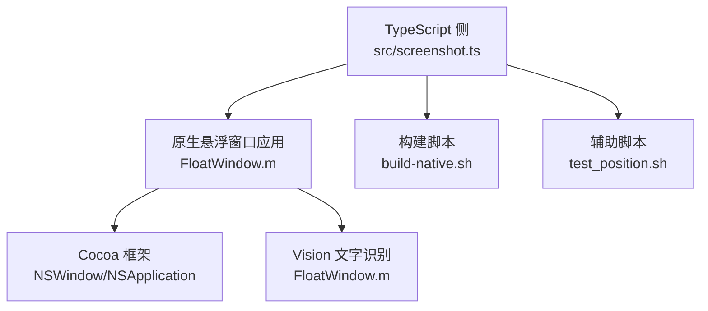
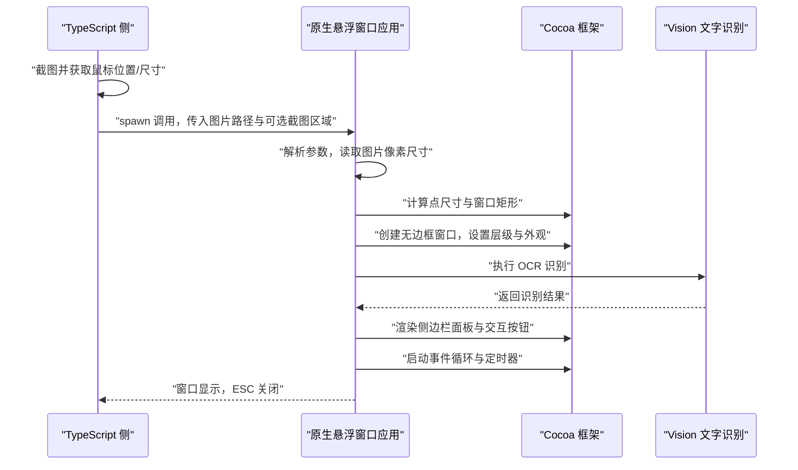
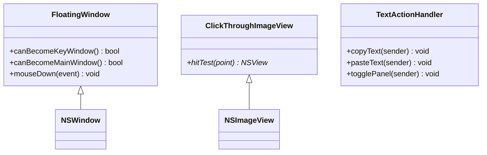
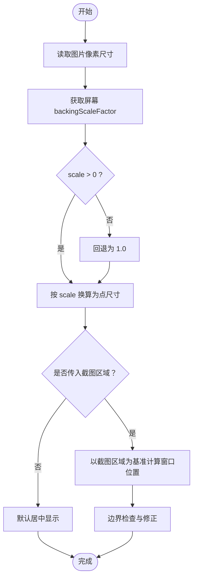
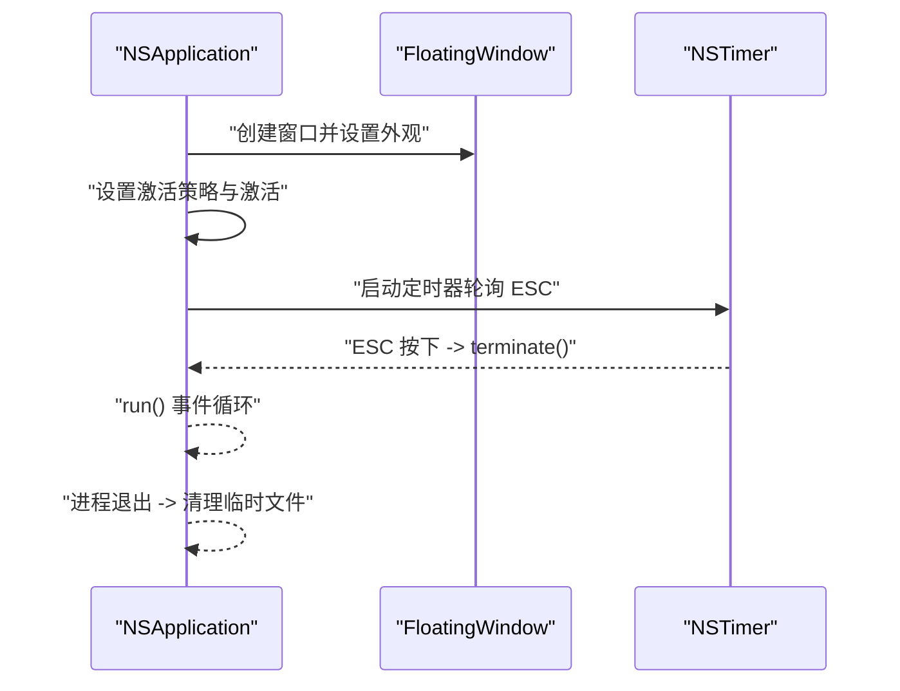
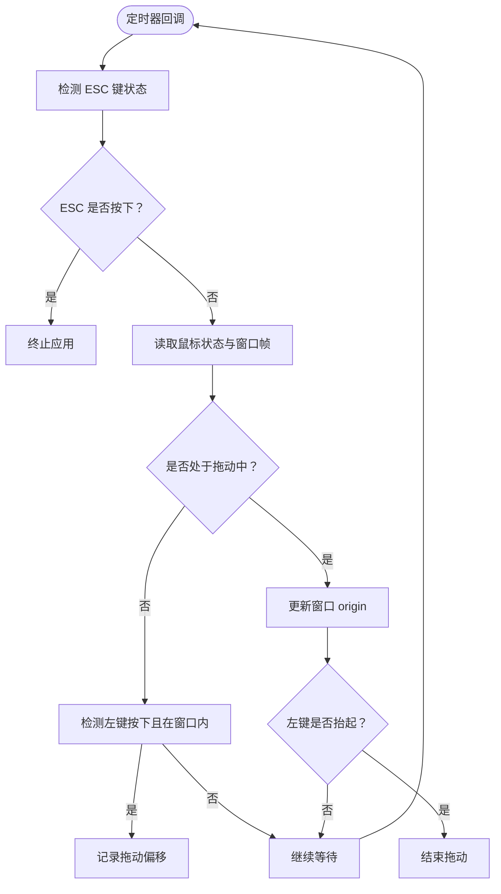
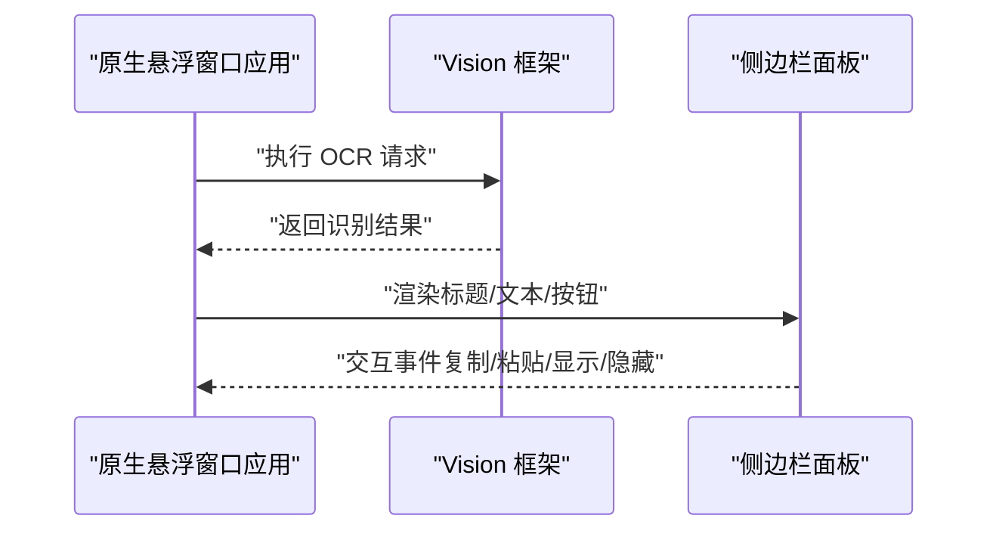
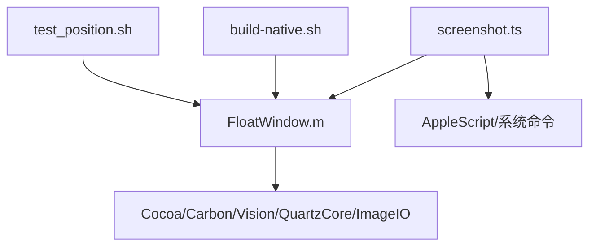

# 窗口管理

<cite>
**本文引用的文件**
- [FloatWindow.m](file://FloatWindow.m)
- [screenshot.ts](file://src/screenshot.ts)
- [README.md](file://README.md)
- [build-native.sh](file://build-native.sh)
- [float_window.py](file://float_window.py)
- [test_position.sh](file://test_position.sh)
</cite>

## 目录
1. [简介](#简介)
2. [项目结构](#项目结构)
3. [核心组件](#核心组件)
4. [架构总览](#架构总览)
5. [详细组件分析](#详细组件分析)
6. [依赖关系分析](#依赖关系分析)
7. [性能考量](#性能考量)
8. [故障排查指南](#故障排查指南)
9. [结论](#结论)
10. [附录](#附录)

## 简介
本文件围绕 FloatWindow.m 中基于 Cocoa 框架的窗口管理实现展开，重点说明以下方面：
- 如何通过 NSWindow 子类化创建无边框、透明背景的悬浮窗口，并将其层级设置为 NSFloatingWindowLevel 以确保始终置顶；
- backingScaleFactor 在 Retina 屏幕下的像素与点坐标转换机制，保证高 DPI 环境下的精确定位；
- 窗口初始化过程中如何接收来自 TypeScript 层的截图区域坐标参数，并据此计算窗口在屏幕上的最终显示位置；
- 窗口生命周期管理，包括启动时的自动居中逻辑与关闭时的资源释放流程；
- 结合代码示例说明 NSTimer 如何轮询检测 ESC 按键事件以实现快捷关闭功能；
- 常见问题解决方案（如窗口无法置顶、定位偏移）与性能优化建议（减少不必要的重绘与事件监听）。

## 项目结构
该插件由 TypeScript 侧触发、Objective-C 原生悬浮窗口应用承载，配合构建脚本与辅助工具组成完整链路：
- TypeScript 侧负责截图、获取鼠标位置、定位信息拼装与原生应用调用；
- 原生应用负责窗口创建、层级与外观设置、事件处理与生命周期控制；
- 构建脚本负责编译原生二进制与辅助工具；
- 辅助脚本用于验证定位修复效果。

图表来源
- [screenshot.ts](file://src/screenshot.ts#L238-L390)
- [FloatWindow.m](file://FloatWindow.m#L179-L277)
- [build-native.sh](file://build-native.sh#L1-L26)
- [test_position.sh](file://test_position.sh#L1-L15)

章节来源
- [README.md](file://README.md#L1-L61)
- [screenshot.ts](file://src/screenshot.ts#L238-L390)
- [FloatWindow.m](file://FloatWindow.m#L179-L277)
- [build-native.sh](file://build-native.sh#L1-L26)
- [test_position.sh](file://test_position.sh#L1-L15)

## 核心组件
- NSWindow 子类化与外观设置
  - 通过子类化 NSWindow 并覆盖关键方法，实现点击穿透与拖动行为；同时设置窗口样式为无边框、透明背景、阴影与集合行为，确保跨空间与常驻性。
- backingScaleFactor 与坐标转换
  - 在初始化阶段，读取图片像素尺寸并通过屏幕 backingScaleFactor 将像素尺寸换算为点尺寸，从而在 Retina 屏幕下实现 1:1 视觉显示与精确定位。
- 截图区域参数与窗口定位
  - 当 TypeScript 侧传入截图区域坐标时，原生应用据此计算窗口左上角位置，并进行边界检查，避免越界。
- 生命周期与事件处理
  - 启动时设置应用策略、激活窗口；通过定时器轮询 ESC 键状态实现快捷关闭；拖动检测通过本地事件监视器与定时器协同实现。
- 文字识别与交互面板
  - 基于 Vision 框架进行 OCR，识别结果以侧边栏面板展示，并提供复制/粘贴等交互能力。

章节来源
- [FloatWindow.m](file://FloatWindow.m#L154-L167)
- [FloatWindow.m](file://FloatWindow.m#L179-L277)
- [FloatWindow.m](file://FloatWindow.m#L276-L319)
- [FloatWindow.m](file://FloatWindow.m#L319-L464)

## 架构总览
从调用链路看，TypeScript 侧负责准备截图与定位信息，随后调用原生悬浮窗口应用；原生应用完成窗口创建、层级与外观设置、事件处理与生命周期控制。

图表来源
- [screenshot.ts](file://src/screenshot.ts#L238-L390)
- [FloatWindow.m](file://FloatWindow.m#L179-L277)
- [FloatWindow.m](file://FloatWindow.m#L276-L319)
- [FloatWindow.m](file://FloatWindow.m#L319-L464)

## 详细组件分析

### 组件一：NSWindow 子类化与外观设置
- 子类化 NSWindow 并覆盖关键方法，实现：
  - 点击穿透：通过设置 ignoresMouseEvents 与自定义视图 hitTest 返回空，使图片区域完全穿透；
  - 拖动支持：在窗口边缘 10px 区域内允许拖动，提升交互体验；
  - 层级与外观：设置为 NSFloatingWindowLevel、透明背景、阴影与集合行为，确保跨空间常驻且始终置顶。
- 关键实现要点
  - 无边框样式与缓冲绘制，保证窗口与图片像素对齐；
  - 容器视图组织图片视图、拖动区域与侧边栏面板的层级关系；
  - 文字面板采用视觉效果材质与圆角，增强可读性与美观度。

图表来源
- [FloatWindow.m](file://FloatWindow.m#L154-L167)
- [FloatWindow.m](file://FloatWindow.m#L169-L177)
- [FloatWindow.m](file://FloatWindow.m#L8-L83)

章节来源
- [FloatWindow.m](file://FloatWindow.m#L154-L167)
- [FloatWindow.m](file://FloatWindow.m#L169-L177)
- [FloatWindow.m](file://FloatWindow.m#L276-L319)

### 组件二：坐标转换与 Retina 屏幕适配（backingScaleFactor）
- 像素与点的换算
  - 通过遍历图片的图像表示，获取像素宽高；
  - 读取屏幕 backingScaleFactor，将像素尺寸换算为点尺寸，确保在高 DPI 下 1:1 显示；
  - 若 scale 因数异常，默认回退为 1.0，保证稳定性。
- 窗口尺寸与位置
  - 使用换算后的点尺寸作为窗口内容尺寸；
  - 若传入截图区域参数，则以截图区域为基准计算窗口左上角位置，并进行边界检查，防止越界。

图表来源
- [FloatWindow.m](file://FloatWindow.m#L179-L212)
- [FloatWindow.m](file://FloatWindow.m#L215-L277)

章节来源
- [FloatWindow.m](file://FloatWindow.m#L179-L212)
- [FloatWindow.m](file://FloatWindow.m#L215-L277)

### 组件三：窗口初始化与生命周期管理
- 初始化流程
  - 解析命令行参数，加载图片并计算点尺寸；
  - 创建无边框窗口，设置层级为 NSFloatingWindowLevel、透明背景与阴影；
  - 构建容器视图，添加图片视图、拖动区域与侧边栏面板；
  - 设置应用策略为 Regular 以确保可见性与激活。
- 自动居中逻辑
  - 当未传入截图区域时，窗口居中显示于主屏幕；
  - 当传入截图区域时，依据截图区域与图片点尺寸计算窗口位置，并进行边界修正。
- 关闭与资源释放
  - 通过定时器轮询 ESC 键状态，满足则终止应用；
  - 进程退出后，由 TypeScript 侧通过 AppleScript 监控进程并在退出时清理临时文件。

图表来源
- [FloatWindow.m](file://FloatWindow.m#L276-L319)
- [FloatWindow.m](file://FloatWindow.m#L422-L464)
- [screenshot.ts](file://src/screenshot.ts#L342-L390)

章节来源
- [FloatWindow.m](file://FloatWindow.m#L276-L319)
- [FloatWindow.m](file://FloatWindow.m#L422-L464)
- [screenshot.ts](file://src/screenshot.ts#L342-L390)

### 组件四：快捷关闭与拖动交互（ESC 与拖动）
- ESC 快捷关闭
  - 使用定时器以固定周期轮询 ESC 键状态，一旦检测到按下即终止应用；
  - 该方案避免阻塞主线程，同时具备较低的 CPU 占用。
- 拖动交互
  - 通过本地事件监视器捕获拖拽事件，结合定时器检测鼠标状态与窗口帧，实现边缘区域拖动；
  - 拖动区域设置为窗口边缘 10px，既保证可用性又避免误触。

图表来源
- [FloatWindow.m](file://FloatWindow.m#L422-L464)

章节来源
- [FloatWindow.m](file://FloatWindow.m#L422-L464)

### 组件五：OCR 识别与侧边栏面板
- 文字识别
  - 使用 Vision 框架对图片进行文本识别，设置识别语言与置信度阈值，过滤低质量候选；
  - 将识别结果以可滚动文本视图展示，并提供复制与粘贴按钮。
- 交互面板
  - 面板采用视觉效果材质与圆角，位置位于图片右侧，自动避屏边界；
  - 提供显示/隐藏动画，提升用户体验。

图表来源
- [FloatWindow.m](file://FloatWindow.m#L85-L152)
- [FloatWindow.m](file://FloatWindow.m#L319-L418)

章节来源
- [FloatWindow.m](file://FloatWindow.m#L85-L152)
- [FloatWindow.m](file://FloatWindow.m#L319-L418)

## 依赖关系分析
- 外部框架与模块
  - Cocoa：NSWindow、NSApplication、NSImage、NSScreen 等；
  - Carbon：用于事件源与键盘状态查询；
  - Vision：用于文字识别；
  - QuartzCore：用于图层与视觉效果；
  - ImageIO：用于图片元数据读取。
- TypeScript 侧依赖
  - child_process/spawn：调用原生二进制与系统命令；
  - os/exec：执行 AppleScript 与系统命令；
  - fs：临时文件管理与清理；
  - path：路径解析与查找。
- 构建与运行
  - 构建脚本使用 clang 编译原生应用与辅助工具；
  - 进程监控脚本通过 AppleScript 检测进程退出并清理临时文件。

图表来源
- [FloatWindow.m](file://FloatWindow.m#L1-L10)
- [screenshot.ts](file://src/screenshot.ts#L238-L390)
- [build-native.sh](file://build-native.sh#L1-L26)
- [test_position.sh](file://test_position.sh#L1-L15)

章节来源
- [FloatWindow.m](file://FloatWindow.m#L1-L10)
- [screenshot.ts](file://src/screenshot.ts#L238-L390)
- [build-native.sh](file://build-native.sh#L1-L26)
- [test_position.sh](file://test_position.sh#L1-L15)

## 性能考量
- 减少不必要的重绘
  - 使用无边框与缓冲绘制，避免多余阴影与渐变导致的重绘开销；
  - 文字面板仅在需要时显示与切换，避免频繁布局计算。
- 降低事件监听成本
  - ESC 检测采用定时器轮询，时间间隔较小但频率可控，避免高频事件回调；
  - 拖动检测通过本地事件监视器与定时器协作，仅在边缘区域启用拖动逻辑。
- 高 DPI 适配
  - 严格使用 backingScaleFactor 进行像素到点的换算，避免缩放误差；
  - 图片视图设置为按轴独立缩放，确保 1:1 显示。
- 资源释放
  - 进程退出后由外部脚本清理临时文件，避免磁盘占用与残留。

[本节为通用性能建议，无需特定文件引用]

## 故障排查指南
- 窗口无法置顶
  - 检查是否正确设置层级为 NSFloatingWindowLevel；
  - 确认应用激活策略与激活调用；
  - 确认集合行为包含“可加入所有空间”与“常驻”。
- 定位偏移或越界
  - 确认传入截图区域坐标与图片像素尺寸换算为点尺寸后再计算窗口位置；
  - 对窗口位置进行边界检查，确保不越界；
  - 验证坐标系差异（如 Y 轴方向），必要时进行补偿。
- ESC 无法关闭
  - 检查定时器是否启动并运行于公共模式；
  - 确认 ESC 键状态查询逻辑与终止调用；
  - 避免与其他全局热键冲突。
- 拖动无效
  - 检查拖动区域是否设置为边缘 10px；
  - 确认本地事件监视器与定时器协同工作；
  - 验证鼠标状态与窗口帧读取逻辑。
- Python 版本对比
  - 若使用 Python 版本，注意其 ESC 监听与窗口层级设置方式，确保与 Objective-C 版本一致的行为。

章节来源
- [FloatWindow.m](file://FloatWindow.m#L276-L319)
- [FloatWindow.m](file://FloatWindow.m#L422-L464)
- [float_window.py](file://float_window.py#L1-L19)
- [float_window.py](file://float_window.py#L21-L62)
- [float_window.py](file://float_window.py#L64-L98)

## 结论
FloatWindow.m 通过 NSWindow 子类化与 Cocoa 框架的组合，实现了无边框、透明背景、始终置顶的悬浮窗口，并在 Retina 屏幕下利用 backingScaleFactor 精确完成像素到点的换算，确保 1:1 显示与定位稳定。初始化流程中，原生应用接收来自 TypeScript 的截图区域参数，计算窗口位置并进行边界修正；生命周期管理通过应用策略与定时器实现，ESC 快捷关闭与边缘拖动交互进一步提升了可用性。整体设计兼顾性能与用户体验，适合在高 DPI 与多屏环境中稳定运行。

[本节为总结性内容，无需特定文件引用]

## 附录
- 构建与运行
  - 使用构建脚本编译原生应用与辅助工具；
  - 通过 TypeScript 侧调用原生应用并传入截图区域参数；
  - 使用辅助脚本验证定位修复效果。
- 参考文档
  - README 提供功能特性与开发说明；
  - Python 版本提供行为对照与实现思路。

章节来源
- [build-native.sh](file://build-native.sh#L1-L26)
- [screenshot.ts](file://src/screenshot.ts#L238-L390)
- [test_position.sh](file://test_position.sh#L1-L15)
- [README.md](file://README.md#L1-L61)