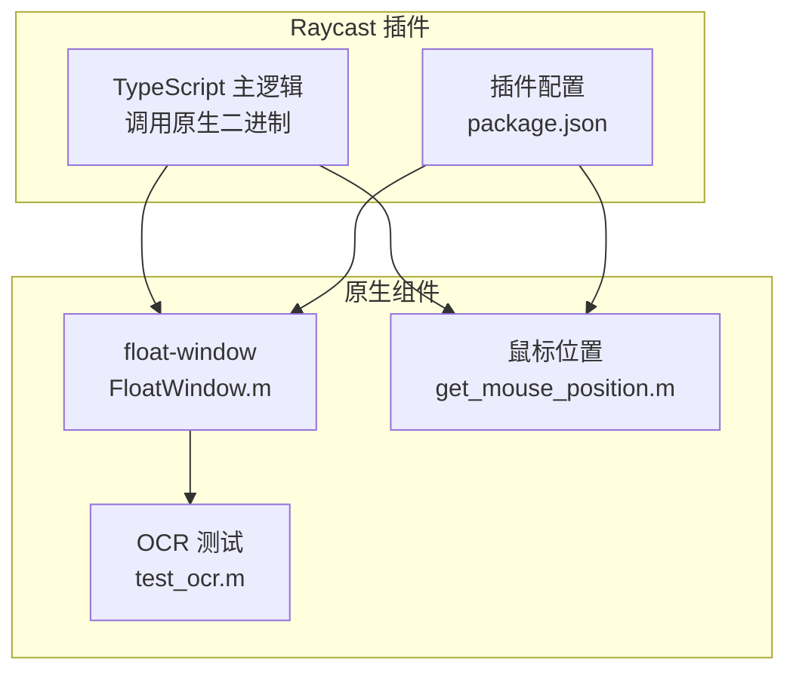
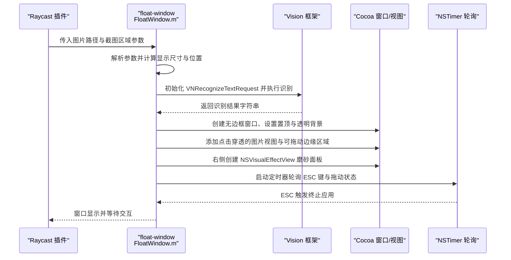
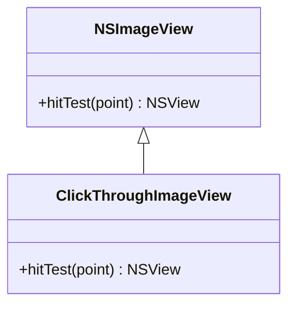
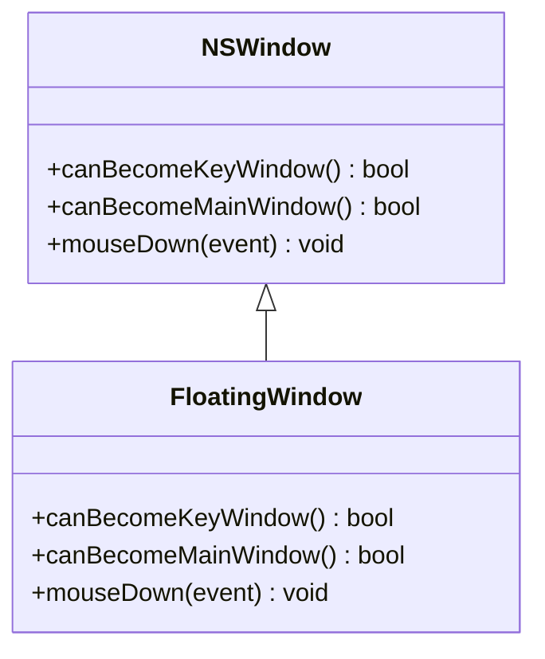
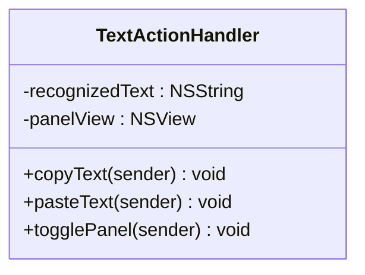
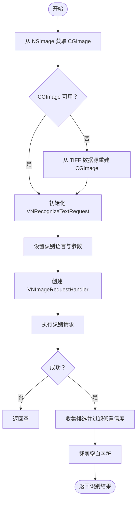
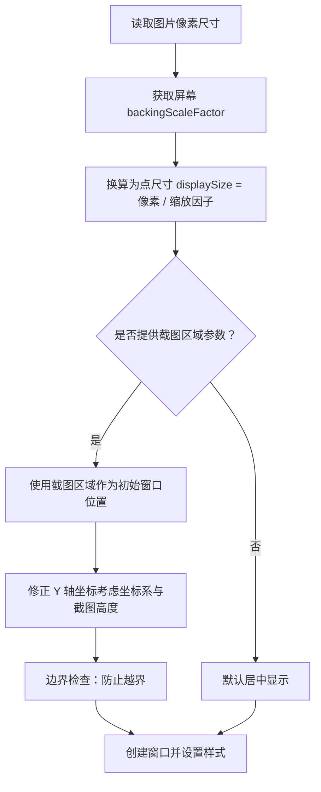
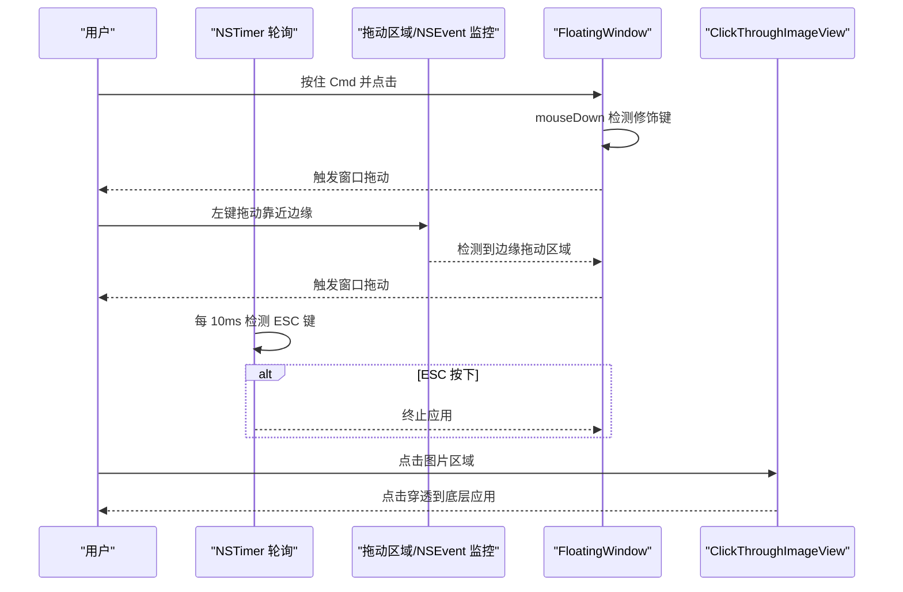
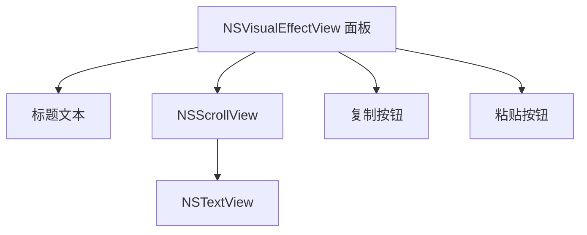
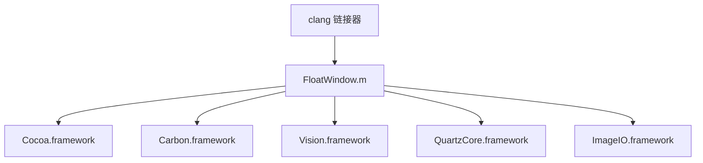

# 表现层架构

<cite>
**本文引用的文件**
- [FloatWindow.m](file://FloatWindow.m)
- [README.md](file://README.md)
- [build-native.sh](file://build-native.sh)
- [package.json](file://package.json)
- [test_ocr.m](file://test_ocr.m)
- [get_mouse_position.m](file://get_mouse_position.m)
- [float_window.py](file://float_window.py)
</cite>

## 目录
1. [引言](#引言)
2. [项目结构](#项目结构)
3. [核心组件](#核心组件)
4. [架构总览](#架构总览)
5. [详细组件分析](#详细组件分析)
6. [依赖关系分析](#依赖关系分析)
7. [性能考量](#性能考量)
8. [故障排查指南](#故障排查指南)
9. [结论](#结论)
10. [附录](#附录)

## 引言
本文件深入解析基于 Objective-C 的原生表现层架构，聚焦于 FloatWindow.m 文件，系统阐述其如何利用 Cocoa 框架创建“无边框、始终置顶（NSFloatingWindowLevel）、点击穿透”的悬浮窗口；详解 ClickThroughImageView 类通过重写 hitTest 实现点击穿透的技术原理；说明窗口定位机制（依据截图区域坐标计算屏幕精确位置，并处理 Retina 屏幕像素与点的转换）；解释用户交互（按住 Cmd 拖动、ESC 关闭、边缘拖动区域监听）；梳理 Vision 框架 OCR 文字识别流程（从 VNRecognizeTextRequest 初始化、语言设置到结果处理）；并描述 UI 组件构建（NSVisualEffectView 磨砂玻璃面板、文本显示与操作按钮布局及事件绑定）。

## 项目结构
该项目是一个 Raycast 插件，包含 TypeScript 主逻辑与原生 Objective-C 悬浮窗口程序。核心文件如下：
- FloatWindow.m：原生悬浮窗口主程序，负责窗口创建、定位、交互与 OCR。
- README.md：功能与技术要点说明。
- build-native.sh：编译原生二进制（float-window 与 get_mouse_position）。
- package.json：Raycast 插件配置与构建脚本。
- test_ocr.m：独立的 OCR 测试程序，复用 FloatWindow.m 中的 OCR 逻辑。
- get_mouse_position.m：获取当前鼠标位置的辅助工具。
- float_window.py：另一版本的悬浮窗口实现（Python），用于对比参考。

图表来源
- [package.json](file://package.json#L1-L34)
- [build-native.sh](file://build-native.sh#L1-L26)
- [FloatWindow.m](file://FloatWindow.m#L1-L60)
- [test_ocr.m](file://test_ocr.m#L1-L40)
- [get_mouse_position.m](file://get_mouse_position.m#L1-L10)

章节来源
- [README.md](file://README.md#L1-L61)
- [package.json](file://package.json#L1-L34)
- [build-native.sh](file://build-native.sh#L1-L26)

## 核心组件
- TextActionHandler：封装复制、粘贴与面板显隐等 UI 操作。
- RecognizedTextFromImage：基于 Vision 框架的 OCR 文字识别函数。
- FloatingWindow：继承 NSWindow，禁用键盘成为第一响应者，并支持按住 Cmd 拖动。
- ClickThroughImageView：继承 NSImageView，重写 hitTest 返回空指针以实现点击穿透。
- 主程序入口：解析参数、计算窗口位置、创建窗口与 UI、启动事件循环。

章节来源
- [FloatWindow.m](file://FloatWindow.m#L1-L83)
- [FloatWindow.m](file://FloatWindow.m#L85-L152)
- [FloatWindow.m](file://FloatWindow.m#L154-L177)
- [FloatWindow.m](file://FloatWindow.m#L179-L212)

## 架构总览
整体流程：Raycast 调用原生 float-window，传入图片路径与截图区域参数；float-window 加载图片、计算显示尺寸与位置、创建无边框悬浮窗口、启用点击穿透、在右侧展示 OCR 结果面板；同时注册 ESC 键轮询检测与边缘拖动区域监听，实现拖动与关闭。

图表来源
- [FloatWindow.m](file://FloatWindow.m#L179-L212)
- [FloatWindow.m](file://FloatWindow.m#L247-L302)
- [FloatWindow.m](file://FloatWindow.m#L325-L398)
- [FloatWindow.m](file://FloatWindow.m#L422-L464)

## 详细组件分析

### ClickThroughImageView：点击穿透实现
- 通过重写 hitTest 方法返回空指针，使该视图在命中测试阶段不拦截鼠标事件，从而实现点击穿透。
- 该视图被设置为图片展示层，保证图片区域对底层应用无遮挡。

图表来源
- [FloatWindow.m](file://FloatWindow.m#L169-L177)

章节来源
- [FloatWindow.m](file://FloatWindow.m#L169-L177)

### FloatingWindow：窗口行为与拖动
- 禁止成为主窗口与键盘窗口，避免抢占焦点。
- 在鼠标按下事件中，若按住 Cmd 键则触发窗口拖动，实现快捷拖动。

图表来源
- [FloatWindow.m](file://FloatWindow.m#L154-L168)

章节来源
- [FloatWindow.m](file://FloatWindow.m#L154-L168)

### TextActionHandler：UI 操作与粘贴模拟
- 复制：将识别出的文字写入通用剪贴板。
- 粘贴：先复制，再通过 CGEvent 模拟按下 Command+V，实现一键粘贴。
- 面板显隐：使用 NSAnimationContext 控制面板淡入淡出与隐藏。

图表来源
- [FloatWindow.m](file://FloatWindow.m#L1-L83)

章节来源
- [FloatWindow.m](file://FloatWindow.m#L1-L83)

### OCR 文字识别流程（Vision 框架）
- 输入：NSImage。
- 步骤：提取 CGImage（若直接不可得则从 TIFF 数据源重建），初始化 VNRecognizeTextRequest，设置识别等级、语言列表与最小文本高度，使用 VNImageRequestHandler 执行请求，遍历结果取置信度高的候选并拼接，最终裁剪空白字符。
- 输出：识别到的文字字符串，若为空则返回空值。

图表来源
- [FloatWindow.m](file://FloatWindow.m#L85-L152)
- [test_ocr.m](file://test_ocr.m#L1-L72)

章节来源
- [FloatWindow.m](file://FloatWindow.m#L85-L152)
- [test_ocr.m](file://test_ocr.m#L1-L72)

### 窗口定位与 Retina 像素/点转换
- 计算策略：
  - 从图片中获取像素尺寸（pixelsWide/pixelsHigh），结合屏幕 backingScaleFactor 将像素换算为点尺寸 displaySize，确保视觉上 1:1。
  - 若提供截图区域参数，则使用截图区域作为窗口初始位置；Y 轴需考虑坐标系差异与截图高度修正，最终进行边界检查，防止越界。
  - 若未提供截图区域，则默认将窗口居中显示。
- Retina 处理：通过屏幕缩放因子将像素尺寸换算为点尺寸，避免在高分屏上出现模糊或尺寸偏差。

图表来源
- [FloatWindow.m](file://FloatWindow.m#L179-L212)
- [FloatWindow.m](file://FloatWindow.m#L215-L277)

章节来源
- [FloatWindow.m](file://FloatWindow.m#L179-L212)
- [FloatWindow.m](file://FloatWindow.m#L215-L277)

### 用户交互与事件监听
- ESC 键关闭：通过 NSTimer 每 10ms 轮询检测 ESC 键状态，一旦按下即终止应用。
- 按住 Cmd 拖动：在 FloatingWindow 的 mouseDown 中判断修饰键，触发窗口拖动。
- 边缘拖动区域：在容器视图上方叠加一个透明的拖动区域，使用 NSTrackingArea 监听鼠标进入/离开；同时使用 NSEvent 的本地监控器捕获左键拖动事件，当鼠标位于窗口边缘 10px 区域时允许拖动。
- 鼠标穿透：图片视图通过 ClickThroughImageView 的 hitTest 返回空指针实现穿透；窗口整体设置 ignoresMouseEvents 为 NO，但仅对边缘区域生效，图片区域仍保持穿透。

图表来源
- [FloatWindow.m](file://FloatWindow.m#L154-L168)
- [FloatWindow.m](file://FloatWindow.m#L300-L326)
- [FloatWindow.m](file://FloatWindow.m#L422-L464)

章节来源
- [FloatWindow.m](file://FloatWindow.m#L154-L168)
- [FloatWindow.m](file://FloatWindow.m#L300-L326)
- [FloatWindow.m](file://FloatWindow.m#L422-L464)

### UI 组件构建：磨砂玻璃面板与按钮
- 面板：使用 NSVisualEffectView 创建磨砂玻璃效果，设置材质、混合模式、圆角与初始可见性。
- 标题与内容：标题文本随是否有识别结果动态变化；若有内容，使用 NSScrollView + NSTextView 显示可滚动文本。
- 操作按钮：复制与粘贴两个圆角按钮，分别绑定到 TextActionHandler 的复制与粘贴方法；按钮布局在面板内水平排列。
- 布局约束：面板宽度与高度根据屏幕与图片尺寸自适应，确保不超出屏幕边界。

图表来源
- [FloatWindow.m](file://FloatWindow.m#L325-L398)

章节来源
- [FloatWindow.m](file://FloatWindow.m#L325-L398)

## 依赖关系分析
- 外部框架依赖：
  - Cocoa：窗口、视图、事件与剪贴板。
  - Carbon：事件源与键盘事件状态查询。
  - Vision：OCR 文字识别。
  - QuartzCore：图层与渲染。
  - ImageIO：图像数据处理。
- 构建脚本依赖：
  - clang 链接 Cocoa、Carbon、Vision、QuartzCore、ImageIO。
  - package.json 在构建前自动编译原生二进制并复制到 dist 目录。

图表来源
- [build-native.sh](file://build-native.sh#L1-L26)
- [FloatWindow.m](file://FloatWindow.m#L1-L10)

章节来源
- [build-native.sh](file://build-native.sh#L1-L26)
- [package.json](file://package.json#L1-L34)

## 性能考量
- Retina 适配：通过 backingScaleFactor 将像素尺寸换算为点尺寸，避免缩放导致的模糊与尺寸偏差。
- OCR 性能：识别语言列表与最小文本高度设置有助于提升准确性；建议在大图场景下控制输入尺寸以减少处理时间。
- 事件轮询：每 10ms 检测一次 ESC 与拖动状态，频率较高但开销较小；可考虑根据实际需求调整周期。
- 点击穿透：仅对图片区域启用穿透，边缘拖动区域保持响应，平衡交互与性能。

## 故障排查指南
- 无法加载图片：检查传入的图片路径是否有效，确认文件存在且可读。
- 窗口未显示或不可见：确认已设置激活策略为 Regular，并调用激活接口；检查窗口层级与集合行为。
- OCR 无结果：确认图片包含可识别文本；检查识别语言列表与最小文本高度设置；查看错误日志。
- ESC 无效：确认 NSTimer 已加入主运行循环并处于 CommonModes；检查事件源状态查询是否正确。
- 鼠标穿透失效：确认 ClickThroughImageView 的 hitTest 返回空指针；检查容器视图层级顺序与 ignoresMouseEvents 设置。
- 边缘拖动无效：确认拖动区域的 TrackingArea 选项与 NSEvent 监控范围覆盖边缘区域。

章节来源
- [FloatWindow.m](file://FloatWindow.m#L179-L212)
- [FloatWindow.m](file://FloatWindow.m#L247-L302)
- [FloatWindow.m](file://FloatWindow.m#L300-L326)
- [FloatWindow.m](file://FloatWindow.m#L422-L464)

## 结论
该表现层架构以 FloatWindow.m 为核心，结合 Cocoa 与 Vision 框架，实现了“无边框、置顶、点击穿透”的悬浮窗口，并提供 OCR 文字识别与便捷的用户交互体验。通过像素/点转换与边缘拖动区域设计，兼顾了 Retina 屏幕的视觉一致性与易用性。整体代码结构清晰、职责明确，适合进一步扩展与维护。

## 附录
- 对比参考：另一版本悬浮窗口实现（Python）展示了不同语言下的相同目标，便于理解跨语言实现差异。
- 工具链：构建脚本自动编译原生二进制，简化开发与部署流程。

章节来源
- [float_window.py](file://float_window.py#L21-L98)
- [get_mouse_position.m](file://get_mouse_position.m#L1-L10)