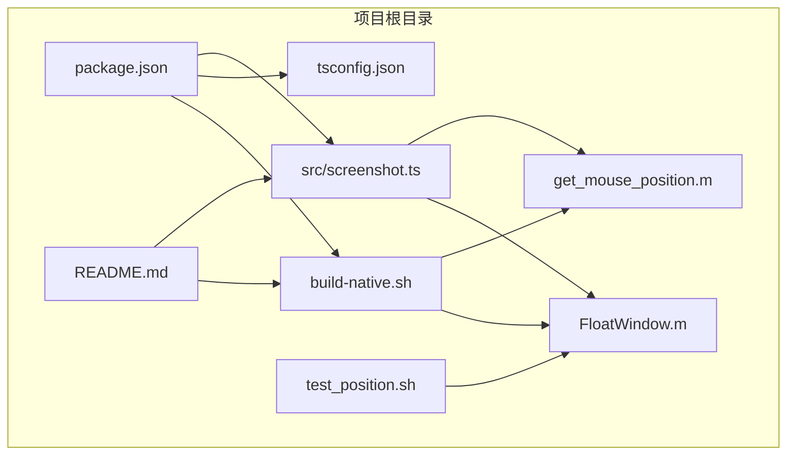
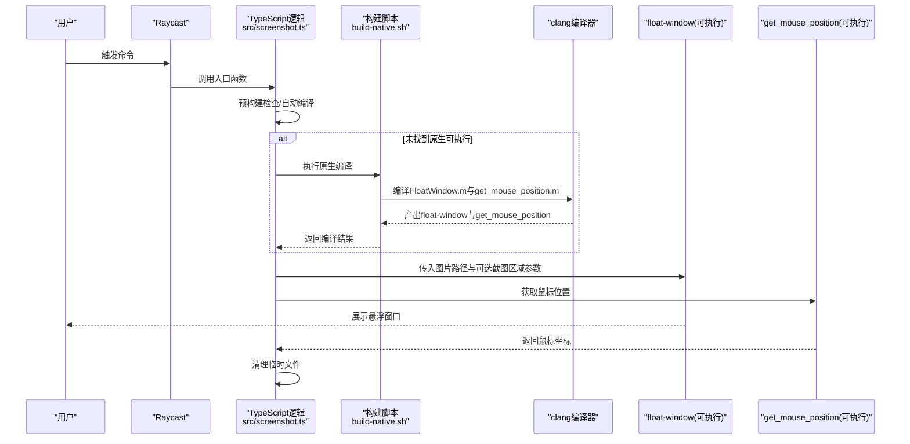
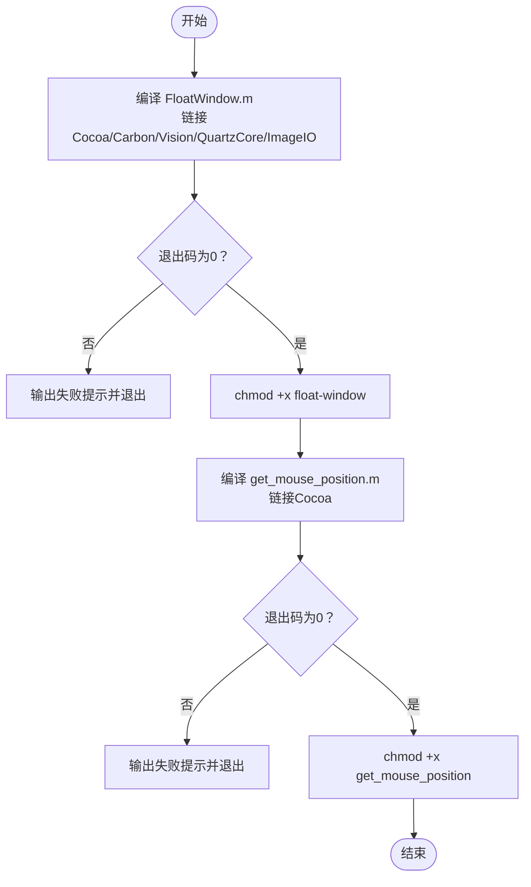
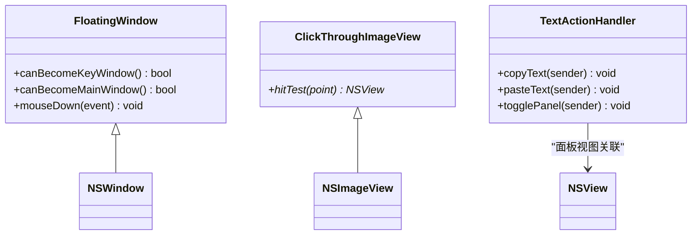
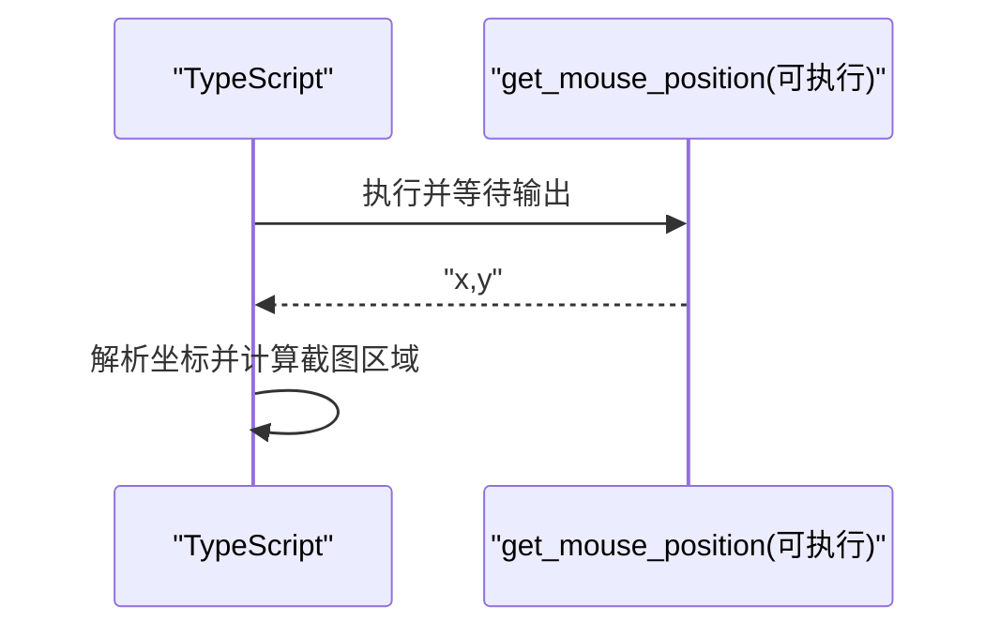
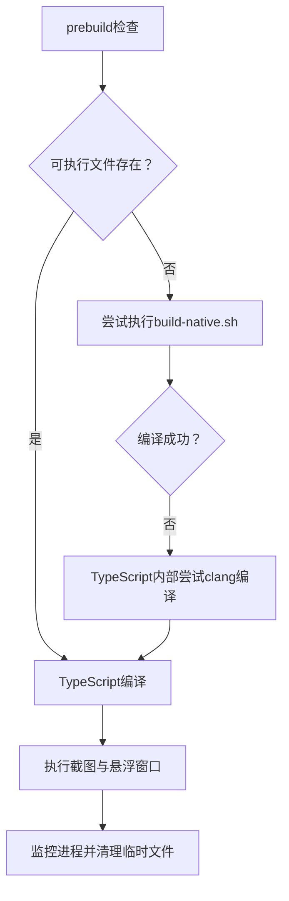
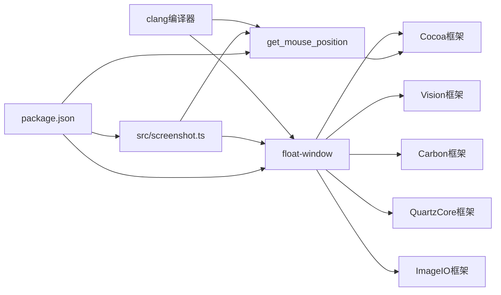

# 构建系统流程

<cite>
**本文引用的文件**
- [package.json](file://package.json)
- [build-native.sh](file://build-native.sh)
- [FloatWindow.m](file://FloatWindow.m)
- [get_mouse_position.m](file://get_mouse_position.m)
- [src/screenshot.ts](file://src/screenshot.ts)
- [tsconfig.json](file://tsconfig.json)
- [README.md](file://README.md)
- [test_position.sh](file://test_position.sh)
</cite>

## 目录
1. [简介](#简介)
2. [项目结构](#项目结构)
3. [核心组件](#核心组件)
4. [架构总览](#架构总览)
5. [详细组件分析](#详细组件分析)
6. [依赖关系分析](#依赖关系分析)
7. [性能考量](#性能考量)
8. [故障排查指南](#故障排查指南)
9. [结论](#结论)
10. [附录](#附录)

## 简介
本文件面向Raycast扩展开发者，系统性解析原生组件的构建流程，重点覆盖以下方面：
- build-native.sh如何使用clang编译器将FloatWindow.m与get_mouse_position.m编译为可执行文件，并说明各系统框架的作用与链接方式。
- 编译命令中的输出选项（-o）与权限设置（chmod +x）的意义。
- 结合package.json中的prebuild、build、postbuild脚本，梳理从依赖检查、原生编译到TypeScript编译与文件复制的完整流水线。
- 分析脚本中的错误处理机制（$?判断）与用户体验优化（成功/失败提示）。
- 探讨构建系统如何适配Raycast扩展的部署结构，确保可执行文件被正确复制到目标目录。
- 提供常见编译错误的解决方案，如缺少Xcode命令行工具或框架链接失败。

## 项目结构
该项目采用“TypeScript前端逻辑 + 原生Objective-C组件”的混合架构：
- TypeScript逻辑位于src目录，负责调用系统命令、管理临时文件与Raycast交互。
- 原生组件为两个独立的Objective-C源文件：FloatWindow.m（悬浮窗口）与get_mouse_position.m（鼠标位置查询）。
- 构建脚本build-native.sh负责将上述源文件编译为可执行文件。
- package.json定义了完整的构建脚本链路，包括预构建检查、TypeScript编译与部署复制。

图表来源
- [package.json](file://package.json#L1-L34)
- [build-native.sh](file://build-native.sh#L1-L26)
- [FloatWindow.m](file://FloatWindow.m#L1-L466)
- [get_mouse_position.m](file://get_mouse_position.m#L1-L10)
- [src/screenshot.ts](file://src/screenshot.ts#L1-L392)
- [tsconfig.json](file://tsconfig.json#L1-L21)
- [README.md](file://README.md#L1-L61)
- [test_position.sh](file://test_position.sh#L1-L15)

章节来源
- [package.json](file://package.json#L1-L34)
- [README.md](file://README.md#L1-L61)

## 核心组件
- 构建脚本：build-native.sh负责编译原生组件，使用clang链接Cocoa、Vision、Carbon、QuartzCore、ImageIO等系统框架，并通过-o指定输出可执行文件名，随后对产物执行chmod +x赋予执行权限。
- 原生组件：
  - FloatWindow.m：基于Cocoa、Vision、Carbon、QuartzCore、ImageIO等框架，实现悬浮窗口、点击穿透、OCR识别、ESC关闭等功能。
  - get_mouse_position.m：基于Cocoa框架，输出当前鼠标坐标。
- TypeScript逻辑：src/screenshot.ts负责截图、定位、调用原生组件、清理临时文件与Raycast交互。
- 构建配置：tsconfig.json定义TypeScript编译目标、模块化策略与输出目录；package.json定义prebuild、build、postbuild脚本链路。

章节来源
- [build-native.sh](file://build-native.sh#L1-L26)
- [FloatWindow.m](file://FloatWindow.m#L1-L466)
- [get_mouse_position.m](file://get_mouse_position.m#L1-L10)
- [src/screenshot.ts](file://src/screenshot.ts#L1-L392)
- [tsconfig.json](file://tsconfig.json#L1-L21)
- [package.json](file://package.json#L1-L34)

## 架构总览
下图展示了从用户触发到最终悬浮窗口展示的端到端流程，涵盖原生组件编译、TypeScript调用与Raycast部署复制。

图表来源
- [src/screenshot.ts](file://src/screenshot.ts#L1-L392)
- [build-native.sh](file://build-native.sh#L1-L26)
- [FloatWindow.m](file://FloatWindow.m#L1-L466)
- [get_mouse_position.m](file://get_mouse_position.m#L1-L10)

## 详细组件分析

### 构建脚本：build-native.sh
- 编译流程
  - 使用clang编译FloatWindow.m，链接Cocoa、Carbon、Vision、QuartzCore、ImageIO等系统框架，并通过-o输出名为float-window的可执行文件。
  - 对float-window执行chmod +x赋予执行权限。
  - 类似地编译get_mouse_position.m，链接Cocoa并输出get_mouse_position。
- 错误处理
  - 通过$?判断上一条命令的退出码，若非0则输出失败提示并退出脚本，避免后续步骤继续执行。
- 用户体验
  - 在每个编译阶段打印提示信息，明确当前任务与结果，提升可观测性。

图表来源
- [build-native.sh](file://build-native.sh#L1-L26)

章节来源
- [build-native.sh](file://build-native.sh#L1-L26)

### 原生组件：FloatWindow.m
- 框架依赖与作用
  - Cocoa：UI框架，提供NSApplication、NSWindow、NSView、NSEvent、NSImage等基础能力。
  - Vision：OCR识别，用于从图片中提取文本。
  - Carbon：事件系统辅助，支持键盘与鼠标事件。
  - QuartzCore：图形与动画，支持NSVisualEffectView、CALayer等。
  - ImageIO：图像处理，支持CGImageSource等。
- 关键行为
  - 解析命令行参数，支持传入图片路径与截图区域（X/Y/宽/高）。
  - 计算屏幕缩放因子，实现1:1像素显示。
  - 创建无边框悬浮窗口，设置层级为最上层，支持点击穿透与边缘拖动。
  - OCR识别并展示识别结果，提供复制/粘贴按钮。
  - ESC键关闭窗口，定时器轮询事件状态。
- 输出与权限
  - 作为clang编译产物，需配合build-native.sh的-o与chmod +x，确保可执行。

图表来源
- [FloatWindow.m](file://FloatWindow.m#L1-L466)

章节来源
- [FloatWindow.m](file://FloatWindow.m#L1-L466)

### 原生组件：get_mouse_position.m
- 框架依赖与作用
  - Cocoa：提供NSEvent与NSPoint，用于获取当前鼠标坐标。
- 关键行为
  - 输出当前鼠标坐标（x,y），格式化为整数并以逗号分隔，供TypeScript解析。

图表来源
- [get_mouse_position.m](file://get_mouse_position.m#L1-L10)
- [src/screenshot.ts](file://src/screenshot.ts#L162-L236)

章节来源
- [get_mouse_position.m](file://get_mouse_position.m#L1-L10)
- [src/screenshot.ts](file://src/screenshot.ts#L162-L236)

### TypeScript逻辑：src/screenshot.ts
- 预构建检查与自动编译
  - prebuild脚本会在构建前检查float-window与get_mouse_position是否存在；若缺失，优先尝试执行build-native.sh；若不可用，给出明确提示。
  - 若源文件存在且可执行文件缺失，TypeScript逻辑内部也会尝试在项目根目录执行clang编译，确保可用性。
- 截图与定位
  - 使用/usr/sbin/screencapture进行交互式截图，通过文件存在性判断用户是否取消。
  - 通过AppleScript与get_mouse_position获取截图区域近似位置，结合图片像素尺寸计算窗口显示区域。
- 调用原生组件
  - 通过多路径探测查找float-window与get_mouse_position，必要时调用build-native.sh或直接clang编译。
  - 以detached模式启动原生进程，避免阻塞主流程。
- 清理与监控
  - 通过osascript后台监控原生进程生命周期，进程退出后清理临时截图文件。

图表来源
- [package.json](file://package.json#L1-L34)
- [src/screenshot.ts](file://src/screenshot.ts#L1-L392)

章节来源
- [package.json](file://package.json#L1-L34)
- [src/screenshot.ts](file://src/screenshot.ts#L1-L392)

### 构建配置：tsconfig.json与package.json
- tsconfig.json
  - 目标为ES2021，模块化策略为commonjs，严格模式开启，输出目录为dist。
- package.json
  - scripts：
    - prebuild：检查float-window与get_mouse_position是否存在，否则尝试执行build-native.sh或提示用户手动编译。
    - build：调用tsc编译TypeScript至dist，并复制float-window与get_mouse_position到dist。
    - postbuild：若dist存在且Raycast扩展目录存在，则将dist内容复制到扩展安装目录，便于Raycast直接加载。
  - 依赖与开发依赖：包含@raycast/api与相关类型定义，以及TypeScript与类型包。

章节来源
- [tsconfig.json](file://tsconfig.json#L1-L21)
- [package.json](file://package.json#L1-L34)

## 依赖关系分析
- 外部工具与框架
  - clang：编译器，链接系统框架。
  - Cocoa/Carbon/Vision/QuartzCore/ImageIO：系统框架，分别提供UI、事件、OCR、图形与图像处理能力。
  - screencapture：系统截图工具。
  - osascript：系统AppleScript执行器。
- 内部依赖
  - build-native.sh依赖FloatWindow.m与get_mouse_position.m。
  - src/screenshot.ts依赖clang编译产物（float-window与get_mouse_position），并在缺失时尝试自动编译。
  - package.json的prebuild/build/postbuild串联TypeScript编译与Raycast部署。

图表来源
- [build-native.sh](file://build-native.sh#L1-L26)
- [FloatWindow.m](file://FloatWindow.m#L1-L466)
- [get_mouse_position.m](file://get_mouse_position.m#L1-L10)
- [src/screenshot.ts](file://src/screenshot.ts#L1-L392)
- [package.json](file://package.json#L1-L34)

章节来源
- [build-native.sh](file://build-native.sh#L1-L26)
- [FloatWindow.m](file://FloatWindow.m#L1-L466)
- [get_mouse_position.m](file://get_mouse_position.m#L1-L10)
- [src/screenshot.ts](file://src/screenshot.ts#L1-L392)
- [package.json](file://package.json#L1-L34)

## 性能考量
- 编译性能
  - 仅包含少量源文件，编译时间短；建议在CI中缓存clang缓存与系统框架头文件以加速二次构建。
- 运行性能
  - 悬浮窗口使用点击穿透与边缘拖动，避免额外渲染开销；OCR识别在主线程执行，建议在大图场景下控制识别范围或异步化。
- 文件I/O
  - 临时文件清理依赖原生进程退出后的监控脚本，确保及时释放磁盘空间。

[本节为通用指导，无需特定文件引用]

## 故障排查指南
- 缺少Xcode命令行工具
  - 现象：clang不可用或链接系统框架失败。
  - 处理：安装Xcode并接受许可协议，或通过Xcode命令行工具安装clang与系统SDK。
- 框架链接失败
  - 现象：编译时报错提示找不到Cocoa、Vision等框架。
  - 处理：确认已安装Xcode与对应SDK；检查build-native.sh中的-framework参数是否与系统可用框架一致。
- 权限不足导致无法执行
  - 现象：运行float-window或get_mouse_position报权限错误。
  - 处理：确保build-native.sh执行chmod +x；或手动对产物执行chmod +x。
- Raycast扩展目录不存在
  - 现象：postbuild复制失败。
  - 处理：确认~/.config/raycast/extensions/screenshots-plugin存在；若不存在，请先在Raycast中导入扩展。
- TypeScript找不到可执行文件
  - 现象：运行时报找不到float-window或get_mouse_position。
  - 处理：执行npm run prebuild或手动运行./build-native.sh；或在src/screenshot.ts内部自动编译逻辑中确认clang可用。
- 截图取消或失败
  - 现象：用户取消截图或screencapture返回非零退出码。
  - 处理：代码已通过文件存在性判断区分取消与异常；若异常，会显示Toast并清理临时文件。

章节来源
- [build-native.sh](file://build-native.sh#L1-L26)
- [src/screenshot.ts](file://src/screenshot.ts#L1-L392)
- [package.json](file://package.json#L1-L34)

## 结论
该构建系统通过清晰的脚本链路与TypeScript逻辑协同，实现了从原生组件编译到Raycast扩展部署的完整闭环：
- build-native.sh负责将FloatWindow.m与get_mouse_position.m编译为可执行文件，并通过chmod +x确保可执行。
- package.json的prebuild/build/postbuild脚本串联TypeScript编译与部署复制，保证Raycast能够直接加载产物。
- src/screenshot.ts在缺失可执行文件时具备自动编译能力，增强用户体验与健壮性。
- 原生组件充分利用Cocoa、Vision等系统框架，实现悬浮窗口、OCR识别与用户交互。

[本节为总结性内容，无需特定文件引用]

## 附录
- 开发与运行建议
  - 在本地开发时，先执行npm run prebuild确保原生组件可用，再运行npm run dev进入开发模式。
  - 构建发布时，执行npm run build并确认postbuild复制成功。
- 测试参考
  - test_position.sh可用于验证悬浮窗口位置与尺寸显示效果，便于迭代修复坐标问题。

章节来源
- [README.md](file://README.md#L1-L61)
- [test_position.sh](file://test_position.sh#L1-L15)