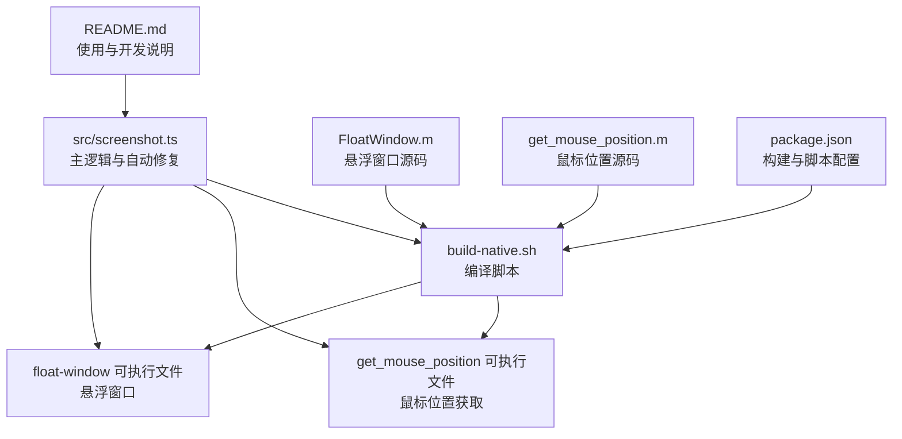
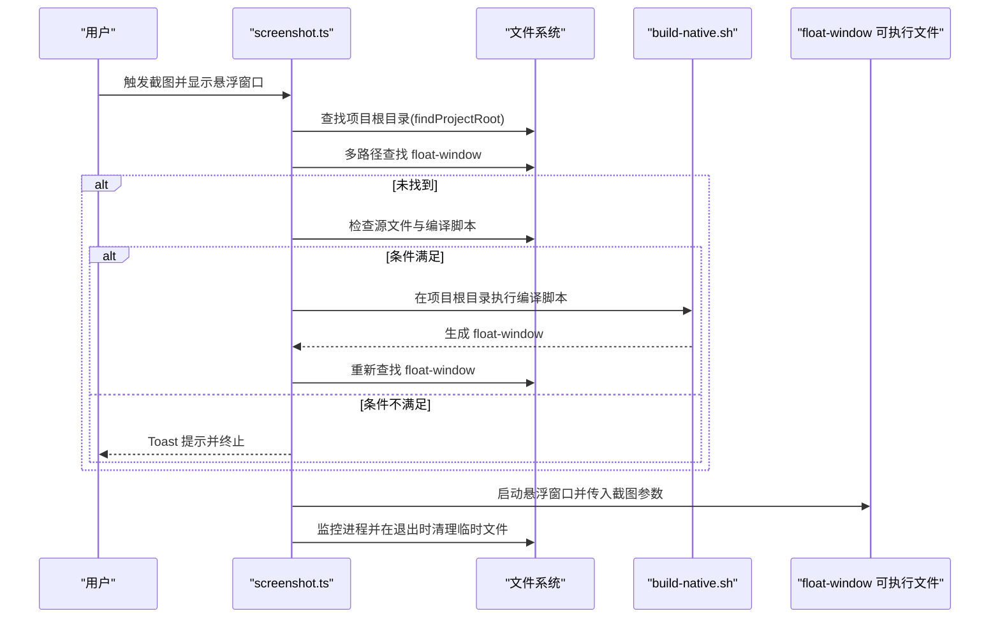
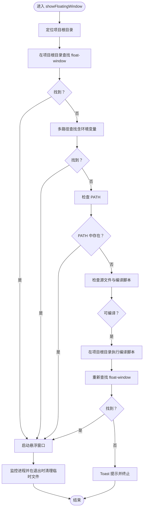
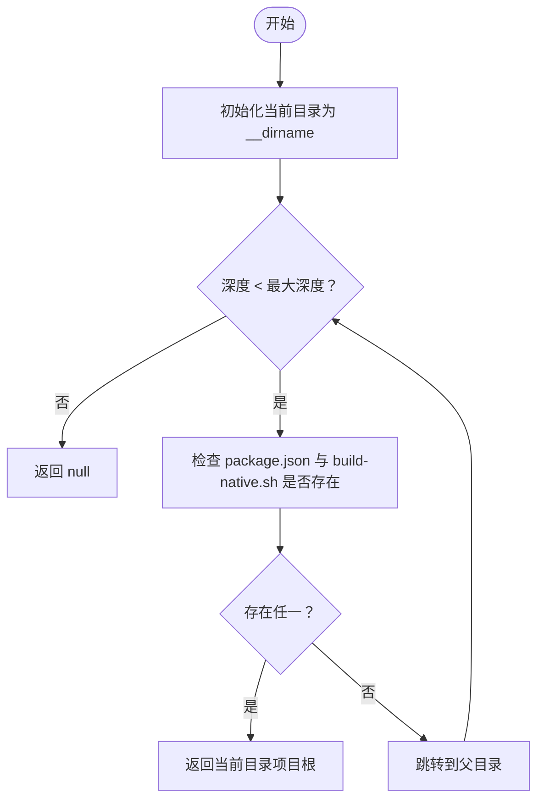
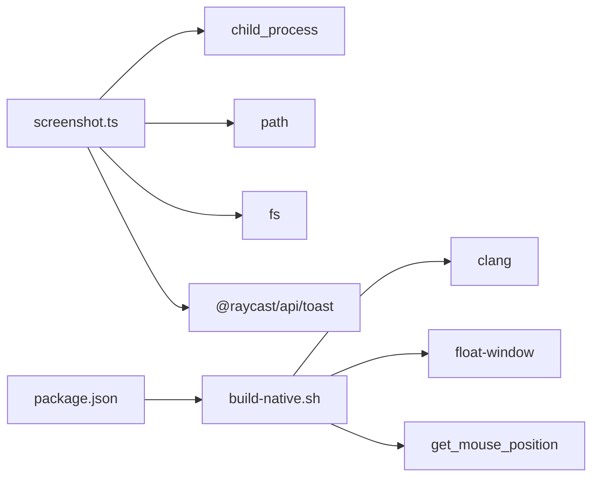

# 自动修复与容错机制

<cite>
**本文引用的文件**
- [src/screenshot.ts](file://src/screenshot.ts)
- [build-native.sh](file://build-native.sh)
- [FloatWindow.m](file://FloatWindow.m)
- [get_mouse_position.m](file://get_mouse_position.m)
- [README.md](file://README.md)
- [package.json](file://package.json)
- [test_position.sh](file://test_position.sh)
- [float_window.py](file://float_window.py)
</cite>

## 目录
1. [引言](#引言)
2. [项目结构](#项目结构)
3. [核心组件](#核心组件)
4. [架构总览](#架构总览)
5. [详细组件分析](#详细组件分析)
6. [依赖关系分析](#依赖关系分析)
7. [性能考量](#性能考量)
8. [故障排查指南](#故障排查指南)
9. [结论](#结论)
10. [附录](#附录)

## 引言
本文件聚焦于插件的“自动修复能力”，即当悬浮窗口可执行文件缺失时，如何通过多路径查找策略定位资源，并在必要时自动触发原生编译流程，最终恢复功能可用。我们将围绕以下关键点展开：
- 当 showFloatingWindow 检测到 float-window 可执行文件缺失时，如何自动触发修复流程
- 多路径查找策略的设计意图与覆盖范围（项目根目录、__dirname 相对路径、环境变量 RAYCAST_EXTENSION_PATH）
- 自动编译的触发条件与执行上下文（cwd 设置）
- 对用户体验的提升与潜在风险（权限问题、编译环境依赖）
- 手动触发修复与调试技巧（Toast 错误提示、日志输出）

## 项目结构
该项目采用“TypeScript 主逻辑 + 原生 Objective-C 悬浮窗口 + Shell 编译脚本”的混合架构：
- TypeScript 侧负责截图、悬浮窗口调用、自动修复与容错
- Objective-C 侧负责高性能悬浮窗口渲染与交互
- Shell 脚本负责一键编译原生二进制

图表来源
- [src/screenshot.ts](file://src/screenshot.ts#L238-L390)
- [build-native.sh](file://build-native.sh#L1-L26)
- [FloatWindow.m](file://FloatWindow.m#L1-L466)
- [get_mouse_position.m](file://get_mouse_position.m#L1-L10)
- [README.md](file://README.md#L1-L61)
- [package.json](file://package.json#L1-L34)

章节来源
- [README.md](file://README.md#L1-L61)
- [package.json](file://package.json#L1-L34)

## 核心组件
- 自动修复入口：showFloatingWindow
- 项目根目录定位：findProjectRoot
- 多路径查找策略：针对 float-window 与 get_mouse_position
- 自动编译触发：基于 build-native.sh 与 FloatWindow.m、get_mouse_position.m
- 执行上下文：cwd 设置为项目根目录或上一级目录
- 用户体验：自动修复减少手动编译成本；失败时通过 Toast 提示

章节来源
- [src/screenshot.ts](file://src/screenshot.ts#L137-L160)
- [src/screenshot.ts](file://src/screenshot.ts#L238-L390)
- [build-native.sh](file://build-native.sh#L1-L26)
- [FloatWindow.m](file://FloatWindow.m#L1-L466)
- [get_mouse_position.m](file://get_mouse_position.m#L1-L10)

## 架构总览
自动修复的整体流程如下：当悬浮窗口可执行文件缺失时，先尝试多路径查找；若仍不可用且源文件存在，则切换到项目根目录执行编译脚本，再重新查找可执行文件；最后启动悬浮窗口并进行临时文件清理。

图表来源
- [src/screenshot.ts](file://src/screenshot.ts#L238-L390)
- [build-native.sh](file://build-native.sh#L1-L26)

## 详细组件分析

### 组件A：自动修复入口——showFloatingWindow
- 功能职责
  - 查找 float-window 可执行文件（优先项目根目录，其次多路径，最后 PATH）
  - 若缺失且源文件与编译脚本存在，切换到项目根目录执行 bash 编译脚本
  - 成功后重新查找并启动悬浮窗口；失败则通过 Toast 提示
- 关键实现要点
  - 多路径查找策略：项目根目录、__dirname 上级、process.cwd、__dirname 上两级、环境变量 RAYCAST_EXTENSION_PATH
  - 执行上下文：cwd 设为项目根目录或上一级目录，保证编译脚本正确解析相对路径
  - 启动参数：向悬浮窗口传递图片路径及可选的截图区域参数
  - 清理策略：通过 AppleScript 监控进程退出后删除临时截图文件

图表来源
- [src/screenshot.ts](file://src/screenshot.ts#L238-L390)

章节来源
- [src/screenshot.ts](file://src/screenshot.ts#L238-L390)

### 组件B：项目根目录定位——findProjectRoot
- 设计意图
  - 通过向上遍历目录，寻找 package.json 或 build-native.sh，从而确定项目根目录
  - 限制最大深度避免无限循环
- 作用
  - 为后续多路径查找与编译脚本执行提供统一的 cwd 基准
  - 便于在不同部署环境下（Raycast 扩展安装目录、开发目录等）稳定定位资源

图表来源
- [src/screenshot.ts](file://src/screenshot.ts#L137-L160)

章节来源
- [src/screenshot.ts](file://src/screenshot.ts#L137-L160)

### 组件C：多路径查找策略
- 目标对象：float-window 与 get_mouse_position
- 查找顺序与意图
  - 项目根目录：确保在 Raycast 扩展安装目录下也能正确找到
  - __dirname 上级与上两级：兼容开发与打包后的不同层级布局
  - process.cwd：适配 Raycast 运行时的工作目录
  - 环境变量 RAYCAST_EXTENSION_PATH：当 Raycast 提供扩展路径时，直接定位资源
  - PATH：兜底查找，避免遗漏系统安装的可执行文件
- 设计价值
  - 在不同部署环境（开发机、Raycast 扩展安装目录、CI/CD 打包产物）均能稳定定位资源
  - 降低因路径差异导致的功能不可用风险

章节来源
- [src/screenshot.ts](file://src/screenshot.ts#L240-L283)
- [src/screenshot.ts](file://src/screenshot.ts#L162-L195)

### 组件D：自动编译触发与执行上下文
- 触发条件
  - 源文件存在（FloatWindow.m 或 get_mouse_position.m）
  - 编译脚本存在（build-native.sh）
  - 未找到可执行文件
- 执行上下文
  - cwd 设置为项目根目录或上一级目录，确保 clang 与脚本内部的相对路径解析正确
  - 对悬浮窗口编译使用 bash 脚本；对鼠标位置工具使用 clang 直接编译
- 输出产物
  - 生成 float-window 与 get_mouse_position 可执行文件，并赋予执行权限

章节来源
- [src/screenshot.ts](file://src/screenshot.ts#L284-L306)
- [src/screenshot.ts](file://src/screenshot.ts#L196-L220)
- [build-native.sh](file://build-native.sh#L1-L26)
- [FloatWindow.m](file://FloatWindow.m#L1-L466)
- [get_mouse_position.m](file://get_mouse_position.m#L1-L10)

### 组件E：自动修复与容错的用户体验与风险
- 用户体验提升
  - 无需手动执行编译脚本即可恢复功能
  - 失败时通过 Toast 提示明确指引（包含项目根目录、__dirname 与建议命令）
- 潜在风险
  - 权限问题：编译与执行需要可执行权限；Raycast 运行环境可能限制某些目录写入
  - 编译环境依赖：需要 clang 与相关框架可用；不同系统版本可能存在差异
  - 路径不确定性：在复杂部署环境中，多路径查找仍可能出现误判

章节来源
- [src/screenshot.ts](file://src/screenshot.ts#L308-L321)

### 组件F：辅助工具与对比实现
- get_mouse_position.m：用于获取鼠标位置，配合悬浮窗口定位
- float_window.py：Python 版本的悬浮窗口实现，用于对比与测试
- test_position.sh：手动测试悬浮窗口位置与参数传递的脚本

章节来源
- [get_mouse_position.m](file://get_mouse_position.m#L1-L10)
- [float_window.py](file://float_window.py#L1-L100)
- [test_position.sh](file://test_position.sh#L1-L15)

## 依赖关系分析
- TypeScript 主模块依赖
  - child_process/spawn/exec：执行外部命令与编译
  - path/fs：路径拼接与文件存在性判断
  - @raycast/api/toast：错误提示
- 编译脚本依赖
  - clang 与 Cocoa/Carbon/Vision/QuartzCore/ImageIO 框架
- 构建脚本依赖
  - package.json 中 prebuild、build、postbuild 脚本，确保二进制随构建流程同步

图表来源
- [src/screenshot.ts](file://src/screenshot.ts#L1-L12)
- [build-native.sh](file://build-native.sh#L1-L26)
- [package.json](file://package.json#L1-L34)

章节来源
- [src/screenshot.ts](file://src/screenshot.ts#L1-L12)
- [build-native.sh](file://build-native.sh#L1-L26)
- [package.json](file://package.json#L1-L34)

## 性能考量
- 自动修复的开销主要来自编译与多次文件系统查询
- 优化建议
  - 预编译：通过 package.json 的 prebuild 脚本在构建阶段强制编译，减少运行时开销
  - 缓存查找结果：在一次会话内缓存项目根目录与可执行文件路径，避免重复查找
  - 并行化：在多路径查找中使用并行探测，缩短等待时间（需注意并发安全与去重）

章节来源
- [package.json](file://package.json#L28-L33)

## 故障排查指南
- 常见症状与定位
  - Toast 提示“找不到 float-window 可执行文件”，同时显示项目根目录与 __dirname
  - 悬浮窗口未出现或立即退出
- 手动触发修复
  - 在项目根目录执行编译脚本，确保 clang 与相关框架可用
  - 确认生成的可执行文件具备执行权限
- 调试技巧
  - 查看控制台日志：自动修复过程中会输出编译与查找过程的日志
  - 使用 test_position.sh 手动验证悬浮窗口参数传递与位置计算
  - 对比 Python 版本的 float_window.py 以确认窗口行为一致性

章节来源
- [src/screenshot.ts](file://src/screenshot.ts#L308-L321)
- [test_position.sh](file://test_position.sh#L1-L15)
- [float_window.py](file://float_window.py#L1-L100)

## 结论
该插件通过“多路径查找 + 自动编译”的组合策略，在不同部署环境下实现了高鲁棒性的自动修复能力。其设计兼顾了易用性与稳定性：在大多数情况下无需手动干预即可恢复功能；在异常情况下提供清晰的提示与日志，便于快速定位问题。建议在生产环境中结合预编译与缓存策略进一步优化性能与可靠性。

## 附录
- 使用与开发说明可参考 README
- 构建与脚本配置可参考 package.json

章节来源
- [README.md](file://README.md#L1-L61)
- [package.json](file://package.json#L1-L34)