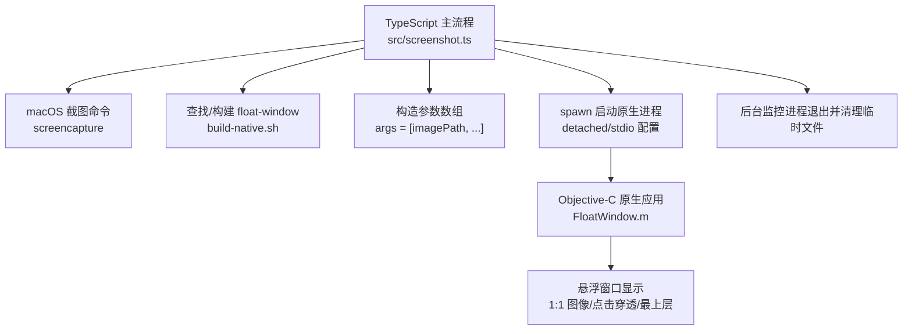
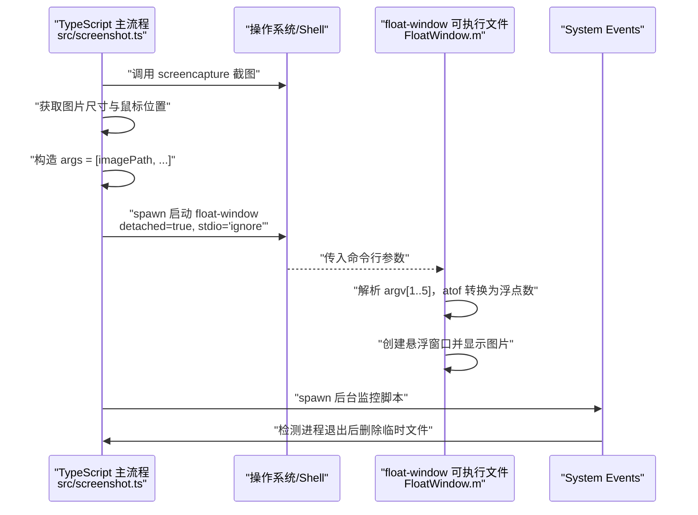
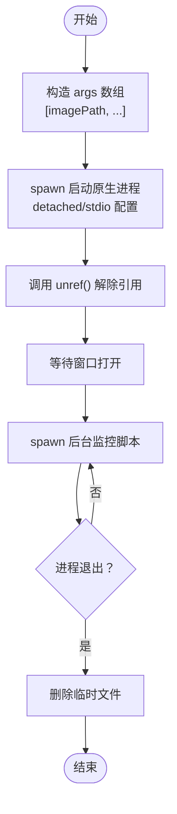
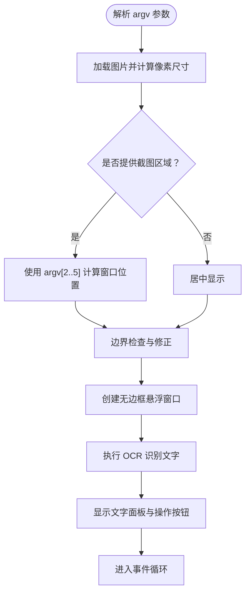
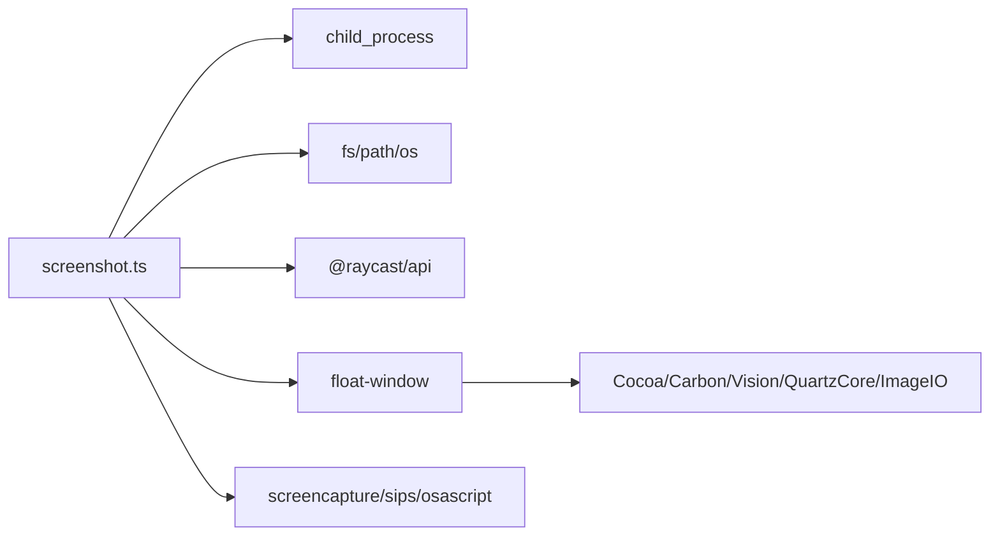

# 进程间通信机制

<cite>
**本文引用的文件**
- [src/screenshot.ts](file://src/screenshot.ts)
- [FloatWindow.m](file://FloatWindow.m)
- [get_mouse_position.m](file://get_mouse_position.m)
- [build-native.sh](file://build-native.sh)
- [package.json](file://package.json)
- [README.md](file://README.md)
- [test_position.sh](file://test_position.sh)
</cite>

## 目录
1. [引言](#引言)
2. [项目结构](#项目结构)
3. [核心组件](#核心组件)
4. [架构总览](#架构总览)
5. [详细组件分析](#详细组件分析)
6. [依赖关系分析](#依赖关系分析)
7. [性能考量](#性能考量)
8. [故障排查指南](#故障排查指南)
9. [结论](#结论)
10. [附录](#附录)

## 引言
本文件围绕 TypeScript 与 Objective-C 之间的进程间通信展开，重点说明 screenshot.ts 如何通过 Node.js 的 spawn 方法启动 float-window 原生进程，并通过命令行参数传递截图文件路径以及区域坐标（x, y, width, height）。文档将深入解析参数传递过程中的数据类型转换（JavaScript 数字如何转换为 C 字符串并通过 atof 解析）、spawn 调用时 detached 与 stdio 配置的作用，确保原生进程独立运行且不阻塞主插件；同时结合代码示例展示参数构造过程（args 数组）与进程启动逻辑，并说明 unref() 对进程生命周期管理的影响。最后讨论该 IPC 方式的优缺点、常见失败原因与排查方法。

## 项目结构
该项目由 TypeScript 插件逻辑与 Objective-C 原生应用组成，二者通过命令行参数进行单向通信：
- TypeScript 主流程负责截图、定位区域、启动原生悬浮窗口，并在原生进程退出后清理临时文件。
- Objective-C 原生应用负责接收参数、加载图片、创建悬浮窗口、执行 OCR 并处理用户交互。

图表来源
- [src/screenshot.ts](file://src/screenshot.ts#L1-L114)
- [src/screenshot.ts](file://src/screenshot.ts#L238-L390)
- [FloatWindow.m](file://FloatWindow.m#L179-L270)
- [build-native.sh](file://build-native.sh#L1-L26)

章节来源
- [src/screenshot.ts](file://src/screenshot.ts#L1-L114)
- [src/screenshot.ts](file://src/screenshot.ts#L238-L390)
- [FloatWindow.m](file://FloatWindow.m#L179-L270)
- [build-native.sh](file://build-native.sh#L1-L26)
- [package.json](file://package.json#L1-L34)
- [README.md](file://README.md#L1-L61)

## 核心组件
- TypeScript 主流程（screenshot.ts）
  - 负责生成临时截图路径、调用 screencapture 截图、获取图片尺寸与鼠标位置、拼接 args 参数、spawn 启动 float-window、后台监控原生进程退出并清理临时文件。
- Objective-C 原生应用（FloatWindow.m）
  - 接收命令行参数，解析图片路径与可选的截图区域坐标，计算窗口位置与尺寸，创建悬浮窗口并执行 OCR。
- 辅助工具
  - get_mouse_position.m：输出当前鼠标坐标，供 TypeScript 获取截图区域参考。
  - build-native.sh：编译 float-window 与 get_mouse_position。
  - package.json：定义构建脚本与开发流程。
  - test_position.sh：手动测试悬浮窗口位置与尺寸。

章节来源
- [src/screenshot.ts](file://src/screenshot.ts#L1-L114)
- [src/screenshot.ts](file://src/screenshot.ts#L116-L160)
- [src/screenshot.ts](file://src/screenshot.ts#L162-L236)
- [src/screenshot.ts](file://src/screenshot.ts#L238-L390)
- [FloatWindow.m](file://FloatWindow.m#L179-L270)
- [get_mouse_position.m](file://get_mouse_position.m#L1-L10)
- [build-native.sh](file://build-native.sh#L1-L26)
- [package.json](file://package.json#L1-L34)
- [test_position.sh](file://test_position.sh#L1-L15)

## 架构总览
下图展示了从 TypeScript 到 Objective-C 的端到端调用链路，包括参数传递、进程启动与生命周期管理。

图表来源
- [src/screenshot.ts](file://src/screenshot.ts#L1-L114)
- [src/screenshot.ts](file://src/screenshot.ts#L315-L390)
- [FloatWindow.m](file://FloatWindow.m#L179-L270)

## 详细组件分析

### TypeScript 参数构造与进程启动
- 参数构造（args 数组）
  - 必需参数：图片路径（imagePath）。
  - 可选参数：截图区域的 x、y、width、height（当存在截图区域时追加）。
  - 数据类型转换：JavaScript 数字通过 toString() 转换为字符串，作为 C 字符串 argv[i] 传入原生应用。
- 进程启动（spawn）
  - 采用 detached: true，确保子进程独立于父进程运行，避免阻塞主插件。
  - stdio: "ignore"，忽略子进程的标准输入输出，减少资源占用。
  - unref()：解除父进程对子进程的引用，防止父进程等待子进程退出而阻塞。
- 生命周期管理
  - 启动后等待短暂时间以确保窗口打开。
  - 通过 osascript 后台脚本监控原生进程退出，一旦退出即删除临时文件，避免资源泄漏。

图表来源
- [src/screenshot.ts](file://src/screenshot.ts#L315-L390)

章节来源
- [src/screenshot.ts](file://src/screenshot.ts#L315-L390)

### Objective-C 参数解析与窗口创建
- 参数解析
  - argv[1]：图片路径（UTF-8 字符串）。
  - argv[2..5]：可选的截图区域坐标（x, y, width, height），通过 atof 转换为浮点数。
  - 日志输出：调试阶段会打印 argv 中各参数，便于定位问题。
- 窗口创建
  - 使用 NSImage 加载图片，计算像素尺寸与缩放因子，确保 1:1 显示。
  - 计算窗口位置：优先使用传入的截图区域坐标；若未提供则居中显示。
  - 窗口属性：无边框、最上层、点击穿透、可拖动边缘区域。
  - OCR：基于 Vision 框架识别图片文字，右侧显示识别结果面板。
  - 交互：ESC 键关闭窗口；左键拖动调整窗口位置。

图表来源
- [FloatWindow.m](file://FloatWindow.m#L179-L270)
- [FloatWindow.m](file://FloatWindow.m#L270-L464)

章节来源
- [FloatWindow.m](file://FloatWindow.m#L179-L270)
- [FloatWindow.m](file://FloatWindow.m#L270-L464)

### 数据类型转换与解析细节
- JavaScript → C 字符串
  - JavaScript 数字通过 toString() 转为字符串，作为 argv[i] 传入原生应用。
- C → 浮点数
  - 原生应用使用 atof(argv[i]) 将 C 字符串转换为浮点数，用于窗口位置与尺寸计算。
- 注意事项
  - 数字精度与小数点格式：确保 toString() 输出符合 atof 的解析预期。
  - 边界检查：原生应用会对窗口位置进行边界修正，避免越界显示。

章节来源
- [src/screenshot.ts](file://src/screenshot.ts#L315-L343)
- [FloatWindow.m](file://FloatWindow.m#L218-L266)

### spawn 配置与生命周期管理
- detached: true
  - 子进程与父进程分离，父进程无需等待其退出即可继续执行。
- stdio: "ignore"
  - 忽略标准输入输出，避免不必要的管道与缓冲区占用。
- unref()
  - 解除父进程对子进程的引用，防止父进程事件循环被阻塞。
- 后台监控
  - 通过 osascript 后台脚本轮询检测原生进程是否仍在运行，退出后删除临时文件，保证资源回收。

章节来源
- [src/screenshot.ts](file://src/screenshot.ts#L315-L390)

### 原生应用编译与部署
- 编译脚本
  - build-native.sh 使用 clang 编译 float-window 与 get_mouse_position，链接 Cocoa、Carbon、Vision、QuartzCore、ImageIO 等框架。
- 构建流程
  - package.json 的 prebuild 脚本会在构建前检查并编译原生二进制；build 脚本将二进制复制到 dist 目录并同步到 Raycast 扩展目录。

章节来源
- [build-native.sh](file://build-native.sh#L1-L26)
- [package.json](file://package.json#L1-L34)

## 依赖关系分析
- TypeScript 依赖
  - child_process.spawn/exec：用于启动外部进程与执行 Shell 命令。
  - fs/path/os：用于临时文件管理与路径拼接。
  - @raycast/api：Raycast 插件 API，用于提示与系统交互。
- Objective-C 依赖
  - Cocoa/Carbon/Vision/QuartzCore/ImageIO：用于窗口、事件、图像与 OCR 能力。
- 运行时依赖
  - macOS screencapture、sips、osascript 等系统工具。
  - 可执行文件 float-window 与 get_mouse_position。

图表来源
- [src/screenshot.ts](file://src/screenshot.ts#L1-L114)
- [FloatWindow.m](file://FloatWindow.m#L1-L10)
- [build-native.sh](file://build-native.sh#L1-L26)

章节来源
- [src/screenshot.ts](file://src/screenshot.ts#L1-L114)
- [FloatWindow.m](file://FloatWindow.m#L1-L10)
- [build-native.sh](file://build-native.sh#L1-L26)

## 性能考量
- 轻量化通信
  - 仅通过命令行参数传递必要数据，避免复杂序列化与额外开销。
- 资源控制
  - stdio: "ignore" 降低 I/O 成本；detached 与 unref() 防止父进程等待与事件循环阻塞。
- 图像处理
  - 原生应用直接使用 NSImage 与 Vision 框架，避免跨语言桥接成本。
- 建议
  - 若未来需要双向通信，可考虑命名管道或本地套接字，但当前方案已满足需求且更简洁。

[本节为通用性能讨论，不直接分析具体文件]

## 故障排查指南
- 常见失败原因
  - 可执行文件缺失：找不到 float-window 或 get_mouse_position。
  - 权限问题：可执行文件未赋予执行权限或未签名。
  - 路径错误：临时文件路径无效或被提前删除。
  - 参数格式错误：toString() 输出不符合 atof 解析预期。
  - 截图取消：screencapture 返回非零退出码但文件不存在。
- 排查步骤
  - 确认编译成功：执行 build-native.sh 并检查二进制存在且可执行。
  - 手动验证：使用 test_position.sh 手动启动悬浮窗口，验证参数传递与窗口显示。
  - 检查路径：确认 imagePath 与截图区域参数有效。
  - 查看日志：原生应用在调试阶段会输出 argv 内容，便于定位问题。
  - 清理资源：监控脚本应在进程退出后删除临时文件，若未删除需检查脚本执行权限。

章节来源
- [src/screenshot.ts](file://src/screenshot.ts#L273-L313)
- [src/screenshot.ts](file://src/screenshot.ts#L342-L390)
- [build-native.sh](file://build-native.sh#L1-L26)
- [test_position.sh](file://test_position.sh#L1-L15)
- [FloatWindow.m](file://FloatWindow.m#L218-L266)

## 结论
本项目通过 TypeScript 与 Objective-C 的简单 IPC 实现，实现了“轻量、安全”的跨语言通信：TypeScript 负责业务流程与系统集成，Objective-C 负责高性能的窗口与图像处理。参数传递采用命令行方式，数据类型在两端之间清晰转换；spawn 的 detached 与 stdio 配置确保原生进程独立运行且不阻塞主插件；unref() 进一步保障父进程事件循环自由。该方案适合一次性参数传递场景，若需双向通信可在现有基础上扩展。

[本节为总结性内容，不直接分析具体文件]

## 附录
- 使用建议
  - 在生产环境中建议增加参数校验与异常捕获，确保 atof 输入合法。
  - 若需更复杂的交互，可引入本地 IPC（如命名管道）以支持后续双向通信。
- 相关文件索引
  - TypeScript 主流程：[src/screenshot.ts](file://src/screenshot.ts#L1-L114)、[src/screenshot.ts](file://src/screenshot.ts#L238-L390)
  - 原生应用入口与参数解析：[FloatWindow.m](file://FloatWindow.m#L179-L270)
  - 鼠标位置工具：[get_mouse_position.m](file://get_mouse_position.m#L1-L10)
  - 编译脚本：[build-native.sh](file://build-native.sh#L1-L26)
  - 构建与开发脚本：[package.json](file://package.json#L1-L34)
  - 使用说明与技术实现：[README.md](file://README.md#L1-L61)
  - 手动测试脚本：[test_position.sh](file://test_position.sh#L1-L15)