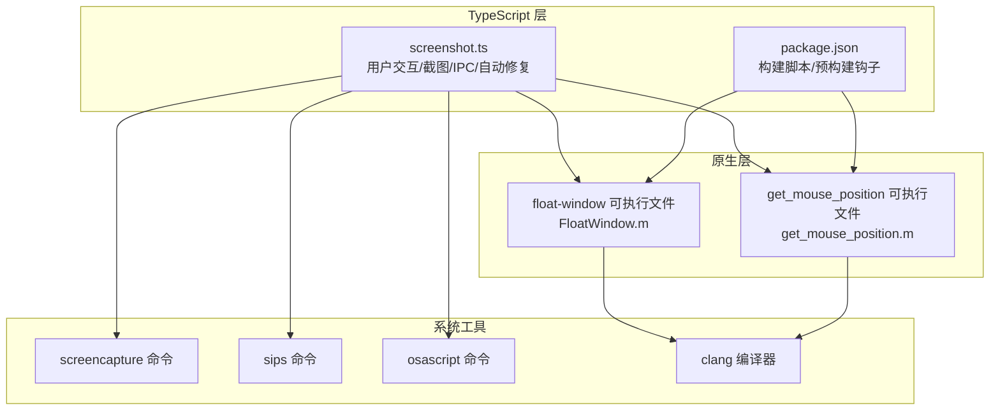
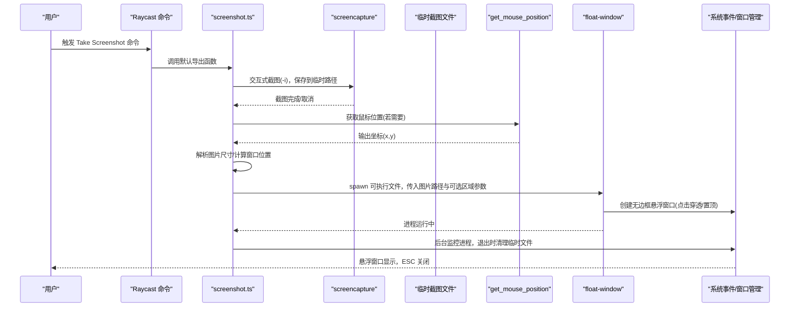
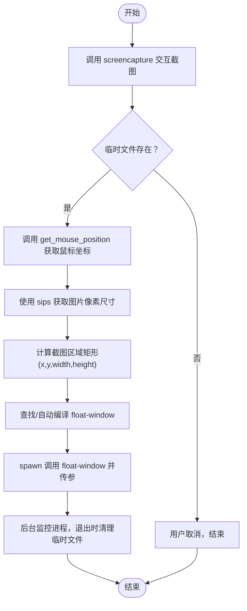
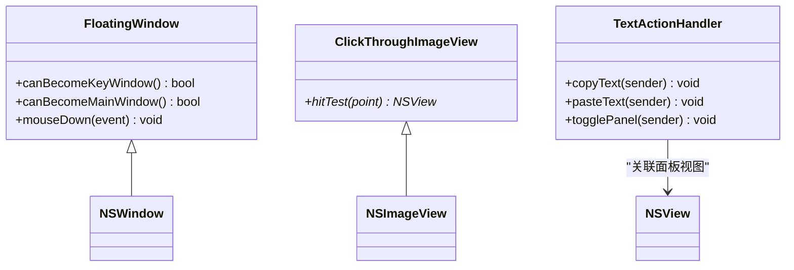
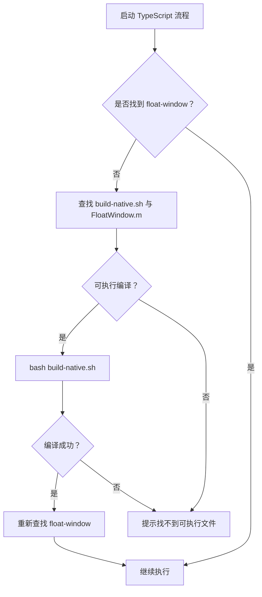
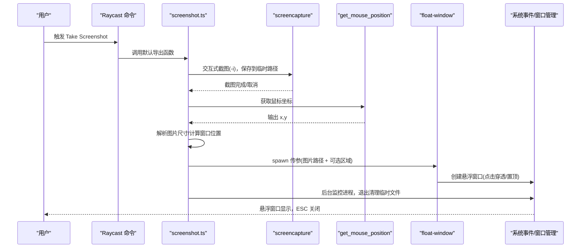
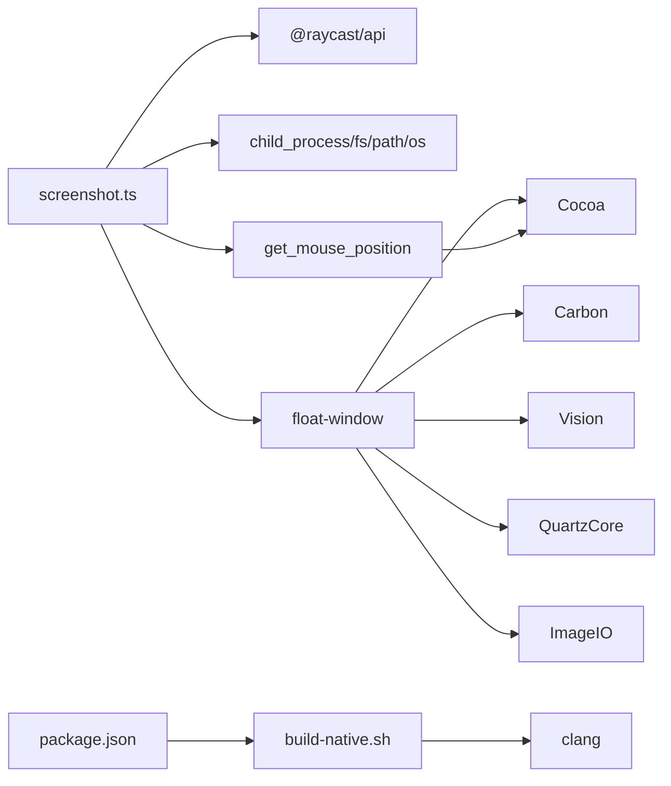

# 集成机制

<cite>
**本文引用的文件**
- [src/screenshot.ts](file://src/screenshot.ts)
- [FloatWindow.m](file://FloatWindow.m)
- [get_mouse_position.m](file://get_mouse_position.m)
- [build-native.sh](file://build-native.sh)
- [package.json](file://package.json)
- [README.md](file://README.md)
- [test_position.sh](file://test_position.sh)
</cite>

## 目录
1. [引言](#引言)
2. [项目结构](#项目结构)
3. [核心组件](#核心组件)
4. [架构总览](#架构总览)
5. [详细组件分析](#详细组件分析)
6. [依赖关系分析](#依赖关系分析)
7. [性能考量](#性能考量)
8. [故障排查指南](#故障排查指南)
9. [结论](#结论)

## 引言
本文件系统性阐述 TypeScript 层与 Objective-C 层之间的集成机制，重点覆盖以下方面：
- 进程间通信：screenshot.ts 如何通过 Node.js 的 spawn 方法调用编译后的 float-window 可执行文件，并通过命令行参数传递截图路径与区域坐标。
- 数据传递格式与类型转换：JavaScript 数字如何转换为 C 字符串，以及在 Objective-C 侧如何解析。
- 构建系统工作流：build-native.sh 如何使用 clang 编译 FloatWindow.m 与 get_mouse_position.m，并链接 Cocoa、Vision 等系统框架。
- 插件的自动修复能力：当检测到原生可执行文件缺失时，如何自动触发编译脚本与源码编译。
- 混合架构优势：原生窗口的流畅性、对 Cocoa API 的深度集成、以及相较 Electron 更低的资源占用。
- 从用户触发 Raycast 命令到最终显示悬浮窗口的完整时序图。

## 项目结构
该项目采用“TypeScript + 原生二进制”的混合架构：
- TypeScript 层负责用户交互、截图采集、临时文件管理、原生可执行文件定位与自动编译、以及与原生应用的进程间通信。
- Objective-C 层负责创建无边框、始终置顶、点击穿透的悬浮窗口，并在窗口边缘提供拖动区域，同时集成 OCR 文字识别与快捷操作。

图表来源
- [src/screenshot.ts](file://src/screenshot.ts#L1-L114)
- [build-native.sh](file://build-native.sh#L1-L26)
- [package.json](file://package.json#L1-L34)
- [FloatWindow.m](file://FloatWindow.m#L179-L212)
- [get_mouse_position.m](file://get_mouse_position.m#L1-L10)

章节来源
- [README.md](file://README.md#L1-L61)
- [package.json](file://package.json#L1-L34)

## 核心组件
- TypeScript 主流程：负责截图、计算窗口位置、调用原生悬浮窗口、监控进程并清理临时文件。
- 原生悬浮窗口：基于 Cocoa 的无边框窗口，支持点击穿透、始终置顶、ESC 关闭、边缘拖动。
- 鼠标位置获取：原生可执行文件，输出当前鼠标坐标。
- 构建脚本：统一编译 float-window 与 get_mouse_position，链接所需系统框架。
- 自动修复：在路径查找失败时，尝试自动编译缺失的原生二进制。

章节来源
- [src/screenshot.ts](file://src/screenshot.ts#L1-L114)
- [FloatWindow.m](file://FloatWindow.m#L179-L212)
- [get_mouse_position.m](file://get_mouse_position.m#L1-L10)
- [build-native.sh](file://build-native.sh#L1-L26)

## 架构总览
下图展示从用户触发 Raycast 命令到悬浮窗口显示的端到端流程，涵盖 TypeScript 层与原生层的交互。

图表来源
- [src/screenshot.ts](file://src/screenshot.ts#L1-L114)
- [src/screenshot.ts](file://src/screenshot.ts#L162-L236)
- [src/screenshot.ts](file://src/screenshot.ts#L238-L390)
- [FloatWindow.m](file://FloatWindow.m#L179-L212)
- [get_mouse_position.m](file://get_mouse_position.m#L1-L10)

## 详细组件分析

### TypeScript 主流程与 IPC
- 截图采集：使用 screencapture 命令进行交互式截图，通过 spawn 并监听 close 事件判断用户是否取消；取消时文件不存在，避免误判为失败。
- 区域信息计算：优先通过 get_mouse_position 获取鼠标位置，再结合图片像素尺寸计算截图区域矩形，作为悬浮窗口的初始位置。
- 原生调用：通过 spawn 调用 float-window，参数顺序为“图片路径 + 可选的截图区域四元组”。参数以字符串形式传递，由原生侧解析为数值。
- 进程监控：使用 osascript 后台轮询检查 float-window 是否仍在运行，退出后清理临时文件。

图表来源
- [src/screenshot.ts](file://src/screenshot.ts#L1-L114)
- [src/screenshot.ts](file://src/screenshot.ts#L162-L236)
- [src/screenshot.ts](file://src/screenshot.ts#L238-L390)

章节来源
- [src/screenshot.ts](file://src/screenshot.ts#L1-L114)
- [src/screenshot.ts](file://src/screenshot.ts#L162-L236)
- [src/screenshot.ts](file://src/screenshot.ts#L238-L390)

### 原生悬浮窗口（FloatWindow.m）
- 参数解析：main 接收至少两个参数（图片路径），若提供额外四个参数则视为截图区域坐标与尺寸。通过 argv[i] 逐个解析为数值。
- 1:1 显示：根据图片像素尺寸与屏幕缩放因子换算为点尺寸，确保视觉上 1:1。
- 窗口属性：无边框、始终置顶、透明背景、阴影、忽略鼠标事件（点击穿透）。
- 边缘拖动：在窗口边缘 10px 区域内允许拖动，支持按住 Cmd 键拖动。
- ESC 关闭：定时轮询 ESC 键状态，按下则终止应用。
- 文字识别：使用 Vision 框架识别图片文字，右侧显示可滚动面板，支持复制/粘贴操作。

图表来源
- [FloatWindow.m](file://FloatWindow.m#L121-L177)
- [FloatWindow.m](file://FloatWindow.m#L179-L212)
- [FloatWindow.m](file://FloatWindow.m#L212-L277)
- [FloatWindow.m](file://FloatWindow.m#L277-L390)
- [FloatWindow.m](file://FloatWindow.m#L390-L466)

章节来源
- [FloatWindow.m](file://FloatWindow.m#L179-L212)
- [FloatWindow.m](file://FloatWindow.m#L212-L277)
- [FloatWindow.m](file://FloatWindow.m#L277-L390)
- [FloatWindow.m](file://FloatWindow.m#L390-L466)

### 鼠标位置获取（get_mouse_position.m）
- 作用：输出当前鼠标坐标，格式为“x,y”，由 TypeScript 侧解析为数字对象。
- 用途：在缺少精确区域信息时，以鼠标为中心点计算截图区域矩形，提升用户体验。

章节来源
- [get_mouse_position.m](file://get_mouse_position.m#L1-L10)

### 构建系统与自动修复
- 构建脚本：build-native.sh 使用 clang 链接 Cocoa、Carbon、Vision、QuartzCore、ImageIO 等框架，分别编译 float-window 与 get_mouse_position，并赋予可执行权限。
- 自动修复：
  - 对于 float-window：若路径查找失败，尝试在项目根目录执行 bash build-native.sh；若源文件存在且脚本可用，自动编译并重新查找。
  - 对于 get_mouse_position：若路径查找失败，尝试在项目根目录执行 clang 编译，成功后重新查找。
- 预构建钩子：package.json 的 prebuild 脚本会在缺少二进制时优先尝试执行 build-native.sh，否则提示用户手动编译。

图表来源
- [build-native.sh](file://build-native.sh#L1-L26)
- [src/screenshot.ts](file://src/screenshot.ts#L273-L313)
- [src/screenshot.ts](file://src/screenshot.ts#L285-L306)
- [package.json](file://package.json#L1-L34)

章节来源
- [build-native.sh](file://build-native.sh#L1-L26)
- [src/screenshot.ts](file://src/screenshot.ts#L273-L313)
- [src/screenshot.ts](file://src/screenshot.ts#L285-L306)
- [package.json](file://package.json#L1-L34)

### 数据传递格式与类型转换
- JavaScript → C 字符串：screenshot.ts 将数字参数转换为字符串后传入 spawn 的 argv 数组。
- C 侧解析：FloatWindow.m 使用 atof 将 argv[i] 解析为 CGFloat；get_mouse_position.m 使用 printf 输出“x,y”，TypeScript 侧 split 与 map(Number) 转换为数字对象。
- 类型一致性：确保 argv 顺序与原生侧解析顺序一致，避免位置偏移。

章节来源
- [src/screenshot.ts](file://src/screenshot.ts#L315-L343)
- [FloatWindow.m](file://FloatWindow.m#L212-L235)
- [get_mouse_position.m](file://get_mouse_position.m#L1-L10)

### 从用户触发到悬浮窗口显示的时序图

图表来源
- [src/screenshot.ts](file://src/screenshot.ts#L1-L114)
- [src/screenshot.ts](file://src/screenshot.ts#L162-L236)
- [src/screenshot.ts](file://src/screenshot.ts#L238-L390)
- [FloatWindow.m](file://FloatWindow.m#L179-L212)
- [get_mouse_position.m](file://get_mouse_position.m#L1-L10)

## 依赖关系分析
- TypeScript 依赖：
  - @raycast/api：命令入口与提示。
  - child_process：spawn/exec 用于调用外部程序。
  - fs/path/os：文件系统与路径处理。
- 原生依赖：
  - Cocoa/Carbon/Vision/QuartzCore/ImageIO：窗口、输入事件、OCR、图像处理。
- 构建依赖：
  - clang：编译 Objective-C 源码。
  - bash：执行构建脚本。

图表来源
- [src/screenshot.ts](file://src/screenshot.ts#L1-L114)
- [FloatWindow.m](file://FloatWindow.m#L1-L56)
- [get_mouse_position.m](file://get_mouse_position.m#L1-L10)
- [build-native.sh](file://build-native.sh#L1-L26)
- [package.json](file://package.json#L1-L34)

章节来源
- [src/screenshot.ts](file://src/screenshot.ts#L1-L114)
- [FloatWindow.m](file://FloatWindow.m#L1-L56)
- [get_mouse_position.m](file://get_mouse_position.m#L1-L10)
- [build-native.sh](file://build-native.sh#L1-L26)
- [package.json](file://package.json#L1-L34)

## 性能考量
- 原生窗口流畅性：基于 Cocoa 的窗口系统，避免 JavaScript 渲染带来的延迟，保证悬浮窗口的动画与事件响应更顺滑。
- 系统集成深度：直接使用 Cocoa API（窗口层级、点击穿透、输入事件）、Vision 框架（OCR）、ImageIO（图像处理），减少中间层开销。
- 资源占用：相比 Electron，该方案仅在需要时启动原生二进制，且体积小、启动快，整体资源占用更低。
- I/O 优化：临时文件在进程退出时清理，避免磁盘碎片与残留。

## 故障排查指南
- 找不到 float-window 或 get_mouse_position：
  - 检查是否已执行构建脚本；若未生成，请运行构建脚本或确认源文件存在。
  - 若路径不在 PATH，可手动指定绝对路径或在项目根目录执行。
- 截图取消导致无文件：
  - 这属于正常行为，无需报错；TypeScript 已针对取消场景进行分支处理。
- OCR 未识别到文字：
  - 图片质量或语言设置可能影响识别效果；可调整语言配置或更换图片。
- 悬浮窗口位置异常：
  - 可参考测试脚本与日志，验证 argv 传参顺序与解析逻辑；必要时使用测试脚本复现问题。

章节来源
- [src/screenshot.ts](file://src/screenshot.ts#L1-L114)
- [src/screenshot.ts](file://src/screenshot.ts#L238-L390)
- [test_position.sh](file://test_position.sh#L1-L15)

## 结论
本项目通过 TypeScript 与 Objective-C 的紧密协作，实现了高性能、低资源占用的悬浮窗口截图体验。TypeScript 负责用户交互与进程编排，原生层负责窗口渲染与系统级集成。自动修复机制提升了可用性，构建脚本统一了编译流程，确保跨平台部署的一致性。该混合架构在 macOS 生态中具备良好的兼容性与扩展性。