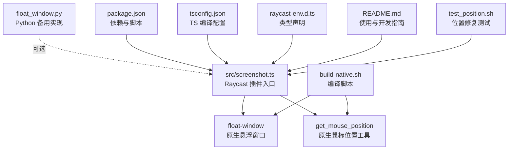
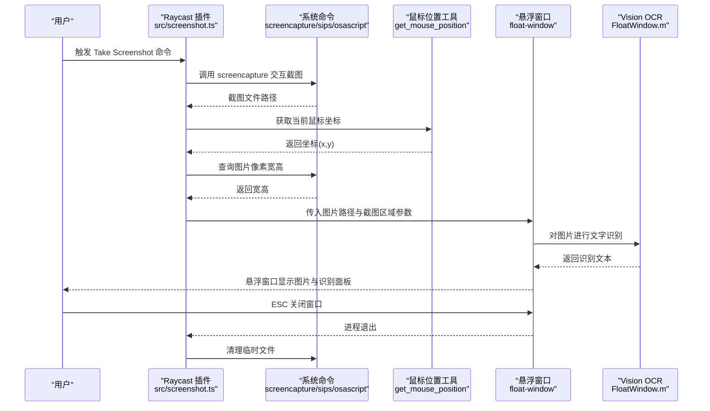
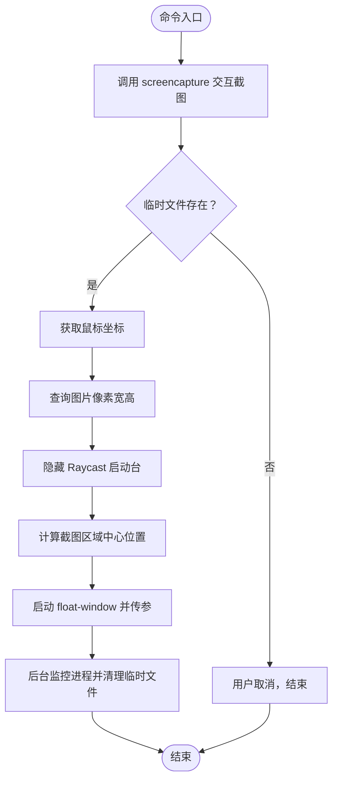
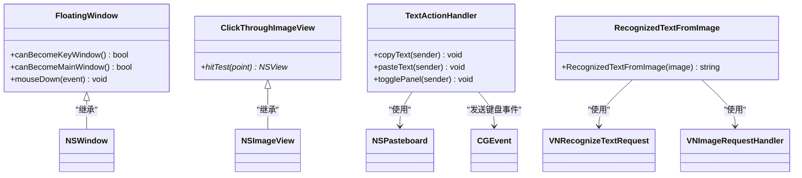
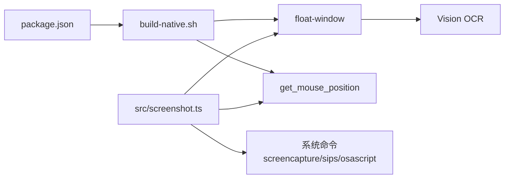

# 文件说明

<cite>
**本文引用的文件列表**
- [src/screenshot.ts](file://src/screenshot.ts)
- [FloatWindow.m](file://FloatWindow.m)
- [get_mouse_position.m](file://get_mouse_position.m)
- [build-native.sh](file://build-native.sh)
- [float_window.py](file://float_window.py)
- [package.json](file://package.json)
- [tsconfig.json](file://tsconfig.json)
- [raycast-env.d.ts](file://raycast-env.d.ts)
- [README.md](file://README.md)
- [test_position.sh](file://test_position.sh)
</cite>

## 目录
1. [简介](#简介)
2. [项目结构](#项目结构)
3. [核心组件](#核心组件)
4. [架构总览](#架构总览)
5. [详细组件分析](#详细组件分析)
6. [依赖关系分析](#依赖关系分析)
7. [性能考量](#性能考量)
8. [故障排查指南](#故障排查指南)
9. [结论](#结论)
10. [附录](#附录)

## 简介
本文件面向开发者，系统性梳理项目中所有关键文件的功能、技术栈、调用关系与修改影响，帮助快速定位代码并理解整体实现。重点覆盖以下文件：
- src/screenshot.ts：主插件逻辑，负责截图调用、路径生成、临时文件管理与原生应用启动。
- FloatWindow.m：核心原生模块，实现悬浮窗口创建、OCR识别、点击穿透与用户交互。
- get_mouse_position.m：辅助工具，获取当前鼠标坐标用于窗口定位。
- build-native.sh：构建脚本，使用 clang 编译 Objective-C 源码。
- float_window.py：Python 备用实现，用于验证概念或调试。
- package.json：定义插件元数据、依赖与构建脚本。
- tsconfig.json：TypeScript 编译配置。
- raycast-env.d.ts：类型声明文件，由 Raycast 自动生成。
- README.md：项目说明与使用开发指南。
- test_position.sh：测试脚本，验证截图位置修复效果。

## 项目结构
项目采用“Raycast 扩展 + 原生二进制”的混合架构：
- TypeScript 插件入口位于 src/screenshot.ts，负责截图与流程控制。
- 原生二进制通过 build-native.sh 编译产出，分别为 float-window（悬浮窗口）与 get_mouse_position（鼠标位置查询）。
- Python 版本 float_window.py 作为替代实现，便于快速验证与调试。
- package.json 统一管理依赖、脚本与构建流程；tsconfig.json 控制 TypeScript 编译；raycast-env.d.ts 提供类型声明。

图表来源
- [src/screenshot.ts](file://src/screenshot.ts#L1-L120)
- [FloatWindow.m](file://FloatWindow.m#L1-L120)
- [get_mouse_position.m](file://get_mouse_position.m#L1-L10)
- [build-native.sh](file://build-native.sh#L1-L26)
- [float_window.py](file://float_window.py#L1-L100)
- [package.json](file://package.json#L1-L34)
- [tsconfig.json](file://tsconfig.json#L1-L21)
- [raycast-env.d.ts](file://raycast-env.d.ts#L1-L26)
- [README.md](file://README.md#L1-L61)
- [test_position.sh](file://test_position.sh#L1-L15)

章节来源
- [README.md](file://README.md#L1-L61)
- [package.json](file://package.json#L1-L34)
- [tsconfig.json](file://tsconfig.json#L1-L21)
- [raycast-env.d.ts](file://raycast-env.d.ts#L1-L26)

## 核心组件
- 主插件逻辑（src/screenshot.ts）
  - 负责截图调用、临时文件管理、Raycast 启动台隐藏、悬浮窗口启动与进程监控。
  - 通过 spawn/exec 与系统命令交互，确保用户取消时正确处理。
  - 自动查找/编译原生二进制，兼容多种部署场景。
- 原生悬浮窗口（FloatWindow.m）
  - 使用 Cocoa/Carbon/Vision 等框架，实现点击穿透、始终置顶、1:1 图像显示、边缘拖动与 ESC 关闭。
  - 内置 OCR 文字识别与右侧操作面板，支持复制/粘贴。
- 鼠标位置工具（get_mouse_position.m）
  - 简洁的 Cocoa 工具，输出当前鼠标坐标，供截图区域近似定位使用。
- 构建脚本（build-native.sh）
  - 统一编译 float-window 与 get_mouse_position，设置权限与错误处理。
- Python 备用实现（float_window.py）
  - 提供等价的悬浮窗口能力，便于验证与调试。
- 类型声明（raycast-env.d.ts）
  - 由 Raycast 自动生成，提供扩展与命令的类型支持。
- 配置与脚本（package.json、tsconfig.json）
  - package.json 定义命令、依赖、脚本与自动部署；tsconfig.json 控制编译目标与输出目录。

章节来源
- [src/screenshot.ts](file://src/screenshot.ts#L1-L120)
- [FloatWindow.m](file://FloatWindow.m#L154-L220)
- [get_mouse_position.m](file://get_mouse_position.m#L1-L10)
- [build-native.sh](file://build-native.sh#L1-L26)
- [float_window.py](file://float_window.py#L1-L100)
- [raycast-env.d.ts](file://raycast-env.d.ts#L1-L26)
- [package.json](file://package.json#L1-L34)
- [tsconfig.json](file://tsconfig.json#L1-L21)

## 架构总览
下图展示从 Raycast 命令到原生悬浮窗口的端到端调用链路，包括截图、定位、窗口创建与 OCR 处理。

图表来源
- [src/screenshot.ts](file://src/screenshot.ts#L1-L120)
- [FloatWindow.m](file://FloatWindow.m#L280-L360)
- [get_mouse_position.m](file://get_mouse_position.m#L1-L10)
- [build-native.sh](file://build-native.sh#L1-L26)

## 详细组件分析

### src/screenshot.ts：主插件逻辑
- 功能要点
  - 截图调用：使用 screencapture 命令交互式选择区域，spawn 方式避免非零退出码误判。
  - 临时文件管理：生成临时 PNG 路径，失败时清理；窗口关闭后通过 AppleScript 监控进程并删除临时文件。
  - Raycast 启动台隐藏：通过 AppleScript 发送快捷键，提升用户体验。
  - 截图区域定位：结合 sips 查询图片尺寸与 get_mouse_position 获取鼠标坐标，计算截图区域中心作为窗口初始位置。
  - 原生应用启动：自动查找/编译 float-window 与 get_mouse_position，支持多级路径回退与 PATH 检测。
- 技术栈
  - TypeScript + @raycast/api；spawn/exec 与 child_process；AppleScript 与 osascript；文件系统与路径解析。
- 调用关系
  - 被 Raycast 命令入口调用；间接调用 get_mouse_position 与 float-window；内部依赖系统命令。
- 修改影响
  - 修改截图区域逻辑会影响窗口初始位置与边界校验。
  - 修改原生二进制查找策略会影响部署兼容性。
  - 修改 AppleScript 隐藏启动台的逻辑可能影响用户体验或触发系统权限提示。

图表来源
- [src/screenshot.ts](file://src/screenshot.ts#L1-L120)

章节来源
- [src/screenshot.ts](file://src/screenshot.ts#L1-L120)
- [src/screenshot.ts](file://src/screenshot.ts#L120-L220)
- [src/screenshot.ts](file://src/screenshot.ts#L220-L392)

### FloatWindow.m：核心原生模块
- 功能要点
  - 窗口创建：无边框、透明背景、始终置顶、阴影、忽略鼠标事件（图片区域）。
  - 1:1 显示：根据图片像素尺寸与屏幕缩放因子换算点尺寸，确保视觉一致。
  - 边缘拖动：窗口边缘 10px 区域可拖动，支持按住 Cmd 拖动。
  - OCR 识别：使用 Vision 框架识别中文/英文文本，过滤低置信度结果。
  - 文字面板：右侧侧边栏显示识别结果，支持复制/粘贴与显示/隐藏切换。
  - ESC 关闭：轮询 ESC 键状态，触发应用终止。
- 技术栈
  - Objective-C + Cocoa/Carbon/Vision/QuartzCore/ImageIO。
- 调用关系
  - 由 src/screenshot.ts 通过 spawn 启动，接收图片路径与可选截图区域参数。
- 修改影响
  - 调整识别语言/置信度阈值会影响 OCR 准确性。
  - 修改窗口层级/忽略鼠标事件会影响交互体验。
  - 调整拖动区域大小会影响可用拖动范围。

图表来源
- [FloatWindow.m](file://FloatWindow.m#L154-L220)
- [FloatWindow.m](file://FloatWindow.m#L280-L360)
- [FloatWindow.m](file://FloatWindow.m#L360-L460)

章节来源
- [FloatWindow.m](file://FloatWindow.m#L1-L120)
- [FloatWindow.m](file://FloatWindow.m#L120-L220)
- [FloatWindow.m](file://FloatWindow.m#L220-L360)
- [FloatWindow.m](file://FloatWindow.m#L360-L466)

### get_mouse_position.m：鼠标位置工具
- 功能要点
  - 输出当前鼠标坐标，格式化为“x,y”，供 src/screenshot.ts 计算截图区域中心位置。
- 技术栈
  - Objective-C + Cocoa。
- 调用关系
  - 被 src/screenshot.ts 通过 spawn 调用。
- 修改影响
  - 修改输出格式会影响 src/screenshot.ts 的解析逻辑。

章节来源
- [get_mouse_position.m](file://get_mouse_position.m#L1-L10)
- [src/screenshot.ts](file://src/screenshot.ts#L160-L236)

### build-native.sh：构建脚本
- 功能要点
  - 编译 float-window 与 get_mouse_position，设置可执行权限，错误处理。
- 技术栈
  - Bash + clang。
- 调用关系
  - 被 package.json 的 prebuild/build 脚本调用；也可手动执行。
- 修改影响
  - 更改编译参数会影响二进制兼容性与运行时行为。

章节来源
- [build-native.sh](file://build-native.sh#L1-L26)
- [package.json](file://package.json#L28-L33)

### float_window.py：Python 备用实现
- 功能要点
  - 等价的悬浮窗口能力，支持点击穿透、ESC 关闭、1:1 显示与居中布局。
- 技术栈
  - Python + PyObjC(AppKit)。
- 调用关系
  - 可作为 src/screenshot.ts 的替代方案，便于验证与调试。
- 修改影响
  - 与 Objective-C 实现存在细微差异，需注意事件处理与窗口层级。

章节来源
- [float_window.py](file://float_window.py#L1-L100)

### package.json：插件元数据与脚本
- 功能要点
  - 定义命令、依赖、开发/构建脚本与自动部署。
  - prebuild：在构建前检查并编译原生二进制。
  - build：TypeScript 编译并复制二进制到 dist。
  - postbuild：将 dist 内容同步到 Raycast 扩展目录。
- 技术栈
  - JSON 配置。
- 调用关系
  - 被 npm/yarn 调用；间接驱动 src/screenshot.ts 的构建与部署。
- 修改影响
  - 调整 scripts 会影响本地开发与发布流程。

章节来源
- [package.json](file://package.json#L1-L34)

### tsconfig.json：TypeScript 编译配置
- 功能要点
  - 指定目标版本、模块解析、严格模式与输出目录。
- 技术栈
  - JSON 配置。
- 调用关系
  - 被 tsc 编译器读取。
- 修改影响
  - 更改 target/outDir 会影响产物结构与兼容性。

章节来源
- [tsconfig.json](file://tsconfig.json#L1-L21)

### raycast-env.d.ts：类型声明
- 功能要点
  - 自动生成的类型声明，提供扩展与命令的类型支持。
- 技术栈
  - TypeScript 声明文件。
- 调用关系
  - 被 src/screenshot.ts 等 TS 文件引用。
- 修改影响
  - 手动修改可能导致类型不一致，应通过 package.json 更新。

章节来源
- [raycast-env.d.ts](file://raycast-env.d.ts#L1-L26)

### README.md：使用与开发指南
- 功能要点
  - 功能特性、安装步骤、使用方法、开发流程与技术实现说明。
- 技术栈
  - Markdown。
- 调用关系
  - 作为项目文档，指导用户与开发者。
- 修改影响
  - 与实际实现不一致会导致误导。

章节来源
- [README.md](file://README.md#L1-L61)

### test_position.sh：位置修复测试
- 功能要点
  - 通过指定截图区域参数启动悬浮窗口，验证位置修复效果。
- 技术栈
  - Bash。
- 调用关系
  - 直接调用已安装的 float-window 二进制。
- 修改影响
  - 仅用于测试，不影响生产逻辑。

章节来源
- [test_position.sh](file://test_position.sh#L1-L15)

## 依赖关系分析
- 组件耦合
  - src/screenshot.ts 与 FloatWindow.m/ get_mouse_position.m 存在运行时耦合（通过 spawn 与文件路径）。
  - package.json 的 prebuild/build 脚本与 build-native.sh 形成构建期耦合。
- 外部依赖
  - macOS 系统命令：screencapture、sips、osascript。
  - Cocoa/Carbon/Vision 等框架。
- 潜在循环依赖
  - 无直接循环依赖；构建脚本与运行时二进制通过 package.json 解耦。
- 接口契约
  - float-window 接收图片路径与可选截图区域参数；get_mouse_position 输出坐标字符串；screenshot.ts 负责组装参数与清理资源。

图表来源
- [package.json](file://package.json#L28-L33)
- [build-native.sh](file://build-native.sh#L1-L26)
- [src/screenshot.ts](file://src/screenshot.ts#L220-L392)
- [FloatWindow.m](file://FloatWindow.m#L280-L360)

章节来源
- [package.json](file://package.json#L1-L34)
- [build-native.sh](file://build-native.sh#L1-L26)
- [src/screenshot.ts](file://src/screenshot.ts#L220-L392)

## 性能考量
- 截图与系统命令
  - 使用 screencapture 与 sips 为轻量系统工具，开销较低；注意用户取消时的异常分支处理。
- 原生二进制
  - float-window 与 get_mouse_position 为短生命周期进程，spawn+detached+unref 设计降低阻塞风险。
- OCR 识别
  - Vision 识别在大图或复杂场景下可能耗时增加；可通过调整识别语言与置信度阈值平衡准确率与性能。
- 窗口渲染
  - 1:1 显示与透明背景会增加 GPU/CPU 负担；建议在小尺寸图片或低分辨率显示器上观察性能表现。

## 故障排查指南
- 无法找到 float-window 或 get_mouse_position
  - 确认已执行构建脚本；检查 package.json 的 prebuild/build 脚本是否成功；确认二进制权限与路径。
- 截图后悬浮窗口未显示或立即消失
  - 检查 src/screenshot.ts 的进程监控逻辑与 AppleScript 清理时机；确认 float-window 是否正常退出。
- 截图区域位置不正确
  - 检查 src/screenshot.ts 的鼠标坐标与图片尺寸解析；参考 test_position.sh 的参数格式。
- OCR 未识别到文字
  - 调整识别语言与置信度阈值；确保图片清晰且包含可识别文本。
- ESC 无法关闭窗口
  - 检查 FloatWindow.m 的 ESC 键轮询逻辑与事件循环。

章节来源
- [src/screenshot.ts](file://src/screenshot.ts#L320-L392)
- [FloatWindow.m](file://FloatWindow.m#L420-L460)
- [test_position.sh](file://test_position.sh#L1-L15)

## 结论
该插件通过 TypeScript 与原生二进制的协同，实现了“快速截图 + 悬浮显示 + OCR + 点击穿透”的完整体验。src/screenshot.ts 负责流程编排与资源管理，FloatWindow.m 提供高性能的悬浮窗口与 OCR 能力，get_mouse_position.m 与 build-native.sh 保障了跨平台部署的一致性。建议在修改时优先关注路径查找、参数传递与清理逻辑，确保稳定性与可维护性。

## 附录
- 开发与部署建议
  - 使用 npm run dev 进行开发；npm run build 生成 dist 并自动部署至 Raycast 扩展目录。
  - 如需手动编译，先执行 ./build-native.sh，再运行 npm run build。
- 测试建议
  - 使用 test_position.sh 验证截图区域参数；在不同分辨率与缩放因子下测试窗口定位与边界校验。