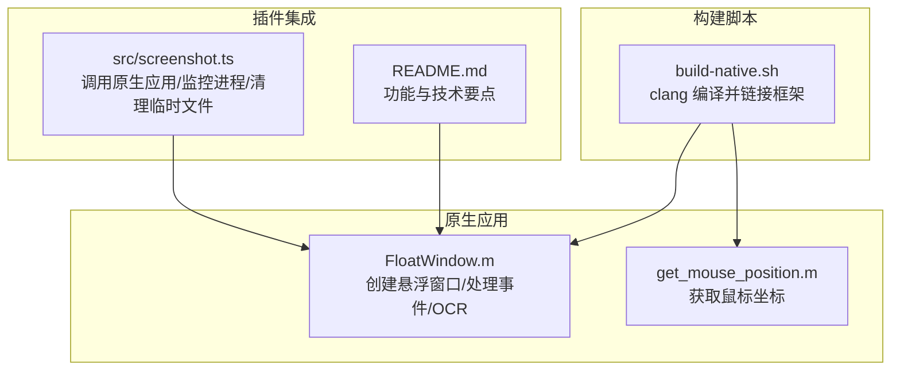
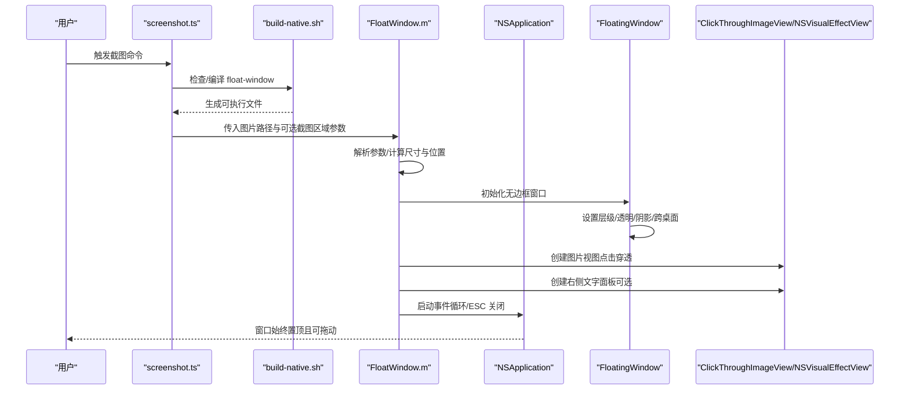
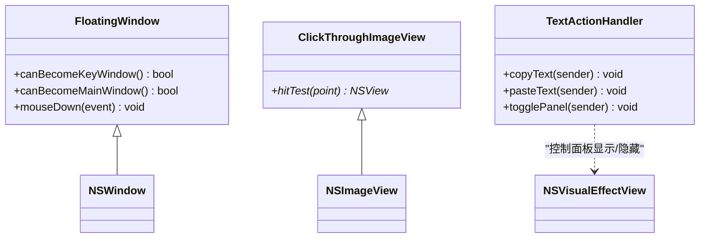
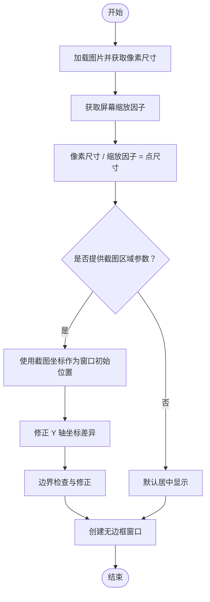
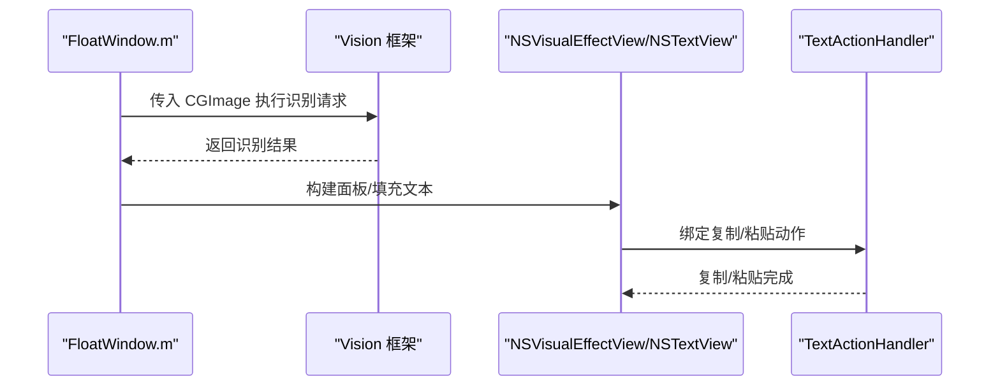
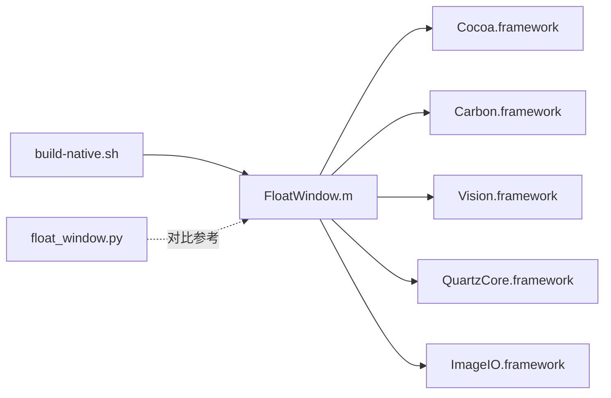

# 悬浮窗口

<cite>
**本文引用的文件**
- [FloatWindow.m](file://FloatWindow.m)
- [build-native.sh](file://build-native.sh)
- [README.md](file://README.md)
- [float_window.py](file://float_window.py)
- [src/screenshot.ts](file://src/screenshot.ts)
- [get_mouse_position.m](file://get_mouse_position.m)
</cite>

## 目录
1. [简介](#简介)
2. [项目结构](#项目结构)
3. [核心组件](#核心组件)
4. [架构总览](#架构总览)
5. [详细组件分析](#详细组件分析)
6. [依赖关系分析](#依赖关系分析)
7. [性能考量](#性能考量)
8. [故障排查指南](#故障排查指南)
9. [结论](#结论)
10. [附录](#附录)

## 简介
本项目通过原生 Objective-C 应用在 macOS 上创建“无边框、可点击穿透”的悬浮窗口，用于展示截图并提供 OCR 文字识别与交互面板。文档围绕以下目标展开：
- 解释 NSWindowStyleMaskBorderless 如何实现无边框效果
- 解释 NSFloatingWindowLevel 如何确保窗口始终置顶
- 解释 setIgnoresMouseEvents 如何实现点击穿透
- 分析窗口初始化时如何根据传入的截图区域参数定位位置，并处理 Retina 屏幕下的坐标系统转换
- 说明 build-native.sh 如何使用 clang 编译并链接 Cocoa、Vision 等框架
- 结合代码说明窗口阴影、透明背景与跨桌面显示（NSWindowCollectionBehaviorCanJoinAllSpaces）的实现
- 常见问题与性能建议

## 项目结构
- FloatWindow.m：核心原生应用，负责创建悬浮窗口、处理输入事件、执行 OCR、构建 UI 面板
- build-native.sh：编译脚本，使用 clang 链接 Cocoa、Carbon、Vision、QuartzCore、ImageIO 等框架
- README.md：项目说明与技术要点
- float_window.py：Python 版本的悬浮窗口实现（对比参考）
- src/screenshot.ts：Raycast 插件脚本，负责调用原生应用、监控进程与清理临时文件
- get_mouse_position.m：辅助工具，输出当前鼠标坐标

图表来源
- [FloatWindow.m](file://FloatWindow.m#L179-L212)
- [build-native.sh](file://build-native.sh#L1-L26)
- [src/screenshot.ts](file://src/screenshot.ts#L273-L313)
- [README.md](file://README.md#L46-L61)

章节来源
- [FloatWindow.m](file://FloatWindow.m#L179-L212)
- [build-native.sh](file://build-native.sh#L1-L26)
- [README.md](file://README.md#L1-L61)

## 核心组件
- FloatingWindow：继承自 NSWindow，禁用键盘/主窗口焦点，支持按住 Command 拖动
- ClickThroughImageView：继承自 NSImageView，重写 hitTest 返回 nil 实现点击穿透
- TextActionHandler：处理复制/粘贴/切换面板等动作
- OCR 识别：基于 Vision 框架对图片进行文字识别
- 主流程：解析参数、计算窗口位置与尺寸、创建窗口、设置层级与行为、添加视图与交互、启动事件循环

章节来源
- [FloatWindow.m](file://FloatWindow.m#L154-L167)
- [FloatWindow.m](file://FloatWindow.m#L169-L177)
- [FloatWindow.m](file://FloatWindow.m#L1-L56)
- [FloatWindow.m](file://FloatWindow.m#L85-L152)
- [FloatWindow.m](file://FloatWindow.m#L179-L212)

## 架构总览
下图展示了从 Raycast 插件到原生悬浮窗口的调用链路与关键交互点。

图表来源
- [src/screenshot.ts](file://src/screenshot.ts#L273-L313)
- [build-native.sh](file://build-native.sh#L1-L26)
- [FloatWindow.m](file://FloatWindow.m#L179-L212)
- [FloatWindow.m](file://FloatWindow.m#L268-L302)
- [FloatWindow.m](file://FloatWindow.m#L325-L353)
- [FloatWindow.m](file://FloatWindow.m#L422-L464)

## 详细组件分析

### 1) 无边框窗口与点击穿透
- 无边框：通过 styleMask 指定 NSWindowStyleMaskBorderless 创建无边框窗口
- 点击穿透：通过重写 NSImageView 的 hitTest 返回 nil，使图片区域的点击事件透传给底层应用；同时设置 window 的 ignoresMouseEvents 控制整体穿透行为
- 边缘拖动：通过在窗口边缘 10px 区域放置一个透明视图，使用 Tracking Area 与事件监视器实现拖动逻辑

图表来源
- [FloatWindow.m](file://FloatWindow.m#L154-L167)
- [FloatWindow.m](file://FloatWindow.m#L169-L177)
- [FloatWindow.m](file://FloatWindow.m#L1-L56)
- [FloatWindow.m](file://FloatWindow.m#L325-L353)

章节来源
- [FloatWindow.m](file://FloatWindow.m#L154-L167)
- [FloatWindow.m](file://FloatWindow.m#L169-L177)
- [FloatWindow.m](file://FloatWindow.m#L395-L422)

### 2) 窗口层级与置顶
- 层级设置：通过 setLevel 指定 NSFloatingWindowLevel，确保窗口始终置顶于其他应用之上
- 跨桌面显示：通过 setCollectionBehavior 设置 NSWindowCollectionBehaviorCanJoinAllSpaces 与 NSWindowCollectionBehaviorStationary，使窗口可在所有桌面之间显示且保持固定

章节来源
- [FloatWindow.m](file://FloatWindow.m#L274-L302)

### 3) Retina 坐标系统与 1:1 显示
- 像素尺寸获取：遍历图片的图像表示，获取像素宽高，从而实现 1:1 显示
- 缩放因子换算：读取屏幕 backingScaleFactor，将像素尺寸换算为点尺寸，保证在不同分辨率下视觉一致
- 截图区域定位：若提供截图区域参数，则直接使用截图坐标作为窗口初始位置；同时修正 Y 轴坐标差异，确保窗口正确对齐截图区域

图表来源
- [FloatWindow.m](file://FloatWindow.m#L179-L212)
- [FloatWindow.m](file://FloatWindow.m#L212-L235)
- [FloatWindow.m](file://FloatWindow.m#L234-L245)
- [FloatWindow.m](file://FloatWindow.m#L247-L277)
- [FloatWindow.m](file://FloatWindow.m#L268-L277)

章节来源
- [FloatWindow.m](file://FloatWindow.m#L179-L212)
- [FloatWindow.m](file://FloatWindow.m#L212-L235)
- [FloatWindow.m](file://FloatWindow.m#L234-L245)
- [FloatWindow.m](file://FloatWindow.m#L247-L277)

### 4) 文字识别与交互面板
- OCR：使用 Vision 框架对图片进行文字识别，设置识别语言与置信度阈值，拼接候选结果
- 面板布局：右侧浮动面板，支持标题、滚动文本视图、复制/粘贴按钮；支持淡入淡出动画与隐藏显示
- 文本操作：通过 TextActionHandler 实现复制到剪贴板与模拟粘贴快捷键（Cmd+V）

图表来源
- [FloatWindow.m](file://FloatWindow.m#L85-L152)
- [FloatWindow.m](file://FloatWindow.m#L325-L353)
- [FloatWindow.m](file://FloatWindow.m#L395-L422)
- [FloatWindow.m](file://FloatWindow.m#L1-L56)

章节来源
- [FloatWindow.m](file://FloatWindow.m#L85-L152)
- [FloatWindow.m](file://FloatWindow.m#L325-L353)
- [FloatWindow.m](file://FloatWindow.m#L395-L422)
- [FloatWindow.m](file://FloatWindow.m#L1-L56)

### 5) 编译与链接（build-native.sh）
- 使用 clang 编译 FloatWindow.m
- 链接框架：Cocoa、Carbon、Vision、QuartzCore、ImageIO
- 成功后赋予可执行权限，失败则输出错误并终止

章节来源
- [build-native.sh](file://build-native.sh#L1-L26)

### 6) 与 Raycast 插件的集成
- 自动编译：若未找到可执行文件，脚本会在项目根目录执行 build-native.sh 并重新查找
- 进程监控：使用 AppleScript 监控原生应用进程，退出后清理临时文件
- 功能声明：README 中明确列出点击穿透、始终置顶、1:1 显示、ESC 关闭等特性

章节来源
- [src/screenshot.ts](file://src/screenshot.ts#L273-L313)
- [src/screenshot.ts](file://src/screenshot.ts#L342-L390)
- [README.md](file://README.md#L46-L61)

## 依赖关系分析
- FloatWindow.m 依赖 Cocoa、Carbon、Vision、QuartzCore、ImageIO 等框架
- 编译脚本 build-native.sh 显式指定这些框架
- Python 版本 float_window.py 提供了等价能力的参考实现（便于理解行为差异）

图表来源
- [FloatWindow.m](file://FloatWindow.m#L1-L7)
- [build-native.sh](file://build-native.sh#L1-L26)
- [float_window.py](file://float_window.py#L1-L19)

章节来源
- [FloatWindow.m](file://FloatWindow.m#L1-L7)
- [build-native.sh](file://build-native.sh#L1-L26)
- [float_window.py](file://float_window.py#L1-L19)

## 性能考量
- 避免过度使用视觉效果：如阴影、圆角、模糊等可能影响渲染性能，应按需启用并在不需要时关闭
- 事件轮询频率：定时器周期过短会增加 CPU 占用，可根据需求调整
- 图片尺寸与缩放：确保 1:1 显示时避免不必要的缩放与重采样
- 文字面板：滚动视图与文本容器的尺寸与内边距会影响绘制开销

## 故障排查指南
- 编译失败（缺少框架）
  - 现象：clang 报告找不到某个框架
  - 排查：确认 build-native.sh 中已包含对应框架；macOS SDK 是否安装完整
  - 参考：[build-native.sh](file://build-native.sh#L1-L26)
- 窗口无法置顶
  - 现象：窗口被其他应用遮挡
  - 排查：确认 setLevel 已设置为 NSFloatingWindowLevel；检查系统权限与窗口集合行为
  - 参考：[FloatWindow.m](file://FloatWindow.m#L274-L302)
- 点击穿透无效
  - 现象：图片区域仍拦截点击
  - 排查：确认 ClickThroughImageView 的 hitTest 返回 nil；确认 window 的 ignoresMouseEvents 设置
  - 参考：[FloatWindow.m](file://FloatWindow.m#L169-L177), [FloatWindow.m](file://FloatWindow.m#L395-L422)
- Retina 坐标错位
  - 现象：窗口位置与截图区域不匹配
  - 排查：确保使用像素尺寸与缩放因子换算为点尺寸；修正 Y 轴坐标差异
  - 参考：[FloatWindow.m](file://FloatWindow.m#L179-L212), [FloatWindow.m](file://FloatWindow.m#L212-L235), [FloatWindow.m](file://FloatWindow.m#L234-L245)
- ESC 关闭无效
  - 现象：按 ESC 无反应
  - 排查：确认事件轮询与 ESC 键检测逻辑正常；确保应用处于前台
  - 参考：[FloatWindow.m](file://FloatWindow.m#L422-L464)

章节来源
- [build-native.sh](file://build-native.sh#L1-L26)
- [FloatWindow.m](file://FloatWindow.m#L169-L177)
- [FloatWindow.m](file://FloatWindow.m#L179-L212)
- [FloatWindow.m](file://FloatWindow.m#L212-L235)
- [FloatWindow.m](file://FloatWindow.m#L234-L245)
- [FloatWindow.m](file://FloatWindow.m#L274-L302)
- [FloatWindow.m](file://FloatWindow.m#L422-L464)

## 结论
本项目通过 Cocoa 与 Vision 框架实现了高性能、低耦合的悬浮窗口：无边框、点击穿透、始终置顶、跨桌面显示，并在 Retina 屏幕下正确处理坐标系统。配合 Raycast 插件，形成完整的截图悬浮展示与 OCR 交互体验。建议在实际部署中关注编译框架完整性、窗口层级与事件处理的稳定性，并根据设备性能适度优化视觉效果。

## 附录
- 获取鼠标位置：get_mouse_position.m 输出当前鼠标坐标，可用于调试窗口定位
- Python 对比实现：float_window.py 提供了等价能力的参考实现，便于理解行为差异

章节来源
- [get_mouse_position.m](file://get_mouse_position.m#L1-L10)
- [float_window.py](file://float_window.py#L1-L19)
- [float_window.py](file://float_window.py#L21-L62)
- [float_window.py](file://float_window.py#L64-L98)