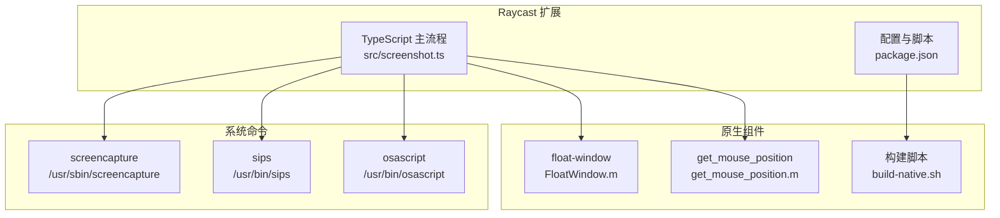
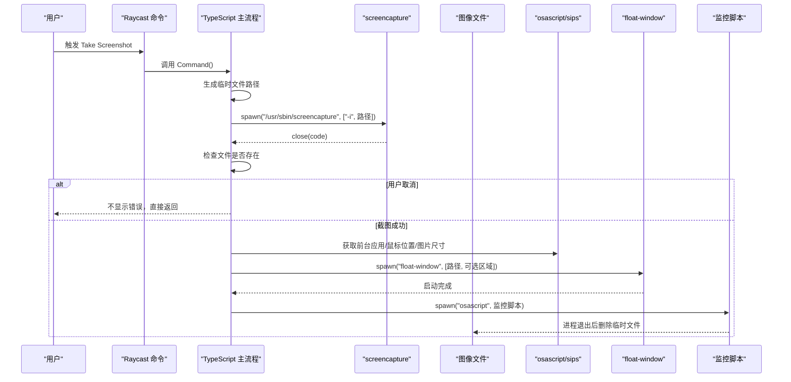
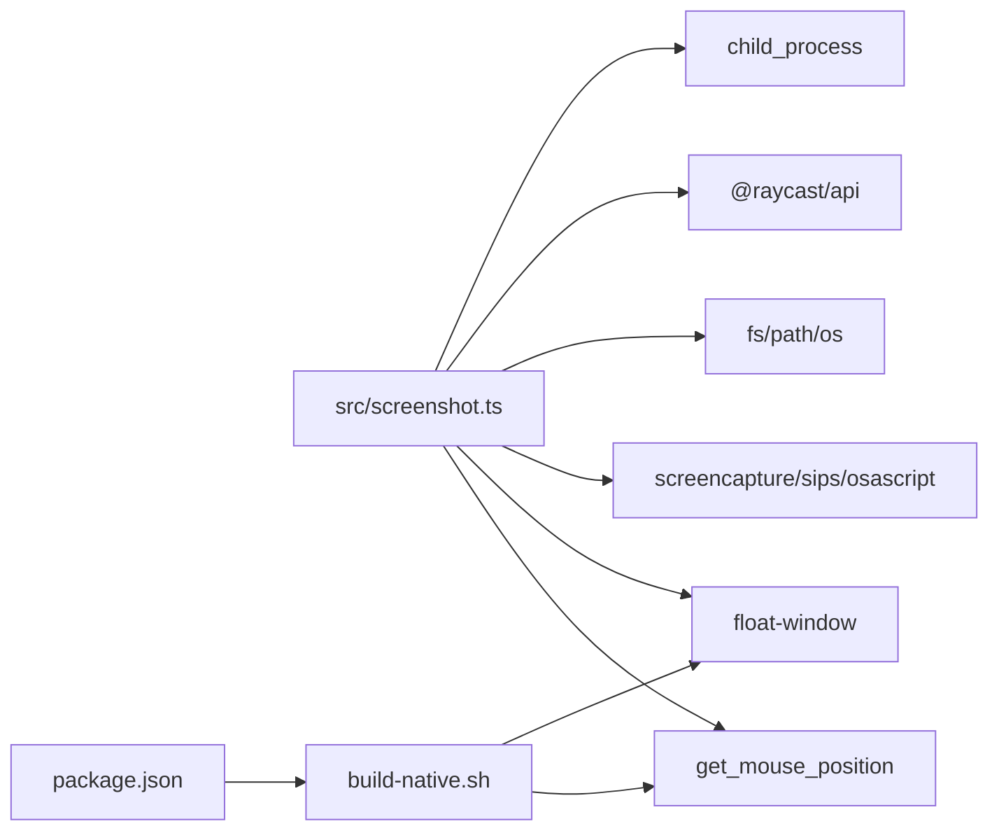

# 截图功能

<cite>
**本文引用的文件列表**
- [src/screenshot.ts](file://src/screenshot.ts)
- [README.md](file://README.md)
- [package.json](file://package.json)
- [build-native.sh](file://build-native.sh)
- [FloatWindow.m](file://FloatWindow.m)
- [get_mouse_position.m](file://get_mouse_position.m)
- [tsconfig.json](file://tsconfig.json)
- [raycast-env.d.ts](file://raycast-env.d.ts)
- [test_position.sh](file://test_position.sh)
</cite>

## 目录
1. [简介](#简介)
2. [项目结构](#项目结构)
3. [核心组件](#核心组件)
4. [架构总览](#架构总览)
5. [详细组件分析](#详细组件分析)
6. [依赖关系分析](#依赖关系分析)
7. [性能考量](#性能考量)
8. [故障排查指南](#故障排查指南)
9. [结论](#结论)

## 简介
本文件围绕 Raycast 插件中的截图功能展开，重点解释如何通过 TypeScript 使用 child_process.spawn 调用系统命令 /usr/sbin/screencapture 实现交互式区域截图；说明临时文件路径生成策略、用户取消行为的判断逻辑（基于文件存在性而非退出码）、在 Raycast 环境中正确调用系统命令的方式；对比 spawn 与 exec 的差异及使用完整路径规避环境变量问题；展示 Promise 封装的进程调用机制与异常处理策略；并说明截图完成后如何将图像路径与截图区域信息传递给悬浮窗口原生应用，确保数据流完整。同时提供常见问题与性能优化建议。

## 项目结构
该插件采用“TypeScript + 原生组件”的混合架构：
- TypeScript 主流程负责生成临时文件、调用 screencapture、解析尺寸与鼠标位置、隐藏启动台、调用悬浮窗口原生应用并监控其生命周期以清理临时文件。
- 原生组件由 Objective-C 编写，提供悬浮窗口能力（点击穿透、始终置顶、ESC 关闭、1:1 显示等）。
- 构建脚本负责编译原生组件，确保可执行文件可用。

图表来源
- [src/screenshot.ts](file://src/screenshot.ts#L1-L114)
- [package.json](file://package.json#L1-L34)
- [build-native.sh](file://build-native.sh#L1-L26)
- [FloatWindow.m](file://FloatWindow.m#L179-L267)
- [get_mouse_position.m](file://get_mouse_position.m#L1-L10)

章节来源
- [README.md](file://README.md#L1-L61)
- [package.json](file://package.json#L1-L34)

## 核心组件
- 截图主流程：生成临时文件路径、调用 screencapture、解析尺寸与鼠标位置、隐藏启动台、调用悬浮窗口原生应用、监控并清理临时文件。
- 原生悬浮窗口：接收图像路径与可选的截图区域参数，创建点击穿透、始终置顶的悬浮窗口，支持 ESC 关闭与拖动。
- 原生鼠标位置工具：获取当前鼠标坐标，辅助计算截图区域的窗口位置。
- 构建脚本：编译 float-window 与 get_mouse_position，确保可执行文件可用。

章节来源
- [src/screenshot.ts](file://src/screenshot.ts#L1-L114)
- [FloatWindow.m](file://FloatWindow.m#L179-L267)
- [get_mouse_position.m](file://get_mouse_position.m#L1-L10)
- [build-native.sh](file://build-native.sh#L1-L26)

## 架构总览
下图展示了从触发命令到悬浮窗口显示的端到端流程，以及关键节点的数据传递与控制流。

图表来源
- [src/screenshot.ts](file://src/screenshot.ts#L1-L114)
- [src/screenshot.ts](file://src/screenshot.ts#L116-L160)
- [src/screenshot.ts](file://src/screenshot.ts#L162-L236)
- [src/screenshot.ts](file://src/screenshot.ts#L238-L390)
- [FloatWindow.m](file://FloatWindow.m#L179-L267)

## 详细组件分析

### 临时文件路径生成与清理策略
- 生成规则：使用系统临时目录与时间戳拼接唯一 PNG 文件名，避免冲突。
- 清理策略：
  - 异常时主动删除临时文件；
  - 成功后通过原生监控脚本在悬浮窗口进程退出后删除临时文件，确保即使用户未手动关闭也会清理。

章节来源
- [src/screenshot.ts](file://src/screenshot.ts#L1-L39)
- [src/screenshot.ts](file://src/screenshot.ts#L85-L114)
- [src/screenshot.ts](file://src/screenshot.ts#L342-L390)

### 用户取消行为的判断逻辑（基于文件存在性）
- screencapture 交互式截图时，若用户取消，进程会以非零退出码结束，但此时临时文件不会被创建。
- 判断方式：监听 close 事件后检查目标文件是否存在，存在则视为成功，否则视为取消。
- 结果处理：取消时不弹错误提示，直接返回。

章节来源
- [src/screenshot.ts](file://src/screenshot.ts#L1-L39)
- [src/screenshot.ts](file://src/screenshot.ts#L85-L114)

### 为什么使用 spawn 而非 exec
- spawn 的优势：
  - 对于交互式命令（如 screencapture -i），用户取消时会产生非零退出码，若使用 exec，错误处理会更复杂且易误判。
  - spawn 更适合需要精确控制子进程生命周期与事件回调的场景。
- exec 的替代：在需要解析输出（如 sips、osascript）时使用 execAsync，便于获取标准输出与错误信息。

章节来源
- [src/screenshot.ts](file://src/screenshot.ts#L1-L39)
- [src/screenshot.ts](file://src/screenshot.ts#L116-L160)

### 使用完整路径规避环境变量问题
- screencapture 与 sips、osascript 等系统命令均使用绝对路径，避免 Raycast 运行时环境 PATH 不包含 /usr/sbin 或 /usr/bin 导致找不到命令的问题。
- 在调用原生组件时，同样使用绝对路径或通过多处查找策略定位可执行文件，确保在不同部署环境下均可运行。

章节来源
- [src/screenshot.ts](file://src/screenshot.ts#L1-L39)
- [src/screenshot.ts](file://src/screenshot.ts#L238-L313)

### Promise 封装的进程调用机制与异常处理
- Promise 封装：
  - screencapture 使用 spawn 并在 close 事件中 resolve/reject；
  - 其他外部命令（sips、osascript、原生工具）使用 execAsync 获取输出，便于后续解析。
- 异常处理：
  - 用户取消：捕获错误并忽略提示；
  - 其他错误：弹出失败提示，并在必要时删除临时文件；
  - 原生组件缺失：给出明确提示并引导运行构建脚本。

章节来源
- [src/screenshot.ts](file://src/screenshot.ts#L1-L39)
- [src/screenshot.ts](file://src/screenshot.ts#L85-L114)
- [src/screenshot.ts](file://src/screenshot.ts#L116-L160)
- [src/screenshot.ts](file://src/screenshot.ts#L162-L236)
- [src/screenshot.ts](file://src/screenshot.ts#L238-L313)

### 截图区域信息与悬浮窗口数据流
- 截图区域信息来源：
  - 通过 sips 获取图片像素宽高；
  - 通过 get_mouse_position 获取鼠标坐标，以鼠标为中心推导窗口位置；
  - 若失败则回退到默认居中显示。
- 数据传递：
  - 将图像路径与可选的截图区域参数（x, y, width, height）传入 float-window；
  - float-window 接收参数后，按 1:1 显示并修正坐标系差异，确保悬浮窗口与截图区域对齐。
- 生命周期管理：
  - 启动后通过 osascript 后台监控悬浮窗口进程，进程退出即删除临时文件，保证资源回收。

章节来源
- [src/screenshot.ts](file://src/screenshot.ts#L41-L83)
- [src/screenshot.ts](file://src/screenshot.ts#L116-L160)
- [src/screenshot.ts](file://src/screenshot.ts#L162-L236)
- [src/screenshot.ts](file://src/screenshot.ts#L238-L390)
- [FloatWindow.m](file://FloatWindow.m#L179-L267)

### 原生悬浮窗口功能要点
- 点击穿透：图片区域点击穿透，不影响底层应用；
- 置顶显示：使用浮动窗口层级，始终在最上层；
- ESC 关闭：检测 ESC 键，关闭窗口；
- 1:1 显示：按像素尺寸显示，避免缩放；
- 边缘拖动：窗口边缘 10px 区域可拖动窗口；
- OCR 面板：右侧显示识别到的文字，支持复制与粘贴。

章节来源
- [README.md](file://README.md#L1-L61)
- [FloatWindow.m](file://FloatWindow.m#L179-L267)
- [FloatWindow.m](file://FloatWindow.m#L268-L464)

### 原生组件构建与查找策略
- 构建脚本：clang 编译 float-window 与 get_mouse_position，赋予可执行权限；
- 查找策略：优先项目根目录，其次多处可能路径，再尝试 which，最后自动编译；
- 调试：提供测试脚本 test_position.sh，便于验证位置修正效果。

章节来源
- [build-native.sh](file://build-native.sh#L1-L26)
- [src/screenshot.ts](file://src/screenshot.ts#L238-L313)
- [test_position.sh](file://test_position.sh#L1-L15)

## 依赖关系分析
- TypeScript 主流程依赖：
  - child_process.spawn/exec：调用系统命令与原生组件；
  - @raycast/api：Toast 提示与命令入口；
  - fs/path/os：文件系统与路径操作；
  - osascript/sips/screencapture：系统工具；
  - float-window/get_mouse_position：原生组件。
- 构建脚本依赖：
  - clang 与 Cocoa/Carbon 等框架；
  - build-native.sh 与 FloatWindow.m/get_mouse_position.m。

图表来源
- [src/screenshot.ts](file://src/screenshot.ts#L1-L114)
- [package.json](file://package.json#L1-L34)
- [build-native.sh](file://build-native.sh#L1-L26)

章节来源
- [src/screenshot.ts](file://src/screenshot.ts#L1-L114)
- [package.json](file://package.json#L1-L34)

## 性能考量
- 避免频繁磁盘 I/O：
  - 仅在截图完成后才写入临时文件，尽量减少中间步骤的文件读写；
  - 通过原生监控脚本在进程退出后一次性清理，避免重复轮询。
- 资源回收：
  - 严格遵循“失败清理、成功延时清理”的策略，降低磁盘占用。
- 建议：
  - 定期清理旧的临时文件，防止长期积累导致磁盘压力增大；
  - 在开发阶段使用 test_position.sh 快速验证位置修正，减少反复截图带来的 I/O。

章节来源
- [src/screenshot.ts](file://src/screenshot.ts#L342-L390)
- [test_position.sh](file://test_position.sh#L1-L15)

## 故障排查指南
- 临时文件未清理：
  - 确认悬浮窗口原生进程是否正常退出，监控脚本依赖进程退出触发清理；
  - 如需手动清理，可在终端执行删除对应临时文件。
- screencapture 命令权限问题：
  - 确认 /usr/sbin/screencapture 可执行且路径正确；
  - 在 Raycast 环境中，建议直接使用绝对路径调用，避免 PATH 问题。
- 原生组件缺失：
  - 运行构建脚本编译 float-window 与 get_mouse_position；
  - 确认可执行文件存在于预期路径，或通过 which 查找；
  - 若自动编译失败，检查 clang 与相关框架是否安装。
- 截图区域位置偏差：
  - 使用 test_position.sh 验证位置修正逻辑；
  - 检查坐标系差异与屏幕缩放因子，确保按像素尺寸 1:1 显示。
- 调试建议：
  - 使用 osascript 进行交互式调试，确认系统事件与键盘事件响应；
  - 在 TypeScript 中增加日志输出，定位路径查找与参数传递问题。

章节来源
- [src/screenshot.ts](file://src/screenshot.ts#L238-L313)
- [src/screenshot.ts](file://src/screenshot.ts#L342-L390)
- [build-native.sh](file://build-native.sh#L1-L26)
- [test_position.sh](file://test_position.sh#L1-L15)

## 结论
本截图功能通过 TypeScript 与原生组件的协同，实现了在 Raycast 环境中稳定、可靠的交互式区域截图与悬浮显示。关键点在于：
- 使用 spawn 调用 screencapture 并以文件存在性判断用户取消；
- 通过完整路径规避环境变量问题；
- 以 Promise 封装进程调用并完善异常处理；
- 将图像路径与截图区域信息传递给悬浮窗口原生应用，确保数据流完整；
- 通过原生监控脚本在进程退出后清理临时文件，保障资源回收。

配合构建脚本与调试工具，开发者可快速定位问题并优化性能与稳定性。