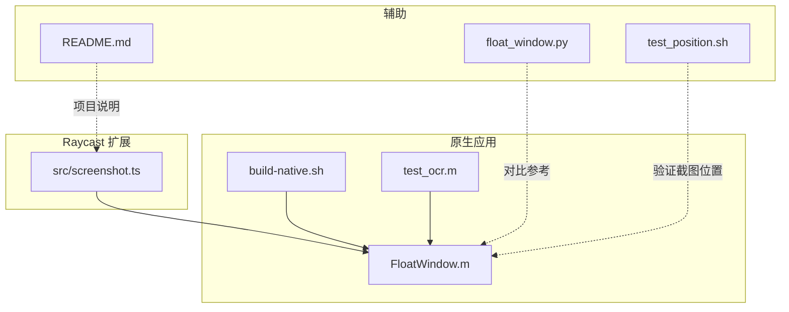
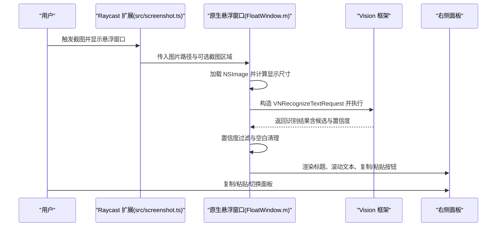
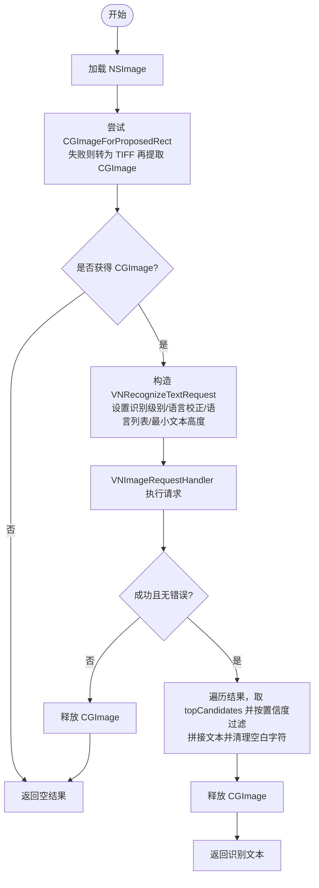
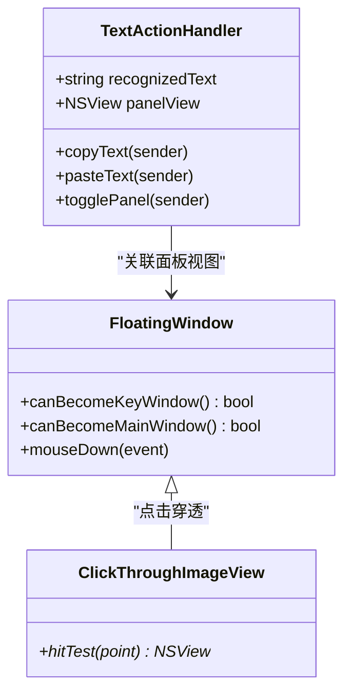
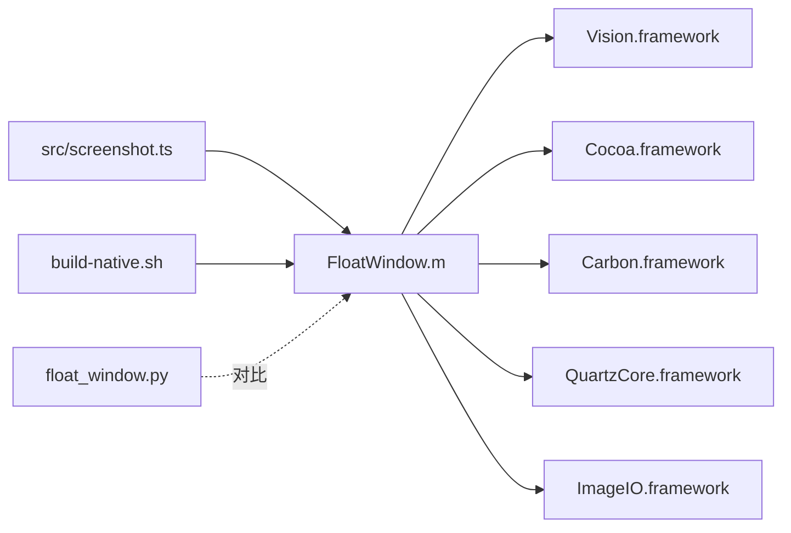

# 文字识别

<cite>
**本文引用的文件**
- [FloatWindow.m](file://FloatWindow.m)
- [test_ocr.m](file://test_ocr.m)
- [README.md](file://README.md)
- [build-native.sh](file://build-native.sh)
- [src/screenshot.ts](file://src/screenshot.ts)
- [float_window.py](file://float_window.py)
- [test_position.sh](file://test_position.sh)
</cite>

## 目录
1. [简介](#简介)
2. [项目结构](#项目结构)
3. [核心组件](#核心组件)
4. [架构总览](#架构总览)
5. [详细组件分析](#详细组件分析)
6. [依赖关系分析](#依赖关系分析)
7. [性能考量](#性能考量)
8. [故障排查指南](#故障排查指南)
9. [结论](#结论)
10. [附录](#附录)

## 简介
本文件围绕在 FloatWindow.m 中集成 Apple Vision 框架实现 OCR 文字识别展开，系统性说明以下内容：
- VNRecognizeTextRequest 请求的配置要点：设置 recognitionLevel 为更准确的级别、启用语言校正、支持中英文识别的语言列表。
- 从 NSImage 到 CGImage 的转换流程，以及通过 VNImageRequestHandler 执行识别请求。
- 识别结果的后处理逻辑：置信度阈值过滤（confidence > 0.1）、空白字符清理。
- 结合 test_ocr.m 验证 OCR 功能的独立测试方法。
- 识别结果在悬浮窗口右侧面板中的展示方式及复制/粘贴按钮交互。
- 常见问题与优化建议：中文识别率低、内存泄漏、性能阻塞等。

## 项目结构
该项目由 TypeScript/Raycast 调用原生 Objective-C 应用实现悬浮窗口显示截图，并在其中集成 Vision OCR。核心文件与职责如下：
- FloatWindow.m：原生悬浮窗口应用入口，负责加载图片、调用 Vision OCR、构建右侧面板、提供复制/粘贴交互。
- test_ocr.m：独立的 OCR 测试程序，复用 FloatWindow.m 中的识别逻辑，便于离线验证。
- build-native.sh：编译原生二进制（float-window）所需的脚本。
- src/screenshot.ts：Raycast 扩展的主逻辑，负责调用 float-window 并管理生命周期。
- float_window.py：Python 版本的悬浮窗口实现（对比参考）。
- test_position.sh：测试截图位置修复效果的脚本。

图表来源
- [src/screenshot.ts](file://src/screenshot.ts#L238-L313)
- [FloatWindow.m](file://FloatWindow.m#L179-L212)
- [test_ocr.m](file://test_ocr.m#L74-L92)
- [build-native.sh](file://build-native.sh#L1-L26)
- [README.md](file://README.md#L1-L61)

章节来源
- [README.md](file://README.md#L1-L61)
- [src/screenshot.ts](file://src/screenshot.ts#L238-L313)
- [build-native.sh](file://build-native.sh#L1-L26)

## 核心组件
- TextActionHandler：封装复制/粘贴/切换面板等交互行为，持有识别出的文字与面板视图。
- RecognizedTextFromImage：OCR 主流程，负责 NSImage -> CGImage 转换、配置 VNRecognizeTextRequest、执行识别、后处理结果。
- 悬浮窗口与右侧面板：在图片右侧展示识别结果，包含标题、滚动文本视图、复制/粘贴按钮。
- 独立测试 test_ocr.m：最小化验证路径，便于快速定位识别问题。

章节来源
- [FloatWindow.m](file://FloatWindow.m#L1-L56)
- [FloatWindow.m](file://FloatWindow.m#L85-L177)
- [FloatWindow.m](file://FloatWindow.m#L274-L398)
- [test_ocr.m](file://test_ocr.m#L1-L92)

## 架构总览
下图展示了从 Raycast 调用原生悬浮窗口应用，到加载图片、执行 OCR、展示结果与交互的整体流程。

图表来源
- [src/screenshot.ts](file://src/screenshot.ts#L238-L313)
- [FloatWindow.m](file://FloatWindow.m#L179-L212)
- [FloatWindow.m](file://FloatWindow.m#L274-L398)
- [FloatWindow.m](file://FloatWindow.m#L85-L177)

## 详细组件分析

### 组件一：OCR 请求配置与执行
- 请求级别与语言校正
  - 将 recognitionLevel 设为更准确的级别，提升整体识别质量。
  - 启用 usesLanguageCorrection，改善拼写与语法。
- 语言列表
  - 设置 recognitionLanguages 为 zh-Hans、zh-Hant、en-US、en-GB，覆盖中英文场景。
- 文本高度与最小文本高度
  - 将 minimumTextHeight 设为 0，交由系统自动检测文本高度，避免误判。
- 执行与错误处理
  - 使用 VNImageRequestHandler 以 CGImage 初始化处理器，执行单个请求。
  - 若失败或返回错误，记录日志并释放 CGImage，避免泄漏。

图表来源
- [FloatWindow.m](file://FloatWindow.m#L85-L177)
- [test_ocr.m](file://test_ocr.m#L1-L72)

章节来源
- [FloatWindow.m](file://FloatWindow.m#L85-L177)
- [test_ocr.m](file://test_ocr.m#L1-L72)

### 组件二：NSImage 到 CGImage 的转换流程
- 优先使用 NSImage 的 CGImageForProposedRect 获取 CGImage。
- 若失败，读取 TIFFRepresentation，通过 CGImageSource 提取首帧 CGImage。
- 成功后根据标记决定是否释放 CGImage，确保资源安全。

章节来源
- [FloatWindow.m](file://FloatWindow.m#L85-L122)
- [test_ocr.m](file://test_ocr.m#L1-L26)

### 组件三：识别结果后处理逻辑
- 置信度阈值过滤：仅保留置信度高于 0.1 的候选文本。
- 拼接与换行：逐条候选文本之间插入换行符，形成多行结果。
- 空白字符清理：去除首尾空白与换行，保证面板显示整洁。

章节来源
- [FloatWindow.m](file://FloatWindow.m#L121-L177)
- [test_ocr.m](file://test_ocr.m#L40-L72)

### 组件四：悬浮窗口与右侧面板展示
- 窗口与图片视图
  - 创建无边框窗口，设置层级为浮动，背景透明，阴影开启，集合行为允许跨空间与常驻。
  - 图片视图采用点击穿透，避免遮挡底层应用交互。
- 右侧面板
  - 标题根据是否有识别结果动态变化；有结果时展示滚动文本视图与复制/粘贴按钮。
  - 无结果时显示提示信息，帮助用户感知功能存在。
- 复制/粘贴交互
  - 复制：写入通用剪贴板。
  - 粘贴：先复制，再模拟 Command+V 键事件触发粘贴。

图表来源
- [FloatWindow.m](file://FloatWindow.m#L1-L56)
- [FloatWindow.m](file://FloatWindow.m#L154-L177)
- [FloatWindow.m](file://FloatWindow.m#L169-L177)

章节来源
- [FloatWindow.m](file://FloatWindow.m#L274-L398)
- [FloatWindow.m](file://FloatWindow.m#L351-L422)
- [FloatWindow.m](file://FloatWindow.m#L1-L56)

### 组件五：独立测试 test_ocr.m
- 作用：验证识别逻辑的正确性，便于在本地快速测试不同图片。
- 关键点：与 FloatWindow.m 中的识别函数共享相同的请求配置与后处理逻辑，便于一致性验证。

章节来源
- [test_ocr.m](file://test_ocr.m#L1-L92)

## 依赖关系分析
- 原生编译依赖
  - 链接框架：Cocoa、Carbon、Vision、QuartzCore、ImageIO。
- Raycast 调用链
  - 通过 TypeScript 脚本查找/编译并运行 float-window，传入图片路径与可选截图区域参数。
- Python 对比实现
  - float_window.py 提供了等价的悬浮窗口能力，便于理解与对照。

图表来源
- [src/screenshot.ts](file://src/screenshot.ts#L238-L313)
- [build-native.sh](file://build-native.sh#L1-L26)
- [float_window.py](file://float_window.py#L1-L19)

章节来源
- [build-native.sh](file://build-native.sh#L1-L26)
- [src/screenshot.ts](file://src/screenshot.ts#L238-L313)
- [float_window.py](file://float_window.py#L1-L19)

## 性能考量
- OCR 耗时较长，应避免在主线程阻塞 UI。当前实现将识别逻辑放在应用启动阶段，配合定时器轮询 ESC 键与拖拽状态，尽量减少主线程压力。
- 建议
  - 在需要时再触发识别（例如延迟识别或异步队列），避免每次窗口创建都强制执行。
  - 对于大图，可考虑降采样或裁剪 ROI，以降低识别时间。
  - 合理设置 minimumTextHeight 与语言列表，减少无效扫描区域。

章节来源
- [FloatWindow.m](file://FloatWindow.m#L179-L212)
- [FloatWindow.m](file://FloatWindow.m#L420-L461)

## 故障排查指南
- 中文识别率低
  - 已启用 usesLanguageCorrection 与多语言列表（zh-Hans、zh-Hant、en-US、en-GB），可进一步尝试提高 recognitionLevel 或增加语言候选。
  - 确认输入图像清晰、对比度良好，必要时调整分辨率或亮度/对比度。
- 内存泄漏
  - 识别流程中对 CGImage 的获取与释放路径已覆盖，确保在失败分支与成功分支均释放 CGImage。
  - 建议：在高并发或长时间运行场景下，增加日志与资源计数，确认释放路径被调用。
- OCR 执行失败
  - 检查 Vision 框架可用性与权限；查看错误日志（test_ocr.m 中已打印错误描述）。
- 窗口位置异常
  - 已针对截图区域 Y 轴进行修正，若仍异常，可通过 test_position.sh 脚本验证位置修复效果。

章节来源
- [FloatWindow.m](file://FloatWindow.m#L85-L177)
- [test_ocr.m](file://test_ocr.m#L40-L48)
- [test_position.sh](file://test_position.sh#L1-L15)

## 结论
本项目在原生悬浮窗口中集成了 Apple Vision 的 OCR 能力，实现了从 NSImage 到 CGImage 的稳健转换、准确的请求配置与后处理逻辑，并在右侧面板中提供复制/粘贴交互。通过独立测试程序 test_ocr.m，能够快速验证识别效果。针对中文识别率与内存管理等常见问题，已在实现中给出相应策略与建议。建议在实际使用中结合性能优化与用户体验需求，进一步完善识别触发时机与图像预处理。

## 附录
- 编译与运行
  - 使用 build-native.sh 编译 float-window。
  - Raycast 扩展通过 src/screenshot.ts 查找/编译并运行原生应用。
- 参考实现
  - float_window.py 提供了 Python 版本的悬浮窗口实现，便于理解窗口与事件处理。

章节来源
- [build-native.sh](file://build-native.sh#L1-L26)
- [src/screenshot.ts](file://src/screenshot.ts#L238-L313)
- [float_window.py](file://float_window.py#L21-L62)