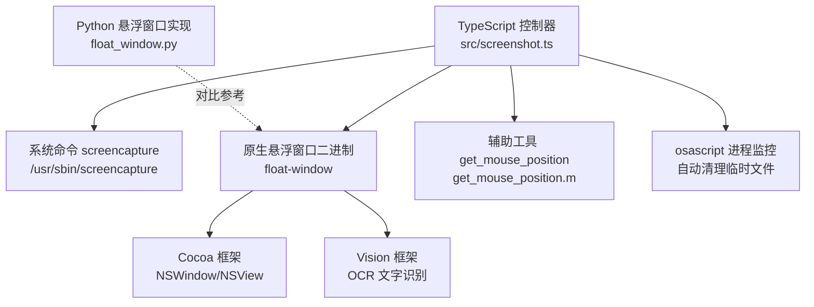
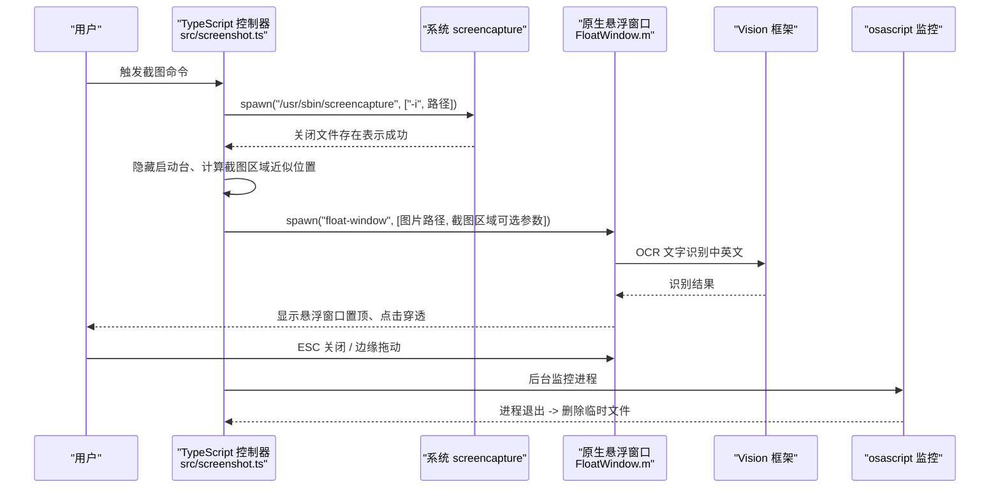
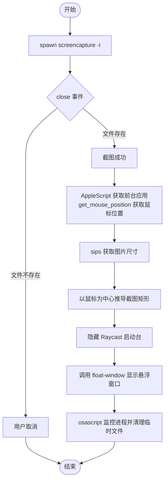
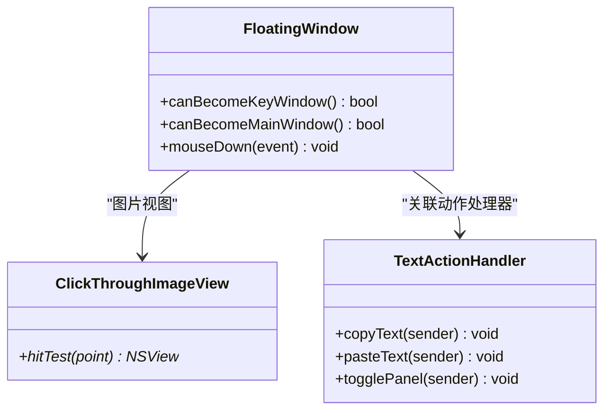
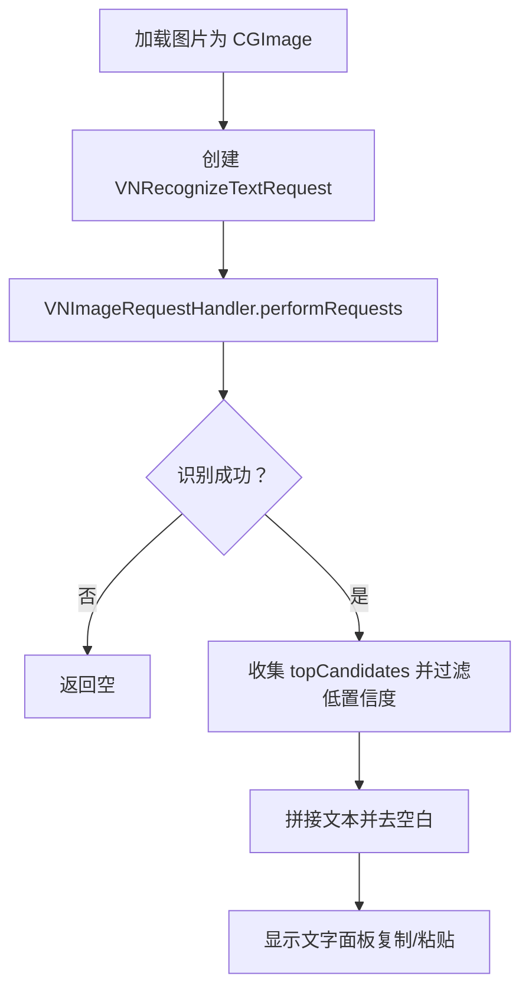
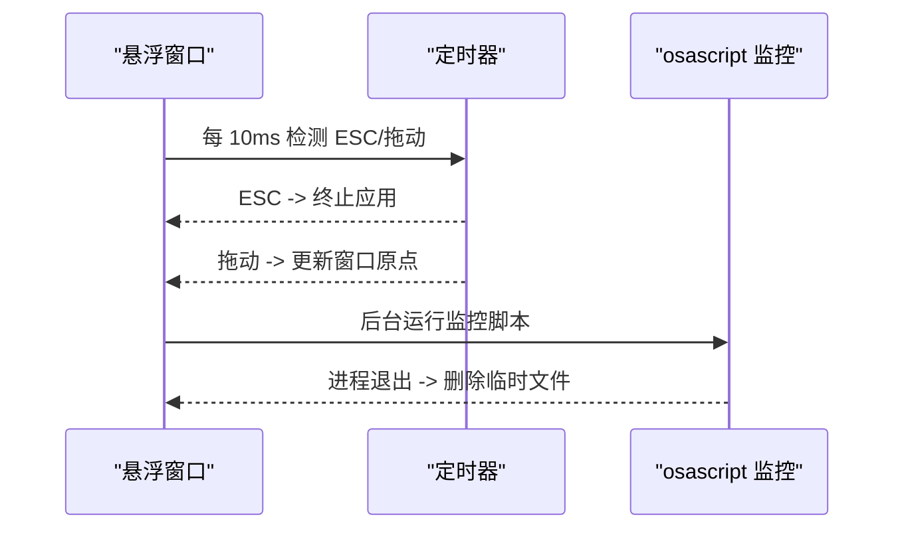
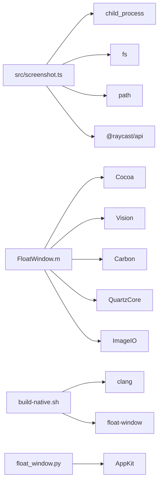

# 核心功能详解

<cite>
**本文引用的文件**
- [src/screenshot.ts](file://src/screenshot.ts)
- [FloatWindow.m](file://FloatWindow.m)
- [README.md](file://README.md)
- [build-native.sh](file://build-native.sh)
- [float_window.py](file://float_window.py)
- [get_mouse_position.m](file://get_mouse_position.m)
- [test_ocr.m](file://test_ocr.m)
- [test_position.sh](file://test_position.sh)
</cite>

## 目录
1. [简介](#简介)
2. [项目结构](#项目结构)
3. [核心组件](#核心组件)
4. [架构总览](#架构总览)
5. [详细组件分析](#详细组件分析)
6. [依赖关系分析](#依赖关系分析)
7. [性能考量](#性能考量)
8. [故障排查指南](#故障排查指南)
9. [结论](#结论)

## 简介
本文件深入解析该 Raycast 插件的四大核心功能模块：截图功能、悬浮窗口、文字识别与用户交互。重点说明如何通过 child_process.spawn 调用系统 screencapture 命令实现交互式区域选择并妥善处理用户取消；如何在 Objective-C 中利用 Cocoa 框架创建无边框悬浮窗口、设置层级与点击穿透；如何使用 Vision 框架在 Objective-C 中实现 OCR 并支持中英文识别；以及如何通过 ESC 键监听、边缘拖动与 osascript 进程监控实现完整的用户交互与自动清理策略。

## 项目结构
该项目采用“TypeScript 控制流 + 原生 Objective-C 悬浮窗口 + 辅助工具”的混合架构：
- TypeScript 负责截图触发、临时文件管理、悬浮窗口调用与进程监控。
- Objective-C 源码负责创建无边框悬浮窗口、OCR 文字识别、窗口置顶与交互。
- Shell 脚本负责编译原生二进制（悬浮窗口与鼠标位置工具）。
- Python 版本提供等价的悬浮窗口实现（便于理解与对比）。
- 测试工具与脚本辅助验证 OCR 与位置修复。

图表来源
- [src/screenshot.ts](file://src/screenshot.ts#L1-L114)
- [FloatWindow.m](file://FloatWindow.m#L179-L277)
- [build-native.sh](file://build-native.sh#L1-L26)
- [float_window.py](file://float_window.py#L1-L98)
- [get_mouse_position.m](file://get_mouse_position.m#L1-L10)

章节来源
- [README.md](file://README.md#L1-L61)
- [src/screenshot.ts](file://src/screenshot.ts#L1-L114)
- [build-native.sh](file://build-native.sh#L1-L26)

## 核心组件
- 截图功能：通过 child_process.spawn 调用 screencapture -i，等待用户完成选择；以文件存在性判断是否取消；随后隐藏启动台并调用悬浮窗口。
- 悬浮窗口：Objective-C 创建 NSWindowStyleMaskBorderless 无边框窗口，设置 NSFloatingWindowLevel 置顶，通过 setIgnoresMouseEvents 实现点击穿透；支持 ESC 关闭与边缘拖动。
- 文字识别：Vision 框架 VNRecognizeTextRequest 在 Objective-C 中执行 OCR，支持中英文语言列表与置信度过滤。
- 用户交互：ESC 键检测（NSEvent/CGEventSource）、边缘区域拖动（NSTrackingArea + NSEvent 监视）、自动清理（osascript 监控进程并删除临时文件）。

章节来源
- [src/screenshot.ts](file://src/screenshot.ts#L1-L114)
- [FloatWindow.m](file://FloatWindow.m#L179-L277)
- [test_ocr.m](file://test_ocr.m#L1-L92)
- [float_window.py](file://float_window.py#L64-L98)

## 架构总览
下图展示从用户触发到悬浮窗口显示与交互的端到端流程，包括截图、悬浮窗口、OCR 与清理策略。

图表来源
- [src/screenshot.ts](file://src/screenshot.ts#L1-L114)
- [src/screenshot.ts](file://src/screenshot.ts#L238-L390)
- [FloatWindow.m](file://FloatWindow.m#L179-L277)
- [FloatWindow.m](file://FloatWindow.m#L422-L464)
- [test_ocr.m](file://test_ocr.m#L1-L92)

## 详细组件分析

### 截图功能：交互式区域选择与异常处理
- 调用方式：使用 child_process.spawn 调用 /usr/sbin/screencapture -i，避免 exec 的非零退出码误判。
- 取消处理：通过检查目标 PNG 文件是否存在判断用户是否取消；若不存在则抛出“用户取消了截图操作”。
- 截图区域近似定位：通过 AppleScript 获取前台应用名，结合 get_mouse_position 获取鼠标位置，再用 sips 获取图片像素尺寸，以鼠标为中心推导截图矩形，作为悬浮窗口初始位置参考。
- 启动台隐藏：调用 osascript 激活 Raycast 并发送快捷键隐藏启动台。
- 错误提示与清理：捕获异常后区分“取消”与“失败”，失败时弹出 Toast 并删除临时文件。

图表来源
- [src/screenshot.ts](file://src/screenshot.ts#L1-L114)
- [src/screenshot.ts](file://src/screenshot.ts#L238-L390)
- [get_mouse_position.m](file://get_mouse_position.m#L1-L10)

章节来源
- [src/screenshot.ts](file://src/screenshot.ts#L1-L114)
- [src/screenshot.ts](file://src/screenshot.ts#L238-L390)
- [get_mouse_position.m](file://get_mouse_position.m#L1-L10)

### 悬浮窗口：无边框、置顶、点击穿透与拖动
- 无边框窗口：使用 NSWindowStyleMaskBorderless 创建窗口，设置 NSFloatingWindowLevel 确保置顶。
- 点击穿透：通过 setIgnoresMouseEvents:NO（允许边缘区域响应）与自定义 NSImageView 子类重写 hitTest 返回 nil 实现图片区域点击穿透。
- 1:1 显示：根据图片像素尺寸与屏幕缩放因子换算为点尺寸，确保视觉上 1:1。
- 置顶与集合行为：设置窗口层级与集合行为，保证跨空间与常驻。
- 边缘拖动：在窗口边缘 10px 区域内启用拖动；同时支持按住 Cmd 键拖动。
- ESC 关闭：通过定时轮询 CGEventSourceKeyState 检测 ESC 键，触发应用终止。
- 文字面板：右侧显示识别结果面板，支持复制/粘贴按钮与动画显示/隐藏。

图表来源
- [FloatWindow.m](file://FloatWindow.m#L154-L177)
- [FloatWindow.m](file://FloatWindow.m#L169-L177)
- [FloatWindow.m](file://FloatWindow.m#L1-L56)

章节来源
- [FloatWindow.m](file://FloatWindow.m#L179-L277)
- [FloatWindow.m](file://FloatWindow.m#L274-L302)
- [FloatWindow.m](file://FloatWindow.m#L300-L326)
- [FloatWindow.m](file://FloatWindow.m#L351-L373)
- [FloatWindow.m](file://FloatWindow.m#L372-L398)
- [FloatWindow.m](file://FloatWindow.m#L422-L464)

### 文字识别：Vision 框架 OCR 与复制/粘贴
- 识别请求：使用 VNRecognizeTextRequest，设置识别级别为 Accurate，开启语言纠正与最小文本高度自动检测。
- 多语言支持：设置 recognitionLanguages 为中英文（简体/繁体/美式/英式）。
- 结果处理：遍历 topCandidates 取置信度最高候选，过滤低置信度文本，拼接识别结果并去除空白字符。
- 复制/粘贴：通过 NSPasteboard 写入文本；模拟 Command+V 键事件实现粘贴。
- 面板交互：识别到文字时显示可滚动文本视图与按钮；未识别到文字时显示提示信息。

图表来源
- [FloatWindow.m](file://FloatWindow.m#L85-L122)
- [FloatWindow.m](file://FloatWindow.m#L121-L177)
- [FloatWindow.m](file://FloatWindow.m#L1-L56)
- [test_ocr.m](file://test_ocr.m#L1-L92)

章节来源
- [FloatWindow.m](file://FloatWindow.m#L85-L122)
- [FloatWindow.m](file://FloatWindow.m#L121-L177)
- [FloatWindow.m](file://FloatWindow.m#L1-L56)
- [test_ocr.m](file://test_ocr.m#L1-L92)

### 用户交互：ESC 关闭、边缘拖动与自动清理
- ESC 关闭：定时轮询 CGEventSourceKeyState 检测 ESC 键状态，满足条件即终止应用。
- 边缘拖动：在窗口边缘 10px 区域内启用拖动；同时支持按住 Cmd 键拖动；左键拖拽时根据鼠标位置与窗口帧计算新原点。
- 自动清理：使用 osascript 循环检测 float-window 进程是否存在，进程退出或报错时删除对应的临时截图文件，避免资源泄露。

图表来源
- [FloatWindow.m](file://FloatWindow.m#L422-L464)
- [src/screenshot.ts](file://src/screenshot.ts#L342-L390)

章节来源
- [FloatWindow.m](file://FloatWindow.m#L422-L464)
- [src/screenshot.ts](file://src/screenshot.ts#L342-L390)

## 依赖关系分析
- TypeScript 控制器依赖：
  - child_process.spawn/exec：调用 screencapture 与辅助工具。
  - fs：检查文件存在与删除临时文件。
  - os：生成临时文件路径。
  - path：拼接路径。
  - @raycast/api：Toast 与 UI 交互。
- 原生悬浮窗口依赖：
  - Cocoa：NSWindow/NSView/NSApplication。
  - Vision：VNRecognizeTextRequest。
  - Carbon/QuartzCore/ImageIO：事件与图像处理。
- 编译脚本依赖：
  - clang 与系统框架：编译 float-window 与 get_mouse_position。
- Python 悬浮窗口：
  - AppKit：等价的 Cocoa 实现，便于理解与对比。

图表来源
- [src/screenshot.ts](file://src/screenshot.ts#L1-L114)
- [FloatWindow.m](file://FloatWindow.m#L1-L10)
- [build-native.sh](file://build-native.sh#L1-L26)
- [float_window.py](file://float_window.py#L1-L19)

章节来源
- [src/screenshot.ts](file://src/screenshot.ts#L1-L114)
- [FloatWindow.m](file://FloatWindow.m#L1-L10)
- [build-native.sh](file://build-native.sh#L1-L26)
- [float_window.py](file://float_window.py#L1-L19)

## 性能考量
- 截图阶段：使用 spawn 与文件存在性判断，避免因非零退出码误判导致的额外开销。
- 悬浮窗口：1:1 显示通过像素尺寸换算，减少缩放渲染成本；点击穿透避免不必要的事件处理。
- OCR：仅对有效 CGImage 执行识别，过滤低置信度文本，减少无效 UI 更新。
- 进程监控：osascript 轮询间隔合理（0.3s），避免高频系统调用；异常路径同样清理文件，降低资源占用。

## 故障排查指南
- 无法找到 float-window 可执行文件
  - 确认已执行构建脚本生成二进制并具备执行权限。
  - 检查 TypeScript 中的查找逻辑与 PATH 设置。
- 截图取消但未提示
  - 确认 screencapture 的 close 事件基于文件存在性判断；若文件未生成应视为取消。
- 悬浮窗口未置顶或被遮挡
  - 确认 NSFloatingWindowLevel 设置正确；检查集合行为与层级。
- 点击穿透无效
  - 确认图片视图 hitTest 返回 nil；确认 setIgnoresMouseEvents 的设置。
- ESC 无法关闭窗口
  - 确认定时轮询 CGEventSourceKeyState 的实现；确保应用处于可激活状态。
- 自动清理未生效
  - 确认 osascript 监控脚本在后台运行且能访问 System Events；检查临时文件路径与权限。

章节来源
- [src/screenshot.ts](file://src/screenshot.ts#L238-L390)
- [FloatWindow.m](file://FloatWindow.m#L422-L464)
- [build-native.sh](file://build-native.sh#L1-L26)
- [README.md](file://README.md#L1-L61)

## 结论
该插件通过 TypeScript 与原生 Objective-C 的协同，实现了从交互式截图到悬浮窗口显示与 OCR 的完整闭环。其关键优势在于：
- 截图流程健壮：以文件存在性判断取消，避免误判。
- 悬浮窗口体验佳：置顶、点击穿透、边缘拖动与 ESC 关闭一体化设计。
- 文字识别实用：多语言支持与复制/粘贴增强可用性。
- 自动清理可靠：进程监控保障资源回收。

建议在生产环境中：
- 为 OCR 与窗口拖动增加更细粒度的日志与错误上报。
- 对路径查找与编译失败场景提供更友好的提示与回退方案。
- 在多显示器与高分屏环境下进一步验证位置与缩放计算的准确性。