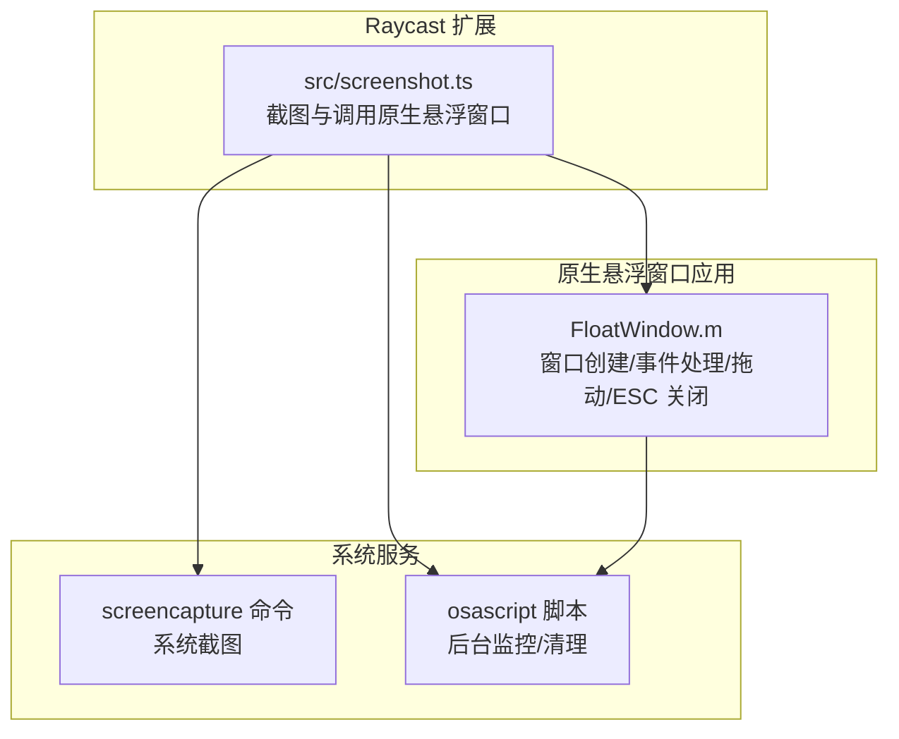
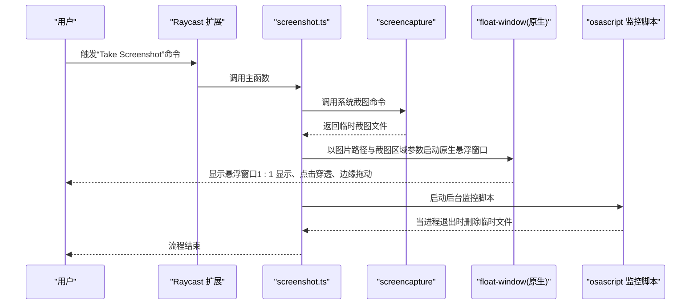
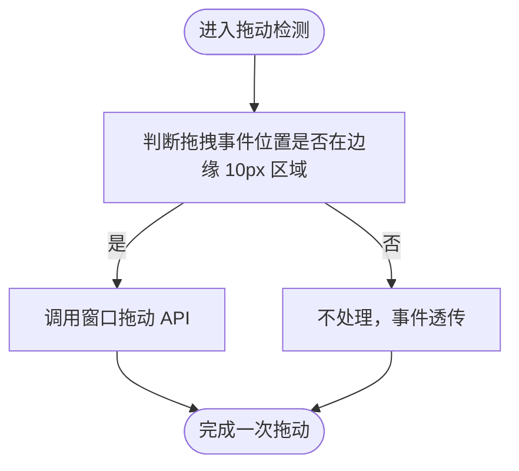
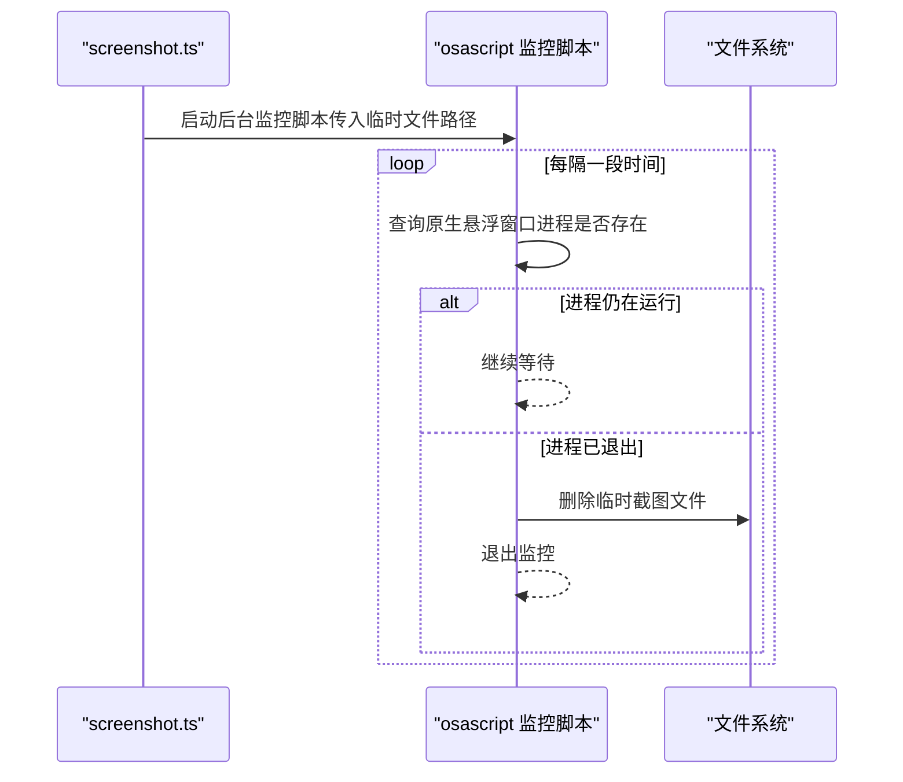
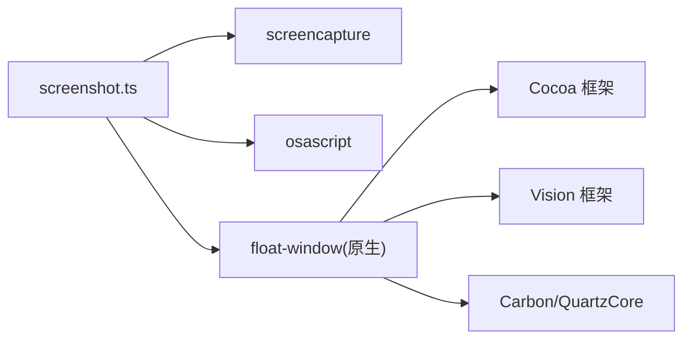

# 用户交互

<cite>
**本文引用的文件**
- [FloatWindow.m](file://FloatWindow.m)
- [src/screenshot.ts](file://src/screenshot.ts)
- [README.md](file://README.md)
</cite>

## 目录
1. [简介](#简介)
2. [项目结构](#项目结构)
3. [核心组件](#核心组件)
4. [架构总览](#架构总览)
5. [详细组件分析](#详细组件分析)
6. [依赖关系分析](#依赖关系分析)
7. [性能考量](#性能考量)
8. [故障排查指南](#故障排查指南)
9. [结论](#结论)

## 简介
本文件聚焦于插件的用户交互设计，围绕以下关键点展开：
- ESC 键关闭悬浮窗口
- 窗口边缘 10px 拖动区域与拖动行为
- 点击穿透与可拖动区域的共存策略
- 自动清理机制：后台监控原生悬浮窗口进程，进程退出后删除临时截图文件

以上能力由 TypeScript 脚本负责调用原生悬浮窗口应用并启动后台监控；原生应用负责窗口渲染、事件监听与拖动逻辑。

## 项目结构
- TypeScript 主流程位于 src/screenshot.ts，负责截图、定位、调用原生悬浮窗口、以及后台监控与清理。
- 原生悬浮窗口应用 FloatWindow.m 负责窗口创建、点击穿透、边缘拖动区域、ESC 关闭等交互细节。
- README.md 提供功能概览与开发指引。

图表来源
- [src/screenshot.ts](file://src/screenshot.ts#L1-L392)
- [FloatWindow.m](file://FloatWindow.m#L1-L466)

章节来源
- [README.md](file://README.md#L1-L61)

## 核心组件
- 原生悬浮窗口应用（FloatWindow.m）
  - 窗口类型与层级：无边框、始终置顶、透明背景、忽略阴影。
  - 点击穿透：图片区域设置为点击穿透，不影响底层应用交互。
  - 边缘拖动：窗口边缘 10px 区域用于触发窗口拖动。
  - ESC 关闭：通过系统级按键状态轮询检测 ESC，终止应用。
- TypeScript 调用链（src/screenshot.ts）
  - 调用系统 screencapture 截图，生成临时文件。
  - 解析图片尺寸与鼠标位置，计算截图区域，传入原生悬浮窗口。
  - 启动原生悬浮窗口（detached）。
  - 启动后台 osascript 监控脚本，进程退出后删除临时文件。

章节来源
- [FloatWindow.m](file://FloatWindow.m#L268-L323)
- [FloatWindow.m](file://FloatWindow.m#L303-L318)
- [FloatWindow.m](file://FloatWindow.m#L428-L458)
- [src/screenshot.ts](file://src/screenshot.ts#L1-L114)
- [src/screenshot.ts](file://src/screenshot.ts#L238-L391)

## 架构总览
下图展示从 Raycast 命令到悬浮窗口显示、再到后台清理的整体流程。

图表来源
- [src/screenshot.ts](file://src/screenshot.ts#L1-L114)
- [src/screenshot.ts](file://src/screenshot.ts#L238-L391)
- [FloatWindow.m](file://FloatWindow.m#L268-L323)

## 详细组件分析

### ESC 键关闭机制
- 原理概述
  - 原生应用通过定时器轮询系统 ESC 按键状态，若检测到按下则调用应用终止函数退出。
  - 该方案避免了安装全局热键监听器带来的复杂性与潜在冲突。
- 关键实现要点
  - 使用系统级按键状态查询接口进行 ESC 检测。
  - 检测到 ESC 后直接终止应用，确保窗口关闭。
- 注意事项
  - 由于采用轮询，需关注 CPU 占用与响应延迟之间的平衡。

章节来源
- [FloatWindow.m](file://FloatWindow.m#L428-L458)

### 窗口边缘 10px 拖动区域与拖动行为
- 点击穿透与可拖动区域的共存
  - 图片区域设置为点击穿透，保证用户对底层应用的操作不受影响。
  - 在容器视图上叠加一个与窗口同尺寸的“拖动区域”，仅在边缘 10px 区域内响应鼠标事件，从而实现“点击穿透 + 可拖动”的共存。
- 边缘拖动实现原理
  - 在拖动区域上注册跟踪区域，监听鼠标拖拽事件。
  - 当鼠标拖拽事件落在边缘区域内时，调用窗口拖动 API 实现窗口移动。
- 交互细节
  - 窗口支持按住特定修饰键时拖动（例如 Cmd 键），并在窗口内部左键按下时同样触发拖动。
  - 窗口始终置顶、透明背景、忽略阴影，确保悬浮效果。

图表来源
- [FloatWindow.m](file://FloatWindow.m#L303-L318)
- [FloatWindow.m](file://FloatWindow.m#L158-L167)

章节来源
- [FloatWindow.m](file://FloatWindow.m#L158-L167)
- [FloatWindow.m](file://FloatWindow.m#L286-L323)
- [FloatWindow.m](file://FloatWindow.m#L303-L318)

### 自动清理机制：后台监控与文件删除
- 设计目标
  - 防止因用户未手动关闭悬浮窗口导致临时截图文件长期占用磁盘空间。
- 实现思路
  - 在启动原生悬浮窗口后，后台启动 osascript 监控脚本。
  - 脚本周期性检查原生悬浮窗口进程是否存在，若不存在则删除对应的临时截图文件。
- 关键点
  - 临时文件路径在 TypeScript 中生成并传入原生悬浮窗口。
  - 清理逻辑在脚本中执行，确保即使前端异常也能回收资源。

图表来源
- [src/screenshot.ts](file://src/screenshot.ts#L345-L383)

章节来源
- [src/screenshot.ts](file://src/screenshot.ts#L345-L383)

### 点击穿透与可拖动区域的共存
- 点击穿透
  - 图片视图重写命中测试方法，使其返回空，从而让点击事件透传至底层应用。
- 可拖动区域
  - 在容器视图上叠加一个与窗口同尺寸的“拖动区域”，设置其忽略鼠标事件为否，使其能够接收并处理拖拽事件。
- 结果
  - 图片区域完全穿透，边缘 10px 区域可拖动，二者互不干扰。

章节来源
- [FloatWindow.m](file://FloatWindow.m#L169-L178)
- [FloatWindow.m](file://FloatWindow.m#L286-L323)
- [FloatWindow.m](file://FloatWindow.m#L416-L418)

## 依赖关系分析
- TypeScript 侧依赖
  - 系统命令：screencapture（截图）、sips（读取图片尺寸）、osascript（隐藏启动台、后台监控）。
  - 进程管理：spawn/detach 启动原生悬浮窗口与监控脚本。
- 原生侧依赖
  - Cocoa 框架：NSWindow、NSView、NSTrackingArea、NSEvent、NSApplication 等。
  - Vision 框架：图片 OCR（识别文字）。
  - Carbon/QuartzCore：底层事件与图形处理。
- 外部集成点
  - Raycast 扩展生命周期与命令入口。
  - macOS 窗口系统与事件模型。

图表来源
- [src/screenshot.ts](file://src/screenshot.ts#L1-L114)
- [FloatWindow.m](file://FloatWindow.m#L1-L20)

章节来源
- [src/screenshot.ts](file://src/screenshot.ts#L1-L114)
- [FloatWindow.m](file://FloatWindow.m#L1-L20)

## 性能考量
- ESC 关闭采用轮询检测，建议：
  - 控制轮询频率，避免过高导致 CPU 占用上升。
  - 在窗口不可见或后台时降低轮询强度。
- 拖动检测：
  - 避免在高频拖动场景下重复创建/销毁跟踪区域。
  - 保持拖动区域尺寸与布局稳定，减少不必要的视图层级变更。
- 监控脚本：
  - 合理设置轮询间隔，兼顾及时性与资源消耗。
- 点击穿透：
  - 仅在必要区域启用鼠标事件，避免扩大事件处理范围。

## 故障排查指南
- ESC 无响应
  - 检查原生悬浮窗口是否处于前台且可接收键盘事件。
  - 确认轮询逻辑是否正常运行（定时器是否加入主循环）。
  - 排查是否有全局键盘拦截工具或系统设置影响 ESC 捕获。
- 拖动卡顿
  - 检查拖动区域是否被其他视图遮挡或事件被拦截。
  - 确认拖动事件回调是否频繁触发，必要时优化事件处理逻辑。
  - 避免在拖动过程中进行大量 UI 更新或重绘。
- 自动清理未生效
  - 确认后台 osascript 监控脚本已启动且传入了正确的临时文件路径。
  - 检查原生悬浮窗口进程是否正常退出，若异常退出可能导致清理逻辑未触发。
- 点击穿透失效
  - 确认图片视图的命中测试方法返回空，且拖动区域未覆盖图片区域。
  - 检查视图层级顺序，确保图片视图在拖动区域之下。

章节来源
- [FloatWindow.m](file://FloatWindow.m#L428-L458)
- [FloatWindow.m](file://FloatWindow.m#L303-L318)
- [src/screenshot.ts](file://src/screenshot.ts#L345-L383)

## 结论
本插件通过 TypeScript 与原生悬浮窗口应用的协作，实现了简洁高效的用户交互体验：
- ESC 键即时关闭悬浮窗口；
- 窗口边缘 10px 区域提供直观拖动入口；
- 图片区域点击穿透，不影响底层应用；
- 后台监控脚本保障临时文件的自动清理，避免磁盘占用。

上述设计在易用性与稳定性之间取得良好平衡，适合在 Raycast 生态中作为通用的悬浮窗口交互范式参考。