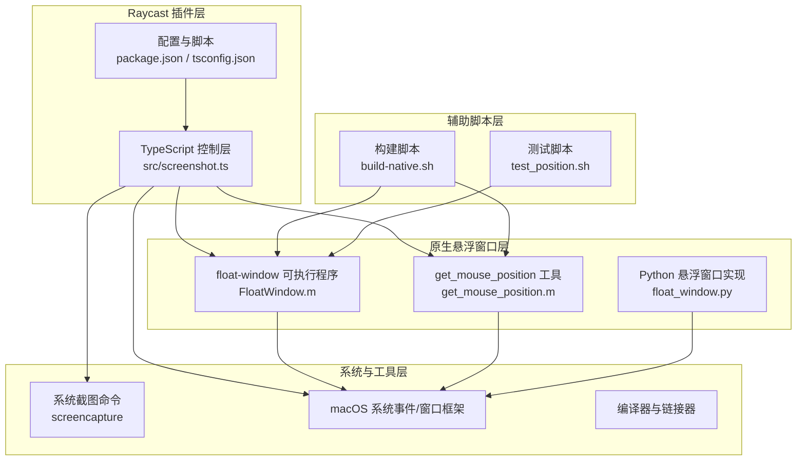
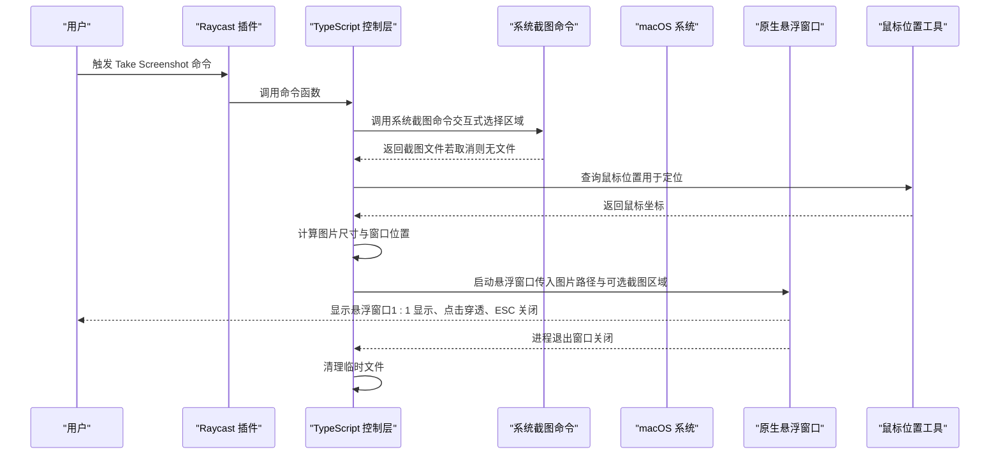
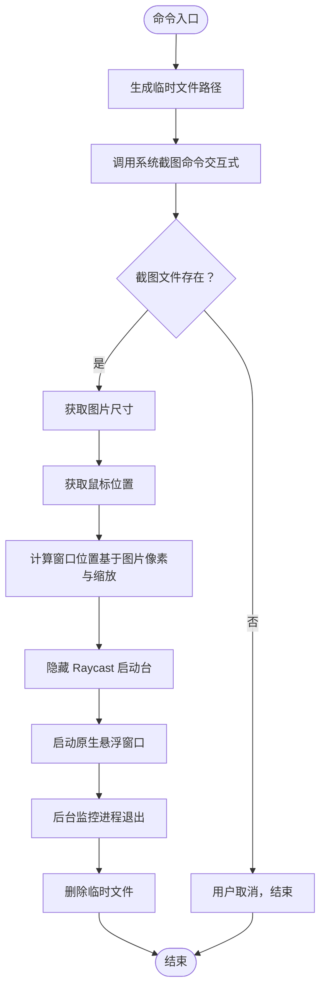
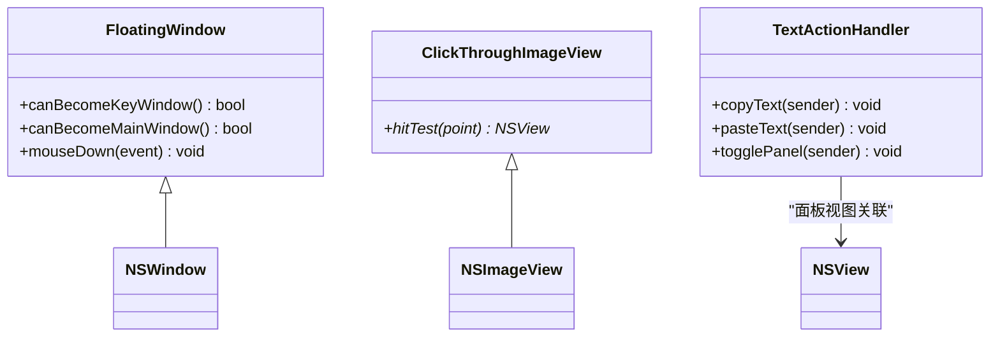
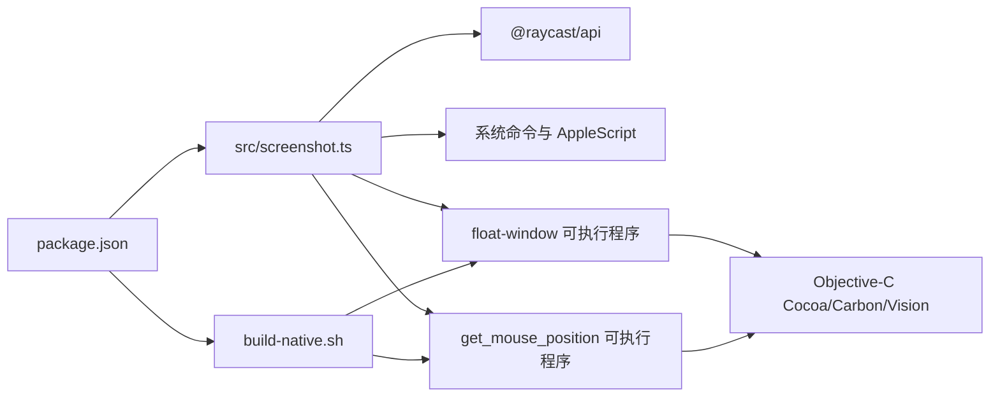

# 项目概述

<cite>
**本文引用的文件列表**
- [README.md](file://README.md)
- [package.json](file://package.json)
- [tsconfig.json](file://tsconfig.json)
- [src/screenshot.ts](file://src/screenshot.ts)
- [FloatWindow.m](file://FloatWindow.m)
- [get_mouse_position.m](file://get_mouse_position.m)
- [build-native.sh](file://build-native.sh)
- [float_window.py](file://float_window.py)
- [test_position.sh](file://test_position.sh)
</cite>

## 目录
1. [简介](#简介)
2. [项目结构](#项目结构)
3. [核心组件](#核心组件)
4. [架构总览](#架构总览)
5. [详细组件分析](#详细组件分析)
6. [依赖关系分析](#依赖关系分析)
7. [性能考量](#性能考量)
8. [故障排查指南](#故障排查指南)
9. [结论](#结论)
10. [附录](#附录)

## 简介
ScreenshotsPluginOnRaycast 是一个为 Raycast 平台开发的 macOS 插件，旨在帮助用户快速截图并以“悬浮窗口”的形式直接显示在屏幕上。该插件强调高效与易用性：通过系统级截图工具唤起截图流程，随后以 1:1 比例显示图片，支持点击穿透、ESC 关闭、始终置顶、边缘拖动以及自动清理临时文件等特性，从而在不打断当前工作流的前提下完成截图预览与后续处理。

适用人群
- 需要频繁截图并即时预览的 Mac 用户
- 希望在不切换应用的情况下完成截图与 OCR 文字提取的开发者与设计师
- 追求轻量、即开即用的生产力工具使用者

核心价值
- 提升截图与预览效率：一键唤起系统截图工具，自动定位并显示悬浮窗口
- 降低干扰：点击穿透与 ESC 关闭，避免遮挡当前工作界面
- 增强可用性：OCR 文字识别与复制/粘贴快捷操作，便于快速提取与复用文本

## 项目结构
该项目采用“TypeScript 控制层 + Objective-C 原生悬浮窗口 + Shell 辅助构建”的分层架构：
- TypeScript 层负责：命令入口、截图调用、临时文件管理、悬浮窗口进程调度与生命周期监控
- Objective-C 层负责：创建无边框悬浮窗口、实现点击穿透、始终置顶、边缘拖动、ESC 关闭、OCR 文字识别与面板交互
- Shell 脚本负责：编译原生二进制（悬浮窗口与鼠标位置查询工具）
- Python 版本的悬浮窗口实现作为备用方案，展示相同能力的不同语言实现

图表来源
- [src/screenshot.ts](file://src/screenshot.ts#L1-L114)
- [FloatWindow.m](file://FloatWindow.m#L180-L277)
- [get_mouse_position.m](file://get_mouse_position.m#L1-L10)
- [build-native.sh](file://build-native.sh#L1-L26)
- [float_window.py](file://float_window.py#L1-L100)
- [test_position.sh](file://test_position.sh#L1-L15)
- [package.json](file://package.json#L1-L34)
- [tsconfig.json](file://tsconfig.json#L1-L21)

章节来源
- [README.md](file://README.md#L1-L61)
- [package.json](file://package.json#L1-L34)
- [tsconfig.json](file://tsconfig.json#L1-L21)

## 核心组件
- 命令入口与控制流（TypeScript）
  - 负责生成临时文件名、调用系统截图命令、隐藏 Raycast 启动台、计算悬浮窗口位置、启动原生悬浮窗口并监控其生命周期
- 原生悬浮窗口（Objective-C）
  - 负责创建无边框窗口、设置置顶与透明背景、实现点击穿透、边缘拖动、ESC 关闭、OCR 文字识别与面板交互
- 鼠标位置查询工具（Objective-C）
  - 用于在截图后获取鼠标位置，作为悬浮窗口初始定位的参考
- 构建与部署脚本（Shell）
  - 编译原生二进制，确保在开发与发布阶段具备可执行文件
- 备选实现（Python）
  - 展示相同能力的 Python 版本悬浮窗口，便于理解与迁移

章节来源
- [src/screenshot.ts](file://src/screenshot.ts#L1-L114)
- [FloatWindow.m](file://FloatWindow.m#L180-L277)
- [get_mouse_position.m](file://get_mouse_position.m#L1-L10)
- [build-native.sh](file://build-native.sh#L1-L26)
- [float_window.py](file://float_window.py#L1-L100)

## 架构总览
下图展示了从用户触发命令到悬浮窗口显示与交互的端到端流程，包括截图、定位、窗口创建与生命周期管理。

图表来源
- [src/screenshot.ts](file://src/screenshot.ts#L1-L114)
- [src/screenshot.ts](file://src/screenshot.ts#L238-L391)
- [FloatWindow.m](file://FloatWindow.m#L180-L277)
- [get_mouse_position.m](file://get_mouse_position.m#L1-L10)

## 详细组件分析

### TypeScript 控制层（命令入口与流程编排）
职责
- 生成临时文件路径，调用系统截图命令（交互式选择区域）
- 在用户取消时正确处理，避免误报错误
- 获取图片尺寸与鼠标位置，推导悬浮窗口初始位置
- 隐藏 Raycast 启动台，避免遮挡
- 启动原生悬浮窗口并守护其生命周期，退出时清理临时文件

关键实现要点
- 使用子进程调用系统截图命令，基于文件存在与否判断用户是否取消
- 通过 AppleScript 获取前台应用信息，结合鼠标位置估算截图区域中心，再以图片像素尺寸换算为点尺寸，确保 1:1 显示
- 通过 AppleScript 隐藏启动台，等待短暂时间确保隐藏生效
- 启动原生悬浮窗口并以后台 AppleScript 监控进程退出，退出后删除临时文件

图表来源
- [src/screenshot.ts](file://src/screenshot.ts#L1-L114)
- [src/screenshot.ts](file://src/screenshot.ts#L116-L135)
- [src/screenshot.ts](file://src/screenshot.ts#L162-L236)
- [src/screenshot.ts](file://src/screenshot.ts#L238-L391)

章节来源
- [src/screenshot.ts](file://src/screenshot.ts#L1-L114)
- [src/screenshot.ts](file://src/screenshot.ts#L116-L135)
- [src/screenshot.ts](file://src/screenshot.ts#L162-L236)
- [src/screenshot.ts](file://src/screenshot.ts#L238-L391)

### 原生悬浮窗口（Objective-C）
职责
- 创建无边框、透明背景、始终置顶的悬浮窗口
- 实现点击穿透（图片区域），允许底层应用继续接收输入
- 支持 ESC 关闭窗口
- 支持边缘 10px 区域拖动窗口
- 1:1 显示图片，按屏幕缩放因子换算像素尺寸
- 内置 OCR 文字识别面板，支持复制/粘贴文字

实现细节
- 通过窗口层级设置实现始终置顶
- 通过忽略鼠标事件与自定义视图命中测试实现点击穿透
- 通过边缘区域跟踪与拖拽事件实现窗口拖动
- 通过 Vision 框架进行 OCR 文字识别，支持多语言
- 通过定时轮询检测 ESC 键状态，实现关闭

图表来源
- [FloatWindow.m](file://FloatWindow.m#L154-L168)
- [FloatWindow.m](file://FloatWindow.m#L169-L178)
- [FloatWindow.m](file://FloatWindow.m#L1-L83)

章节来源
- [FloatWindow.m](file://FloatWindow.m#L180-L277)
- [FloatWindow.m](file://FloatWindow.m#L276-L319)
- [FloatWindow.m](file://FloatWindow.m#L319-L464)

### 鼠标位置查询工具（Objective-C）
职责
- 读取当前鼠标位置并以“x,y”格式输出，供 TypeScript 层用于悬浮窗口定位

章节来源
- [get_mouse_position.m](file://get_mouse_position.m#L1-L10)

### 构建与部署脚本（Shell）
职责
- 编译原生悬浮窗口与鼠标位置工具
- 在开发与构建阶段确保可执行文件可用

章节来源
- [build-native.sh](file://build-native.sh#L1-L26)
- [package.json](file://package.json#L28-L33)

### 备选实现（Python）
职责
- 展示相同能力的 Python 版本悬浮窗口，便于理解与迁移

章节来源
- [float_window.py](file://float_window.py#L1-L100)

## 依赖关系分析
- TypeScript 层依赖 Raycast 平台 API 与系统命令
- 原生悬浮窗口依赖 macOS 窗口与事件框架、Vision 文字识别框架
- 构建脚本依赖 clang 与系统框架
- 开发与运行时通过 npm 脚本与 Raycast CLI 驱动

图表来源
- [src/screenshot.ts](file://src/screenshot.ts#L1-L114)
- [FloatWindow.m](file://FloatWindow.m#L1-L10)
- [get_mouse_position.m](file://get_mouse_position.m#L1-L10)
- [build-native.sh](file://build-native.sh#L1-L26)
- [package.json](file://package.json#L1-L34)

章节来源
- [package.json](file://package.json#L1-L34)
- [tsconfig.json](file://tsconfig.json#L1-L21)

## 性能考量
- 截图与悬浮窗口显示链路尽量短：TypeScript 层仅做协调与调度，核心渲染与交互由原生窗口承担
- 1:1 显示避免额外缩放开销；点击穿透减少不必要的事件转发
- 通过后台 AppleScript 监控进程退出，避免阻塞主流程
- 建议在开发阶段使用本地构建脚本，避免重复编译带来的等待

## 故障排查指南
常见问题与解决思路
- 找不到 float-window 或 get_mouse_position 可执行文件
  - 确认已执行构建脚本生成二进制
  - 检查可执行文件权限与路径
- 截图后悬浮窗口位置异常
  - 检查截图区域参数与屏幕缩放因子换算
  - 使用测试脚本验证位置修正逻辑
- ESC 无法关闭窗口
  - 确认原生窗口进程仍在运行
  - 检查键盘事件轮询是否被系统策略阻止
- OCR 未识别到文字
  - 确认图片清晰且包含可识别文本
  - 检查语言设置与置信度阈值

章节来源
- [src/screenshot.ts](file://src/screenshot.ts#L238-L391)
- [test_position.sh](file://test_position.sh#L1-L15)
- [FloatWindow.m](file://FloatWindow.m#L420-L464)

## 结论
ScreenshotsPluginOnRaycast 通过“TypeScript 控制层 + Objective-C 原生悬浮窗口”的组合，实现了高效、低干扰的截图预览体验。其核心优势在于：1) 与系统截图工具无缝衔接；2) 原生窗口提供点击穿透、置顶与拖动等高级特性；3) 1:1 显示与 ESC 关闭提升易用性；4) 自动清理临时文件保障稳定性。对于希望在 Mac 上快速截图并即时预览与处理文本的用户而言，这是一个实用且可扩展的解决方案。

## 附录
- 使用场景示例
  - 快速分享截图：截图后悬浮窗口直接显示，便于快速分享或保存
  - OCR 文字识别：悬浮窗口内置文字面板，支持复制/粘贴，适合提取屏幕文字
- 开发者建议
  - 若需进一步优化，可在 TypeScript 层引入更精确的截图区域检测与边界校正
  - 可考虑将 Python 版本作为跨语言兼容的备选实现